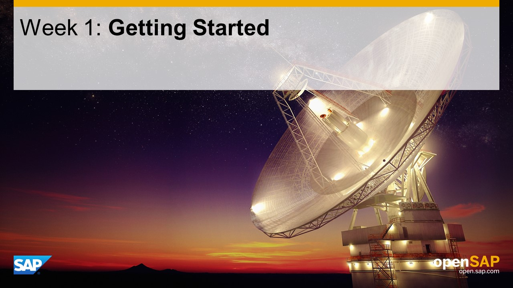

## Units
- Unit 1: [Why extend SAP S/4HANA on SAP HANA Cloud Platform?](./unit-1/)
- Unit 2: [Business Scenario for this Course](./unit-2/)
- Unit 3: [Typical Extension Patterns](./unit-3/)
- Unit 4: [Typical Setup for Extension Projects](./unit-4/)
- Unit 5: [Getting Started: Tools Setup](./unit-5/)
- Unit 6: [Getting Started: SAP S/4HANA System Setup](./unit-6/)

