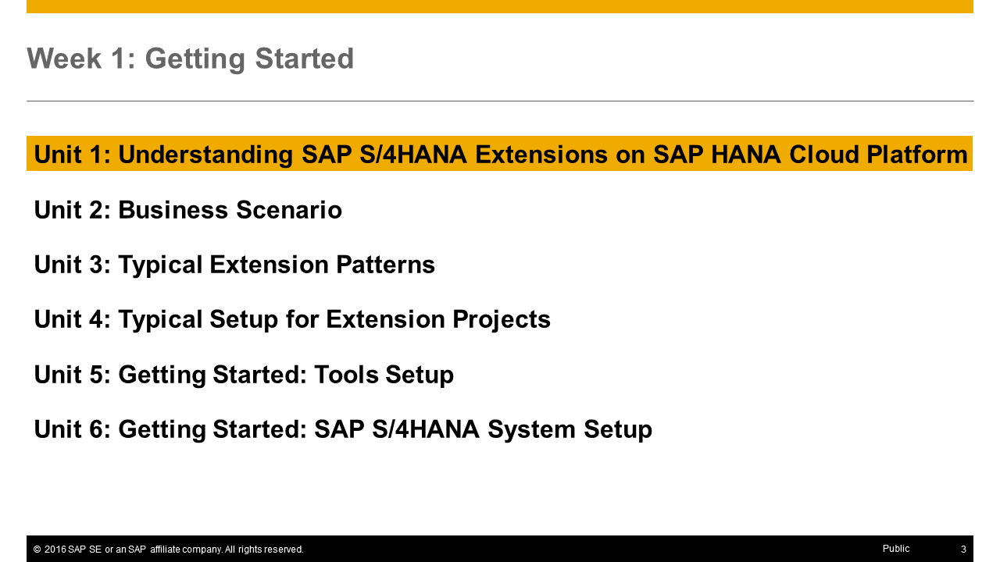

<a name="top"/>



> **Note:** On this page you will only find the presentation slides of the unit, without any additional context or explanations. Therefore **we strongly recommend to watch the [corresponding video](https://open.sap.com/courses/hcp3a1/items/7BQ0Xs7x2tzCFjJNjlXZg0)** _(openSAP log-in required)_ in which Thomas Bieser, the course instructor, explains the slides in detail. This will greatly enhance your understanding of this units content.

## Presentation Slides

### Slide 1: Title

### Slide 2: Week Overview

### Slide 3: Unit Overview

### Slide 4: Understanding SAP S/4HANA Extensions on SAP HANA Cloud Platform

### Slide 5: Innovation keeps your business running tomorrow

### Slide 6: Dimensions of innovation

### Slide 7: Innovate fast with minimal risk and cost

### Slide 8: What you've learned in this unit

[Top](#top)

[**Up ^** Week 1 Overview](../) | [**Next >** Unit 2](../unit-2/)
