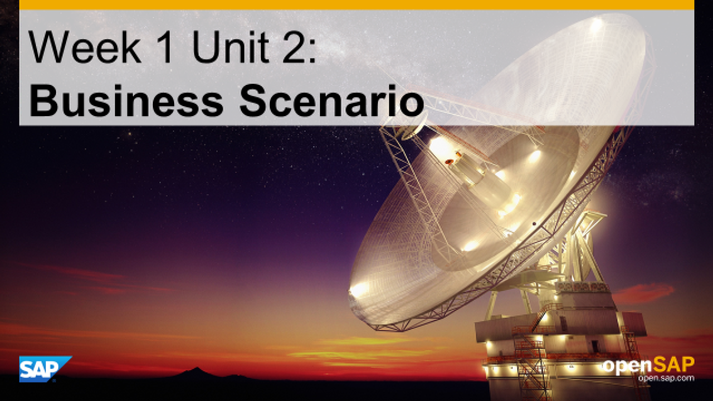
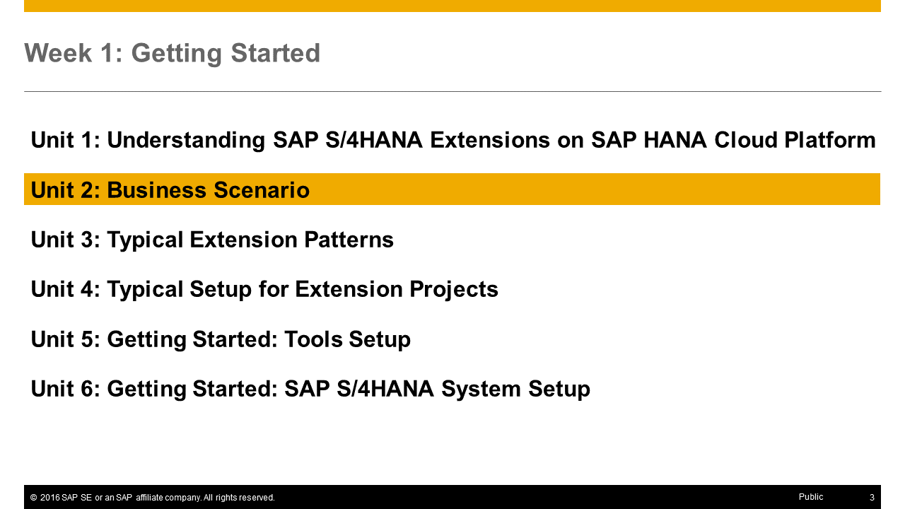
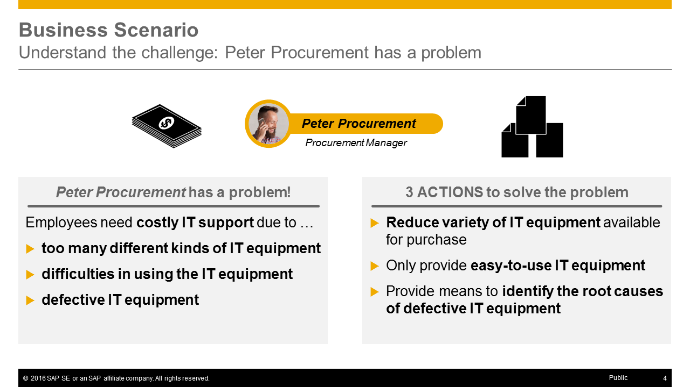
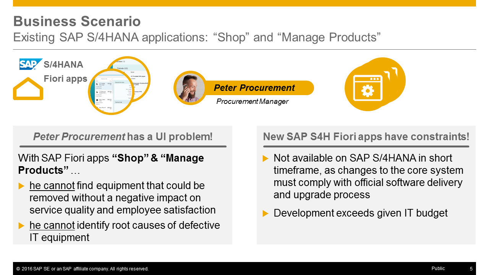
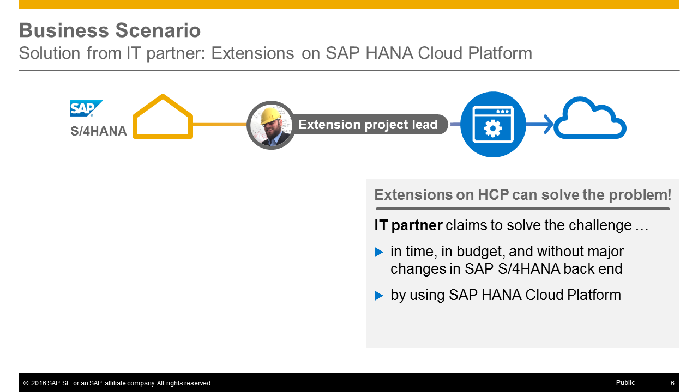
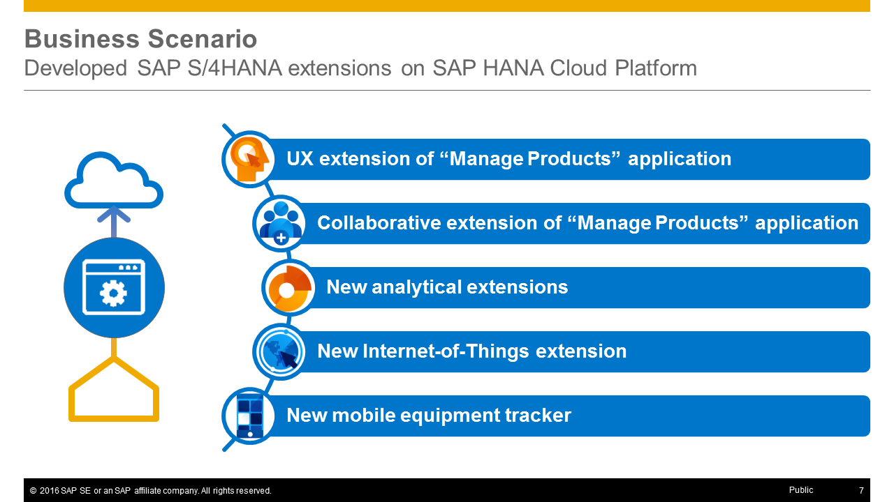
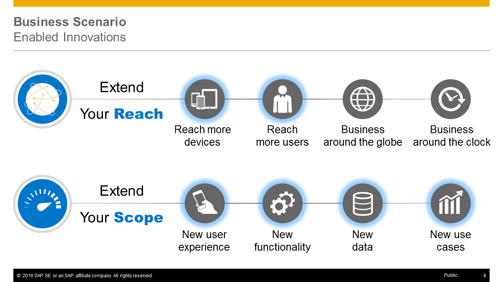
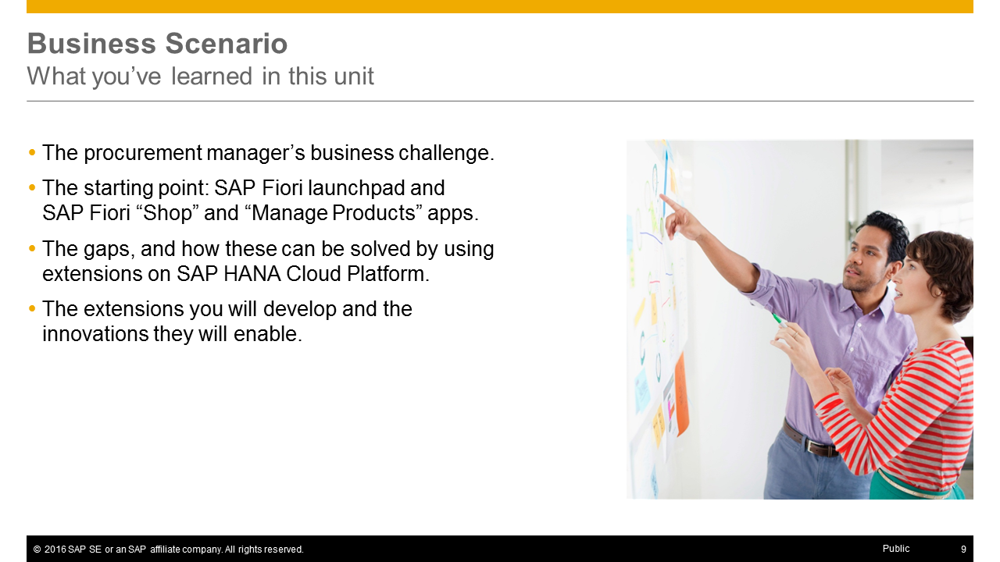

<a name="top"/>



> **Note:** This unit does not contain any hands-on steps but only the presentation slides of the unit. It is recommended to listen to the corresponding video where the course instructor [Thomas explains the unit contents](https://open.sap.com/courses/hcp3a1) in detail.

## Presentation Slides

### Slide 1: Business Scenario

### Slide 2: Agenda

### Slide 3: Unit Overview

### Slide 4: Understand the challenge

### Slide 5: Existing SAP S/4 HANA Applications: _Shop_ and _Manage Products_

### Slide 6: Solution from IT Partner: Extensions on HCP

### Slide 7: Developed SAP S/4 HANA Extensions on HCP

### Slide 8: Enabled Innovations

### Slide 9: What you've learned in this unit

[Top](#top)

[**< Previous** Unit 1](../unit-1/) | [**Up ^** Week 1](../) | [**Next >** Unit 3](../unit-3/)
