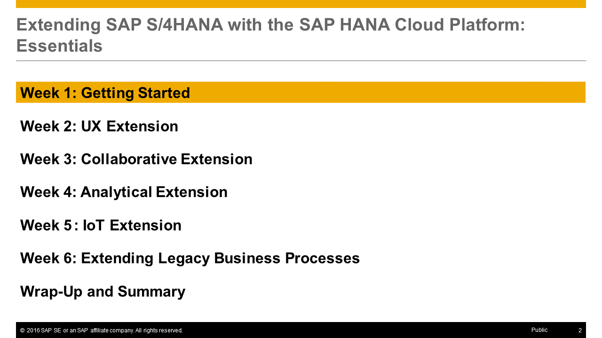

<a name="top"/>


> **Note:** On this page you will only find the presentation slides of the unit, without any additional context or explanations. Therefore **we strongly recommend to watch the [corresponding video](https://open.sap.com/courses/hcp3a1/items/7gzW8WDpvqYbDAiKQQkGNU)** _(openSAP log-in required)_ in which Thomas Bieser, the course instructor, explains the slides in detail. This will greatly enhance your understanding of this units content.

## Presentation Slides

### Slide 1: Title

### Slide 2: Week Overview

### Slide 3: Unit Overview

### Slide 4: What is an on-premises extension on SAP HANA Cloud Platform?

### Slide 5: SAP S/4HANA can access on-premises back ends

### Slide 6: Point-to-Point (P2P) Pattern

### Slide 7: P2P: Direct Integration of SAP Fiori User Interfaces

### Slide 8: P2P: Application-to-Application Integration

### Slide 9: Data Replication Pattern

### Slide 10: Hub Pattern

### Slide 11: What you've learned in this unit

[Top](#top)

[**< Previous** Unit 2](../unit-2/) | [**Up ^** Week 1 Overview](../) | [**Next >** Unit 4](../unit-4/)
