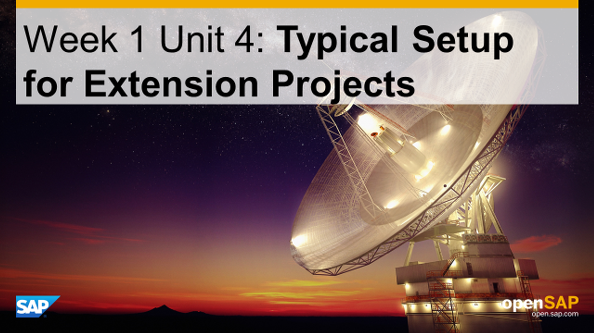
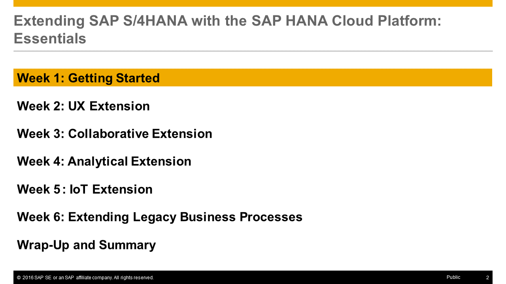
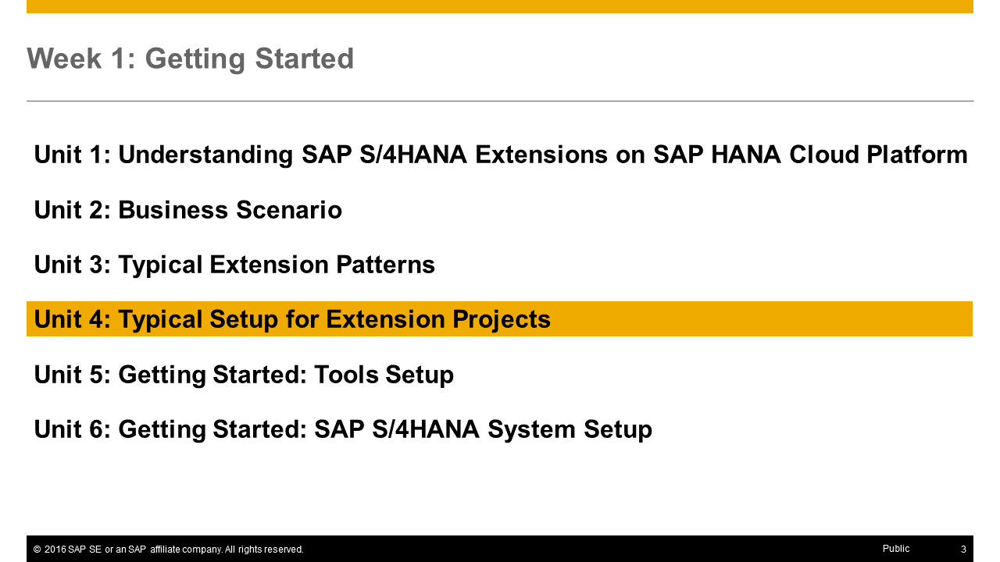
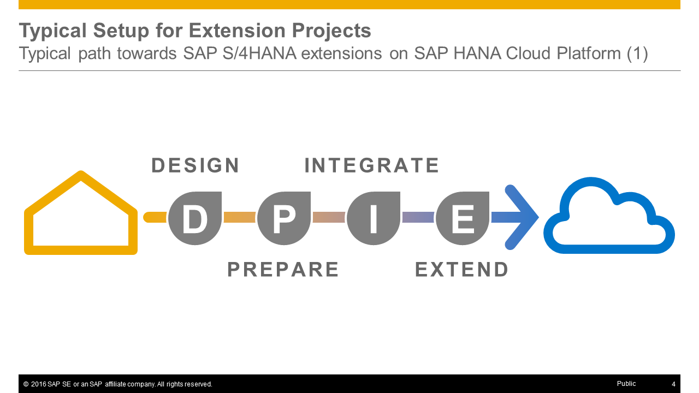
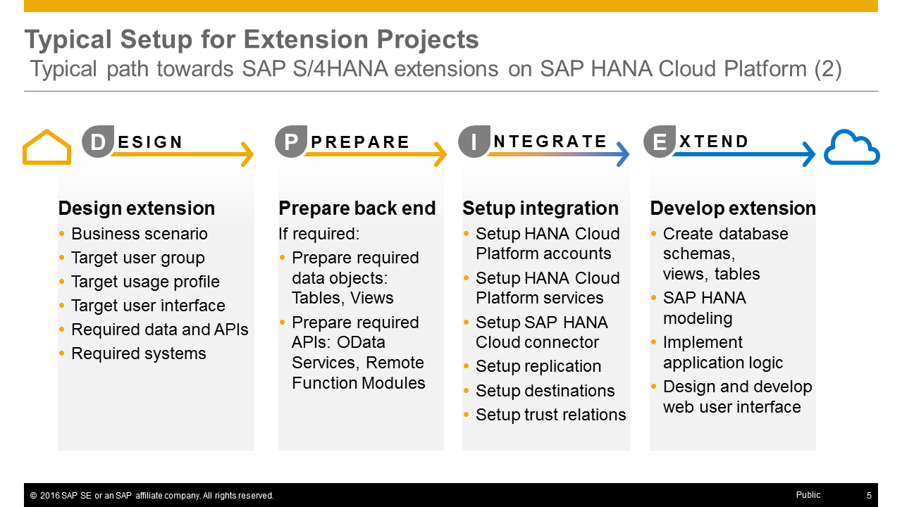
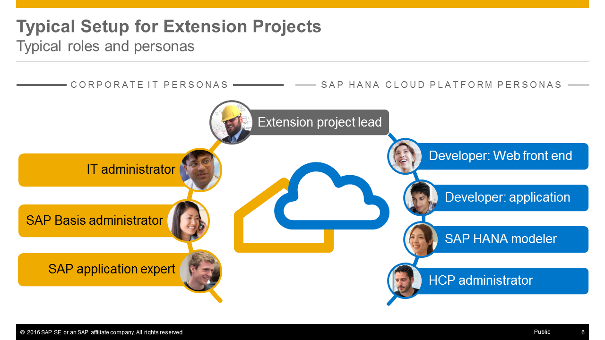
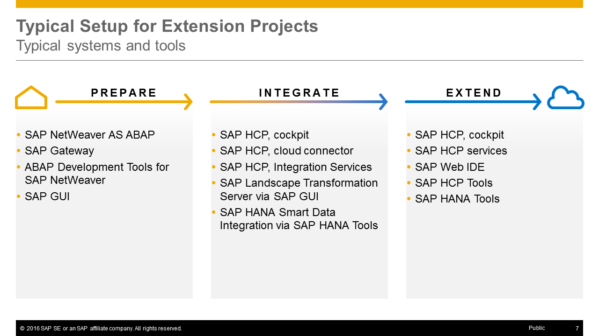
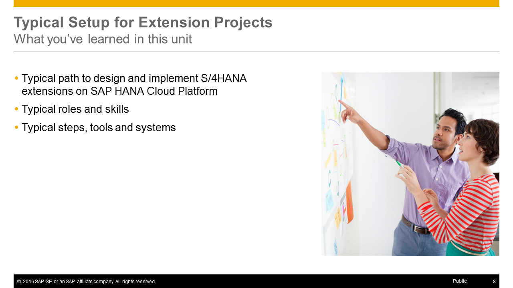

<a name="top"/>


> **Note:** This unit does not contain any hands-on steps but only the presentation slides of the unit. It is recommended to listen to the corresponding video where the course instructor [Thomas explains the unit contents](https://open.sap.com/courses/hcp3a1) in detail.

## Presentation Slides

### Slide 1: Typical Setup for Extension Projects

### Slide 2: Agenda

### Slide 3: Unit Overview

### Slide 4: Typical path towards SAP S/4HANA extensions on SAP HANA Cloud Platform (1)

### Slide 5: Typical _Path_ towards Extension Projects: _Design, Prepare, Integrate and Extend (DPIE)_

### Slide 6: Typical _Roles_ for Extension Projects

### Slide 7: Typical _Tools_ for Extension Projects

### Slide 8: What you've learned in this unit

[Top](#top)

[**< Previous** Unit 3](../unit-3/) | [**Up ^** Week 1](../) | [**Next >** Unit 5](../unit-5/)
