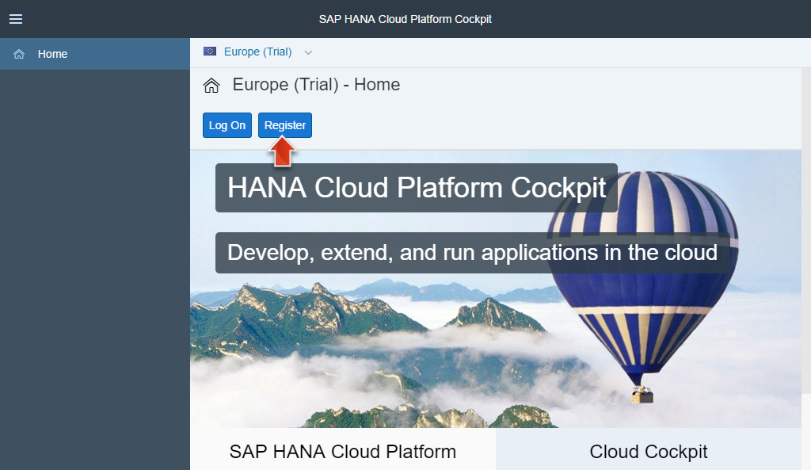
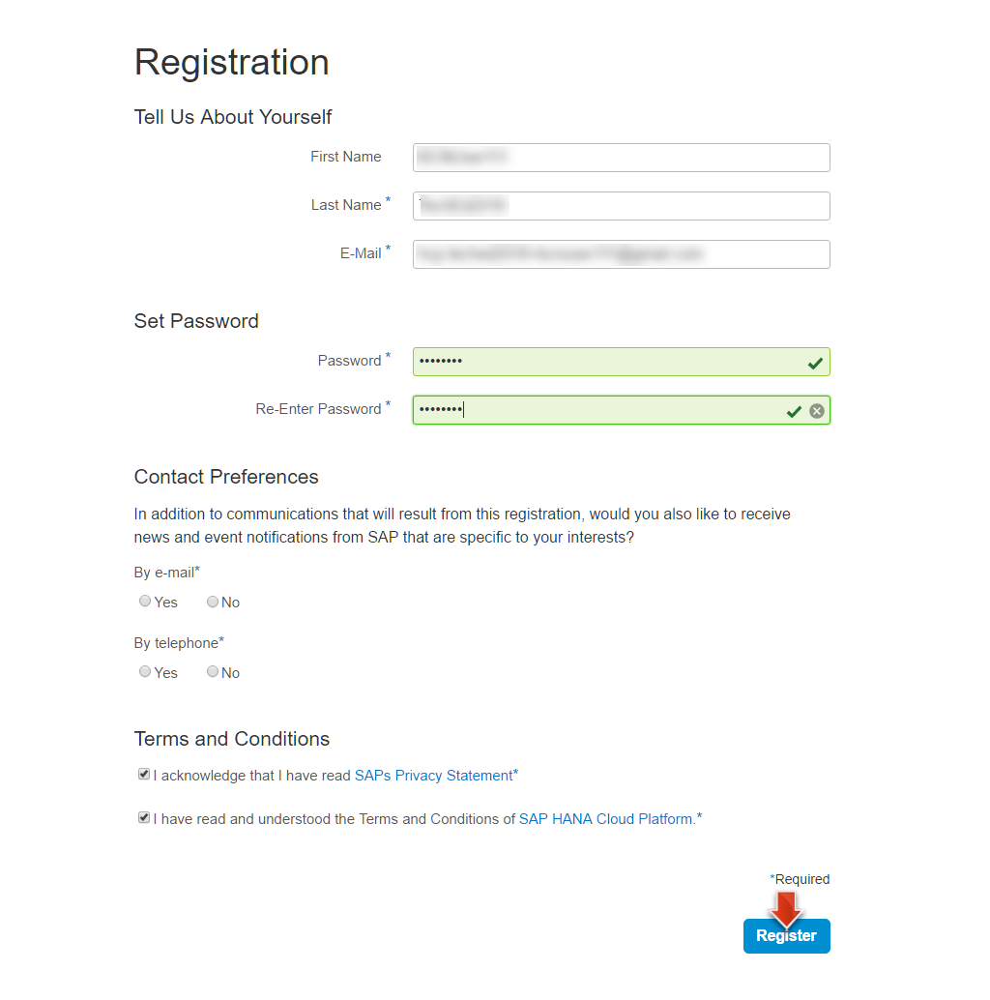
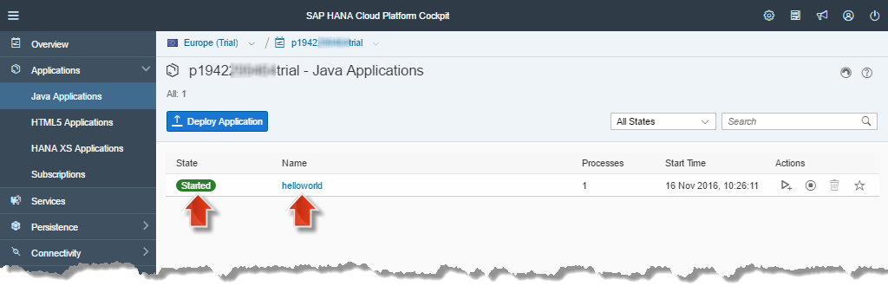

<a name="step-1-1-top"/><a name="step-1-2-top"/><a name="step-2-1-top"/><a name="step-2-2-top"/><a name="step-2-3-top"/><a name="step-3-1-top"/><a name="step-3-2-top"/><a name="step-4-1-top"/><a name="step-4-2-top"/><a name="step-5-1-top"/><a name="step-5-2-top"/><a name="step-5-3-top"/><a name="step-5-4-top"/><a name="step-6-1-top"/><a name="step-6-2-top"/><a name="step-6-3-top"/><a name="step-6-4-top"/><a name="step-6-5-top"/>



**Overview:**

**Roles:**

-   HCP administrator
-   Application and Web Front-End Developer
-   SAP HANA modeler

**Systems, Tools, Services:**

-   Java SDK (JDK)
-   Chrome Web browser with QR Code extension and Postman
-   SAP HANA Cloud Platform Trial Account (HCP Trial account)
-   Eclipse IDE
-   Maven

## Step 1: Installing Java 8 SDK

In this tutorial Java 8 SDK is mandatory.

> **Warning:** Lower versions like Java 7 or 6 will not work.

#### 1.1 Check if a Java 8 SDK is installed

1.  Open the console or command line of your operating system.
2.  Execute command **java -version**.

    > **Result:** If Java is already installed, then the command will display the Java version information. The version should be **at least 1.8.0**.
    >
    > 

3.  To check if you have a full fletched Java SDK (and not only a simple Java Runtime Environment (JRE)) installed, execute the command **javac -version**

    > **Result:** If you have a Java SDK installed then the command will display the Java version information, otherwise the operating system will complain that it can't find the command and you have to install a new Java SDK as described in the next section 1.2.
    >
    >  

[Top](#step-1-1-top)

#### 1.2 Install Java 8 SDK

If no Java 8 SDK is installed on your computer yet, then install a Java 8 SDK of your choice or follow this [help to install the SAP JVM](https://help.hana.ondemand.com/help/frameset.htm?76137f42711e1014839a8273b0e91070.html).

[Top](#step-1-2-top)

## Step 2: Prepare Chrome Web Browser and Plugins

Tools like the _SAP Web IDE_ work best with _Google Chrome_, so we recommend to use this browser.

#### 2.1 Install and Configure Chrome

1.  If Chrome Web browser is not already installed, then download and install it from [https://www.google.com/chrome](https://www.google.com/chrome).

    > **Hint:** In this tutorial, we advise you to use special configuration settings and to create several _bookmarks_. If you don't want to "spoil" your default Chrome configuration, just may create a _new user profile_ in Google Chrome where you can do all these settings, save logon data and passwords and add bookmarks without interfering with your regular browser experience. You don't know how this works? Find out here [support.google.com: Share Chrome with others or add personas](https://support.google.com/chrome/answer/2364824).

2.  Open Chrome Web browser
3.  Configure browser **language**

    > **Hint:** In this tutorial we will rely on the _default browser language_ is set to **English**.

4.  Open **chrome://chrome/settings/languages** and make sure that **English** or **English (United States)** is set as default language.

    

[Top](#step-2-1-top)

#### 2.2 Disable Your SSO certificate (if in use)

> **Note:** This step only applies to users who have enabled configured certificate-based Single-Sign-On (SSO) in Google Chrome.

To work through some units with a predefined user, e.g. login to SAP HANA Cloud Platform with another trial user, you have to disable your SSO-certificate in your Google Chrome Browser (if in use).

1.  Open the Google Chrome Settings, search for **certificates** and click **Manage certificates** in the HTTPS/SSL section.

    

2.  In the **Certificates** popup select tab **Personal** and double-click the SSO-certificate that is issued to your user. In the new **Certificate** dialog select tab **Details** and click the **Edit Properties** button.

    

3.  In the **Certificate Properties** popup dialog under **General** select radio button **Disable all purposes for this certificate** and click **Ok**. Close all open popup dialogs.

    

[Top](#step-2-3-top)

#### 2.3 Postman for Chrome

_Postman_ is a REST client, which helps you to send HTTP requests to work with REST APIs. Many HANA Cloud Platform services (like e.g. the later used _Jam_ or _Internet of Things_ service) exposes their data via such REST APIs. In the forecoming weeks of this tutorial, you therefore need a REST client tool. As we provide a postman specific environment file, we recommend to install and use Postman as REST client as described in the following steps:

> **Warning:** _Postman_ seems to also send additional values not defined in your rest-request. Those values come from your current browser settings and/or session. So be aware, in which profile/session you install and use the _Postman_ plugin.

1.  In _Chrome Web Browser_ open [Postman in the Chrome App Web Store](https://chrome.google.com/webstore/detail/postman/fhbjgbiflinjbdggehcddcbncdddomop)
2.  Click  **ADD TO CHROME**.

    

> **Result:** Postman is now available in the _Chrome Apps_
>
>  
>
> **Hint:** When you later need the _Postman_ REST client just open the link **chrome://apps/** in Chrome to find the _Postman App_

[Top](#step-2-2-top)

#### 2.4 QR Extension for Chrome

By means of the _QR Extension_ you can generate a QR code for any URL opened in the Chrome Web browser. Later in week 5 of this tutorial you will make use of this feature.

1.  In _Chrome_ Web Browser open [QR Extension in the Chrome App Web Store](https://chrome.google.com/webstore/detail/the-qr-code-extension/oijdcdmnjjgnnhgljmhkjlablaejfeeb).
2.  Install with **ADD TO CHROME**.
3.  The installed and enabled _QR Code Extension_ is now available as small **QR Code icon** next to the Chrome URL bar.

    

> **Result:** For any URL which you open in your Chrome Web browser you could generate a QR code by clicking on the QR code icon.

## Step 3: Prepare SAP HANA Cloud Platform Trial Account

_SAP HANA Cloud Platform Trial_, also known as developer edition, is a free, perpetual license to evaluate _SAP HANA Cloud
Platform_ (HCP) for an unlimited period and free of charge.

In this tutorial we will describe how to execute the entire extensions business scenario on a newly registered HCP Trial Account.

> **Hint:** Experienced users might also re-use their already existing _HCP_ account. But you should then be aware that all steps of this tutorial are described as if you started from a newly registered _HCP_ account. Therefore we advise you to register a new _HCP_ trial account to use in this tutorial.
>
> **Info:** For more information about SAP HANA Cloud Platform accounts see [here](https://hcp.sap.com/try.html).

#### 3.1 Register for a Trial Account

1.  Open [https://hanatrial.ondemand.com](https://hanatrial.ondemand.com), the SAP HANA Cloud Platform Trial entry page

    

2.  Click on **Register**.
3.  On the **Registration** page.

4.  Enter the mandatory data
5.  Read and accept the Terms and Conditions
6.  Confirm by clicking **Register**:

    

7.  You will get a "Thank you for registering with SAP" dialog. Just close it.

    

8.  You will receive a confirmation e-mail. Click on **Click here to activate your account** link to confirm your address and activate your trial account.

    

9.  Close the "News and Announcements" (if opens) as it is not relevant for this tutorial.

    

10. Click on the **p-User link** of your trial account.

    

11. The _SAP HANA Cloud Platform Cockpit_ overview page of your Trial account will open.

    

> **Result:** You now have your **SAP HANA Cloud Platform Trial** account, on which all the S/4 HANA Extensions of this course can be executed on.
>
> **Info:** Refer to the [help](https://help.hana.ondemand.com/help/frameset.htm?65d74d39cb3a4bf8910cd36ec54d2b99.html) page for additional information about the limitations of HCP Trial accounts.

[Top](#step-3-1-top)

#### 3.2 Create _HCP_ Bookmark

> **Note:** The opened HCP Trial Cockpit page will later during the course be launched many times. It is the main entry page for developers managing the services, application, configuration, etc. of the HCP account.

For quickly accessing the HCP Trial Cockpit page create now a Web browser bookmark as follows:

1.  Create a **bookmark** with name **HCP** for the opened HCP Trial cockpit page.

2.  In Chrome click **Bookmark this page** icon
3.  Change bookmark name to **HCP**
4.  Folder: **Bookmarks bar**
5.  Click **Done**

    

    > **Result:** If you have enabled in Chrome customization menu, **Bookmarks > Show bookmarks bar** then you should get a new Bookmark **HCP** on the the bookmark bar of your browser. Click on it to access quickly your HCP Trial Cockpit page.
    >
    > 

6.  **Close** the HCP Trial cockpit browser window.

[Top](#step-3-2-top)

## Step 4: Prepare SAP Web IDE

SAP Web IDE is a web-based development environment that simplifies the end-to-end application lifecycle: prototyping, development, packaging, deployment, and custom extensions. Many extensions of the course are developed in the Web IDE.

On every HCP Trial account the _Web IDE_ is enabled and you can launch it as follows.

#### 4.1 Launch SAP Web IDE

1.  Open **HCP** bookmark in _Chrome_ Web browser (as defined in above [section 3.2](#create-hcp-bookmark))
2.  Log in with your HCP Trial User Id (P-user) and password (if requested).
3.  Navigate to **Services**.
4.  Search for **Web IDE** and open the tile **SAP Web IDE**.

    

5.  On the page for the **SAP Web IDE** click **Open SAP Web IDE** link.

    

6.  The **SAP Web IDE** will open in a new browser tab.

    

> **Result:** You have seen how the Web IDE can be launched when starting from the HCP Cockpit page. Next create a bookmark for quickly launching Web IDE whenever needed in the course.

[Top](#step-4-1-top)

#### 4.2 Create _SAP Web IDE_ Bookmark

1.  Create a **bookmark** with name **SAP Web IDE** for the opened HCP Trial cockpit page.

2.  In Chrome click **Bookmark this page** icon
3.  Change bookmark name to **HCP**
4.  Folder: **Bookmarks bar**
5.  Click **Done**

    

    > **Result:** You should get a new Bookmark **SAP Web IDE** next to the _HCP_ bookmark. Click on it to access quickly your SAP Web IDE page.
    >
    >  

6.  **Close** the Web IDE browser window.

[Top](#step-4-2-top)

## Step 5: Install and Configure SAP Tools for Eclipse

By means of the _SAP Tools for Eclipse_, developers can execute certain HCP development tasks: Building, deploying and running a Java application on HCP or maintaining an SAP HANA instance which in running on HCP will be typical task which will be demonstrated soon in this course.

To make use of the SAP HANA Cloud Platform Tools for Java, you first need to
have a supported version of Eclipse installed on your computer.

> **Warning:**  Even if you have _Eclipse_ installed on your computer, its a good idea to install an additional version. In this course you will need some special configuration. Having a separate installation prevents you from destroying your working environment.
> To give an overview, this is what you will check/install in the following units:
>
> -   **Proxy Settings:** need to be configured so that you can access sources in the web. For more details [see below 5.2](#configure-proxy-settings)
> -   Some **SAP Development Tools for Eclipse** are needed. What is needed and how to see [below 5.3](#install-sap-development-tools-for-eclipse)
> -   **UTF-8** Text encoding is needed. [see below 5.4]( #configure-utf-8-text-encoding)
> -   **JDK8** is needed. [see below 6.1](#installed-jre-in-eclipse---jdk8-needed)

#### 5.1 Install Eclipse Neon IDE

For this course it is recommended to install the Eclipse Neon as follows:

1.  [Open the Download site for Eclipse](http://www.eclipse.org/downloads/eclipse-packages/) and click on the **Eclipse IDE for Java EE Developers** link

    

2.  Choose the operating system that you will use to run Eclipse and choose the download site:

    

3.  Choose the preferred download site and start the download.
4.  Once the download has finished extract the archive to a local folder of your choice (e.g. `C:\\dev\\eclipse`).
5.  Click on the eclipse executable file to start the Eclipse IDE.

    

6.  Eclipse will first show you a Workspace Launcher dialog to choose your workspace. Replace the suggested workspace path with c:\\dev\\eclipse_workspace.

    

7.  Confirm with **OK**.
8.  Close the Eclipse Welcome Page.

    

> **Result:** You have an up and running Eclipse Neon IDE. Before you start installing the SAP Tools for Eclipse into your IDE you should check if you need to configure a proxy as described next.

[Top](#step-5-1-top)

#### 5.2 Configure Proxy Settings

If you are accessing the Internet via a _proxy_ then you need to setup a proxy in the Eclipse IDE. Otherwise you can skip the following steps and continue with next [section 5.3](#install-sap-development-tools-for-eclipse)

1.  From the Eclipse menu, choose **Window > Preferences**

    > **Hint:** For Mac OSX, choose instead **Eclipse > Preferences**.

2.  On the opened _Preferences_ page navigate to **General > Network Connections** and setup your proxy:

3.  Choose **Manual** from **Active Provider** dropdown list.
4.  Select the HTTP table row and click **Edit**

    

5.  On the opened _Edit Proxy Entry_ dialog

    -   Enter your **Host** and **Proxy** value (e.g. _proxy_ and _8080_).
    -   Click **OK** to confirm the proxy setting for HTTP schema.

        

6.  Configure proxy settings also for **HTTPS** (as shown above for HTTP).
7.  Click on **OK** to close _Preferences_ dialog and save all proxy settings.

    

> **Result:** In case you are working behind a proxy, you have setup now the Network proxy in Eclipse so that HTTP(S) calls from Eclipse works. E.g. You can install software tools from update sites (See next section 5.3).

[Top](#step-5-2-top)

#### 5.3 Install _SAP Development Tools for Eclipse_

Now install the SAP Tools for Eclipse into your IDE.

1.  From the Eclipse menu, choose **Help > Install New Software...**

    

2.  Copy the URL [https://tools.hana.ondemand.com/neon](https://tools.hana.ondemand.com/neon) and paste it in the **Work with** field and then press the **Enter** (or **Return**) key.

    

3.  List of available software should appear.

    > **Note:** If Eclipse is not able to find the tools then please check your network settings again. Especially if you are working with a proxy you might check your proxy settings again.

4.  In the List select the following tools:
    -   **ABAP Development Tools for SAP Netweaver**.
    -   **SAP HANA Cloud Platform Tools**,
    -   **SAP HANA Tools**
5.  Press the **Next >** Button

    

6.  On the **Install Details** page click **Next**.

    

7.  Read and **accept** the license agreement and choose **Finish**. The installation will now start.

    

8.  At the end of the installation, you will be asked to restart Eclipse. Confirm the dialog with **Yes** to restart Eclipse immediately

    

9.  After Eclipse restarts, close the Eclipse Welcome Page.

> **Result:** You now have the SAP Tools for Eclipse (_ABAP Development Tools for SAP NetWeaver_, _HANA Cloud Platform Tools for Java_ and _SAP HANA Tools_) installed in your Eclipse IDE.

[Top](#step-5-3-top)

#### 5.4 Configure UTF-8 Text encoding

In later weeks, you will import an _Analytical View_. Here you will run into errors if **UTF-8 Text encoding** is not set. The encoding which is preconfigured depends on various installation aspects of your Eclipse. Please check your preferences.

1.  From the Eclipse menu, choose **Window > Preferences**

    > **Hint:** For Mac OSX, choose instead **Eclipse > Preferences**.

2.  On the opened _Preferences_ page navigate to **General > Workspace** and setup the _Text file encoding_:

3.  Select **Other** in _Text file encoding_ section.
4.  Select **UTF-8** from dropdown list.
5.  Click **OK** to save this setting.

    

[Top](#step-5-4-top)

#### 5.5 Configure _Chrome_ as default Web Browser for Eclipse

As Gogole Chrome works best for our tutorial, its recommended to set _Chrome_ as default external Web browser for Eclipse.

1.  From the Eclipse menu, choose **Window > Preferences**
2.  Choose **Java > Installed JREs**
3.  Choose **General > Web Browser**

4.  Select **Use external web browser** option
5.  Select **Chrome** checkbox as _External web browser_
6.  Click **OK** to save this preference setting

    

> **Result:** With this setting Eclipse will open the Chrome Web browser window when e.g. a Web application is launched from Eclipse, as you will see soon for the HelloWorld Java test application.

[Top](#step-6-3-top)

## Step 6: Build and Run Maven-based Project in Eclipse

In this last section of the unit 5 you will ensure that your Eclipse IDE can successfully build a Maven-based _HelloWorld_ Java project.

> **Note:** Building successfully a Maven-based Java project in your Eclipse is a prerequisite for executing the tutorial course. In weeks 5 and 6 you will build and deploy the so-called Java Hub applications in the same way as you test now for the HelloWorld.

A first pre-condition for running a successful Maven build in Eclipse is that you have setup a JDK as _Installed JRE_ as described in the following section 6.1.

#### 6.1 Installed JRE in Eclipse - JDK8 needed

1.  From the Eclipse menu, choose **Window > Preferences**
2.  Choose **Java > Installed JREs**.

    

3.  Check if the **default** installed JRE is pointing to a **JDK 8**. Make sure that the respective _Location_ path should contains the term **jdk** and **not "jre"**.

    > **Note:** If you have to change the default Installed JRE do the **all** the following steps (including the remove JREs part):
    >
    > -   Click **Add** button.
    >
    >     
    >
    > -   In the opened _Add JRE_ window select **Standard VM** as _JRE Type_.
    > -   Click **Next**
    >
    >     
    >
    > -   Click **Directory...** and browse to the folder where you extracted your JAVA JDK 8 or SAP JVM.
    > -   Click **OK**
    > -   Back on the _Add JRE_ window click **Finish** to add the intended JDK 8 to the list of installed JREs
    >
    >     
    >
    > -   Select the added JDK 8 so that it is marked as **default** installed JRE.
    >
    >     > **Note:** Remove also all other existing installed JREs, especially if they are pointing to a jre. The reason is that Maven build later in certain situations could take the installed JREs which are not selected as default.
    >
    > -   **Select** the line, **not the checkbox (!)** of the installed JRE entry to be removed.
    > -   Click **Remove** to remove the line selected JRE.
    >
    >     
    >
    > -   Click **OK** to save settings and close the _Preferences_ window.
    >
    >     

> **Result:** After executing the above steps you have ensured that the needed JDK has been set up for a successful Maven build.

The next pre-condition for running a successful Maven build is the proxy setting as described in the following section 6.2.

[Top](#step-6-1-top)

#### 6.2 Reusing an already installed _Maven_

On of the concept of _Maven_ is to held build artifacts and dependencies in a _repository_.
When building a maven project artifacts are downloaded from repositories. The _settings.xml_ defines which repositories are known to your _maven_.

If you have already a maven running on your computer and **don't want to disturb your existing maven repository** you can configure to use another _settings.xml_ for this tutorial.

1.  Create a new directory anywhere for your new Maven repository content, for e.g. _m2-cloud-s4ext_ in your user home directory.
2.  Download the file [settings.xml](./imports/maven/settings.xml?raw=true) and copy it to this directory.
3.  Edit the file and replace the `<localRepository/>` tag with the path to the new directory which you created in step 1. For example: `<localRepository>${user.home}/m2-cloud-s4ext/repository</localRepository>`
4.  In Eclipse open **Windows > Preferences> Maven> User Settings** (For Mac OSX, choose instead **Eclipse > Preferences>..**).
5.  Select the new settings.xml file by clicking **Browse** under **User Settings**.
6.  Click **Update Settings**. Click **Apply** and click **OK**.

Find out at [https://maven.apache.org/settings.html](https://maven.apache.org/settings.html) how to use a different directory for your local maven repository using `localRepository` tag.

#### 6.3 Configure Proxy for Maven

If you are **not** accessing the Internet **via a _proxy_** (typical for a corporate network) then you can skip this section and continue immediately with next [section 6.4](#maven-test-build).

Otherwise you need to setup also a proxy for Maven as described with the following steps.

1.  Create a new folder of your choice where Maven will download and create repository artifact.

    > **Note:** By default Maven uses a **.m2** directory in the user home directory, so we recommend to create via a command **mkdir .m2** this directory if is does not already exists.

2.  Download the file [settings.xml](./imports/maven/settings.xml?raw=true) and copy it to this directory.
3.  From the Eclipse menu, choose **Window > Preferences**
4.  In the **Preferences** dialog

5.  Select **Maven > User Settings**
6.  Click on **Open File** link next to user settings to open the before copied settings.xml file in an editor behind the _Preferences_ window.

    

7.  Close the **Preference** dialog to display the entire settings.xml editor.
8.  Edit your proxy information in the **\<proxies>** section.

9.  Enter **host** and **port** of your proxy.
10. If your proxy needs an authenticated user then enter **username** and **password**, otherwise simple remove these tags from the proxy settings.
11. A simple unauthenticated proxy setting (with **proxy** as host and **8080** as port) is shown in the following screenshot.

    

12. **Save** your changes and **close** then the settings.xml editor.s

> **Info:** For more general information on proxy settings in Maven see [https://maven.apache.org/guides/mini/guide-proxies.html](https://maven.apache.org/guides/mini/guide-proxies.html).

[Top](#step-6-3-top)

#### 6.4 Maven Test Build

Now you are ready to test if can build and run a Java Web application project with Maven in your Eclipse IDE. For this test we prepared a Maven-based HelloWorld Java project as follows.

1.  Download [helloworld.zip](./imports/java/helloworld.zip?raw=true).
2.  Extract the downloaded helloworld.zip archive to a directory of your choice.
3.  From the Eclipse menu, choose **File > Import...** to open _Import_ wizard.

    

4.  Choose **Maven > Existing Maven Projects** and click **Next**.

    

5.  In the **Import Maven Projects** dialog:

6.  Click Button **Browse** and select the **helloworld** directory where you have extracted the helloworld.zip
7.  The **helloworld/pom.xml** will be listed in the **Projects** section.
8.  Select the checkbox of this **pom.xml**
9.  Choose **Finish** to start importing the Maven project into your Eclipse.

    

    > **Info:** **pom** stands for **Project Object Model**. It is an XML representation of a Maven project held in a file named pom.xml. For more information see: [https://maven.apache.org/pom.html](https://maven.apache.org/pom.html).

10. In the **Project Explorer** view  of the _Java EE_ Perspective you should find now the imported **helloworld**.

    

11. Right-click on the **helloworld** project node to open the **Context Menu**.

    

12. Choose **Run As > Maven install** to start the Maven build for the helloworld project.
13. The _Eclipse IDE_ will open a **Console** Tab that displays the build progress. You should see **BUILD SUCCESS**. If not please check the [troubleshooting Guide for Maven](../../troubleshooting/troubleshooting-maven)

    

14. In _Project Explorer_ view expand project node, **helloworld > target** to find the built **helloworld.war** file.

    > **Note:** To see it you might have to refresh the project by right-clicking on the project-node and press **Refresh**.
    >
    > 

> **Result:** Maven has build successfully the _helloworld_ Java web application and created a **helloworld.war** file (see console output for the location). You can deploy this war file to Java virtual machine of you Trial HCP account and run the _helloworld_ application then in the Cloud. This you will do in the following [section 6.5](#deploy-and-run-helloworld-java-app-on-hcp-account)

[Top](#step-6-4-top)

#### 6.5 Deploy and Run HelloWorld Java App on HCP Account

As you now have successfully build the helloworld Java Application with the **helloworld.war** as deployable build artifact we will show here quickly the steps how you should deploy and run such Java applications on your HCP Trial account.

1.  Open **HCP Cockpit** bookmark in _Chrome_ Web browser (as defined in above [section 3.1](#register-for-a-trial-account)).
2.  Log in with your HCP Trial User Id (P-user) and password (if requested).
3.  Navigate to **Java Applications > Applications**.
4.  Click on **Deploy Application**.

    

5.  In the **Deploy Application** dialog use the following properties:

6.  **WAR File Location**: **helloworld.war** from your local file system. This will suggest you the **Application Name** **helloworld**, which is fine.

    > **Hint:** How to get the path of the war? In Eclipse open the **Context Menu of helloworld.war > Properties**. In the upcoming properties dialog you can find the full path.
    >
    >  
    >
    > -   **Runtime Name**: **Java Web Tomcat 8**.
    >     **Warning:** Don't use other properties for the applications of this course.
    > -   Click on **Deploy** to start the upload of the helloworld.war file to your HCP account.

    

7.  On the **successfully deployed** dialog click on **Start** to start the deployed Java application.

    

8.  Once the Java application is started, click on the  **helloworld** application.

    

9.  Click on the link under **Application URLs**. It opens the application in a new browser window.

    

10. Click on the link in **Open HelloWorldServlet**.

    

11. A message **Hello World!** is displayed.

    

> **Result:** You have successfully deployed and started the _helloworld_ application in your **SAP HANA Cloud Platform Trial Account**. Later in this course in week 5 and 6 you will deploy and run other Java applications to your HCP Trial account in the same way as you tested here with the _helloworld_.

[Top](#step-6-5-top)

[**&lt; Previous** Unit 4](../unit-4/) | [**Up ^** Week 1](../) | [**Next >** Unit 6](../unit-6/)
