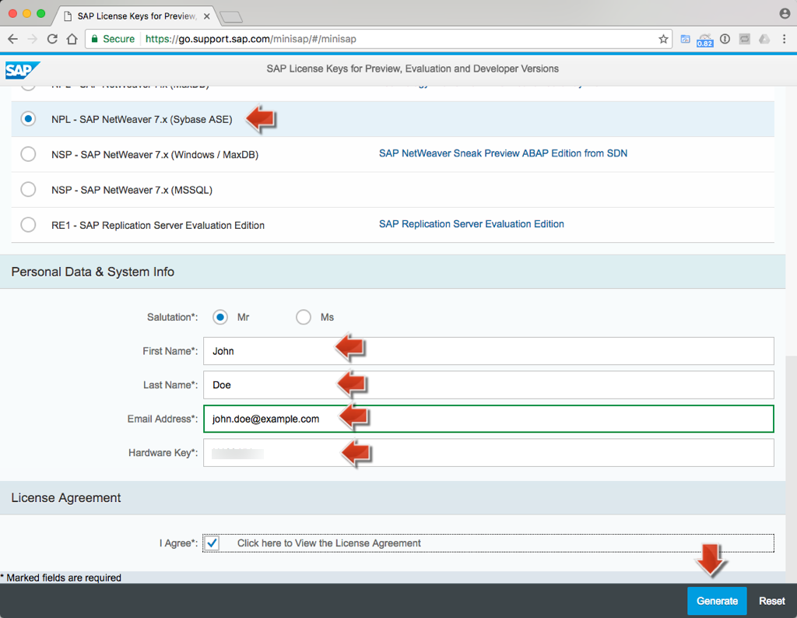
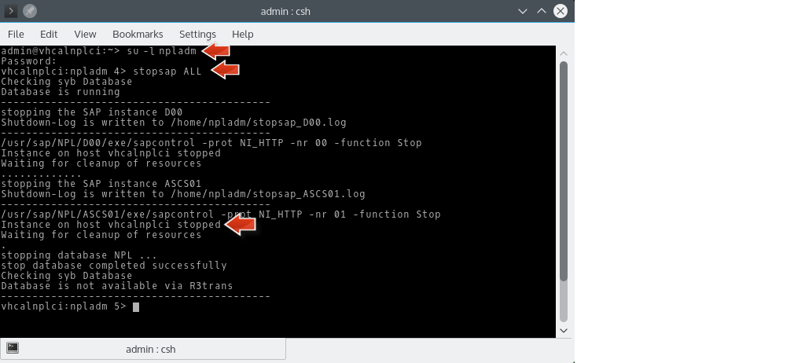

<a name="step-1-1-top"/><a name="step-1-2-top"/><a name="step-1-3-top"/><a name="step-2-1-top"/><a name="step-2-2-top"/><a name="step-2-3-top"/><a name="step-2-4-top"/><a name="step-2-5-top"/><a name="step-3-1-top"/><a name="step-3-2-top"/><a name="step-3-3-top"/><a name="step-4-1-top"/><a name="step-4-2-top"/><a name="step-4-3-top"/><a name="step-4-4-top"/><a name="step-5-top"/><a name="step-6-1-top"/><a name="step-6-2-top"/><a name="step-6-3-top"/><a name="step-6-4-1-top"/><a name="step-6-4-2-top"/><a name="step-6-5-1-top"/><a name="step-6-5-2-top"/>



**Overview:**

**Role:**

-   IT administrator
-   SAP Basis administrator

**Systems, Tools, Services:**

-   Oracle VM VirtualBox (VirtualBox)
-   openSUSE Leap 42.1 Linux OS (VM OS)
-   SAP NetWeaver AS ABAP 7.50 SP02 (NetWeaver AS ABAP)
-   SAP GUI / SAP Logon client

## Step 1: Preparation Steps

The _SAP NetWeaver AS ABAP_ system which is used in this course has to be installed on a 64 bit Linux Operating System (OS).
To enable also users working with Windows or Mac OS X operation system to install the needed ABAP system, we describe here how to make use of VirtualBox, where the ABAP system then is installed and run on a Linux Virtual Machine (VM).

> **Hint:** If you have already a 64 bit Linux OS then you can skip the described downloads and installation of VirtualBox (1.1 and 2.1) and Linux (1.2 and 2.3) and just download the ABAP installation files (1.3).

**System Requirements:**

Make sure that you have on your PC/Laptop or Mac:

1.  At least **8 GB of RAM** (better: 16 GB).
2.  At least **100 GB of free disk space**.

The tutorial has been tested to work for _Windows_ and on _Mac OS X_. Most of the written tutorial was created on Windows, whereas the video presentation was done on an Mac OS X.

As the some of the installation files are very large (> several GB) we recommend to start the download first for all files, before you start the installation process.

#### 1.1 Download Oracle VM VirtualBox

1.  Download the latest released version of Oracle VM VirtualBox (in short VirtualBox) from [https://www.virtualbox.org/wiki/Downloads](https://www.virtualbox.org/wiki/Downloads) for your host operating system (host OS).
2.  Click on e.g. **x86/amd64** link to start the download of VirtualBox for Windows OS.

[Top](#step-1-1-top)

#### 1.2 Download Linux OS openSUSE

1.  Download Linux OS openSUSE Leap **42.1** (DVD installation medium, 64bit, released version) to your local machine from [https://software.opensuse.org/421/en](https://software.opensuse.org/421/en) (Ensure that you do not choose the **Network** installation files.)

    > **Warning:** For this tutorial you must use Linux OS openSUSE Leap **42.1** that is not the latest openSUSE release. Make sure to download and install the **42.1** version, as we have not verified the tutorial with any other version.

2.  On the opened download page click **Direct Link** link to start the download.

[Top](#step-1-2-top)

#### 1.3 Download NetWeaver AS ABAP

1.  Open [https://tools.hana.ondemand.com/#abap](https://tools.hana.ondemand.com/#abap)
2.  Scroll down to section **SAP NetWeaver AS ABAP Developer Edition**
3.  Download all eight archive files `sap_netweaver_as_abap_750_sp02_ase_dev_edition.part<n>.rar` _(&lt;n> == 1,2,3,4,5,6,7,8)_ to your local machine.
4.  Use any unarchiver tool (e.g. _WinRAR_ for Windows or _Unarchiver_ for OS X) to extract the NetWeaver ABAP installation files somewhere to your local machine.

> **Warning:** Please check the file size of all the parts what you have downloaded. The file size is listed next to part rar files in [https://tools.hana.ondemand.com/#abap](https://tools.hana.ondemand.com/#abap). Each part file is around 1.5 GB.
>
> Please check that you have extracted the rar files correctly. The total size of the extracted folder of the Netweaver AS ABAP Installation files is around 12+ GB.
> If you have partially downloaded or partially extracted the ABAP files and if you continue the installation, you will run into installation errors.

[Top](#step-1-3-top)

## Step 2: Install Linux VM in VirtualBox

#### 2.1 Install VirtualBox

1.  Use the VirtualBox installer you downloaded before (Step 1 - 1.1).
2.  You can keep all default settings of the installation wizard.
3.  After installation, you can start the VirtualBox Manager as follows:
    -   On a Windows host:  Open the standard **Programs** menu and click on the item in the **VirtualBox** group.
    -   On a Mac OS X host: In the **Finder**, double-click on the **VirtualBox** item in the **Applications** folder (You may want to drag this item onto your Dock).

    

[Top](#step-2-1-top)

#### 2.2 Create new Linux VM in VirtualBox

1.  Open **VirtualBox** Manager application
2.  Click **New** button to create a new Linux virtual machine (VM) image with the following settings:
      - Name: **SAP NetWeaver 7.50 SP02**
      - Type: **Linux** (Operating System)
      - Version: **openSUSE (64-bit)**
      - Click **Next**

    

3.  On the next displayed wizard page:
      - Change _Memory size_ to **6 GB** (6144 MB).
      - Click **Next**

    

4.  On the next displayed wizard page:
      - Make sure that **Create a virtual hard disk now** is selected.
      - Click **Create**

    

5.  On the next opened wizard page:
      - Make sure that **VDI** (Default) is selected as _Hard disk file type_.
      - Click **Next**

    

6.  On the next displayed wizard page:
    - Make sure that **Dynamically allocated** (Default) is selected as _Storage on physical hard disk_.
    - Click **Next**

    

7.  On the next displayed wizard page:
    - Change _File size_ to **80 GB** and keep the _File location_
    - Click **Create** to create **a new VM entry** with the specified settings.

    

> **Result:** A new VM entry with Name _SAP NetWeaver 7.50 SP02_ is created on the left side of the VirtualBox Manager.
>
>    

[Top](#step-2-2-top)

#### 2.3 Set boot installation file for Linux VM

1.  Right-click on the new VM entry **SAP NetWeaver 7.50 SP02** to open the context menu.
2.  Choose **Settings...** to open a settings dialog.
3.  Select **Storage** from the navigation.
4.  In the _Storage Tree_ section select the **Empty** node of _Controller:IDE_.

    

5.  In the _Attributes_ section on the right side click on the **disk icon** to open a context menu.
6.  Click on option **Choose Virtual Optical Disk File...** to open a file browser.

    

7.  Select the openSUSE Linux OS .iso file from your local storage that you downloaded in step 1.

    

8.  Back on the _Settings_ dialog click **OK** to save the settings.

    

> **Result:** The VM has been prepared to boot from the specified _openSUSE DVD Image_ file as soon as it is started as described in the next section.

[Top](#step-2-3-top)

#### 2.4 Install openSUSE Linux OS on the VM

1.  In **VirtualBox Manager** select _SAP NetWeaver 7.50 SP02_ VM node and click **Start** button to start the new VM. It opens a new window **Oracle VM VirtualBox** and starts the virtual machine.

    

    > **Note:** If you have never worked with a Virtual Machine before, you have to imagine that a VM acts like a computer inside of your operating system. The window that now opened acts like a computer monitor for this emulated machine.

2.  Quickly use your keyboard **DOWN key** to select the **Installation** menu item, otherwise it will automaticall select the first menu item.

    

3.  Hit the **RETURN** key to start the VM OS installation of openSUSE Linux.
4.  During initialization, click the icon of the **mouse pointer integration** message so that this message is never displayed again.

      

5.  In the installation wizard, set the OS language to **English** and the Keyboard Language corresponding to the keyboard layout that you are using. You should check that your keyboard layout is correct by typing some special characters (e.g. ä, ß, z, a, >) in **Keyboard Test** area.

      

6.  Click **Next** to accept license and press **Next** in the screen with **Installation Options** by leaving the defaults.

      

9.  In the next screen with _Suggested Partitioning_ click on **Edit Proposal Settings**.

      

    -   For the field **File System for Root partitioning**, choose **Ext4** from the drop-down box.
    -   Uncheck **Propose Separate Home Partition**. This option is needed so that openSUSE Linux OS installation creates only one drive, instead of two drives (_Home_ and _Extension_) where _Home_ would have insufficent space to install the SAP NetWeaver backend system.
    -   Choose **Ok** to save settings.

10. Click **Next**.

    

11. Adjust **Region** and **Timezone** and press **Next**.

    

12. In Desktop Selection, choose **KDE Desktop**.

    

13. Click on **Next**.
14. Provide User's Full Name, Username and Master Password and click **Next**.

    > **Note:** Regarding the _Master Password_ we assume that you might want to use the same password throughout the tutorial, because it might be easier to remember. The SAP NetWeaver requires a certain password complexity. Therefore, it makes sense that you use at least 8 characters, one number and one capital letter to form your password, e.g. _Appl1ance_.

    

15. In the _Installation Settings_ wizard step, scroll down to find **Firewall and SSH** settings:

    -   Click on the **disable** link to disable the **Firewall**.
    -   Click on the **enable** link to enable the **SSH service**.

    

16. Click on **Install**.

    

17. After confirming that all settings are correct, click on **Install**.

    

18. After the installation finished (about 15-20 minutes), the VM will reboot automatically.

19. The VM will come up with default start option **Boot from hard Disk**. If you do nothing it will
    automatically use this option after 60 seconds (you may also hit RETURN key to speed this up).

      

20. Next the **openSUSE Leap &lt;version>** is displayed as default boot option and will be used automatically after a few seconds.

    

21. OpenSUSE might want to install quite some updates. It is not necessary to install these, so you may skip this step.
22. Eventually you will reach the logon screen for your openSUSE installation. (The logon page/lockscreen will also come up after certain time of not working with the running VM). Enter your **password** and click **Unlock** to enter the KDE desktop.

    > **Note:** This password is also the password of the _root_ user, which you have to enter frequently later in this unit. The _root_ user has advanced administration privileges in a Linux OS.

    

23. Close the **Desktop Folder** window: Hover over the window and click the **X** icon (with tooltip _Remove_) in the lower right corner of the window.

    

24. **For Laptop/Macbook Users:** To keep the Linux VM session alive when not connected to a power supply you must change the default _Energy Saving_ system settings.

    > **Warning:** The default power setting is that the server will suspend your session after 10 minutes of inactivity when your laptop is running on a battery. This stops any access to the SAP system and also shuts down the network connection making the VM inaccessible.

25. On the KDE desktop open the _Application_ menu (similar to the Windows _Start_ menu) in the bottom left corner. In the search field enter the query string **power** and click on the menu entry  **Energy Saving**.

    

26. In the _Energy Saving_ dialog select tab **On Battery**. Disable the checkbox **Suspend session**.
27. Select tab **On Low Battery**. Again disable the checkbox **Suspend session**.
28. Click on **Apply** and close the dialog with **Ok**.

      

[Top](#step-2-4-top)

#### 2.5 Create VM Snapshot

Having successfully installed and set up your openSUSE Linux operating system, you should create a **VM snapshot** of this initial state. You may revert to this snapshot, in case something should go wrong or break in the VM.

1.  In the running **Oracle VM VirtualBox** window menu: Choose **Machine > Take Snapshot...**.

    

2.  In the opened window enter **Initial Installation Snapshot** and click _OK_.

    

> **Result:** The VM snapshot _Initial Installation Snapshot_ has been created and saved.

[Top](#step-2-5-top)

## Step 3: VM Configurations - Proxy, Internet, shared Clipboard

#### 3.1 Configure Internet Proxy

In case you are using a proxy to connect to the internet, you have to configure it as follows; otherwise you may continue with [Step 3.2](#test-internet-connection).

##### 3.1.1 VM VirtualBox Setting

1.  In the running **Oracle VM VirtualBox** window menu: Choose **Input > Keyboard > Keyboard Settings...**.

    

2.  In the opened _Preferences_ window select _Proxy_ from the navigation:
      - Select **Manual Proxy Configuration** option.
      - Enter your **Host** and **Port** to the corresponding input fields (e.g. **proxy.mycompany.com** and **8080**).
      - Click **OK** to save the proxy settings.

    

##### 3.1.2 YaST Proxy Setting

YaST is the installation and configuration tool for openSUSE. It can be used to configure your entire system, network, system services and security settings. It may also install new software packages from the internet. Hence you might need to set up a proxy for YaST.

1.  In the running **Oracle VM VirtualBox** open the KDE **Application Menu** by clicking on the **gear with K** icon in the lower left corner.

    

2.  Navigate to **System > YaST** and click on the _YaST_ item.
3.  Enter your **root password** to open the _YaST Control Center_.

    

4.  Enter **proxy** as search term into the **Search** field.

    

5.  On the right side, select the **Proxy** icon in the _Network Services_ category.
6.  On the _Proxy Configuration_ page:
    -   Select **Enable Proxy** checkbox.
    -   Enter **HTTP Proxy URL** value, e.g. http://proxy.mycompany.corp:8080
    -   Select  **Use the Same Proxy for All Protocols** checkbox.
    -   Click **Test Proxy Settings** to verify the proxy settings.

    

7.  A **Proxy settings work successfully** popup should appear. Confirm with **OK**.

    

8.  Click **OK** to save the proxy settings.

    

9.  Confirm the _Successfully Saved_ dialog with **OK**.

##### 3.1.2 Firefox Proxy Setting

1.  In the running **Oracle VM VirtualBox** open the KDE **Application Menu** by clicking on the **gear with K** icon in the lower left corner.

    

2.  Navigate to **Internet > Firefox** and click on the item to open the _Firefox_ web browser.

    

3.  Open **Firefox menu** in the upper right corner and click on **Preferences**.

    

4.  On the opened **Preferences** page:
    -   Choose **Advanced** item from left side icon bar.
    -   On the _Advanced_ page click **Network** tab.
    -   Click **Settings...** button

    

5.  On the opened **Connection Settings** dialog:
    -   Select **Manual Proxy configuration** option
    -   Enter your **HTTP Proxy** and **Port** value (e.g. _proxy_ and _8080_)
    -   Select **Use this proxy server for all protocols** option
    -   Click **OK** to save the proxy settings.

    

[Top](#step-3-1-top)

#### 3.2 Test Internet Connection

1.  In the running **Oracle VM VirtualBox** open the KDE **Application Menu** by clicking on the **gear with K** icon in the lower left corner.

    

2.  Navigate to **Internet > Firefox** and click on the item to open the _Firefox_ web browser.

    

3.  You should now see a working openSUSE default web page.

[Top](#step-3-2-top)

#### 3.3 Enable bi-directional shared clipboard

Before you continue with the ABAP installation specific steps, you should enable the bi-directional shared clipboard as follows. This option allows you to use clipbord contents (copy & paste) from your host OS (Windows / Mac OS X) in the VM (openSUSE) and vice-versa. This should make things much easier when you copy and paste contents from this tutorial into the Linux console.

1.  In the running **Oracle VM VirtualBox** window menu: Open **Devices > Shared Clipboard > Bidirectional**.

    

2.  Click on the **Bidirectional** item so that it is enabled.

> **Hint:** With this enabled _bi-directional_ option you can now copy and paste from your host operating system to the VM image window and vice versa. This is very helpful as you can copy e.g. needed command lines from the tutorial description (web page on your host OS) into a bash window of your VM window.

[Top](#step-3-3-top)

## Step 4: VM Preparations for ABAP Installation

#### 4.1 Enable Network Access to Linux VM

1.  In **VirtualBox** Manager right-click on **SAP NetWeaver 7.50 SP02 VM** item to open context menu.

    

2.  Choose **Settings...** to open a settings dialog.
3.  Select **Network** and change the following settings in the **Adapter 1** tab:
    - Enable Network Adapter: **selected**
    - Attached to: **NAT**

    

6.  Click on **Advanced**, to see the _Advanced Network Settings_.
7.  Click on the **Port Forwarding** button.

    

8.  On the opened _Port Forwarding Rules_ dialog:
    -   Click 6 times the **green plus** icon to create 6 rows of roles.
    -   Then enter the following _Port Forwarding Rules_.

    > **Hint:** Copy each value entry (e.g. 1. each Name, 2. Protocol, etc.) then double-click into the table field to get the edit focus and then paste the copied value.

    | Name                |Protocol |Host-IP   |Host Port |Guest IP  |Guest Port |
    |---------------------|---------|----------|----------|----------|-----------|
    | HTTP                |TCP      |127.0.0.1 |8000      |10.0.2.15 |8000       |
    | HTTPS               |TCP      |127.0.0.1 |44300     |10.0.2.15 |44300      |
    | SAP Cloud Connector |TCP      |127.0.0.1 |8443      |10.0.2.15 |8443       |
    | SAP GUI             |TCP      |127.0.0.1 |3200      |10.0.2.15 |3200       |
    | ABAP in Eclipse     |TCP      |127.0.0.1 |3300      |10.0.2.15 |3300       |
    | SSH                 |TCP      |127.0.0.1 |22        |10.0.2.15 |22         |

9.  Click **OK** to save the entered values.

    

10. Click **OK** to save Network settings.

    

[Top](#step-4-1-top)

#### 4.2 Setup UUIDD Service

The UUID daemon is used to generate universally unique identifiers (UUIDs). The SAP NetWeaver backend system needs this service to create unique IDs.

##### 4.2.1 Install UUIDD

> **Hint:** UUIDD installation will only work if the VM has internet access.

1.  In the running **Oracle VM VirtualBox** open the KDE **Application Menu**.

    

2.  Navigate to **System > YaST** and click the YaST item.
3.  Enter your **root password** to open _YaST Control Center_ window.

    

4.  The first list item **Software** is selected by default.
5.  On the right side click on **Software Management** from the items list.
6.  On the newly opened _YaST2_ page do the following:
      - Enter **uuidd** string into the search field and click **Search**.
      - On the right side select the found **uuidd** package.
      - Click **Accept** to install _uuid daemon helper_ in YaST.

    

10. On the **Installation Successfully Finished** page, click **Finish** to get back to the _YaST Control Center_ window.

##### 4.2.2 Start UUIDD

The installed UUIDD service will now be started by a command window called _Konsole_. Many installation and configuration steps can and will be accessed from this command window in this tutorial.

1.  Open the KDE **Application Menu**.
2.  Navigate to **System > Konsole** and click on it to open a new terminal window.

    

    > **Hint:** If you right-click on the Konsole item you can choose **Add to Favorite** to create a shortcut icon in the KDE Application Menu.

3.  In the bash window execute **sudo service uuidd status** to check if the service is running.

    > **Hint:** You may press the _middle mouse button_ or _mouse scroll wheel_ to paste text into the _Konsole_.

4.  All commands starting with `sudo` will ask for your **root** password. (`sudo` means that the command is executed with root user privileges.)
5.  **UUIDD status** output should be **inactive (dead)** as you just installed the service and it is not started yet.

    

6.  Execute **sudo service uuidd start** to start the service.

    

7.  Execute **sudo service uuidd status** to check if the service is running.

    > **Hint:** If you press UP and DOWN keys on your keyboard, you can see the history of commands that you executed in the _Konsole_ before.

8.  The _UUIDD_ status should now be **active (running)**.

[Top](#step-4-2-top)

#### 4.3 Prepare Network Setup

The SAP NetWeaver backend expects the **hostname** of its system to be called  _vhcalnplci_. We will now change the hostname of the openSUSE system accordingly, as this is more convinient than to reconfigure the SAP NetWeaver backend system.

1.  Open your _Oracle VM VirtualBox_ window.

2.  Open the **Konsole** and execute command **sudo vi /etc/hostname**, to open the hostname file with the _vi_ editor, which is a text editor for the terminal window.

    

3.  Press **Esc** and **i** to switch the _vi_ editor to _insert_ mode, in order to change the content of the configuration file **/etc/hostname**. The text in this file sets the **system host name**.

    

4.  Replace the existing hostname _linux-n1wt.suse_ with **vhcalnplci**.

    > **Hint:** Navigate in the _vi_ editor with **arrow keys** and then use **back DEL** key to delete the characters.

    

5.  Press **Esc** and **:wq** (_write_ and _quit_) to save the changed file and to quit the _vi_ editor.

    

6.  Hit **ENTER** key to execute this _vi_ editor command and go back to the _Konsole_ bash window.

    

    > **Hint:** After pressing the _Esc_ the cursor will go to the bottom of the screen at a colon prompt. Write your file by entering **:w** and quit by entering **:q**. You can combine these to save and exit by entering **:wq**.

7.  You now need to restart the openSUSE network adapter to reload the configuration file with the new hostname and to test it.
8.  Execute **sudo rcnetwork restart**.
9.  Execute **hostname** and see that the hostname output is **vhcalnplci**.

    

10. You now need to change the openSUSE **hosts** file. The _hosts_ file translates a _hostname_ to an IP address.
11. In the opened _Konsole_ execute command **sudo vi /etc/hosts** to open the vi editor for _hosts_ file.
12. Press **Esc** and **i** to switch the _vi_ editor again to _insert_ mode.
13. After the existing **127.0.0.1** entry add the following new line entry:

    -   **10.0.2.15 vhcalnplci vhcalnplci.dummy.nodomain**

        > **Hint:** Navigate in the _vi_ editor with **arrow keys** to the place where you want to paste the added entry.

    

14. Press **Esc** and **:wq** and hit the **ENTER** key to save the changed file.
15. Restart network to set settings and test it:
16. Execute **sudo rcnetwork restart**
17. Test setup with **ping vhcalnplci**
18. The ping output should look like: `64 bytes from vhcalnplci (10.0.2.15): icmp_seq=1 ttl=64 time=0.041 ms`
19. Stop the ping output with **CRTL** and **C**.

    

[Top](#step-4-3-top)

#### 4.4 Mount _netweaver_ Installation Folder in Linux VM

To start the installation of the _SAP NetWeaver_ backend system, you need to allow the openSUSE to access the _netweaver_ installation folder which resides in you host operating system (your main Windows / Mac OS) to get access to extracted ABAP installation files.

##### 4.4.1 Setup a Shared Folder

1.  In **VirtualBox Manager** right-click on **SAP NetWeaver 7.50 SP02 VM** item to open context menu.

    

2.  Choose **Settings...** to open a settings dialog.
3.  Select the **Shared Folders** item.

    

4.  Click on the **folder icon with green plus** (with tooltip _Adds new shared folder_) to open _Add Share_ dialog:
    -   Folder Path: **\<navigate to location where you extracted the SAP NetWeaver installation files>**. (see [Step 1.3](#download-netweaver-as-abap))
    -   Folder Name: **netweaver**
    -   Read-only: **not selected** (default)
    -   Auto-Mount: **not selected** (default)
    -   Make Permanent: **not selected** (default)
    -   Click **OK**

    

5.  Click on **OK**.

    

##### 4.4.2 Mount _netweaver_ folder to the Shared Folder

1.  Use already opened **Konsole** or open a new one (KDE **Application Menu** and navigate to **System > Konsole**).
2.  Execute command **mkdir netweaver** _(make directory)_ to create a new _netweaver_ folder.

    > **Hint:** Execute command **pwd** _(print working directory)_, so that you know at which location you created this folder.

    

3.  Execute command **sudo mount -t vboxsf netweaver netweaver** to mount (== _map_) this _netweaver_ folder in the VM, to the _Shared Folder_ you set up in [step 4.4.1](#setup-a-shared-folder) (which also named _netweaver_).

    

4.  Execute command **cd netweaver** _(change dir)_ to navigate into the _netweaver_ folder.
5.  Execute command **ls -l** _(list directory using a long listing format)_ to show the contents of the mounted folder. The contents are the extracted _SAP NetWeaver_ installation files to which openSUSE now access to.

Now you have prepared everything for the _SAP NetWeaver_ installation.

[Top](#step-4-4-top)

## Step 5: Install SAP NetWeaver AS ABAP on Linux VM

In the previous steps you have downloaded, extracted and mounted the installation files for a _SAP NetWeaver_ system to the openSUSE Linux running inside of your local machine. You will now install the system in this Linux OS. Please note that this is a specially prepared and simplified installation of a _SAP NetWeaver_ backend, and that the installation process of a live and productive instance requires more expertise on how to best tweak the system settings.
Please also be aware that the RAM settings we allocated in the VM are very minimalistic, so the system might react slower that you would expect it to run, if it were installed properly on a dedicated server.

1.  Use the already opened **Konsole** terminal window, or open a new one (KDE **Application Menu** and navigate to **System > Konsole**).
2.  Inside the mounted **netweaver** folder execute command **ls -l** to see that amongst other files and folders the **install.sh** is available. This is the installation script to start the installation of the _SAP NetWeaver_ system.
3.  Execute **chmod +x install.sh** to enable the execution of the installer.

    

4.  Execute **sudo ./install.sh** to start the installation.
5.  Hit **Enter** key when _Hit enter to continue_ message appears.
6.  Hit **Space** key until _Do you agree to the above license_ message comes up.
7.  Read and accept the license agreement and confirm with **yes**, if you agree to the terms of condition.
8.  When prompted for the OS users password, choose a strong password for your ABAP OS users (Users like _npladm_). **The password should be minimum length 8 characters, contain at least one capital letter and one number; e.g. `Appl1ance`.**

    > **Note:** The install script will fail if you choose a password that is too weak.

9.  Installation will start and take about 20 minutes.

      

10. If the installation was successful, you should see the following message:

        Instance on host vhcalnplci started
        Installation of NPL successful

    

[Top](#step-5-top)

## Step 6: Run and Test SAP NetWeaver AS ABAP

#### 6.1 Start NetWeaver AS ABAP

With the following steps you make sure that the AS ABAP is up and running.

##### 6.1.1 Startup ABAP

1.  Use already opened **Konsole** or open a new one (KDE **Application Menu** and navigate to **System > Konsole**).
2.  Execute the following three commands to start and check the installed NetWeaver AS ABAP:
3.  Execute **su -l npladm** (will ask for _NetWeaver AS ABAP_ **system password**) to switch to _NetWeaver Admin_ user, so that you act in this Konsole as this user and its permissions.

    > **Hint:** This user has been created during the ABAP installation in above Step 5 and only this user has the permissions to start, stop and check the status of the installed ABAP on the VM.
    >
    > **Note:** The `-` (or `-l`) parameter for the **su** (_substitue user_) command creates a shell environment the same as if you had logged in with that different user.  Without the `-l` parameter, you're running the **sapcontrol** command in the shell environment of the current user.

4.  Execute **startsap ALL** to start the ABAP server (if not already).
5.  Execute **sapcontrol -nr 00 -function GetProcessList** to check that the processes are running and are all **GREEN**

    > **Note:** As 'startsap ALL' can take some time, repeat the command execution a few times until all four processes _(IGS Watchdog, Dispatcher, Gateway, ICM)_ are _GREEN_.

    The result should look as follows:

        GetProcessList
        OK
        name, description, dispstatus, textstatus, starttime, elapsedtime, pid
        igswd_mt, IGS Watchdog, GREEN, Running, 2017 ... , ... , ...
        disp+work, Dispatcher, GREEN, Running, 2017 ... , ... , ...
        gwrd, Gateway, GREEN, Running, 2017 ... , ... , ...
        icman, ICM, GREEN, Running, 2017 ... , ... , ...

    

##### 6.1.2 Create a new VM Snapshot

After the installation of the _SAP NetWeaver AS ABAP_ finished successfully, you should create a snapshot to preserve this state as you already did after the Linux installation. You can then always revert to this snapshot VM state, in case your VM image should get broken for whatever reason.

1.  In the running **Oracle VM VirtualBox** window menu: Choose **Machine > Take Snapshot...**.

    

2.  In the opened window enter **ABAP Installation Snapshot** and click _OK_.

    

> **Result:** ABAP installation snapshot has been created.

[Top](#step-6-1-top)

#### 6.2 Setup SAP GUI Client

The SAP GUI (also known as: _SAP Logon_ or _SAP Front End_) is the front-end application to connect to SAP backend systems like the _SAP NetWeaver AS ABAP_.

> **Hint:** If you have already a _SAP GUI / SAP Logon_ installed on your computer, you may use it and skip the installation and continue with [step 6.2.2](#add-sap-netweaver-to-sap-gui-and-log-on).

##### 6.2.1 Install SAP GUI Client

> **Hint**: If you encounter any issues, you may also refer to the [SAP Front End Installation Guide](http://www.sap.com/documents/2014/10/bed91652-5a7c-0010-82c7-eda71af511fa.html).

In your host OS (Windows or Mac OS) navigate to the location where you extracted the NetWeaver ABAP installation files and open the folder **client**.

**For Windows:**

1.  Go to folder /client/**SAPGUI4Windows**
2.  Right-click on `SAP_GUI_7.40_PL1_20150108_1618.exe` and choose **Run as administrator** from context menu to launch the installation wizard.

    

3.  If you get a Windows security promt (as you are requesting administrator privileges), you need to confirm _User Account Control_ dialog with **OK**.
4.  Click through the installation wizard and keep the default values and make sure that **SAPGUI 7.40 PL1** checkbox is selected.
5.  The wizard should finish with a success message which you confirm with **Close**.

    

> **Result:** The **/SAP/FrontEnd/SAPgui/saplogon.exe** file inside Windows program files folder has been created to launch **SAP Logon** application. A shortcut to **SAP Frontend** is placed in your Windows Start menu.

**For Mac OS:**

1.  Go to folder /client/**JavaGUI**
2.  Double-click on `PlatinGUI740_8-OSX.JAR` file to run it with _JAR Launcher.app_ so that the SAP Front End installer opens.

    

3.  Click **Next** to open _Readme_ page.
4.  Click again **Next** to open _Installation Options_ page.
5.  Keep the defaults and click **Install** to start the installation.
6.  The wizard should finish with a success message which you confirm with **Close**.

    

##### 6.2.2 Add SAP NetWeaver to SAP GUI and Log On

**For Windows:**

1.  Open the **SAP Logon** application (also known as _SAP GUI_) from Windows Start menu.

    

2.  Add your local NetWeaver ABAP installation as new system:
3.  Click **New** icon from the _SAP GUI_ toolbar to open **Create New System Entry** wizard.

    

4.  Select **User Specified System** entry and click **Next**.

    

5.  On the next page enter the following details:

    -   Description : **Local NetWeaver**
    -   Application Server: **127.0.0.1**
    -   Instance Number : **00**
    -   System ID: **NPL**

        

6.  Click **Finish** to create a new system entry.

    

7.  Logon to the new system:
8.  Right-click on the newly created entry **Local NetWeaver** and click on **Log on** option of the context menu.

    

9.  To log on to the system for the first time, use the following credentials:
      - Client: **001**
      - User: **Developer**
      - Password: **Appl1ance**
      - Language: **EN**

    

10. Click green **Accept** icon to log on to the system with the specified credentials.
11. Click also green **Accept** icon on the opened **Copyright** dialog so that the **SAP Easy Access** entry page of the local NetWeaver system is displayed.

    

> **Hint (optional):** The _Favorites_ links like **Launchpad** as you can see in the before opened _SAP Easy Access_ page will only work, if you add the following entry to the `hosts` file in your **host operating system** (Windows: open the file **C:\\Windows\\System32\\drivers\\etc\\hosts** in a text editor with administrator privileges): `127.0.0.1 vhcalnplci vhcalnplci.dummy.nodomain`

**For Mac OS X:**

1.  Open **SAP GUI** application by double-clicking **/Applications/SAP Clients/SAPGUI/SAPGUI.app** file.

    

2.  **New** icon to open **Connection Properties** dialog
3.  Enter _Description_: **Local NetWeaver**
4.  Click **Advanced** tab

    

5.  On _Advanced_ tab select **Expert mode** option.
6.  In the text area field enter **conn=/H/127.0.0.1/S/3200**

    

7.  Click **SAVE** to create a new system entry.

    

8.  Log on to the new system.
9.  Right-click on the new entry **Local NetWeaver** and click on **Connect** option of the context menu.

    

10. To log on to the system for the first time, use the following credentials:
      - Client: **001**
      - User: **Developer**
      - Password: **Appl1ance**
      - Language: **EN**

    

11. Click green **Accept** icon to log into the system with the specified credentials.
12. Click also green **Accept** icon on the opened **Copyright** dialog so that the **SAP Easy Access** entry page of the local NetWeaver system is displayed.

    

> **Hint (optional):** The _Favorites_ links like **Launchpad** as you can see in the before opened _SAP Easy Access_ page will only work, if you add the following entry to the `hosts` file in your **host operating system**. (Mac OS: open _Terminal_ and type  **_sudo nano /etc/hosts_**): `127.0.0.1 vhcalnplci vhcalnplci.dummy.nodomain`

[Top](#step-6-2-top)

#### 6.3 Install SAP System License

To work with the installed local _SAP NetWeaver AS ABAP_ system you have to request a _Demo license_ for free as described in the following steps.

##### 6.3.1 Install License

1.  Open **SAP GUI** and login with the **SAP*** user.
2.  Enter **SLICENSE** in the transaction field in the upper left corner.

    

3.  Click green **Enter** icon to launch the _SLICENSE_ transaction.
4.  Copy & paste Hardware Key from the opened transaction page.

    

5.  Open the [SAP Sneak Preview License Key Request](https://websmp130.sap-ag.de/sap/bc/bsp/spn/minisap/minisap.htm) page.
6.  Fill in your **HCP trial User ID** as _SCN User id_ and fill in the other requested information.
7.  Read and agree to the license terms and conditions.
8.  Choose System ID **NPL - SAP NetWeaver 7.x (Sybase ASE)**.
9.  Enter the **Hardware key** value which you copied from _SLICENSE_ transaction before.
10. Click **Submit**.

    

11. You will receive a mail to the provided email address with an attachment called **NPL.txt**

    > **Note:** The mail might take 5-10 minutes or sometimes even longer. In this case you may revisit this at a later point in time and continue with the tutorial.

12. Save the attachment **NPL.TXT** fom the e-mail to your local disk.
13. Switch to the SAP GUI window.
14. On the transaction _SLICENSE_ page click the button **Install**.

    > **Note:** If the Install button is not visible, scroll down.

    

15. In the file picker, navigate to the license file **NPL.TXT** and open it.
16. On the **SAP GUI Security** window click **Allow** to grant access to the file.
17. Then a successfully installed window should appear on which you click the green **Continue** icon.
18. Finally, a new **Valid License Entry** is added to the table on the _Digital Signed Licenses_ tab.

    

19. **Close** the window where the transaction _SLICENSE_ has been opened.

##### 6.3.2 Create a new VM Snapshot

After you added the license to your _SAP NetWeaver AS ABAP_, you should again create a **VM Snapshot** in order to preserve this state.

1.  In the running **Oracle VM VirtualBox** window menu: Choose **Machine > Take Snapshot...**.
2.  In the opened window enter **ABAP with License** and click **OK**.

> **Result:** _ABAP with License_ snapshot has been created.

[Top](#step-6-3-top)

#### 6.4 Shutdown VM with NetWeaver AS ABAP

When you are not working on the course, like probably now as week 1 almost finished, it is recommended to shutdown the openSUSE VM in which the _SAP NetWeaver AS ABAP_ is running.

> **Note:** First reason for this is that the SAP NetWeaver system might take a considerable amount of system resources on your host OS machine. The second reason is that the shutdown and restart with snapshot procedure of the VM with the ABAP system is sometimes the best way to get out of certain SAP NetWeaver related problems (e.g. SAP NetWeaver processes does not result in GREEN status after executing 'startup ALL'_).

Shutdown of the VM should be done in two steps, first stopping the ABAP and secondly closing the VM:

##### 6.4.1 Stopping NetWeaver AS ABAP

1.  In the running **Oracle VM VirtualBox** open KDE **Application Menu**.
2.  Open a **Konsole** (**System > Konsole**) and execute the following three commands:
3.  Execute **su -l npladm** (will ask for _NetWeaver AS ABAP_ **system password**) to switch to the _NetWeaver Admin_ user, so that you act in this Konsole as this user and its permissions.
4.  Execute **stopsap ALL** to stop the ABAP server.

    

[Top](#step-6-4-1-top)

##### 6.4.2 Closing VM

1.  In the running **Oracle VM VirtualBox** window menu: Open **File > Close...**.

    

2.  In the opened _Close Virtual Machine_ window select the **Power off the machine** option.

    > **Hint:** With this option the current state will not be preserved and if VM is restarted the last saved snapshot will be taken as system state.

    

3.  Click **OK** so that the VM window is closed.

[Top](#step-6-4-2-top)

#### 6.5 Starting VM with NetWeaver AS ABAP

After you have stopped the ABAP and closed the VM as described in above [section 6.4](#shutdown-vm-with-netweaver-as-abap) we now describe how you launch the VM, start the NetWeaver AS ABAP there and verify that the system processes are running as they should.

We will describe this startup of the VM from the latest existing snapshot you created.

> **Hint:** Keep in mind that in later weeks of this course you will be pointed to this _How to start a VM_ section. Then you might already have another latest snapshot that the one after described below.

##### 6.5.1 Starting up VM from latest Snapshot

1.  In **VirtualBox Manager** restore the latest snapshot:
2.  Select **Snapshots** button in the upper right corner.
3.  Open the snapshot tree nodes and select the latest node **before Current State** node (at the end of week 1, unit 6 this is **ABAP with License Snapshot**).
4.  Open context menu on selected node and chose **Restore Snapshot**.

    

5.  If the _Virtual Box - Question_ window pops up then:
    -   **Deselect checkbox** _Create a snapshot of current machine state option_.
    -   Click **Restore**.

    

    > **Result:** The state of the selected VM is restored to this snapshot and can be started now.

6.  Select _SAP NetWeaver 7.50 SP02_ VM node and click **Start** button to start the new VM. It opens a new window **Oracle VM VirtualBox** and starts the virtual machine.

    > **Hint:** Hit RETURN key to accept the default menu entries (first _Boot from Harddisk_ and second _openSUSE_) so that you do not have to wait a few seconds for auto-start.

      

[Top](#step-6-5-1-top)

##### 6.5.2 Starting up NetWeaver AS ABAP on running VM

1.  In the running **Oracle VM VirtualBox** open KDE **Application Menu**.
2.  Open a **Konsole** (**System > Konsole**).
3.  Check Network connection:
4.  Execute **sudo ifconfig** (will ask for root password).
5.  Make sure, that you find **inet addr:10.0.2.15** as part of the output result.

    > **Note:** If you don't get this **inet addr**, then try to execute **sudo rcnetwork restart** and check again.

    

6.  Start _SAP NetWeaver AS ABAP_:
7.  Execute **su -l npladm** (will ask for _NetWeaver AS ABAP_ **system password**) to switch to _NetWeaver Admin_ user, so that you act in this _Konsole_ as this user and its permissions.
8.  Execute **startsap ALL** to start the ABAP server.
9.  Execute **sapcontrol -nr 00 -function GetProcessList** to check that the processes are running and are all **GREEN**.

    > **Note:** As the system start may take some time, you should repeat the command execution of `sapcontrol -nr 00 -function GetProcessList` a few times, until all four processes _(IGS Watchdog, Dispatcher, Gateway, ICM)_ are _GREEN_.

    

    The result should look as follows:

        GetProcessList
        OK
        name, description, dispstatus, textstatus, starttime, elapsedtime, pid
        igswd_mt, IGS Watchdog, GREEN, Running, 2017 ... , ... , ...
        disp+work, Dispatcher, GREEN, Running, 2017 ... , ... , ...
        gwrd, Gateway, GREEN, Running, 2017 ... , ... , ...
        icman, ICM, GREEN, Running, 2017 ... , ... , ...

[Top](#step-6-5-2-top)

[**&lt; Previous** Unit 4](../unit-4/) | [**Up ^** Week 1 Overview](../)
