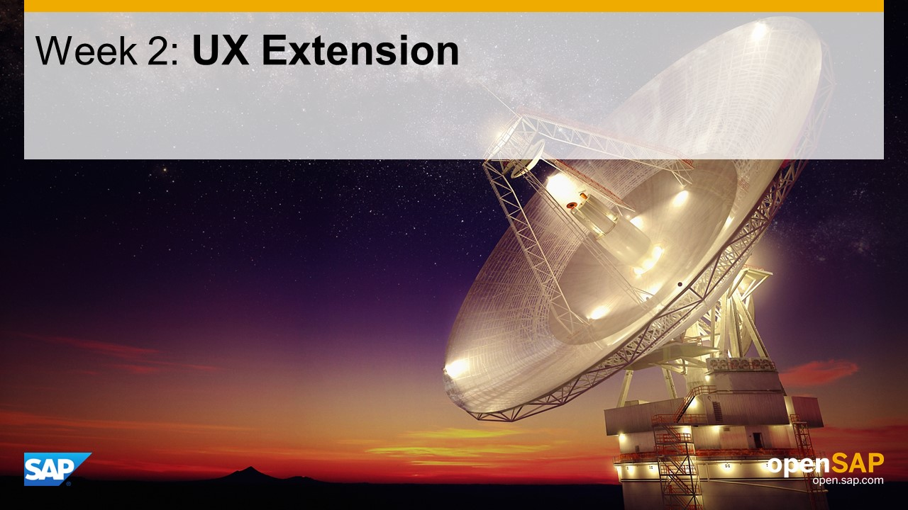

## Units
- Unit 1: [Understanding the Challenge](./unit-1/)
- Unit 2: [Preparing Back-End APIs](./unit-2/)
- Unit 3: [Exposing Back-End APIs to the Cloud](./unit-3/)
- Unit 4: [Creating an SAP Fiori Launchpad in the Cloud](./unit-4/)
- Unit 5: [UX Extension: Filter, Sort, and Group by Rating](./unit-5/)

