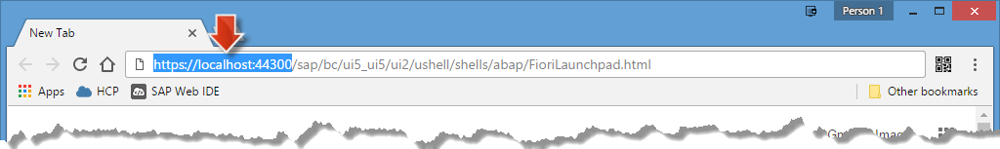

<a name="step-1-top"/><a name="step-2-top"/><a name="step-3-1-top"/><a name="step-3-2-top"/><a name="top"/>
<a name="top-1"/><a name="top-2"/><a name="top-3"/><a name="top-4"/><a name="top-5"/><a name="top-6"/><a name="top-7"/><a name="top-8"/><a name="top-9"/><a name="top-10"/>
<a name="top"/>





> **Note:** On this page you will only find the presentation slides of the unit, without any additional context or explanations. Therefore **we strongly recommend to watch the [corresponding video](https://open.sap.com/courses/hcp3a1/items/5jtQzI31I7trRXgAVi8woJ)** _(openSAP log-in required)_ in which Thomas Bieser, the course instructor, explains the slides in detail. This will greatly enhance your understanding of this units content.

## Presentation Slides

### Slide 1: Title

[Top](#top-1)

### Slide 2: Week Overview

[Top](#top-2)

### Slide 3: Unit Overview

[Top](#top-3)

### Slide 4: Business Problem for this week

[Top](#top-4)

### Slide 5: Solution: Identify IT equipment with low satisfaction rating

[Top](#top-5)

### Slide 6: Extension for this week: UX Extension

[Top](#top-6)

### Slide 7: Extension Pattern: Point-to-point connectivity via OData

[Top](#top-7)

### Slide 8: Path towards the Collaborative Extension

[Top](#top-8)

### Slide 9: Involved Roles

[Top](#top-9)

### Slide 10: What you've learned in this unit

[Top](#top-10)

## System Preparation Steps

### Step 1: VM with SAP NetWeaver AS ABAP is up and running

As we want to make sure that your back-end system is in a defined, up and running state do the following **VM Stop/Start cycle**:

1.  **Stop** SAP NetWeaver AS ABAP and **Close** VM as described in [Week 1, Unit 6, Step 6.4](../../week-1/unit-6/#shutdown-vm-with-netweaver-as-abap).
2.  **Start** latest VM Snapshot **ABAP with License Snapshot** and then SAP NetWeaver AS ABAP as described in [Week 1, Unit 6, Step 6.5](../../week-1/unit-6/#starting-vm-with-netweaver-as-abap).

> **Result:** Your _SAP NetWeaver AS ABAP 7.50 SP02_ system is now up and running with its processes in the openSUSE Linux VM.

[Top](#step-1-top)

### Step 2: Logon to SAP NetWeaver AS ABAP

Verify with the following steps that you can log on to the _SAP NetWeaver AS ABAP_ (running in the VirtualBox VM) using the _SAP Logon_ application in your **_host operating system (OS)_**, i.e. your main Windows / Mac OS installation.

1.  Open **SAP Logon / SAP GUI** application
      - Windows: Find and launch **SAP Logon** in Windows start menu, or by open the **\\&lt;path-to-Program-Files>/SAP/FrontEnd/SAPgui/saplogon.exe** file.
      - Mac OS: Find and launch **SAP GUI** in your app launcher or locate the app in the file path **\\&lt;path-to-Applications>/SAP Clients/SAPGUI/SAPGUI.app**.

    

2.  Double-click the **Local NetWeaver** entry to open the logon screen and use the following credentials:
    -   Client: **001**
    -   User: **Developer**
    -   Password: **Appl1ance**
    -   Language: **EN**

    

> **Result:** The **SAP Easy Access** default page of the _SAP NetWeaver AS ABAP_ system is now open. Your logged in user **Developer** has access to several transactions and web applications like the SAP Fiori launchpad (FLP) as you will see later.

[Top](#step-2-top)

### Step 3: Open SAP Fiori Launchpad

You have verified in above Step 2 that you can access the _SAP NetWeaver AS ABAP_ and opened the _SAP Easy Access_ page. Now you will verify that the logon page of the sample SAP Fiori Launchpad (FLP) can be opened. This ensures that Fiori applications of the Back-End system can be accessed via Web browser.

1.  In the opened **SAP Easy Access** page:
2.  Select **Favorites > Launchpad** and open context menu (using a right-click).
3.  Click **Change Favorites** entry.

    

4.  Select and copy the entire **Web Address** URL to your clipboard. The URL is **http://vhcalnplci.dummy.nodomain:8000/sap/bc/ui5_ui5/ui2/ushell/shells/abap/FioriLaunchpad.html**
5.  **Close** the _Change Web address or path_ window.

    

6.  Open a new _Google Chrome_ browser tab.
7.  Paste the before copied FLP URL into the address bar.
8.  Replace the beginning part of the URL **http://vhcalnplci.dummy.nodomain:8000** with **https://localhost:44300**.
9.  Press **Return**.

    

    > **Result:** In Google Chrome you get informed that your connection is not secure, due to issues with the SSL certificate. (The certificate is issued to a different hostname than localhost.)

    

10. On the _Your connection is not private_ page, click on the **Advanced** button to enable the _proceed_ link.
12. Click the link **Proceed to localhost (unsafe)** to access the before entered localhost Fiori launchpad URL.

    

> **Result:** You successfully opened the SAP Fiori launchpad login screen in your web browser from your host OS. This launchpad is hosted on your SAP NetWeaver AS ABAP 7.50 system. This confirms that the system is successfully up and running on the guest OS (Linux VM).

[Top](#step-3-1-top)

### Step 4: Create _S/4HANA FLP_ Bookmark

1.  In _Google Chrome_ create a new **bookmark** with name **S/4HANA FLP** for the opened SAP Fiori Launchpad page.

    

    > **Result:** You have created a new bookmark **S/4HANA FLP** on the bookmark bar of your browser. Click on it to quickly access the SAP Fiori Launchpad (FLP) of the SAP S/4HANA backend system.

2.  **Close** the Web browser window. Later in this week when you need to open the FLP you will just make use of the new **S/4HANA FLP** bookmark.

> **Result:** As you have executed all above steps you have now an up and running _SAP NetWeaver AS ABAP_ in the guest OS (Linux VM) which to which you are connected to via the opened _SAP Logon / SAP GUI_ from your host OS (Windows / Mac OS).

[Top](#step-3-2-top)

[**&lt; Previous** Week 1](../../week-1/) | [**Up ^** Week 2](../) | [**Next >** Unit 2](../unit-2/)
