<a name="step-1-1-top"/><a name="step-1-2-top"/><a name="step-1-3-top"/><a name="step-1-4-top"/>
<a name="step-2-1-top"/><a name="step-2-2-1-top"/><a name="step-2-2-2-top"/><a name="step-2-3-top"/>





**Overview:**

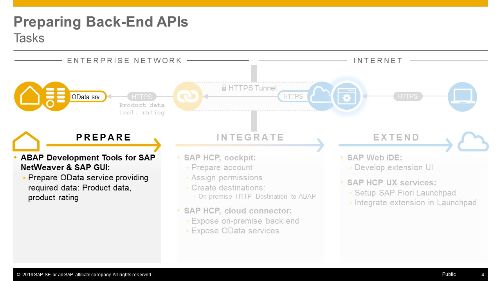

**Roles:**

Corporate IT Personas:

-   SAP Basis administrator: exposes OData services in back-end
-   SAP application expert: provides OData service in ABAP back-end.

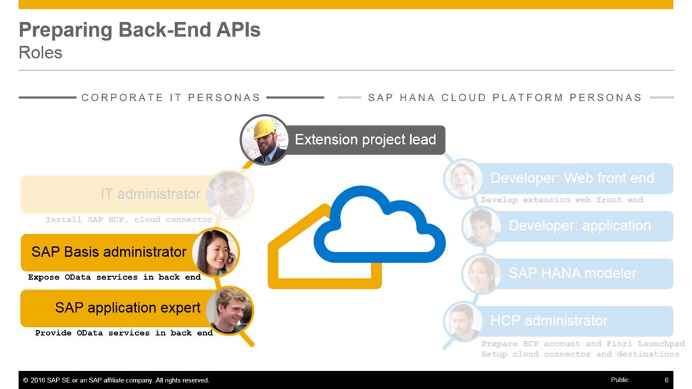

**Systems, Tools, Services:**

-   SAP GUI
-   Eclipse IDE with SAP Development Tools (ABAP in Eclipse/AiE)
-   Web browser (Google Chrome)
-   SAP NetWeaver AS ABAP 7.50 SP2

## Step 1: Use _ABAP in Eclipse_ to work with SAP NetWeaver AS ABAP

In this step you will use _ABAP in Eclipse (AiE)_  to connect to your local _SAP NetWeaver AS ABAP_.

> **Note**: Remember, that you installed the _AiE_ tools before in [Week 1, Unit 5, Step 5.3](../../week-1/unit-5/#step-5-install-and-configure-sap-tools-for-eclipse) as part of the _SAP tools for Eclipse_.

#### 1.1 Quickcheck: NetWeaver is still up and running

By executing the [preparation steps in Week 2, Unit 1](../unit-1/#step-1-vm-with-netweaver-abap-is-up-and-running) you already ensured that the _SAP NetWeaver AS ABAP_ is up and running. Anyhow, it is a good practice to quickly check if the processes of the system are still running and their process state is **GREEN**:

1.  Open your openSUSE VM and start a **Konsole** terminal window.
2.  Execute **su -l npladm** (will ask for _SAP NetWeaver AS ABAP_ **system password**)
3.  Execute **sapcontrol -nr 00 -function GetProcessList** to check that the processes are running and are all **GREEN**

    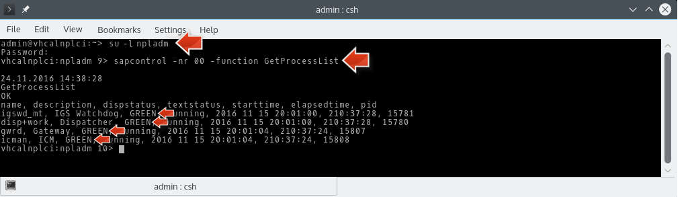

Now that you are sure that the SAP NetWeaver backend system is still up and running, you can start connecting your _ABAP in Eclipse_ tools to it.

[Top](#step-1-1-top)

#### 1.2 Open ABAP in Eclipse (AiE) tools

ABAP in Eclipse allows you to connect to a SAP NetWeaver system much like the SAP GUI / SAP Logon. In this course we will rely on AiE, as this gives you the benefit of doing all developments in the same IDE.

1.  Open your Eclipse IDE

    > **Hint:** To open Eclipse you have to click on eclipse executable file as you did during the installation [section 5.1](../../week-1/unit-5/#install-eclipse-neon-ide) of unit 5 in week 1.

2.  From the Eclipse menu, choose **Window > Perspective > Open Perspective > Other...**

    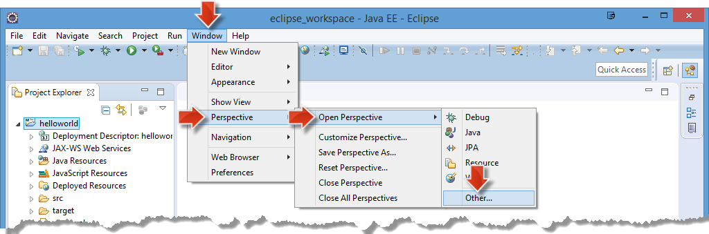

3.  In the opened _Show Perspective_ window, select **ABAB** and click on **OK** to open the _ABAP_ perspective.

    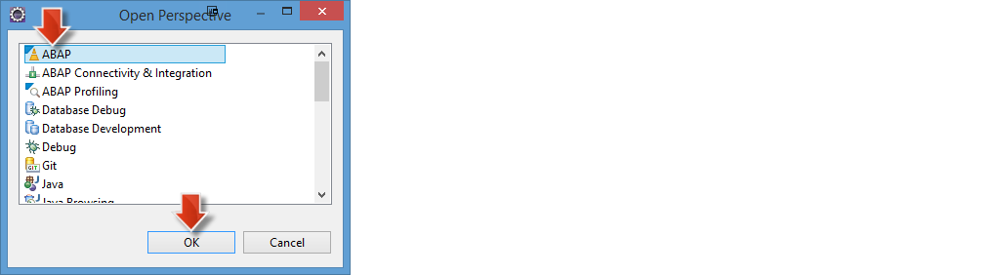

4.  Right-click on the **ABAP icon** on the upper right corner of the toolbar and choose **Show Text** to display texts of each perspective button additionally to the icons.

    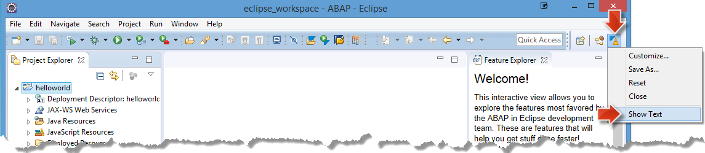

> **Result:** You opened the **ABAP** perspective in your Eclipse IDE where you do now the ABAP specific development tasks. In the section 1.3 you create a new ABAP project.

[Top](#step-1-2-top)

#### 1.3 Create new ABAP Project

1.  From the Eclipse menu, choose **File > New > ABAP Project**.

    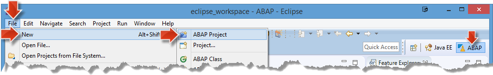

2.  On opened _New ABAP Project_ wizard
3.  Select the table row with _Name_ **Local NetWeaver**
4.  Click **Next**.

    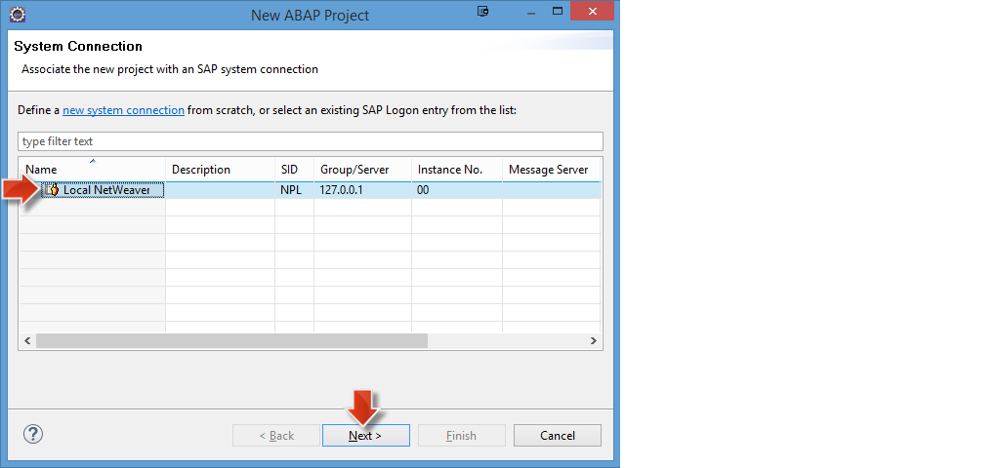

5.  Keep the _pre-filled values_ and ignore the _SCN is disabled_ warning.
6.  Click **Next**.

    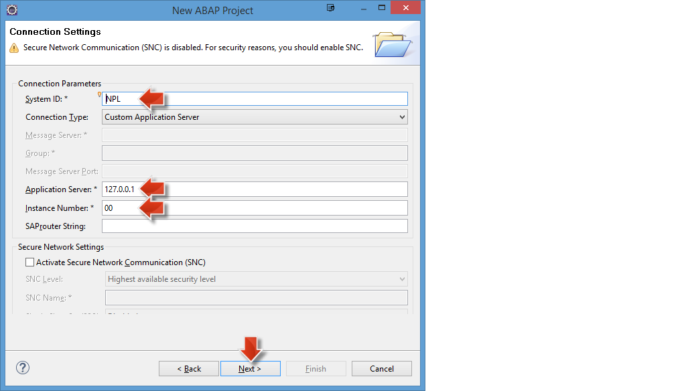

7.  On _Logon to System_ page enter:

    -   _Client_: **001**
    -   _User_: **DEVELOPER**
    -   _Password_: **Appl1ance**
    -   _Language_: **EN**
    -   Click **Next**.

        > **Note:** Due to a bug it could happen that the first time your copy and paste values to input fields of ABAP in Eclipse you will get a **Cannot paste** error. Then just click **OK** and **repeat the paste action**, then it will work.
        >
        > 

    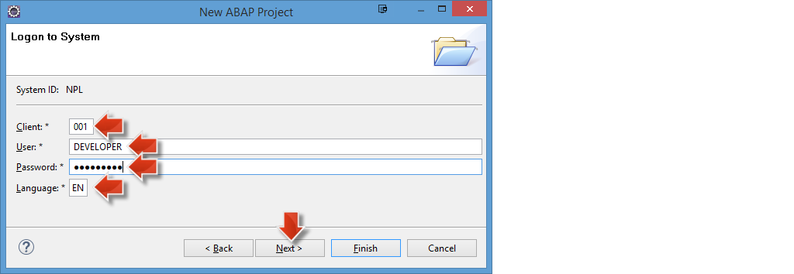

8.  In the next wizard step

    -   Keep the project name **NPL_001_developer_en** unchanged
    -   Click **Finish** to create the new ABAP project.

    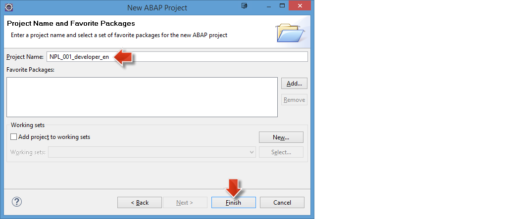

> **Result:** You have created a new ABAP project with name **NPL_001_developer_en** which is visible in the Project Explorer view of your Eclipse IDE. Via this project you established also a connection to the local NetWeaver AS ABAP by means of the Developer user credentials. Keep in mind that when you shutdown the ABAP system then also the project will be disconnected and closed. You can only work on ABAP projects when the ABAP system is connected.

You have now an ABAP project in your Eclipse workspace and also a Java **helloworld** project. To manage the different types of projects, we will create in the next section two so-called _working sets_, one for Java and one for ABAP projects.

[Top](#step-1-3-top)

#### 1.4 Organize Projects in Working Sets

Follow the steps below to create two containers named ABAP and JAVA and add the existing respective projects. These containers are named _Working Sets_ in Eclipse.

1.  In the toolbar of **Project Explorer** view click the **View Menu** icon

    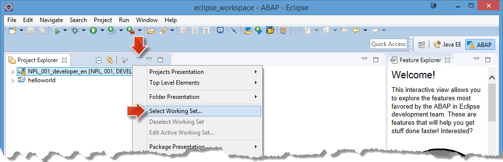

2.  Chose menu item **Select Working Set...**.
3.  On the _Select Working Set_ window create an **ABAP** Working Set:
4.  Select the **Window Working Sets** option.
5.  Click **New...**.

    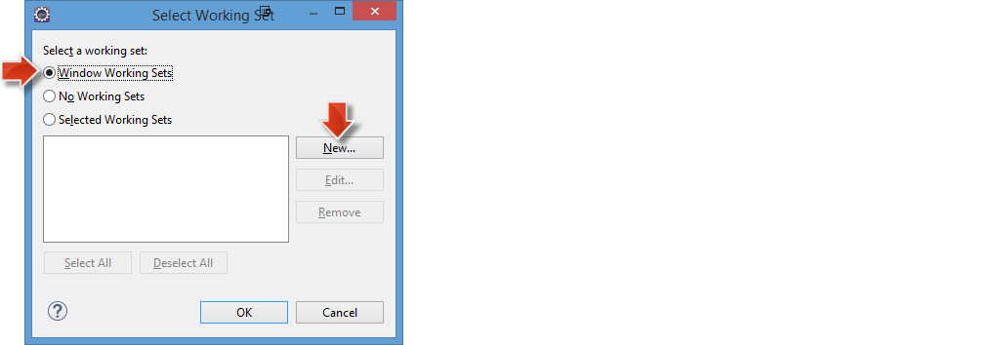

6.  On the first _New Working Set_ wizard page

    -   Select **Resource** as _Working set type_.
    -   Click **Next**.

    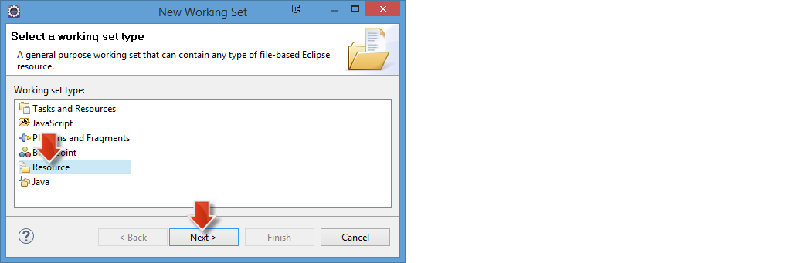

7.  On next wizard page

    -   Enter **ABAP** as _Working set name_.
    -   Select only the checkbox of the **NPL_001_developer_en** ABAP project node.
    -   Click **Finish**.

          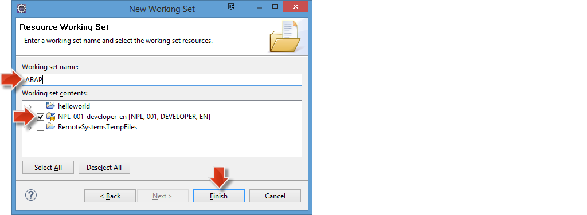

        > **Result:** A new ABAP Working Set has been created which contains the existing ABAP project.
        >
        > 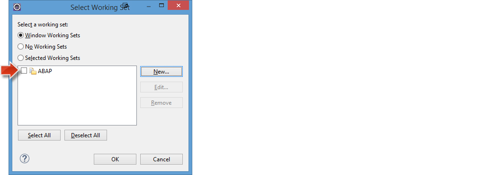

8.  On the _Select Working Set_ window create a **JAVA** Working Set very similar to the ABAP Working Set but with

    -   Select **Java** as _Working set type_.
    -   Enter **JAVA** as _Working set name_.
    -   Select **helloworld** JAVA project node and click **Add ->** to move it into the _Workset content area_.
    -   Select **NPL_001_developer_en** ABAP project node and click **Remove** to remove it from the _Workset content area_.
    -   Click **Finish**.

    > **Result:** Both an ABAP and JAVA Working Set has been created which contains the corresponding ABAP and JAVA projects.
    >
    > 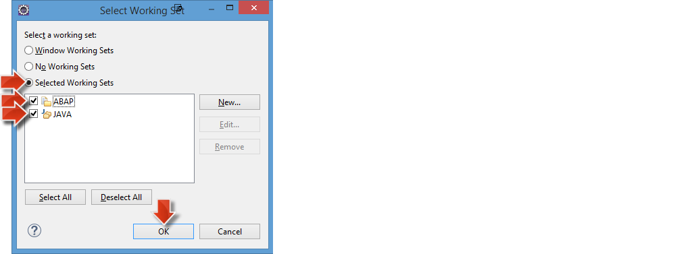

9.  On the _Select Working Set_ dialog:

    -   Select **Selected Working Sets** option.
    -   **Select both checkboxes** of the ABAP and JAVA node in the _Selected Working Set_ area.
    -   Click **OK**.

10. Back in the Eclipse IDE: In the toolbar of **Project Explorer** view:

    -   Click the **View Menu** icon
    -   Choose menu item **Top Level Elements > Working Sets**

        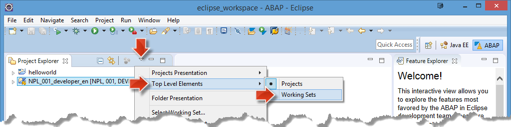

> **Result:** The two Working Sets **ABAP** and **JAVA** are now displayed as top level nodes in the _Project Explorer_ view and inside these two new containers the corresponding ABAP and Java projects are located. In this course we will continue to organize all projects in semantic Working Set containers, e.g. a new Java application project will be added into the JAVA Working Set container. This helps to keep a good overview in the project explore view.
>
> 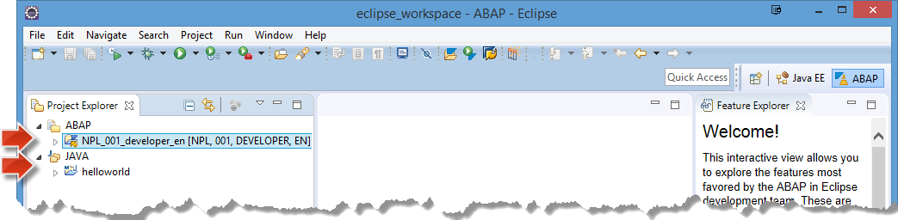

[Top](#step-1-4-top)

## Step 2: Explore Back-End OData Services

Through the before created ABAP project you established from your Eclipse IDE a connection to your SAP NetWeaver AS ABAP system. Via this project-enabled Back-End connection you can now investigate directly from your development IDE which OData Services are exposed by the Back-End system.

#### 2.1 Explore OData Services with SICF

Now you will run from Eclipse IDE an ABAP application, the **SICF** transaction, where you can explore all OData services exposed by the Back-End.

> **Info:** By means of the ABAP transaction **SICF** you maintain the services of the _Internet Communication Framework (ICF)_. The _ICF_ allows you to communicate with the SAP system using Internet standard protocols (HTTP, HTTPS and SMTP).

1.  In the Eclipse toolbar click the green icon **Run ABAP Development Object as ABAP Application in SAP GUI**.

    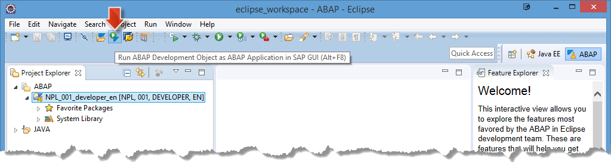

2.  In the opened **Run ABAP Application** window enter search string **SICF** (Searching action will start and **can take some** time, just wait).

    > **Note:** The _Run ABAP Application_ action gives you access to all transaction an AS ABAP system exposes and the used _SICF_ is one of them.

3.  Select first matching item **SICF (Transaction)**.
4.  Click **OK**.

    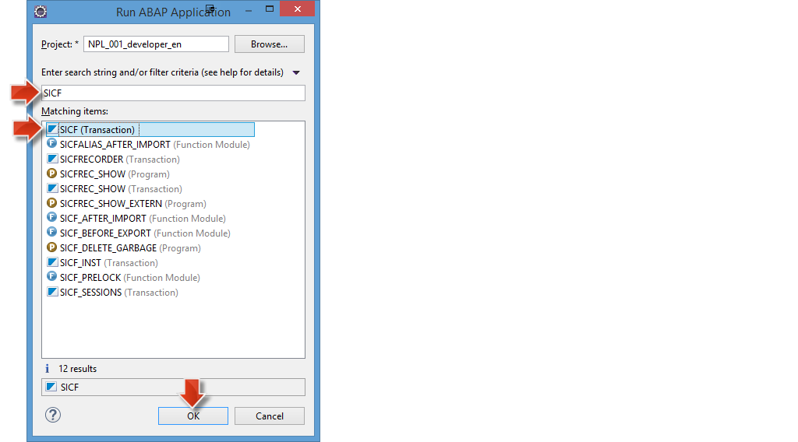

    > **Result:** SICF editor opens with the initial **Define Services** screen, where you define which services you want to filter.
    >
    > 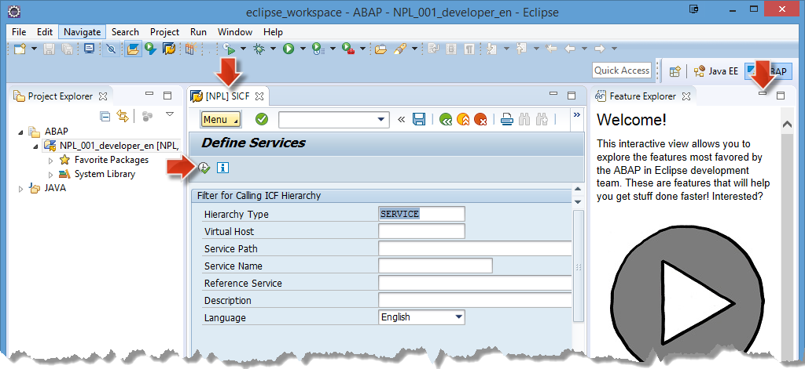

5.  Click **Minimize**  icon of the **Feature Explorer** view to get more space for the _SICF editor_
6.  Keep the default filter (_Hierarchy Type_: **SERVICE**) of the _SICF editor_ and click the **Execute icon** on the _Define Service_ toolbar to open the hierarchy tree of available services.

    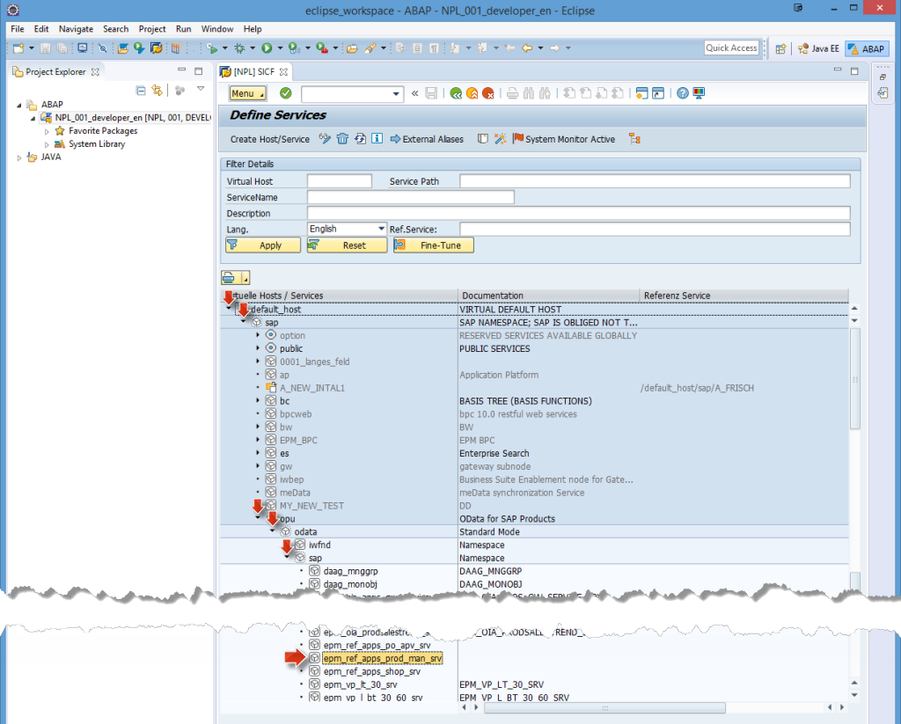

7.  In the **Virtual Hosts/Services** column expand tree item **default host > sap > opu > odata > sap**.

    > **Note:** This location `sap/opu/odata/sap` is the location where you find OData services as delivered with any SAP NetWeaver AS ABAP. There you also find the OData services from the Reference applications of the [Enterprise Procurement Model (EPM)](http&#x3A;//www.sap.com/documents/2012/09/2a404253-5b7c-0010-82c7-eda71af511fa.html), a demonstration data model on which the business cases and challenges of this course are based on. The _Manage Products_ we use for an extension in this week 2 is one of these EPM Reference Applications and we will look in the following step for the underlying OData service of this application.

8.  Select tree item **default host > sap > opu > odata > sap > epm_ref_apps_prod_man_srv**.
9. Open **right-click context menu**.
10. Make sure that **Activate Service** is grayed out, which means that the service is already activated.

    > **Note:** If an OData service is not activated you can use this **Activate Service** to activate it.

    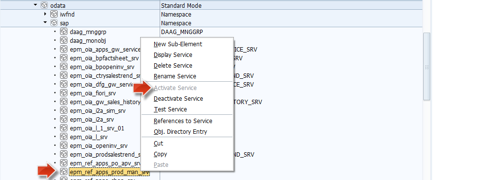

Now that you have found the OData service **epm_ref_apps_prod_man_srv** which the **Manage Products** application uses and confirmed that it is already activated you can explore more details of the service as shown in the following step 2.2.

[Top](#step-2-1-top)

#### 2.2 Explore OData Service Details with SAP Gateway Client

To explore details of a specific OData service in the NetWeaver back-end you use the ABAP transaction **IWFND/MAINT_SERVICE** to search for a specific OData service. For the found OData service you open the **SAP Gateway Client** that provides a REST client tool. All this is shown in the following subsection.

##### 2.2.1 Open _SAP Gateway Client_

1.  In Eclipse IDE: First **close** the before opened _SICF editor_.

    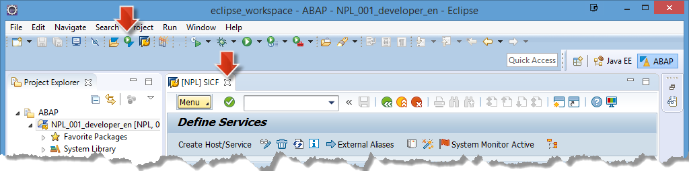

2.  In the Eclipse toolbar click the green icon **Run ABAP Development Object..**.
3.  In the opened **Run ABAP Application** window
4.  Enter search string **/IWFND/M** (Searching action will start, just wait).
5.  Select first matching item **/IWFND/MAINT_SERVICE (Transaction)**.
6.  Click **OK**.

    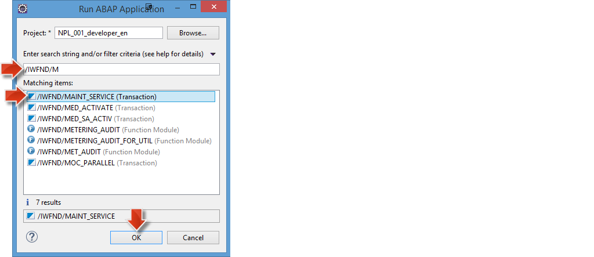

    > **Result:** [NLP] IWFND/MAINT_SERVICE editor opens with the initial **Activate and Maintain Services** screen, where you can e.g. filter for certain services.
    >
    > 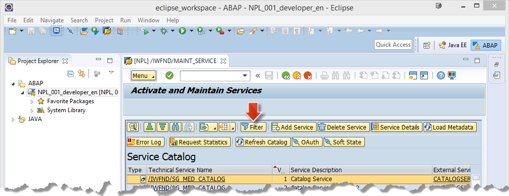

7.  Click **Filter** button in the toolbar of the _Activate and Maintain Services_ page
8.  In the opened **Filter for Service Catalog** window
9.  Enter filter string **\*PROD\*** as _Technical Service Name_.
10. Click **green accept icon** with tooltip _Continue_.

    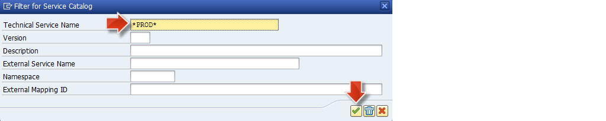

    > **Result:** The **Service Catalog** table only displays those services that contain **PROD** in their technical name.
    >
    > 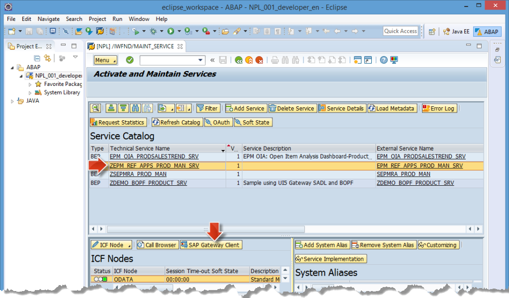

11. Select the table row of the **EPM_REF_APPS_PROD_MAN_SRV** service (external service name), which is the same as before found in transaction _SICF_.
12. Click **SAP Gateway Client** button in _ICF Nodes_ area at the bottom to explore more details of the selected OData service.

    > **Note:** The first time you open the _SAP Gateway Client_ tool in a new window it will take some time, just wait.

13. If a **SAP GUI Security** dialog window opens and you are asked to access the file **SAPGuiServer.exe**

    -   Mark the checkbox **Remember My Decision**
    -   Click **Allow** to open up a new SAP GUI client window with the _SAP Gateway Client_.

    > **Result:** _SAP Gateway Client_ tool opens in a new window.
    >
    > 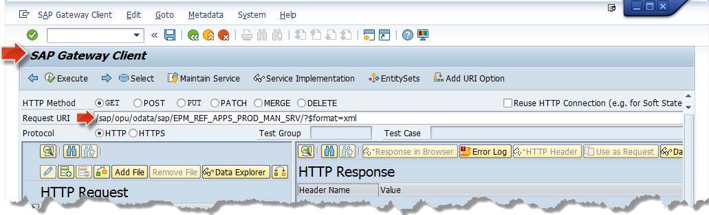

[Top](#step-2-2-1-top)

##### 2.2.2 Explore OData Service in _SAP Gateway Client_

The _SAP Gateway Client_ tool has been opened for the selected OData service **EPM_REF_APPS_PROD_MAN_SRV**. By means of this REST client tool you can explore the details of the service as follows.

1.  Click toolbar button **Execute** to test the _GET_ HTTP response of the OData service **EPM_REF_APPS_PROD_MAN_SRV**.

    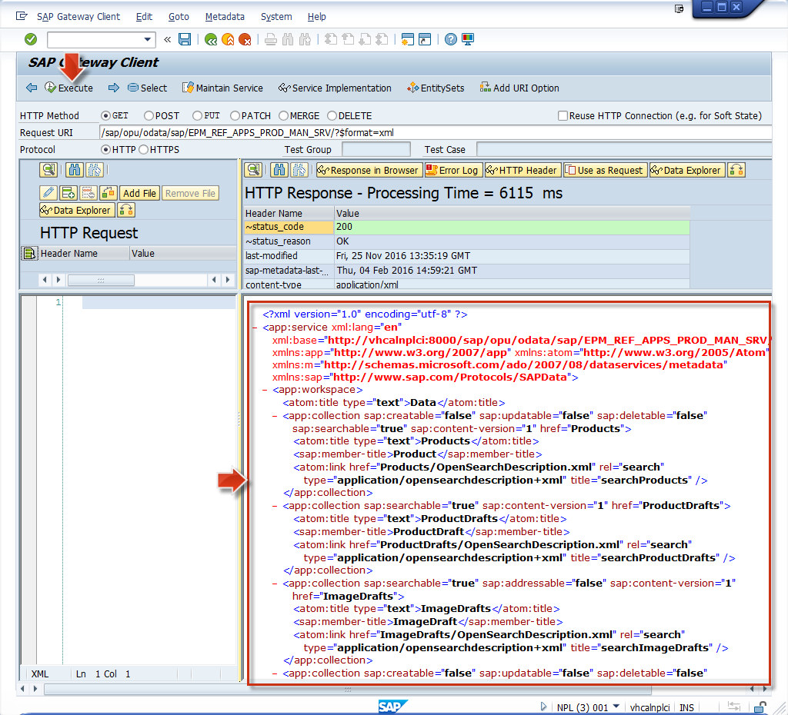

2.  Click **Data Explorer** button to get more specific data of this OData service.

    > **Hint:** The OData service **EPM_REF_APPS_PROD_MAN_SRV** which we explore here offers the data of a _Manage Products_ application. We want to see now which product data is offered exactly by the service and - for the intended UX Extension - is there some product rating data available which could be added to the application as extension.

      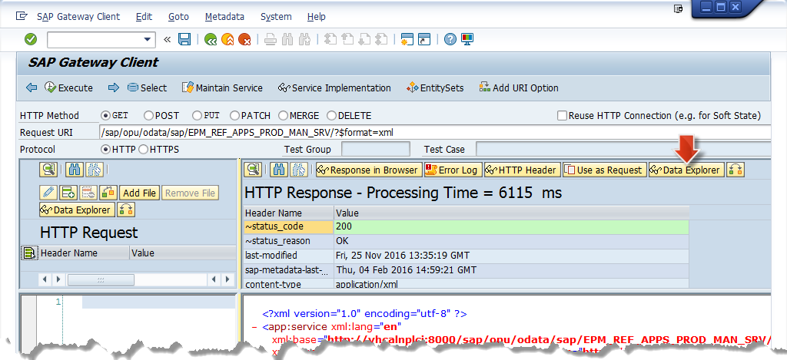

    > **Result:** The Response is now structured in a **service document with entities** like Products, Suppliers etc. which the service offers.
    >
    > 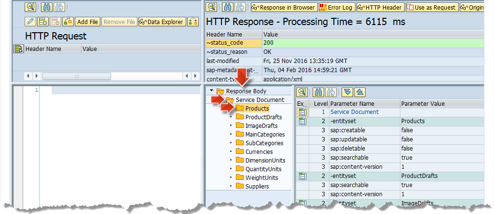

3.  Click **Entity Sets** on the main toolbar of the _SAP Gateway Client_ page to get all Entity Sets provided by the OData service.

    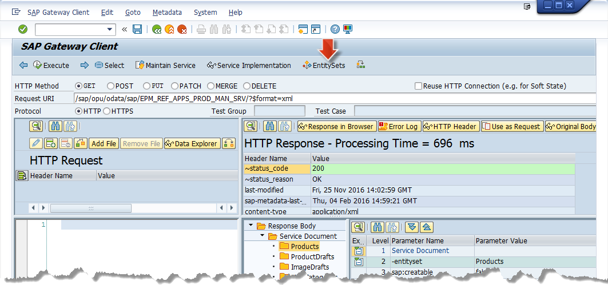

4.  Select the **Products** entity set and click on the **green accept icon**

    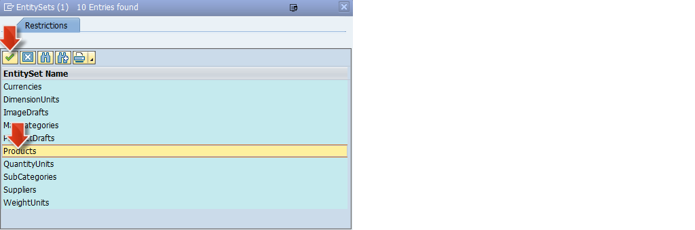

    > **Result:** The request URI changed to /sap/opu/odata/sap/EPM_REF_APPS_PROD_MAN_SRV**/Products**, i.e. the _Products_ string was added at the end.
    >
    > 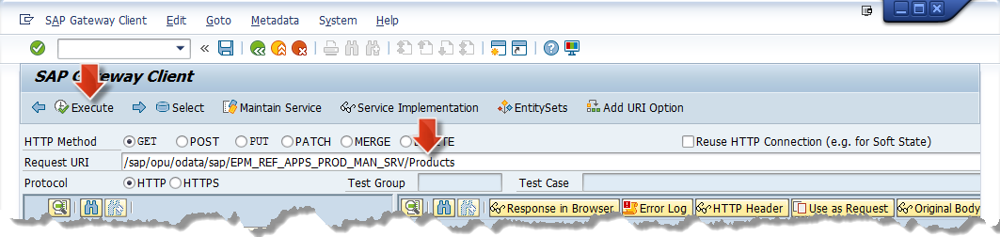

5.  Click toolbar button **Execute** to get the _GET_ HTTP response of the OData service **EPM_REF_APPS_PROD_MAN_SRV** but this time specifically for the **Products entity set**
6.  **Double-click on any Product** (e.g. HT-1000) in the HTTP Response area to see the all properties the service offers for each product.

    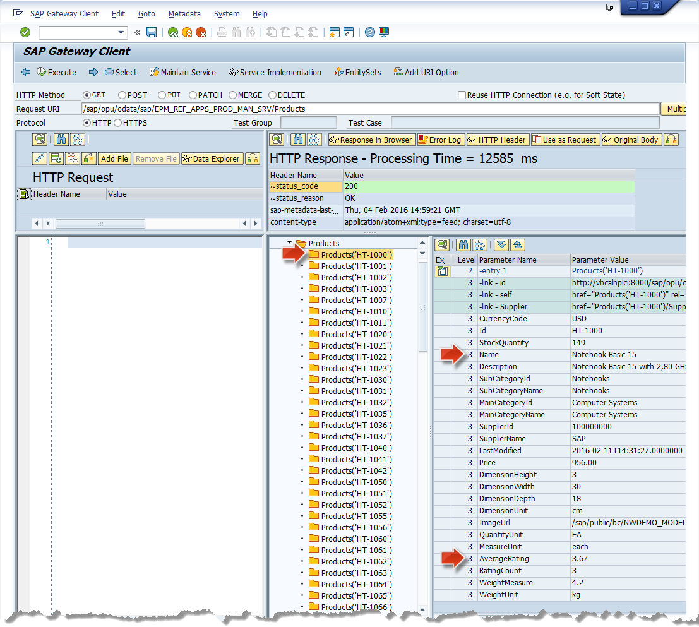

> **Result:** By means of the ABAP transaction `/IWFND/MAINT_SERVICE` and the _SAP Gateway Client_ you have seen how to explore the data of a specific OData service. Especially the **Products** entity set of the **EPM_REF_APPS_PROD_MAN_SRV** OData service contains also a property value **AverageRating** which we will use later this week in [Unit 5 for the UX extension](../../unit-5/). Remember that we wanted to help the product manager to identify badly rated products.

[Top](#step-2-2-2-top)

#### 2.3 Explore OData Services within Web Browser

So far you explored the back-end OData Services via NetWeaver AS ABAP transactions and tools (_SAP Gateway Client_). Now we will show how you can investigate a Fiori application in your Web browser to find out which OData service it uses.

As example Fiori application you will use here the **Manage Products** application which you can find on the _S/4HANA Fiori launchpad (FLP)_ as follows.

1.  Open **S/4HANA FLP** bookmark in _Chrome_ Web browser - [see Week 2, Unit 1, Step 4](../../week-2/unit-1/#step-4-create-s4hana-flp-bookmark)

    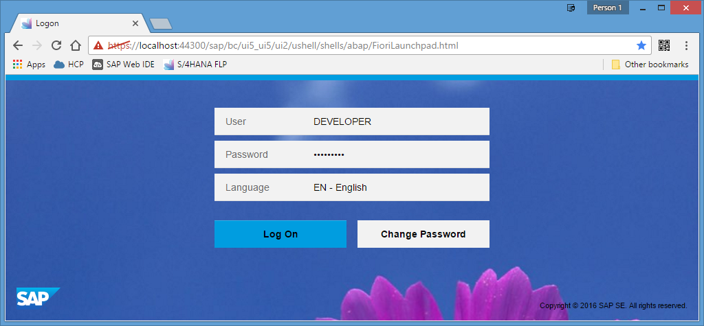

2.  On opened FLP login page enter:

    -   _User_: **DEVELOPER**
    -   _Password_: **Appl1ance**
    -   Click **Log On** to enter the FLP (launching Fiori launchpad application the first time could again took some time, just wait.)

    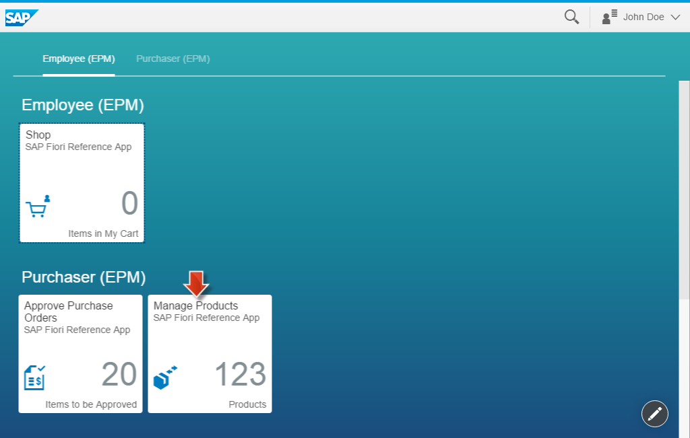

3.  Click **Manage Products** tile on the FLP to open the SAP Fiori reference application in which you can manage products coming from a Enterprise Procurement Model (EPM) defined in SAP NetWeaver AS ABAP back-end.

    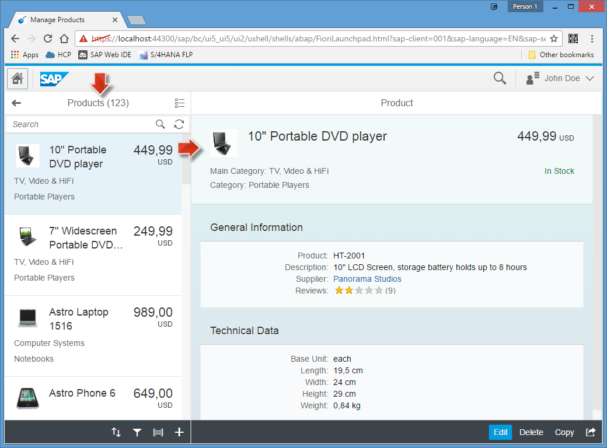

4.  Open Developer Tools in Google Chrome:

    -   Open the Google Chrome menu, by clicking on the **3 dots icon** in the in the upper right corner.
    -   Select **More tools > Developer tools**.
    -   Keyboard shortcut: Windows: `Ctrl + Shift + I` / Mac OS: `Cmd + Alt + I`

    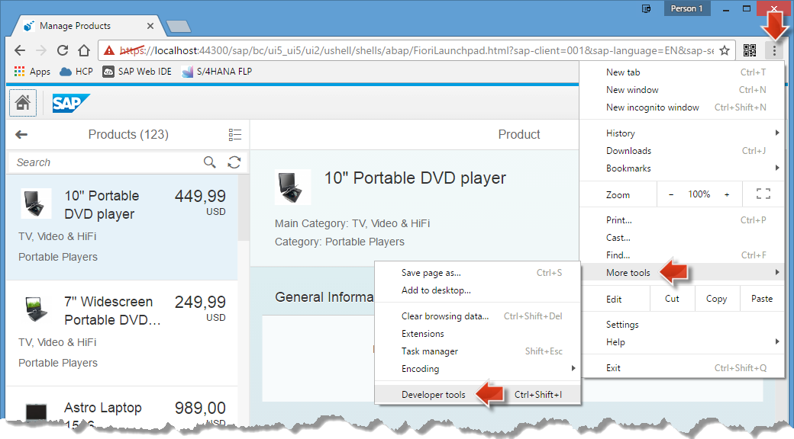

5.  On opened developer tools (by default on the right side of the Web browser)

    -   Click on **Network** tab.

        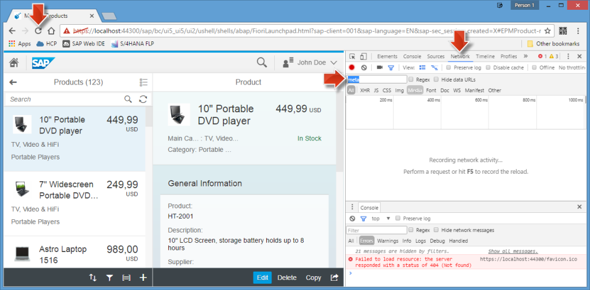

    -   Enter **meta** as string in the filter field of the network tab.
    -   Click **Refresh** icon of the Web browser.

    > **Result:** The first entry of the filtered HTTP network requests starts with **$metadata?** and is the OData service which provides the products data of the Fiori application.
    >
    > 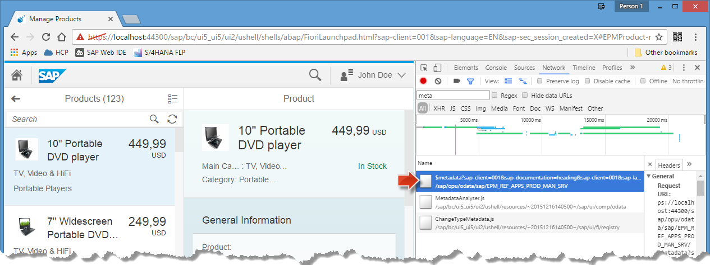

6.  Double-click on row **$metadata?sap-documentation=heading&sap-language=EN** to open the OData service metadata from the SAP NetWeaver AS ABAP 7.50 server.

    > **Result:** The service response gets displayed in a new browser tab, describing the data model of the **EPM_REF_APPS_PROD_MAN_SRV** OData service. As before in the SAP Gateway Client you can find in the metadata service output in the Web browser the properties of the product entity, e.g. the Average Rating.
    >
    >   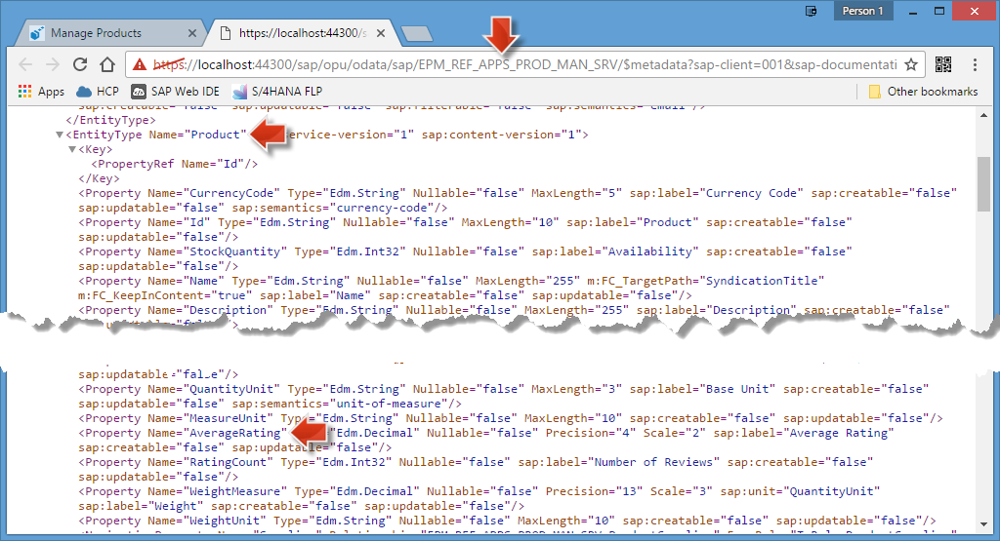

[Top](#step-2-3-top)

[**&lt; Previous** Unit 1](../unit-1/) | [**Up ^** Week 2](../) | [**Next >** Unit 3](../unit-3/)
