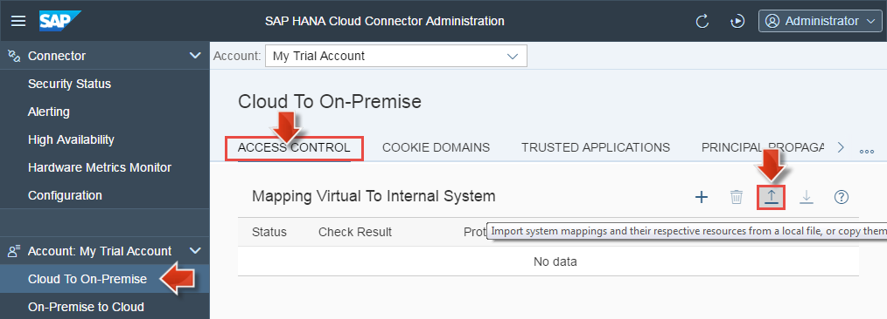

<a name="step-1-top"/><a name="step-2-top"/>





**Overview:**

**Roles**

-   Corporate IT personas: IT administrator installs SAP HANA Cloud Connector in his corporate IT landscape.
-   SAP HANA Cloud Platform personas: HCP administrator prepares HCP account, sets up SAP HCP, cloud connector and defines connectivity destinations.

**Systems, Tools, Services:**

-   on host OS: VirtualBox, SAP Development Tools, SAP HANA Cloud Platform cockpit, SAP HANA Cloud Connector Administrator (both in Google Chrome browser)

## Downloads

| Download Link                                       | Description                   | Context                                                                                                           |
|-----------------------------------------------------|-------------------------------|-------------------------------------------------------------------------------------------------------------------|
| [**s4h-http-access-control.zip**](./imports/connector/s4h-http-access-control.zip?raw=true) | Access control definition       | [Step 3: Add Access to S/4HANA Back-End System](#step-3-add-access-to-s4hana-back-end-system)      |
| [**s4h-onpremise-http.properties**](./imports/destinations/s4h-onpremise-http.properties?raw=true)    | HTTP connectivity destination | [Step 4: Create HTTP Destination in HCP Trial Account](#step-4-create-http-destination-in-hcp-trial-account)    |

## Step 1: Install SAP HANA Cloud Connector in Linux VM

#### 1.1 Download SAP HANA Cloud Connector for Linux

1.  Open the Google Chrome web browser on your host OS and open page [SAP Development Tools](http://tools.hana.ondemand.com).
2.  Go to **Cloud** and scroll to section **SAP HANA Cloud Connector**.

    

3.  Download the **Linux** installer with link **sapcc-XXX-linux-x64.zip** and read and agree to the following End User License Agreement. Click button **I Have Read And Agree** to start the download.

    

> **Result:** The Linux installer for SAP HANA Cloud connector is now available on your host OS.

#### 1.2 Mount a Shared Download Folder in Linux VM

The Linux installer for SAP HANA Cloud connector is stored in a download folder of your host OS. To run it from within the Linux VM (guest OS) you need to mount a shared download folder from your local operating system:

1.  First test the system status of SAP NetWeaver AS ABAP 7.50 as described in [section 6.5](../../week-1/unit-6/#starting-vm-with-netweaver-as-abap) of unit 6 in week 1):
2.  In the Linux VM window, logon to the Linux desktop, open the command shell (**XTerm** on Gnome, **Konsole** on KDE) and enter **sapcontrol -nr 00 -function GetProcessList** to check that the processes are running and are all GREEN. When SAP NetWeaver AS ABAP 7.50 is successfully running the command returns an **OK** message.

3.  In the VirtualBox Manager on your host OS:
    -   Select the Linux VM instance.
    -   Click **Settings** and select the **Shared Folders** entry in the Settings dialog.
    -   Click on **+** to add a new shared folder.
    -   Select the **Folder Path** to the folder containing the SAP HANA Cloud Connector for Linux installer.
    -   In **Folder Name** enter **scc** and click **OK**.
    -   Click **OK**.

        

4.  In the Linux VM window (guest OS):
    -   Open the command shell via start menu (enter **Konsole** in KDE desktop or **Xterm** in GNU desktop). By default the command shell opens the admin user's home directory `<admin user name>@vhcalnplci`.

        

    -   Enter command **mkdir scc** to create a new folder for the SAP HANA Cloud Connector installation.
    -   Enter command **sudo mount -t vboxsf scc scc** and press Return. Enter your Linux OS admin password.
    -   Enter **cd scc** and then **ls** to view the **sapcc-XXX-linux-x64.zip** installation ZIP that is shared from the host OS download folder.

        

#### 1.2 Run Installer for SAP HANA Cloud Connector in Linux VM

1.  Enter command **sudo unzip sapcc-XXX-linux-x64.zip** (replace placeholder **XXX** with the given release version, e.g. **2.9.0.2**).
2.  Enter command **sudo rpm -i com.sap.scc-ui-XXX.x86_64.rpm** (replace **XXX** with the given version number e.g. **2.9.0-7**).

    > **Note:** you can autocomplete the package name with the **Tab** key while entering the command **sudo rpm -i com.**.

3.  Press the **Return** key to start the installation process:
    

4.  Enter command **sudo service scc_daemon status**.

> **Result:** SAP HANA Cloud Connector is successfully installed and the connector daemon is running on the Linux guest OS.
>
>  

#### 1.3 Take a snapshot of the Linux VM in VirtualBox Manager

1.  In the Linux VM window select menu item **Machine > Take snapshot**.
2.  Enter snapshot name **NetWeaver & Cloud Connector** and click **OK**.

[Top](#step-1-top)

## Step 2: Connect SAP HANA Cloud Connector with Your HCP Trial Account

Once the cloud connector has been installed and the connector daemon has been started, you can log on and perform the initial configuration. You also establish a connection between the cloud connector and your HCP trial account.

#### 2.1 Set up Initial Configuration

1.  Open the Google Chrome web browser on your host OS and enter URL **https://localhost:8443**.
2.  In Google Chrome you get informed that your connection is not secure. Press the **Advanced** button and click the link **Proceed to localhost (unsafe)**.

    

3.  Add a bookmark to the SAP HANA Cloud Connector Login page, e. g. named **SCC** for _SAP Cloud Connector_ (to add a new bookmark see [Week 2 - Unit 1](../week-2/unit-1/#create-s4hana-flp-bookmark) for more details.).

    

4.  Enter user credentials:

    -   User Name: **Administrator**
    -   Password: **manage**

    

5.  Apply the following steps for the initial setup of the new cloud connector instance:

    -   Change the admin password from **manage** to one of your choice.
    -   Keep the default installation type **Master (Primary installation)** selected.
    -   Click **Save**.

    

6.  Add the very first HCP account (i.e. your HCP trial account) by entering the following form fields:

    **First Account**

    | Property | Value |
    | ------------- | ------------ |
    | Landscape Host | **hanatrial.ondemand.com** |
    | Account Name | **p19XXXtrial** (paste it from the clipboard, see step 2 in the note below) |
    | Display Name | e.g. **My Trial Account** |
    | Account User | **p194XXX** (paste it from the clipboard, see step 3 in the note below) |
    | Password | <enter your own password> |

    (keep fields _Location ID_ and _Description_ empty)

    > **Note:** How to get your HCP trial account name and user:
    >
    > -   **Step 1:** In Google Chrome browser open new tab and logon to HCP Cockpit with URL **https://account.hanatrial.ondemand.com**. Enter your user credentials based on [Week 1 > Unit 5 > Step: Get SAP HANA Cloud Platform trial account](../../week-1/unit-5/).
    > -   **Step 2:** On the Overview page scroll to section **Account Information** and copy the **Account name** into the clipboard, e.g. **p1942128127trial**.
    >
    >    
    >
    > -   **Step 3:** In the HCP cockpit toolbar press the user icon at the right side. Copy the **ID** into the clipboard, e.g. **P1942128127**.
    >
    >     

    **HTTPS Proxy**

    Enter **Host** and **Port** fields if you are working behind a firewall with a proxy.

    

7.  Click **Save**.

    

> **Result:** After the initial configuration was successfully set up the **Connector** view displays a new dashboard entry for the newly added HCP trial account.
>
> 
>
> Click on tree item **Account: My Trial Account** to view more account details.
>
> 
>
> **Related Resources:** For more details see SAP HANA Cloud Platform Documentation:
>
> -   [Installing the Cloud Connector](https://help.hana.ondemand.com/help/frameset.htm?57ae3d62f63440f7952e57bfcef948d3.html)
> -   [Initial Configuration](https://help.hana.ondemand.com/help/frameset.htm?db9170a7d97610148537d5a84bf79ba2.html)

#### 2.2 Check Connection in HCP Trial Account

Check connectivity in your HCP trial account:

1.  In Google Chrome browser select the tab with the HCP cockpit.
2.  In HCP cockpit go to **Connectivity > Cloud Connectors**. The green _Connected_ text indicates, that your HCP trial account is successfully connected with your SAP HANA Cloud Connector installation that is running on your local Linux VM.

    

> **Result:** You successfully set up the initial configuration of the SAP HANA Cloud Connector that is running on your Linux VM (i.e. in your own corporate network). It is connected with Your HCP trial account hosted on the SAP HANA Cloud Platform trial landscape  **hanatrial.ondemand.com**.

## Step 3: Add Access to S/4HANA Back-End System

To allow your HANA Cloud Platform applications to access SAP S/4HANA back-end system on the intranet, you need to insert an extra line into the cloud connector access control management.

#### 3.1 Expose S/4HANA Back-End System with Access Control Definition

Expose the SAP back-end system host to your HCP trial account with the following entry in the access control list:

1.  In Google Chrome browser open the tab with **SAP HANA Cloud Connector Administrator** or use the browser bookmark **SCC** you added in [Step 2.1](#set-up-initial-configuration).
2.  In the navigation pane select item **Account: My Trial Account > Cloud To On-Premise**.
3.  Choose tab **Access Control** to add corporate network hosts that can be accessed from your HCP account.
4.  Download the file [s4h-http-access-control.zip](./imports/connector/s4h-http-access-control.zip?raw=true).
5.  Click **Import** button in the toolbar under **Mapping Virtual To Internal System** and choose the previously downloaded ZIP-file **s4h-http-access-control.zip**.

    

    

> **Result:** A new access control entry is added with the following definition:
>
> | Status | Virtual Host | Internal Host       | Check Result  | Protocol  | Back-end Type   |
> | ------ | ------------ | ------------------- | ------------- | --------- | --------------- |
> | **Ok** | **s4h:443**  | **localhost:44300** | **Reachable** | **HTTPS** | **ABAP System** |
>
> The virtual host **s4h:443** specifies the host name to be used for the HTTP destination configuration in SAP HANA Cloud Platform. The virtual host can be a fake name and does not need to exist.
>
> For this backend system we also need to provide the resource URL path(s) that shall be exposed for access from SAP HANA Cloud Platform:
>
> | Enabled  | Status | URL Path  | Access Policy              |
> | -------- | ------ | --------- | -------------------------- |
> | **true** | **Ok** | **/sap/** | **Path and all sub-paths** |
>
>  
>
> **Related Resources:** For more details see SAP HANA Cloud Platform Documentation: [Configuring Access Control](https://help.hana.ondemand.com/help/frameset.htm?e7d4927dbb571014af7ef6ebd6cc3511.html).

#### 3.2 Take another snapshot of the Linux VM in VirtualBox Manager

1.  In the Linux VM window select menu item **Machine > Take snapshot**.
2.  Enter snapshot name **NetWeaver & Cloud Connector Setup** and click **OK**.

#### 3.3 See Exposed Back-End System in HCP Trial Account

Check Cloud Connector Host in your HCP trial account:

1.  In Google Chrome browser select the HCP cockpit tab.
2.  In the **Connectivity > Cloud Connectors** view a new host entry is added.

> **Result:** Now the cloud knows about the SAP back-end system and can access it via connectivity destinations to be defined next.
>
> | (Virtual) Host | Protocol | Back-End Type   | Resources     |
> | -------------- | -------- | --------------- | ------------- |
> | **s4h:443**    | **HTTP** | **ABAP System** | **Available** |
>
> 

## Step 4: Create HTTP Destination in HCP Trial Account

Based on the exposed S/4HANA back-end system that is connected with your HCP trial account you now create a new _HTTP destination_. It points to the virtual back-end host `http://s4h:443` and will be used in SAP Web IDE for connecting the UX extension app with OData services exposed by the S/4HANA back-end.

#### 4.1 Add a new Connectivity Destination in HCP Trial Account

To import a new connectivity destination of type _HTTP_ apply the following steps:

1.  In the HCP cockpit tab of your browser open **Connectivity > Destinations**.
2.  Download the file [s4h-onpremise-http.properties](./imports/destinations/s4h-onpremise-http.properties?raw=true).
3.  Click **Import Destinations** and choose the previously downloaded properties-file **s4h-onpremise-http.properties**.

    **Destination Configuration**

    Property   | Value
    -----------| ------------
    Name       | **s4h-onpremise-http**
    Type       | **HTTP**
    Descriptor | **S/4HANA HTTP API**
    URL        | **https://s4h:443**
    Proxy Type | **OnPremise**
    Authentication | **BasicAuthentication**
    User | **DEVELOPER**
    Password | _see next step_.

4.  Enter the password **Appl1ance** that you assigned to your SAP NetWeaver AS ABAP 7.50 back-end user **DEVELOPER** in [Week 1 - Unit 6](../week-1/unit-6/).
5.  Click **Save**.

    

    The newly imported HTTP destination configuration is displayed in read-only mode:

    

    > **Note:** The URL `https://s4h:443` points to the virtual host **s4h:443** as defined before in [Step 3.1 Expose S/4HANA Back-End System with Access Control Definition](#expose-s4hana-backend-system-with-access-control-definition).
    > The additional properties `WebIDEEnabled` and `WebIDEUsage` allow SAP Web IDE to call _design-time-specific_ OData services from the ABAP backend  (e.g. `odata_abap` for the OData functionality of SAP Gateway allows SAP Web IDE to access the OData service catalog of the ABAP backend system).

6.  Click **Check Connection** to test system communication between SAP HANA Cloud Platform and the SAP back-end on network level.

    

> **Result:** You added a new HTTP destination to your HCP trial account that points to the S/4HANA back-end system and enables OData service access via virtual host `http://s4h:443`.
>
> **Related Resources:** For more details see SAP HANA Cloud Platform Documentation:
>
> -   [Destinations](https://help.hana.ondemand.com/help/frameset.htm?1e110da0ddd8453aaf5aed2485d84f25.html)
> -   [Creating HTTP Destinations](https://help.hana.ondemand.com/help/frameset.htm?1e110da0ddd8453aaf5aed2485d84f25.html)
> -   [SAP Web IDE - Connecting Remote Systems](https://help.hana.ondemand.com/webide/frameset.htm?5c3debce758a470e8342161457fd6f70.html)

#### 4.2 Test OData Service Access in SAP Web IDE

With the HTTP destination in place you can use SAP Web IDE to browse the OData services that are exposed by the S/4HANA back-end by means of SAP HANA Cloud connector.

1.  In Google Chrome browser open your **SAP Web IDE** bookmark from [Week 1 - Unit 5](../week-1/unit-5/#create-sap-web-ide-bookmark) in a new tab.
2.  On the **Welcome** page in section **Create a Project** click on **New Project from Template**.

    

3.  Click on tile **List Report Application** and click **Next**.

    

4.  Enter "Project Name" **Test**, "Title" **Test** and click **Next**.
5.  In the "Data Connection" step keep the default source **Service Catalog** selected and choose the system entry **S/4HANA HTTP API** from the dropdown list to load all exposed services into the table.
6.  In the filter field enter **PROD** to view all matching OData services including **EPM_REF_APPS_PROD_MAN_SRV**.

    

7.  Click **Show Details** to get closer information on the selected  **EPM_REF_APPS_PROD_MAN_SRV** OData service.

    

8.  Click the **Cancel** button in the upper right corner of the template creation dialog. We come back to SAP Web IDE later this week in [Unit 5](../unit-5/) on the UX extension part.

    

> **Result:** The SAP HANA Cloud Connector is installed on your Linux VM with a secure connection between your HCP trial account and the SAP back-end system. The OData service **EPM_REF_APPS_PROD_MAN_SRV** can be selected in SAP Web IDE to build an application consuming it.

[Top](#step-2-top)

[**&lt; Previous** Unit 2](../unit-2/) | [**Up ^** Week 2](../) | [**Next >** Unit 4](../unit-4/)
