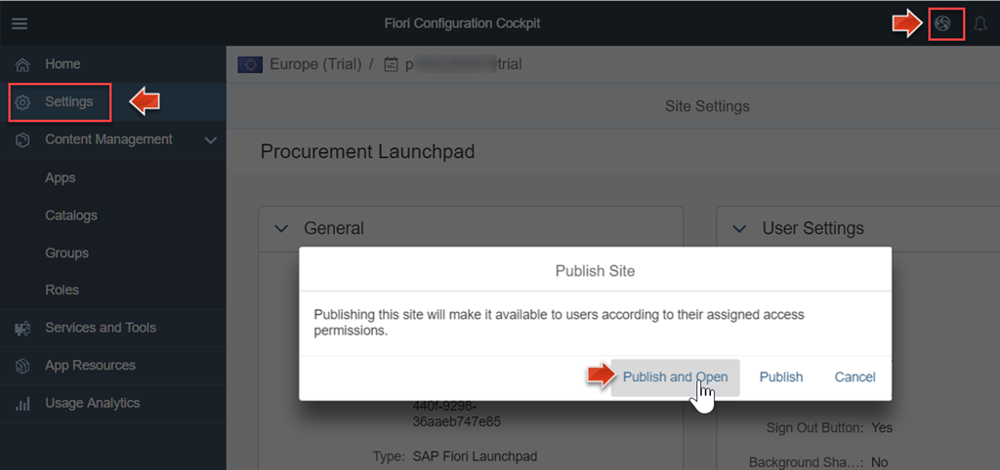

<a name="step-1-top"/><a name="step-2-top"/><a name="step-3-top"/>





**Overview:**

**Roles**

-   SAP HANA Cloud Platform personas: HCP administrator prepares HCP account and Fiori launchpad

**Systems, Tools, Services:**

-   on host OS: in Google Chrome browser: SAP Web IDE, HCP cockpit, HCP Portal Service with SAP Fiori Launchpad on Cloud

## Step 1: Enable Portal Service in HCP Trial Account

SAP Fiori launchpad is a browser-based shell that hosts SAP Fiori apps and provides them with services such as navigation, personalization, and configuration options. The apps are displayed as various tiles and groups.
Administrators must first set up their SAP HANA Cloud Platform account prior to working in SAP Fiori launchpad.

1.  In Google Chrome browser open the HCP Trial cockpit page in a new tab. Use the bookmark you created in [Week 1 - Unit 5](../../week-1/unit-5/#create-hcp-bookmark)
2.  Open the **Services** pane and enter query string **portal** in the search field. Click the **Portal Service** tile to enter the admin page.

    

3.  Press the **Enable** button to provide a Portal to your HCP trial account.

    

    After few seconds a green icon indicates the enabled HCP Portal service.

    

4.  Click the link **Go to Service**.

    

> **Result:**  You entered the **SAP HANA Cloud Portal Site Directory**. This is where you will create your new lauchpad site.
>
> 

## Step 2: Set up a new Launchpad Site

Before end users can work in an SAP Fiori launchpad, you as administrator must first set it up by configuring a new launchpad site with content such as app tiles, tile groups, catalogs, and roles that act as the building blocks of a launchpad.

#### 2.1 Create a new Launchpad Site

To create a new _launchpad site_ in the Site Directory of SAP HANA Cloud Portal apply the following steps:

1.  Choose **Create New Site**.

    

2.  Choose **SAP Fiori Launchpad** as template and enter **Procurement Launchpad** in input field _Site Name_.

    

3.  Choose **Create**.

    

Another browser tab gets opened with the _Fiori Configuration Cockpit_ for the new launchpad site **Procurement Launchpad**.

> **Result:**  You added a new launchpad site with name **Procurement Launchpad** to the Site Directory of SAP HANA Cloud Portal. In the browser tab where you added the new launchpad site it gets displayed as a new tile.
>
> 
>
> **Related Resources:** For more details see SAP HANA Cloud Platform Documentation:
>
> -   [SAP Fiori Launchpad on Cloud](https://help.hana.ondemand.com/cloud_portal_flp/frameset.htm)
> -   [SAP Fiori Launchpad Sites](https://help.hana.ondemand.com/cloud_portal/frameset.htm?69000b4a09b54f33bef1b58a1dbb4001.html  )

#### 2.2 Configure the new Launchpad Site

To configure the new launchpad site _Procurement Launchpad_ You now enter the **SAP Fiori launchpad configuration cockpit**, a browser-based tool used by administrators to create new and maintain existing content for SAP Fiori launchpads.

1.  In _Site Directory_ click **Edit** at the bottom right of the _Procurement Launchpad_ tile or select the browser tab _Welcome to SAP Fiori Configuration Cockpit_ that was opened in the previous step.

    

    In the **Fiori Configuration Cockpit** you will see a navigation menu on the left hand side. From here you can access the various tools, editors, and services provided by the configuration cockpit.

    

2.  To configure the launchpad catalog open menu item **Content Management > Catalogs** or click the **Catalogs** tile.

    

3.  To edit the **Sample Catalog** click the **Edit** button in the footer toolbar.

    

4.  In the **Properties** tab change name and description to **Procurement Applications**.

    

5.  Choose **Roles** tab and assign role **Everyone**.
6.  Click **Save**.

    

7.  Configure the launchpad groups:
8.  Go to **Groups** and click on **Edit**.

    

9.  Edit the **Sample Group**:
    -   Rename it to **Product Management**.
    -   Click **Save**.

    

10. Create a new group named **Equipment Tracking** with the **+** button in the footer toolbar.

    

    > **Result:**  You configured the _Procurement_ launchpad site to contain two groups named _Procuement Applications_ and _Equipment Tracking_:
    >
    > 

[Top](#step-1-top)

#### 2.3 Add an Application to new Launchpad Site

Add "SAP Web IDE" as first application tile inside the _Procurement_ launchpad.

1.  In the left navigation sidebar expand **Content Management**and go to **Apps**.
2.  Click **+** button in the footer toolbar to create a new app.

    

3.  In the **Properties** form enter the following values:
    -   Enter **General > App Title**: **Demo Application**.
    -   Under **App Resources Details** choose **App Type** menu item **URL**.
    -   Copy & paste the URL of your SAP Web IDE browser bookmark: `https://webide-p1942XXX.dispatcher.hanatrial.ondemand.com/` (replace placeholder **p142XXX** with your HCP trial account user).
    -   Assign Catalogs: **Procurement Applications**
    -   Assign Groups: **Product Management**.
    -   Click **Save**.

    

4.  Preview the new launchpad:
5.  Click on the **Site Preview** icon from the black toolbar bar in the top right corner.

      

6.  Verify that your **Demo Application** tile correctly works by navigating to the SAP Web IDE that starts in a new browser tab.

      

[Top](#step-2-top)

## Step 3: Publish the Launchpad Site

1.  Click **Home** to view the existing parts of the new site:
    - 1 Application
    - 1 Catalog
    - 2 Groups
    - 2 Roles

    

2.  Go to **Settings**.
3.  In the header toolbar click the **globe** icon to publish the site.
4.  Confirm the popup dialog and click **Publish and Open**.

    

5.  Add a browser bookmark to the new site with name **HCP FLP**. See [Week 1 - Unit 5](../../week-1/unit-5/#create-hcp-bookmark) on how to add a browser bookmark for SAP Web IDE.

    

[Top](#step-3-top)

[**&lt; Previous** Unit 3](../unit-3/) | [**Up ^** Week 2](../) | [**Next >** Unit 5](../unit-5/)
