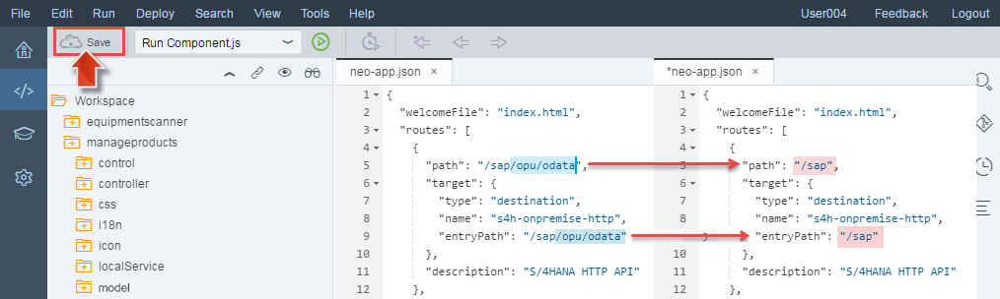

<a name="step-1-top"/><a name="step-2-top"/><a name="step-3-top"/><a name="step-4-top"/><a name="step-5-top"/>





**Overview:**


**Roles**

-   SAP HANA Cloud Platform personas: Web frontend developer creates new extension application


**Systems, Tools, Services:**

-   on host OS: in Google Chrome browser: SAP Web IDE, HCP cockpit

## Downloads

| Download Link | Description | Context |
| :------------ | :---------- | :------ |
| [**rating-extension.zip**](./imports/html5/rating-extension.zip?raw=true) | SAPUI5 project with extended **Manage Products** Fiori App | [Step 3: Implement Custom UI Extension to improve User Experience](#step-3-implement-custom-ui-extension-to-improve-user-experience) |

## Step 1: Import Extension UI to SAP HANA Cloud Platform

#### 1.1 Start your SAP Cloud Connector

Check if the _SAP Cloud Connector_ (SCC) is up and running.

1.  In the running **Oracle VM VirtualBox** open a **Konsole** (KDE **Application Menu > System > Konsole**)
2.  To check the _SCC_ status execute **sudo service scc_daemon status** (will ask for root password).
3.  If status output is:

    -   **Active: active** then Cloud Connector is up and running.

        

    -   **Active: inactive** then start Cloud Connector: **sudo service scc_daemon start**

        -   Then **Check _SCC_ status** again.

        

> **Result:** Your SAP HANA Cloud Connector is up and running.

#### 1.2 Import Fiori App from ABAP Repository into SAP Web IDE

1.  In Google Chrome browser start **SAP Web IDE** in a new tab by using the bookmark you added in [Week 1, Unit 5](../../week-1/unit-5/#create-sap-web-ide-bookmark).

    

2.  Open **S/4HANA FLP** bookmark in _Google Chrome_ Web browser (as defined in [Week 2, Unit 1, Section 3.2](../../week-2/unit-1/#step-4-create-s4hana-flp-bookmark))

    -   Enter your user credentials **Developer**/**Appl1ance** to log in.
    -   The launchpad conains the groups **Employee (EPM)** and **Purchase (EPM)** with three applications **Shop**, **Approve Purchase Order** and **Manage Products**.
    -   Click on tile **Manage Products** to start the standard Fiori application that is running in the SAP S/4HANA back-end system.

        

    -   Press the footer toolbar buttons **Group** and **Filter** to see, that the standard Fiori app running in the S/4HANA back-end does not provide the _Sort by/Filter by Average Raring_ functions.

        

3.  Go to the SAP Web IDE and choose menu item **File > Import > Application from SAPUI5 ABAP Repository**.

    

4.  In the popup dialog enter query string **prod** to filter the applications that are available in the SAPUI5 ABAP Repository of the SAP back-end system.
5.  Select application **EPMRA_PRODMAN** (SAP Fiori Reference Application _Manage Products_).
6.  Rename the **Target Folder** to **manageproducts** (from default **EPMRA_PRODMAN**).
7.  Click **OK** to fetch this application from the SAPUI5 ABAP Repository (on back-end side) to the SAP Web IDE on SAP HANA Cloud Platform.

    

> **Note:** The so-called [SAP Fiori Reference Apps](http://scn.sap.com/docs/DOC-59963) _Shop_ and _Manage Products_ used in this tutorial are sample applications for learning purposes. They do not access _real_ product master data from the S/4HANA backend but are connected to the _Enterprise Procurement Model_.

#### 1.3 Test Imported Fiori App in SAP Web IDE

In SAP Web IDE you can explore the newly imported Fiori application **manageapplication**.

1.  In the workspace tree click on the folder icon of the newly imported project **manageproducts** to view its content.

    

2.  Double-click on file **Workspace > manageproducts > neo-app.json**. The **neo-app.json** file provides the integration details between the user interface and the backend. Look at the destination **s4h-onpremise-http** that is used in the extension app. This destination is blending in the backend system in the path of the application.

    ```json
    {
      "welcomeFile": "index.html",
      "routes": [
        {
          "path": "/sap/opu/odata",
          "target": {
            "type": "destination",
            "name": "s4h-onpremise-http",
            "entryPath": "/sap/opu/odata"
          },
          "description": "S/4HANA HTTP API"
        },
        \[...]
      ]
    }
    ```

3.  To run the application  click on node **manageproducts** and click the **Run** toolbar button (icon with green arrow symbol). In the popup click **Open Run Configuration**.

    

4.  Click the **+** botton and select menu item **SAP Fiori Component on Sandbox**.

    

5.  In the next wizzard step keep all settings defined in run configuration **Run Component.js** unchanged. Click **Save and Run** to start the application in a new browser tab.

    

> **Result:** You imported the existing Fiori app _Manage Products_ from the SAP S/4HANA back-end into your HCP trial account by using SAP Web IDE. Within the application preview of SAP Web IDE you see that the imported application does not yet display image resources to be retrieved from the SAP S/4HANA back-end system.
>
> 

[Top](#step-1-top)

## Step 2: Explore How the Fiori App Communicates with the Back-end

In the next step you explore how the Fiori application _Manage Products_ communicates with HANA Cloud Platform to fetch OData service data and image files from the SAP S/4HANA back-end system. By using the Google Chrome Developer Tools and by changing the **neo-app.json** file in SAP Web IDE you make the missing images appear in the application frontend.

#### 2.1 Inspect Missing Image Resources with Chrome Developer Tools

1.  Open Developer Tools in Google Chrome:
2.  Click the utmost right button in the browser toolbar (or press **Alt + F**) to customize and control Google Chrome.
3.  Select menu item **More tools > Developer tools** or press **Ctrl + Shit + I**.

    

4.  Click on the **Network** panel and reload the page:

    

5.  Look at lines with Status **404** and double-click one of them e.g. **HT-2001.jpg**. In the preview tab You see the message text **HTTP Status 404 - Not found**.

    

6.  See the image URL in the address bar: **https://\[...]dispatcher.hanatrial.ondemand.com/sap/public/bc/NWDEMO_MODEL/IMAGES/HT-2001.jpg** and note that all images are loaded from the path **sap/public/bc**.

    

#### 2.2. Adapt Entry Path to Load MIME Resources

To open access to MIME resources from back-end path **sap/public/bc** you need to edit the **neo-app.json** file that currently defines access to the **sap/opu** path. You can either additionally expose the **sap/opu** path or  open access by truncating the existing path from **/sap/opu/odata** to **/sap** (as described by Thomas in the video).

1.  In SAP Web IDE select tab **neo-app.json**.

    -   In the destination named **s4h-onpremise-http** shorten the **path** and **entrypPath** values from **/sap/opu/odata** to **/sap**.

        ```javascript
        {
        "welcomeFile": "index.html",
        "routes": [
          {
            "path": "/sap",
            "target": {
              "type": "destination",
              "name": "s4h-onpremise-http",
              "entryPath": "/sap"
            },
            "description": "S/4HANA HTTP API"
          },
          ...
          ]
          }
        ```

    -   Save the file.

        

2.  Click the **Manage Products** browser tab and refresh the page.

    > **Note:** to refresh the browser cache hold **CONTROL** key (on a mac) or use shortcut **CTRL+F5**).

> **Result:** The missing image files shall now appear in the application UI:
>
> 

[Top](#step-2-top)

## Step 3: Implement Custom UI Extension to improve User Experience

In the next step you will extend the imported Fiori app by adding sort, filter and grouping functions with new SAPUI5 custom code. After importing the ready-to-run extension app into SAP Web IDE you explore the new functions on frontend side and in the SAPUI5 source code.

#### 3.1 Import and test Extended Fiori App in SAP Web IDE

1.  Download the file [rating-extension.zip](./imports/html5/rating-extension.zip?raw=true) and open it in your ZIP client to view all changed project files.
2.  In the SAP Web IDE project tree click **manageproducts**:
3.  Open context menu item **Import > From File System**.

    

4.  In the Import dialog choose file **rating-extension.zip** you downloaded before.
5.  To change the **Import to** field click **Select Folder** and choose **Workspace > manageproducts** and click  **OK**.

    

    

6.  Confirm the warning message **Folder "manageproducts" already contains files. Files with the same name will be overwritten.** and click **OK**.

    

    

7.  Run the application once more by clicking the **Run** toolbar button.

    

8.  In the left side of the footer toolbar click the sort, filter and grouping buttons to view the new **Average Rating** entries. Filter by **Average Rating: 1-2 (low)**.

    

> **Result:** With the new functions of the extended **Manage Products** Fiori application the procurement manager is able to easily filter by average user rating so that low-rated products can be found easily.
>
>  

#### 3.2 Explore Custom Code in SAP Web IDE

1.  Move back to the SAP Web IDE tab and open the file **Workspace > manageproducts > view > ProductFilterDialog.fragment.xml** with  double-click.

2.  The code block that was added during ZIP-file import is delimited by the lines **&lt;!-- begin** and **&lt;!-- end**. Also read the related description at the beginning to better understand the contained source code. You can also read the full source code here: [ProductFilterDialog.fragment.xml](../unit-5/src/html/manageproducts/view/ProductFilterDialog.fragment.xml).

3.  Open the file **Workspace > manageproducts > view > ProductGroupingDialog.fragment.xml** ([ProductGroupingDialog.fragment.xml](../unit-5/src/html/manageproducts/view/ProductGroupingDialog.fragment.xml)) with  double-click to view the added source code:

    ```xml
    <!-- Extending S/4HANA with HCP -->
    <!-- * UX Extension: Adding filtering/sorting/grouping for AverageRating property -->
    <!-- begin -->
    <ViewSettingsItem id="avgRatingGroupItem"  text="{/#Product/AverageRating/@sap:label}" key="AverageRating" />
    <!-- end   -->
    ```

4.  Open the file **Workspace > manageproducts > view > ProductSortDialog.fragment.xml** ([ProductSortDialog.fragment.xml](../unit-5/src/html/manageproducts/view/ProductSortDialog.fragment.xml) with double-click to view the added source code:

    ```xml
    <!-- Extending S/4HANA with HCP -->
    <!-- * UX Extension: Adding filtering/sorting/grouping for AverageRating property -->
    <!-- begin -->
    <ViewSettingsItem id="avgRatingSortItem" text="{/#Product/AverageRating/@sap:label}" key="AverageRating" />
    <!-- end -->
    ```

5.  To look at the added controller logic that handles the new grouping function open the file **Workspace > manageproducts > controller > SubControllerForFGS.js**, see [SubControllerForFGS.js](../unit-5/src/html/manageproducts/controller/SubControllerForFGS.js). Go through this source code and check how it is done by reading the comment code lines.

[Top](#step-2-top)

## Step 4: Deploy the Extended App to SAP HANA Cloud Platform and Register to Fiori Launchpad

In the last step You deploy the extended Fiori app to the central Git repository of Your HCP trial account.

#### 4.1 Deploy the Extended App to SAP HANA Cloud Platform

The _manageproducts_ SAPUI5 project that was imported from the local SAP Netweaver AS ABAP system already contains a minified JavaScript file `Component-preload.js` to improve loading performance. If you want modify this project after import you need to make sure that this `Component-preload.js` is built again so that it also contains the changed source code. Otherwise the running application will not show any changes you apply to the project.

Execute the following steps to ensure that the `Component-preload.js` is later built correctly and therefore contains the UX extension code at run-time:

1.  Click **Workspace > manageproducts** and choose context menu item **Project Settings**.

    

2.  Select tree item **Project Types** and mark checkbox _Project Type_ **SAPUI5 Client Build**. Click **Save**.

    

    > **Note:** In the video recording Thomas Bieser applied an _ad-hoc approach_ instead of setting the project type to _SAPUI5 Client Build_ in the project preferences. He just deleted the two project files **Component-preload-dbg.js**  **Component-preload.js** before deployment.

3.  Click **Workspace > manageproducts** and choose context menu item **Deploy > Deploy to SAP HANA Cloud Platform**.

    

4.  In the **Deploy Application to SAP HANA Cloud Platform** dialog keep all default settings and click **Deploy**.

    

> **Result:** The **manageproducts** Fiori app was successfully deployed to the Git repository of Your HCP trial account.
>
> 
>
> By following the link _Open the application's page in the SAP HANA Cloud Platform cockpit_ you can find more application details like _status_ and _active version_.
>
> 

#### 4.2 Register Extended Fiori App to Fiori Launchpad

Back in the browser tab with SAP Web IDE you can directly proceed to register the deployed Fiori app **manageproducts** in SAP Web IDE.

1.  In the confirmation popup click **Register to SAP Fiori launchpad**.

    

    > **Note:** In case you closed the confirmation popup before, select  **manageproducts** in the project tree and click context menu item **Deploy > Register to SAP Fiori Launchpad**.

2.  Under **General Information** click **Next**.

    

3.  Under **Tile Configuration** enter title and subtitle and click **Next**:
4.  Title: **Manage Products**
5.  Subtitle: **Rating**

    

6.  Under **Assignment** select the site, catalog and group and click **Next**:

    -   Site: **Procurement Launchpad**
    -   Catalog: **Procurement Application**
    -   Group: **Product Management**

    

7.  Under **Confirmation** click **Finish**.

    

8.  In the confirmation popup **Successfully Registered** click the link **Open SAP Fiori launchpad**.

    

> **Result:** On the launchpad you see the new application tile **Manage Products** in group **Product Management**.
> 	

[Top](#step-4-top)

## Step 5: Look for Low-Rated Products in Extended Fiori App Manage Products

In the last step you explore the extended functions in the _Manage Products_ Fiori frontend that enable the Procurement manager to filter and group products by the average ratings from corporate employees.

1.  In the left side of the footer toolbar click the sort button and click radio button **Average Rating**.

    

2.  In the Products master view scroll up to the first product entries with low ratings starting from 0.00.

    

3.  In the footer toolbar click the group button and group by **Category**. Click **OK**.

    

> **Result**: In the products table all products are grouped by category wherein the low-rated products are listed firs:
> 

[Top](#step-5-top)

[**&lt; Previous** Unit 4](../unit-4/) | [**Up ^** Week 2](../) | [**Next >** Overview Week 3](../../week-3/)
