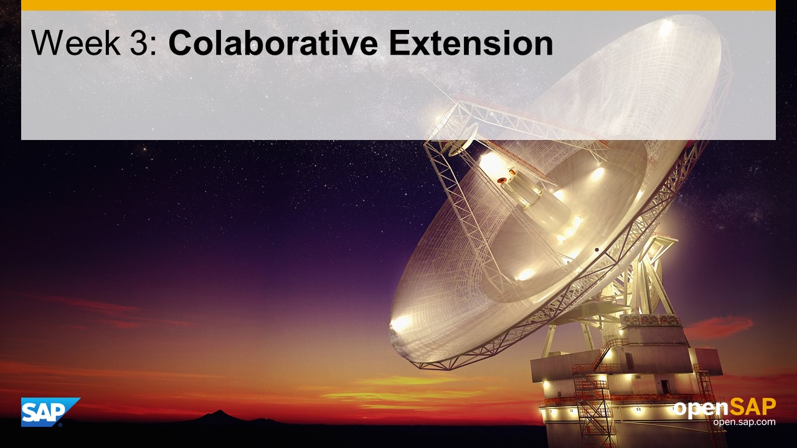

## Units
- Unit 1: [Understand the Challenge](./unit-1/)
- Unit 2: [Preparing and Exposing Back-End APIs](./unit-2/)
- Unit 3: [Preparing SAP Jam](./unit-3/)
- Unit 4: [Preparing Secured Access from SAP HANA Cloud Platform to SAP Jam](./unit-4/)
- Unit 5: [Consuming Back-End APIs](./unit-5/)
- Unit 6: [Creating and Accessing SAP Jam Groups](./unit-6/)

