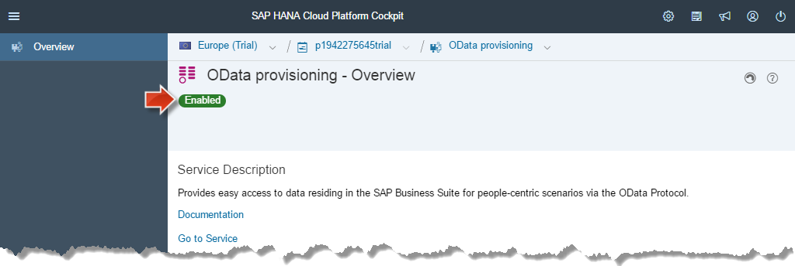
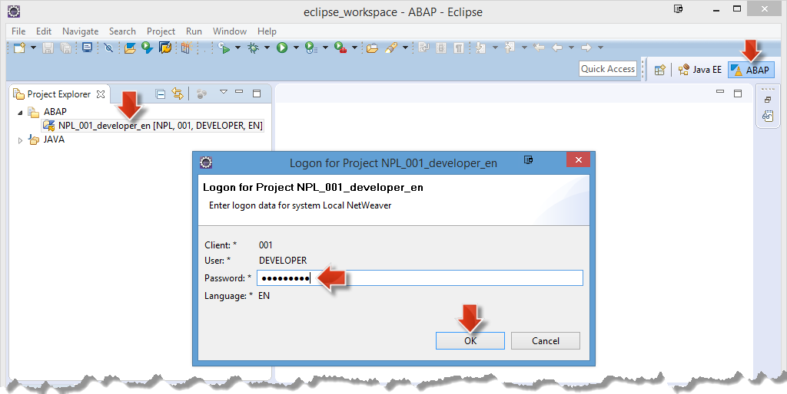

<a name="step-1-1-top"/><a name="step-1-2-top"/><a name="step-1-3-top"/>
<a name="step-2-1-top"/><a name="step-2-2-top"/><a name="step-2-3-top"/><a name="step-2-4-top"/>
<a name="step-3-1-top"/><a name="step-3-2-top"/><a name="step-3-3-1-top"/><a name="step-3-3-2-top"/><a name="step-3-4-1-top"/><a name="step-3-4-2-top"/><a name="step-3-5-1-top"/><a name="step-3-5-2-top"/><a name="step-3-5-3-top"/>





**Overview:**

**Roles**

-   Corporate IT
    -   SAP Basic administrator, SAP application expert
-   SAP HANA Cloud Platform
    -   HCP administrator

**Systems, Tools, Services:**

-   Guest OS (VM Back-End)
    -   NetWeaver 7.50 (S/4 HANA), SAP Cloud Connector (Cloud Connector; SCC)
-   Host OS
    -   Eclipse IDE with ABAP tools (ABAP in Eclipse; AiE), Web browser (Chrome is recommended)
-   HANA Cloud Platform (HCP)
    -   HCP Cockpit, OData provisioning service

## Downloads

| Download Link | Description | Context |
| :------------ | :---------- | :------ |
| [**s4h-onpremise-http-iwbep.properties**](./imports/destinations/s4h-onpremise-http-iwbep.properties?raw=true) | Destination to access S/4HANA backend | [Section 3.3 Import Destination to access OData Services from your SAP S/4HANA backend](#import-destination-to-access-odata-services-from-your-sap-s4hana-backend)      |

## Step 1: Preparation Steps

The following three preparation steps ensure that your local _SAP NetWeaver AS ABAP_ is up and running and that the _SAP HANA Cloud Connector_ is working, in order to establish the connectivity from your local back-end to your _SAP HANA Cloud Platform_ trial account. You can quickly verify that everything is working by launching the _SAP Fiori Launchpad_ in your HCP account, as the applications retrieve the data from your local SAP NetWeaver backend.

#### 1.1 VM with SAP NetWeaver AS ABAP is up and running

To make sure that your SAP S/4HANA backend system is in a defined, up and running state do the following **VM Stop/Start cycle**:

1.  **Stop** SAP NetWeaver AS ABAP and **Close** VM as described in [week 1, unit 6, section 6.4](../../week-1/unit-6/#shutdown-vm-with-netweaver-as-abap).
2.  **Start** first latest VM Snapshot **NetWeaver & Cloud Connector Setup (End of Week 2)** and then NetWeaver ABAP as described in [week 1, unit 6, section 6.5](../../week-1/unit-6/#starting-vm-with-netweaver-as-abap).

> **Result:** Your _SAP NetWeaver AS ABAP 7.50 SP02_ system is now up and running with its processes on a Linux VM.

[Top](#step-1-1-top)

#### 1.2 Cloud Connector is up and running

Make sure that the _SAP HANA Cloud Connector_ (SCC) is up and running.

1.  In the running **Oracle VM VirtualBox** open a **Konsole** (KDE **Application Menu > System > Konsole**)
2.  Check _SCC_ status:
3.  Execute **sudo service scc_daemon status** (will ask for root password) to get the SCC status output.
4.  If status output is:

    -   **Active: active** then Cloud Connector is up and running.

        

    -   **Active: inactive** then start Cloud Connector: **sudo service scc_daemon start**

        -   Then **Check _SCC_ status** again.

        

> **Result:** Your SAP HANA Cloud Connector is up and running.

[Top](#step-1-2-top)

#### 1.3 Open SAP Fiori Launchpad on SAP HANA Cloud Platform

After you verified that your local _SAP NetWeaver AS ABAP_ backend and your _SAP HANA Cloud Connector_ are running, you may check the connectivity to the cloud by launching the _SAP Fiori Launchpad_ in your HCP account and opening the *Manage Products* application. You may do so, by opening the _HCP FLP_ Google Chrome bookmark, that you created in [Week 2, Unit 4](../../week-2/unit-4/#step-3-publish-the-launchpad-site). As the *Manage Products* application retrieves the data from your local SAP NetWeaver backend, you can be sure that the connectivity is established and working correctly if the *Manage Products* data is displayed correctly.

1.  Open Google Chrome.
2.  Click bookmark **HCP FLP**
3.  Logon with the credentials for your SAP HANA Cloud Platform trial account.
4.  Open the **Manage Products** application.

> **Result:** If you can see some data in the application, you can be sure that the connectivity from your local back-end to your _SAP HANA Cloud Platform_ trial account is established and working correctly.
>
> 

[Top](#step-1-3-top)

## Step 2: Identify _Shop_ Back-End Service

The _Collaborative Extension_ that you create in week 3, will be based on the _Shop_ OData service (EPM_REF_APP_SHOP_SRV) that is available in your SAP S/4HANA backend system. This OData service provides _product information_, including _product ratings_.

> **Note:** Why are we using the **Shop OData service** and not the **Manage Products OData service** (EPM_REF_APPS_PROD_MAN_SRV) that we used in Week 2? The services are quite similar: Both offer product data from the underlying [Enterprise Procurement Model (EPM)](https://archive.sap.com/documents/docs/DOC-31458). However, the **Shop OData service** additionally contains **product rating information**, which we want to use later in the Collaborative Extension of the existing **Manage Products** application.

#### 2.1 Get Back-End Service name from Front-End Application

1.  In Google Chrome, open the **S/4HANA FLP** bookmark, that you created in [week 2, unit 1](../../week-2/unit-1/#create-s4hana-flp-bookmark). (This is the SAP Fiori Launchpad that is running on your local SAP S/4HANA backend. This is NOT the Launchpad that you opened in the preparation steps of this unit.)
2.  Click on **Shop** tile to open the SAP Fiori _Shop_ application.

    

3.  Open the Google Chrome **developer tools** as described in [week 2, unit 2](../../week-2/unit-2/#explore-odata-services-within-web-browser). (Keyboard shortcut: Windows: **Ctrl + Shift + I** / Mac OS: **Cmd + Alt + I**)
4.  Select **Network** tab.
5.  **Refresh** the page. This ensures that the developer tools logs the HTTP request that fetches data from your backend system.

    

6.  Enter **metadata** as filter and double-click on the resulting HTTP request that fetches the **metadata** document of the EPM_REF_APP_SHOP_SRV OData service.

> **Result:** The metadata document of the EPM_REF_APP_SHOP_SRV OData service is now open in a new browser tab. Now that we have identified the web service that is the data source for this SAP Fiori application, we can further investigate the service using the SAP Gateway tools in your SAP NetWeaver backend system.
>
> 

[Top](#step-2-1-top)

#### 2.2 Open Maintain Services Transaction

Using the _ABAP in Eclipse (AiE)_ tools you will open the _Maintain Services_ transaction in your SAP NetWeaver backend. This transaction shows OData services that are available in your backend system. Here you will find and open the _EPM_REF_APP_SHOP_SRV_ service, that you identified as data source for the _Shop_ SAP Fiori application in the previous step.

1.  In Eclipse open the **ABAP Perspective**, select the **NPL\_001\_developer\_en** ABAP project in _Project Explorer_ view, and click on the **green icon with a white triangle** (_Run ABAP Development Object as ABAP Application in SAP GUI_) in the Eclipse toolbar: .

    

2.  If requested, log in with password **Appl1ance** of user _DEVELOPER_.

    

    > **Note:** In case you experience any problems to log in, try to close the ABAP project and open it again. See if the _Log in_ step works then.

3.  In the opened **Run ABAP Application** dialog, enter **/IWFND/MAINT_SERVICE** as search string.
4.  Choose item **/IWFND/MAINT_SERVICE (Transaction)** from the list and click on **OK**.

    

> **Result:** You have opened the _Activate and Maintain Services_ transaction in your backend using _ABAP in Eclipse_. This transaction shows all available OData services in your SAP NetWeaver backend.
>
> 

[Top](#step-2-2-top)

#### 2.3 Search for Shop Service

1.  In the **Activate and Maintain Services** transaction, click om the **Filter** button, enter **\*SHOP\*** as **Technical Service Name** and click on the green accept icon.

    

2.  All OData services containing the **SHOP** string will be listed. We are looking for the **ZEPM_REF_APPS_SHOP_SRV** service.

    

3.  In the _Service Catalog_, select the line with **EPM_REF_APPS_SHOP_SRV** as _External Service Name_.
4.  Click **SAP Gateway Client** to open the integrated OData service test client.

    

    > **Note:** _SAP Gateway_ is the development environment in a SAP NetWeaver AS ABAP system, where OData services are created, tested and managed. In earlier releases of SAP NetWeaver, SAP Gateway had to be installed as an ABAP add-on, in newer releases (like SAP S/4HANA), the Gateway tools are included by default. You can find more information on SAP Gateway and on OData services in the SAP context in the [SAP Community](http://www.sap.com/community/topic/gateway.html).

5.  On the opened **SAP Gateway Client** window, click **Execute** to get the HTTP response of the OData service in the XML format.

    

6.  Click **Data Explorer**. This gives you a structured view of the response body.
7.  Take a look at the folder structure, and confirm that there are two **entity sets** called **Reviews** and **Products**.

    

> **Result:** You have verified that the **EPM_REF_APPS_SHOP_SRV** OData service contains the product and reviews information that you need to create the **Collaborative Extension**.

[Top](#step-2-3-top)

#### 2.4 Explore the Contents of the OData Service

To see the contents of the **Reviews** entity set of the selected _EPM_REF_APPS_SHOP_SRV_ OData service in the _SAP Gateway Client_ do the following:

1.  In the **SAP Gateway Client**, click on **EntitySets** in the toolbar.

    

2.  Click on **Reviews** EntitySet Name. This results in the string **/Reviews** getting appended to the **Request URI**.

    

3.  Click on the **Execute** button, so that you get the response for this changed request.

    

4.  The data of the **Review** entities are contained in the HTTP response, and for each review entity you select, you can see the corresponding property values.

    

> **Result:** You have identified the product review data you need in order to find out the products in your store that have a low user rating.

[Top](#step-2-4-top)

## Step 3: Make Back-End Service available in the Cloud

In this step you will expose the **EPM_REF_APPS_SHOP_SRV** OData service from your local S/4HANA backend system to the cloud using the **OData Provisioning service** in your **SAP HANA Cloud Platform** trial account.

#### 3.1 Enable HCP _OData Provisioning_ Service

1.  Open your SAP HANA Cloud Platform cockpit. ([**HCP** bookmark](../../week-1/unit-5/#create-hcp-bookmark))
2.  If requested, log in with your HCP trial user and password.
3.  Navigate to **Services** and click on **OData provisioning**.

    

4.  On the opened **OData provisioning - Overview** page click on the **Enable** button, to enable this service in your account.

    

5.  You should now see a green label stating that the service is **Enabled**.

    

> **Result:** You enabled the SAP HANA Cloud Platform **OData provisioning** service in your trial account.

[Top](#step-3-1-top)

#### 3.2 Configure enabled _OData Provisioning_ Service

Now you will configure the _OData Provisioning_ service, and assign _roles_ to define which users are administrators for this service and which users may access the service.

1.  On _OData provisioning - Overview_ page, click on the **Configure OData provisioning** link to navigate to the _Configure OData provisioning_ page.

    

2.  Click on the **Roles** tab in the lefthand navigation area to assign the users which are allowed to call the exposed OData services.

    

3.  Click on the **User Information** icon in the upper right corner to see your P-User ID.
4.  Select the **ID** P-User value and copy it to your clipboard.

    

5.  In the **Roles** area, select the line **GW_Admin**.
6.  Click on the **Assign** button for _Individual Users_.

    

7.  Paste the your P-User from your clipboard into the **User ID** field.

    

8.  Click **Assign** to save this configuration.

    

9.  Repeat these steps for the second role **GW_User**: Select the **GW_User** line, click on the **Assign** button and paste your **P-User ID**.

    

> **Result:** You have added the necessary roles (GW_Admin and GW_User) to your P-User so that this user is now allowed to access and administrate the OData services that will be exposed via using the HCP OData provisioning service.

[Top](#step-3-2-top)

#### 3.3 Import Destination to access OData Services from your SAP S/4HANA backend

The **SAP HANA Cloud Platform OData Provisioning** establishes the connection to a special SAP Gateway service node (IWBEP) in your SAP S/4HANA backend system. Via this service node, all OData services from the backend system are exposed. Therefore you will now import a destination to your HANA Cloud Platform account, which allows this communication to take place.

##### 3.3.1 Download s4h-onpremise-http-iwbep Destination File

1.  Download the [s4h-onpremise-http-iwbep.properties](./imports/destinations/s4h-onpremise-http-iwbep.properties?raw=true) file to your computer. (**Right-click > Save link as...**).

> **Result:** You have downloaded the file **s4h-onpremise-http-iwbep.properties.txt** somewhere on your PC.

[Top](#step-3-3-1-top)

##### 3.3.2 Import Destination

1.  Continue on the **Configure OData provisioning** page in the HCP Cockpit, that should still be open in your browser.
2.  Click **Destinations** tab on left navigation area.
3.  Click **Import Destination** to open a file picker dialog.

    

4.  Choose the **s4h-onpremise-http-iwbep.properties** file that you downloaded before.
5.  **Open it**, so that its data will be opened in a destination configuration form on the HCP Cockpit page.

    

6.  Enter password **Appl1ance** for the user _DEVELOPER_.
7.  Click **Save**.
8.  The destination has been successfully saved into your SAP HANA Cloud Platform trial account and added as additional line to the destinations table.

    

> **Result:** This destination allows the OData provisioning service to connect to the OData services available in your backend system.

[Top](#step-3-3-2-top)

#### 3.4 Check Back-End Service Accessibility

##### 3.4.1 Service Accessibility on SAP HANA Cloud Connector

1.  Open the **SAP HANA Cloud Connector** admin interface in Google Chrome ([**SCC** bookmark](../../week-2/unit-3/#set-up-initial-configuration)).
2.  Click **Advanced > Proceed to localhost(unsafe)** link
3.  Logon with user **Administrator** and the **Password** that you set in [week 2, unit 3](../../week-2/unit-3/#set-up-initial-configuration).

    

4.  On the opened Cloud Connector ensure that **My Trial Account** is selected as _Account_.
5.  Select **Cloud To On-Premise** tab. It displays the **Access Control** entries.

    

6.  Click the button **Check availability of internal host** to check if the S/4 HANA on-premise system is reachable.
7.  Confirm that for your ABAP system entry with the Virtual Host s4h:443 the path **/sap/** (and all sub-paths) is allowed for access. This means that the path **/sap/iwbep** under which the backend service is exposed, is an allowed path to access.

    

> **Result:** As a result of this mapping, your local SAP S/4HANA backend system can be addressed on the SAP HANA Cloud platform using the virtual host **s4h:443**. All paths and sub-paths below **/sap/** on the backend system can now be accessed in your HCP account.

[Top](#step-3-4-1-top)

##### 3.4.2 IWBEP Service Accessibility in the Backend System

In this step you will make sure that the **iwbep** service node in the backend is activated, so that it may be accessed by the SAP HANA Cloud Platform OData Provisioning service.

1.  Open **Eclipse IDE** and make sure that you opened the **ABAP Perspective**
2.  In _Project Explorer_:
3.  Double-click on the ABAP project **NPL_001_developer_en**.
4.  Log in with password **Appl1ance** if you are not already authenticated.

    

5.  Click on green icon with white triangle (_Run ABAP Development Object as ABAP Application in SAP GUI_) in the Eclipse toolbar.

    

6.  On opened **Run ABAP Application** dialog enter **SICF** as *Search Term*.
7.  Choose item **SICF (Trancaction)** from the list.
8.  Click **OK**

    

9.  The **SICF** transaction opens in Eclipse and shows the **Define Services** tab.

    

10. Keep the default filter (_Hierarchy Type_: **SERVICE**) of the _SICF editor_ and click the **Execute icon** on the _Define Service_ toolbar to open the hierarchy tree of available services.
11. On the opened **Define Services** page:

    -   In the _Virtual Hosts/Services_ column open the nodes **default_host > sap**.
    -   Select **iwbep** child node.
    -   Open right-mouse context menu.
    -   Choose "Activate"

    

12. Confirm the **Activation of ICF Services** dialog: Click **Yes** so that the _iwbep_ service node gets activated.

    

##### 3.4.3 Take another snapshot of the Linux VM in VirtualBox Manager

1.  In the Linux VM window select menu item **Machine > Take snapshot**.
2.  Enter snapshot name **NetWeaver & Cloud Connector Setup & iwbep activated** and click **OK**.

> **Result:** With these steps you activated the **iwbep** node so the OData provisioning service can via Cloud Connector make use of the available **IWBEP** backend services.

[Top](#step-3-4-2-top)

#### 3.5 Access Back-End Service via Cloud OData provisioning service

Now that you activated the **IWBEP** backend service and setup the _SAP HANA Cloud Connector_, you can use the _SAP HANA Cloud Platform OData provisioning_ service to make the backend service available in the cloud.

##### 3.5.1 Open OData Provisioning Administration Cockpit

1.  Go back to the **Configure OData provisioning** page in the HCP Cockpit.
2.  Click on the **OData provisioning** link of the navigation breadcrumb of the HCP Cockpit to navigate back on the **OData provisioning - Overview** page.

    

3.  Click **Go to Service** link to open the _OData Provisioning Administration Cockpit_ page in a new browser tab.

    

> **Result:** The **OData Provisioning Administration Cockpit** opens, in which you can register OData services from your SAP NetWeaver backend system to expose them to the SAP HANA Cloud Platform.
> 
> **Note:** The Administration Cockpit **does not open** but a **not sufficient authorization** message opens in the newly opened browser tab?
>
>    
>
> Then execute the following steps to open the cockpit correctly:
>
>  1. **Close** the newly opened browser tab.
>  2. On the HCP Cockpit tab click **logout** icon.
>  3. **Logon** again with your HCP Trial P-User to the HCP Cockpit to reopend the _OData provisioning - Overview_ page.
>  4. Click **Go to Service** link and this time **OData Provisioning Administration Cockpit** should open correctly. 
>
>    
>

[Top](#step-3-5-1-top)

##### 3.5.2 Register Shop Service in OData Provisioning Cockpit

1.  In opened **_OData Provisioning Administration_** cockpit, click on the **Register** button to open the _Register Service_ dialog.

    

2.  Select **s4h-onpremise-http-iwbep** as _destination_.
3.  Enter **shop** in the _Search Services_ field.
4.  Click on the **search icon**.

    

5.  There are two OData services containing the string **shop** exposed in your backend system.

    

6.  Select the **EPM_REF_APPS_SHOP_SRV** line to mark the service for further actions.
7.  Click **Register** so that the service is added to the _Registered Services_ table.

    

8.  Click on the **EPM_REF_APPS_SHOP_SRV** link, to open a page that displays further information about the OData service.

    

9.  Click the **Service Access > Service Document** link on the opened the _Shop_ OData service in a new browser tab.

10. The **_Shop_ OData service** metadata output **as exposed by OData provisioning service** is displayed in the Web browser.

    

> **Result:** You have now successfully exposed the **EPM_REF_APPS_SHOP_SRV** OData service to the cloud using the **SAP HANA Cloud Platform OData Provisioning** service. Authorized users (i.e. users with the [GW_USER role](#configure-enabled-odata-provisioning-service)) may access this service from everywhere in the internet.

[Top](#step-3-5-2-top)

##### 3.5.3 Create _Shop OData_ Bookmark

1.  Create a Web browser bookmark **Shop OData** of the EPM_REF_APPS_SHOP_SRV OData service URL you exposed in the previous step, so that you can easily refer to it at a later point in time.

    

[Top](#step-3-5-3-top)

[**&lt; Previous** Unit 1](../unit-1/) | [**Up ^** Week 3](../) | [**Next >** Unit 3](../unit-3/)
