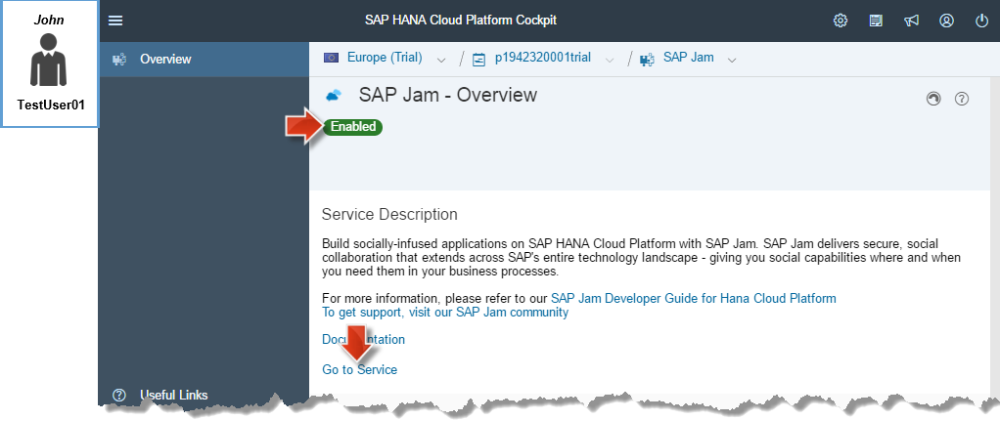
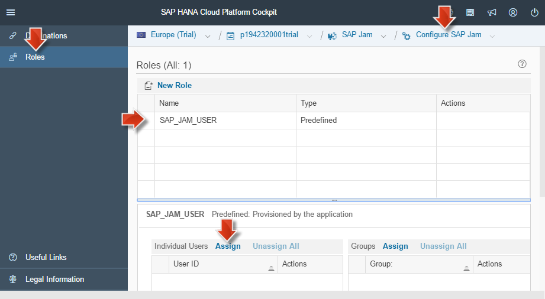
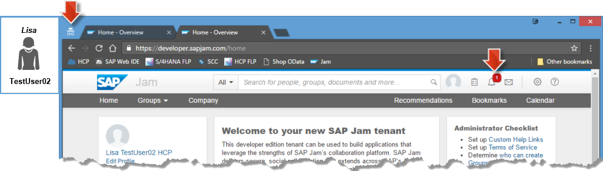

<a name="step-1-1-top"/><a name="step-1-2-top"/><a name="step-1-3-top"/>
<a name="step-2-1-top"/><a name="step-2-2-top"/><a name="step-2-3-top"/>
<a name="step-3-1-1-top"/><a name="step-3-1-2-top"/><a name="step-3-2-top"/><a name="step-3-3-top"/><a name="step-3-4-top"/>





**Overview:**

**Roles**

-   SAP HANA Cloud Platform
    - HCP administrator
    - SAP Jam administrator

**Systems, Tools, Services:**

-   HANA Cloud Platform (HCP)
    - HCP Cockpit,
    - Jam service and cockpit
-   Host OS
    - Google Chrome

## Step 1: Preparation Steps

To experience how the SAP Jam Collaboration feature works you will need to create a second SAP HANA Cloud Platform Trial User.

This newly created user should always work in the so-called Google Chrome [**Incognito Mode**](https://support.google.com/chrome/answer/95464), so that the user session does not gets not mixed up with the your existing HCP Trial user, which will always work in a _normal_ browser window.

Incognito Mode basically works like a fresh Google Chrome browser every time you start this mode. It does not make use of any existing cookies or cached resources on your computer. Once you close an incognito window, it does not remember the websites or resources you visited.

Alternatively, you may use a different browser like _Firefox_, or [create a new user profile in Google Chrome](https://support.google.com/chrome/answer/2364824).

Execute the following preparation steps to get the two HCP Trial users ready in their respective browser sessions, which is then the starting point for the SAP Jam Collaboration scenario.

#### 1.1 Clean initial browser state

1.  **Close** all Chrome browser windows.

> **Note:** By closing all browser sessions you ensure that the HCP Trial user sessions are closed. This should avoid that the two HCP Trial users you will use in the next steps, will clash.

[Top](#step-1-1-top)

#### 1.2 Create a new HCP Trial Test User

1.  Open a **normal** Chrome **browser** window.

    

2.  On the opened _normal_ browser window
3.  Open **Customize and control Google Chrome** menu.
4.  Choose **New incognito window** to opened a new and empty incognito browser window

    

5.  **In this incognito window** open [http://hanatrial.ondemand.com](http://hanatrial.ondemand.com) and **register** a new HCP Trial test user as described [section 3.1](../../week-1/unit-5/#register-for-a-trial-account) of unit 5 in week 1.

    > **Hint:** **Right-click** on the section 3.1 **link** and open it in a **new browser tab**.

6.  After you created your second HCP Trial test P-user:
7.  Open [https://hanatrial.ondemand.com](http://hanatrial.ondemand.com) in the **incognito** browser window.
8.  **Log on** with the **new P-User** and **password**.
9.  Click **p-User Trial Account** link to enter your _HCP Trial Account Cockpit_

    > **Result:** Inside the **incognito** window you opened the _HCP Cockpit_ and **your new second user** is logged on.
    >
    > 
    >
    > In the following description and screenshots we will use our example HCP Trial account user **_Lisa TestUser02_**, with the following settings. When executing the steps adapt the user details (account names, user Ids, etc.) to yours.
    >
    > User Pic | Firstname, Lastname  |   Account Name   | User ID
    > ---------|--------------------- | ---------------- | ------------
    >  | **Lisa** TestUser02, HCP | p1942320002trial | p1942320002
    >
    > **Note:** To make is easier to distinguish between the two used HCP Trial Users we add always the **Lisa TestUser02** picture to the screenshot when the second user is doing something in the **incognito** browser.

10. **Keep** the incognito browser **open** until it is use in a later step below.

[Top](#step-1-2-top)

#### 1.3 The existing HCP Trial User

After you have prepared your second HCP Trial user, which is logged in the incognito browser, you will now open a normal, i.e. not-incognito, browser and log on with your first used HCP Trial user.

1.  Open a **normal** Chrome **browser** window.
2.  Click **HCP** bookmark in _Chrome_ browser.
3.  **Log in** with the HCP Trial User Id (P-user) and password you created first.

    

    > **Result:** You opened the _HCP Cockpit_ and **your first user** is logged on.
    >
    > 
    >
    > In the descriptions and screenshots we will use our example HCP Trial account user **_John TestUser01_**, with the following settings.
    > **Note:** When executing the steps **adapt the user** details (account names, user Ids, etc.) to yours.
    >
    > User Pic | Firstname, Lastname  |   Account Name   | User ID
    > ---------|--------------------- | ---------------- | ------------
    >  | **John** TestUser01, HCP | p1942320001trial | p1942320001
    >
    > **Note:** To make is easier to distinguish between the two HCP Trial Users in the below described collaboration scenario we also add a **John TestUser01** picture to the screenshot when this user is doing something in the **normal** browser.

4.  **Keep** the normal browser **open** until it is use in a later step below.

[Top](#step-1-3-top)

## Step 2: Enable and Open Jam Service

Our example HCP Trial _TestUser01 **John**_ takes the role of the _HCP Administrator_ and will first enable the _HCP Jam Service_.

#### 2.1 Enable Jam Service

1.  Continue with the opened normal browser where the _HCP Cockpit_ is displayed.
2.  Navigate to **Services**.
3.  Search for **Jam**
4.  Click on **SAP Jam** tile.

    

5.  On the opened **SAP Jam - Overview** page
6.  Click on **Enable** button to enable this service

    > **Result:** You enabled the HCP **SAP Jam** service.
    >
    > 

7.  After the service is enabled click **Go to Service** link so that the **SAP Jam Cockpit** logon opens in a new browser tab.

    

8.  Log in to the **Jam Service** cockpit with your first HCP Trial user (here in the documentation HCP Trial _TestUser01 **John**_)

    > **Result:** The **Jam Service** cockpit opens and your first HCP Trial user is logged on and is now in the role of a _Jam administrator_.
    >
    > 

    > **Warning:** If your browser window **width is too small**, you will get a different **Jam Service** cockpit layout. Make sure that you browser width is big enough so that the **Home, Groups, Company, ...** menu bar is visible.

##### 2.1.1 Create _Jam_ Bookmark

To quickly access your _Jam service cockpit_ you will create a **Jam** bookmark as follows

1.  Create a new bookmark **Jam** in your browser as before.

    

2.  Switch to the **HCP cockpit** browser tab where the _SAP Jam - Overview_ page is still open.
3.  **Right-click** on **Go to Service** link to open context menu.
4.  Choose **Copy link address** to copy the _Jam service cockpit_ launch URL to your clipboard.

    

5.  **Right-click** on the before created **SAP Jam bookmark** in the browser bookmark bar to open context menu.
6.  Choose **Edit...** to open _Edit Bookmark_ dialog.

    

7.  On opened **Edit Bookmark** dialog:
8.  **Paste** the before copied **Go to service** URL into the URL field to replace the existing URL.
9.  Click **Save**.

    

    > **Result:** After these steps you can quickly launch the _Jam service cockpit_ by clicking the **Jam** bookmark.

> **Result:** You have seen now how to launch the Jam cockpit of the enabled HCP Jam Service.
> By means of the Jam cockpit you as a _Jam administrator_ can create _Jam Groups_ where certain invited users could shared their contents and collaborate.

[Top](#step-2-1-top)

#### 2.2 Create a Jam Group for Collaboration

The _Jam administrator_ creates a Jam Group as follows.

1.  In the opened _Jam Cockpit_
2.  Choose **Groups > Create Group** from main menu to open **Create a Group** dialog.

    

3.  On the opened **Create a Group** dialog
4.  Enter a group name: **Testing Group**.
5.  Keep the other defaults
    -   Template: **Topic-based Collaboration Template**
    -   Permission: **Private**
    -   **Activate this group view** is selected
6.  Click **Create**.

    

7.  Click **Accept** to confirm also the initial e-mail notification settings.

    

> **Result:** A new Jam Group with name _Testing Group_ opens.
>
> 

[Top](#step-2-2-top)

#### 2.3 Jam Group capabilities: Discussions

In a _SAP Jam Groups_, there are many features that allow you to collaborate with other users. In the following steps, you will learn to use the _Forums_ that allow you to _discuss with other group members_.

1.  On the before created and opened _Testing Group_ page:
2.  Select 'Forums' on the left navigation area of the before opened testing group
3.  In the **Forum Topics** list click on the Discussions item.

    

4.  Click **Add Discussion**.

    

5.  Enter some discussion title and contents in the opened editor.
6.  Click **Publish**

    

> **Results:**
>
> -   A discussion entry is part of the testing group.
> -   Under the created discussion entry one could reply but so far there is only one member in the group, which is the creator.
>
>     

[Top](#step-2-3-top)

## Step 3: Two Users Jam Collaboration Scenario
In order to understand how a collaboration scenario would work in a realistic scenario, you need to create at least one additional SAP HANA Cloud Platfrom trial user, with whom your main user can interact: The **first user** (_John TestUser01_) is the _Jam administrator_, who manages the users in the SAP Jam Group that you created in the previous step. The **second user** (_Lisa TestUser02_) is invited to join the Jam Group by the _Jam administrator_. In this group they may start discussion threads and collaborate on different topics.

In the following four subsections you will learn how this **Two User Jam Collaboration Scenario** works, employing the SAP Jam service on the _SAP HANA Cloud Platform_.

#### 3.1 _John_ invites _Lisa_ to the enabled Jam Instance

The Jam administrator _John(TestUser01)_ will now allow _Lisa(TestUser02)_ to participate in the enabled Jam instance by adding the User ID of this user to a corresponding role.

##### 3.1.1 _John_ assigns _Lisa_ to SAP_JAM_USER Role

1.  Open a new tab in the normal browser:

    -   Open your HCP Account Overview page, by clicking on the [**HCP bookmark**](../../week-1/unit-5#step-3-prepare-sap-hana-cloud-platform-trial-account).
    -   **Log on** with your _first HCP Trial user_ and _password_ (here _John(TestUser01)_)
    -   Click **Services** tab
    -   Search for **jam** and click on **SAP Jam** tile.

        

2.  On the opened **SAP Jam - Overview** page:
3.  Click **Configure SAP Jam** link to open the Jam configuration page.

    

4.  On the opened **Configure SAP Jam** page:
5.  Click **Roles** tab.
6.  Select _SAP_JAM_USER_ role table row.
7.  Click **Assign** link for individual users.

    

8.  In the opened _Assign role to user_ dialog
    - Enter the p-User ID of your **second** HCP Trial user (ours here is _p1942320002_ for _Lisa(TestUser02)_)
    - Click **Assign**.

      

> **Result:** The p-User ID of your second HCP Trial user has been added to individual users table of SAP_JAM_USER.
>
> 

An HCP User which has been assigned the role SAP_JAM_USER can now access the Jam instance. But the user needs to accept first the invitation which the HCP administrator need to send manually as shown in the next subsection.

[Top](#step-3-1-1-top)

##### 3.1.2 _John_ sents _Lisa_ an Invitation Link for SAP JAM

The Jam administrator _John(TestUser01)_ will now send an invitation link to join the _SAP Jam instance_ to the second HCP Trial user (_Lisa(TestUser02)_).

1.  Switch to the still open normal browser window, where the session of your main user is opened.

    -   Open your HCP Account Overview page, by clicking on the [**HCP bookmark**](../../week-1/unit-5#step-3-prepare-sap-hana-cloud-platform-trial-account).
    -   Click **Services** tab
    -   Search for **jam** and click on **SAP Jam** tile.

        

2.  On the opened _SAP Jam - Overview page_
3.  Right mouse click on **Go to Service** link
4.  Choose **Copy link address** to copy this _Jam invitation link_ to your clipboard.

    

5.  The _Jam administrator_ sends this copied _Jam invitation link_ to the second HCP Trial user e.g. via e-mail.

> **Note:** Keep the 'normal' browser window opened, where _first HCP Trial user_ (Jam administrator) is logged in. You will continue to use it during the next steps.

> **Results:**
>
> -   _User 1_ has added via role assignment _User 2_ to the Jam instance and sent an invitation link to _User 2_.
> -   As long as _User 2_ does not accept the invitation, _User 1_ cannot add _User 2_ to any (Collaboration) Group of the Jam instance.

[Top](#step-3-1-2-top)

#### 3.2 _Lisa_ accepts the SAP Jam Invitation from _John_

We now assume that the second HCP Trial user (_Lisa_) received the invitation link for SAP Jam. Lisa opens the link in her browser. As explained in Step 1, the second HCP Trial user should always work in the **incognito browser**, so that the first user (_John_) does not get logged out from his HCP session.

1.  Refresh the still opened **incognito** browser where your second user (_Lisa_) should be logged in to the _HCP Cockpit_. If needed, please log on again.
2.  Open a new tab in the **incognito** browser.
3.  Paste the _Jam invitation link_ that you copied above in [step 3.1.2](#john-sents-lisa-an-invitation-link-for-sap-jam) into the browser address field and open it.
    
    

4.  In the opened logon screen:
    - The User field should be pre-filled with the **e-mail of your second HCP Trial user** (in our case it is _Lisas_ e-mail)
    - Enter **password** of your second User
    - Click **Continue** to enter the Jam instance.

    

  > **Result:** The second HCP Trial user _Lisa_ has now opened a Jam cockpit, which is a SAP Jam tenant from the Jam instance, which the first HCP Trial user created in [Step 2](#step-2-enable-and-open-jam-service).
  >
  > 

> **Note:** Keep all tabs open in the **incognito** browser session. You will continue to use it in one of the next steps.

[Top](#step-3-2-top)

#### 3.3 _John_ invites _Lisa_ to the _Testing Group_

Now that the second HCP Trial User (_Lisa_) has **accepted the invitation and successfully logged in** to the SAP Jam service for the first time, the _Jam administrator_ (_John_) can invite this second user to any Jam Group in his SAP Jam instance.

As the _Jam administrator_ (_John_) has already created the **Testing Group** in his Jam instance, he will now invite the second user (_Lisa_).

1.  Switch to your regular Google Chrome browser window, which should still be open.

    -   Open your SAP Jam instance, by clicking on the [**SAP Jam bookmark**](#create-jam-bookmark).
    -   In case the **Log on** page appears:

        -   Log on with your first _HCP Trial P-user_ password (here _John_) so that the **Jam service cockpit** opens.

        

2.  In the **Jam service cockpit**:
3.  Choose **Groups** > **Testing Group** from the main menu of Jam cockpit so that the testing group opens.

    

4.  On the **Testing Group** page:
5.  Click **+ Invite** button.

    

6.  Enter the user details (first or last name or e-mail) of the user you would like to invite to this Jam group to the _Add people_ field, e.g. _Lisa_.
7.  As a result you will see a **list of users** matching your search string.
8.  Select the **second HCP Trial P-User** (_Lisa_) from the result list.

    

9.  Enter an optional invitation message, which _User 2_ would see in the invitation email.
10. Click **Send**.

    

  > **Result:** The invitation for the **Testing Group** has been sent as e-mail to the e-mail address of the **second User** (_Lisa_). If _Lisa_ still has opened the _Jam cockpit_ in the **incognito session**, she will also see a notification there. This is shown in the next section.
  >
  > 

> **Results:**
>
> -   _User 1_ has sent an invitation to _User 2_ to join the _Testing Group_, where they both can collaborate.
> -   In order to collaborate in this Group, _User 2_ finally has to accept the invitation and open the joined group. This is explained in the following last Step of this unit-2.

[Top](#step-3-3-top)

#### 3.4 _Lisa_ joins the _Testing Group_

To round off this unit, you will see that the second user (_Lisa_) gets a notification to join the **Testing Group** in SAP Jam, and see how this second user joins this SAP Jam group.

> **Note:** This last step was only briefly mentioned in the openSAP video, but not executed there.

1.  Switch to the still opened **incognito** browser session, where your second user (_Lisa_) should still be logged in.
2.  On the opened _Jam Cockpit_ tab:
3.  Click on the **notification icon**, where a red **1** notification has appeared.

    

    > **Result:** See to see message that _User 1_ has invited _User 2_ to **My First Jam Group**

4.  Click **group** icon to get the **Join** button.

    

5.  Click **Join** button to accept the group invitation.
6.  Click **Accept** to accept the _Email Notification_ settings dialog for the now joined group.

    

    > **Result:** The second user (**Lisa**) has now joined the SAP Jam _Testing Group_. You can now see that the Testing Group tile on the left shows **2 Members**. If you click on the corresponding link, _User 1_ and _User 2_ are now both members of this SAP Jam group. As a result, _Lisa_ can now see any existing discussion threads in the **Forum Topics** section. This way John and Lisa would be able to collaborate, discuss and engage with each other.

> **Result:**
>
> -   _User 2_ received the notification to join the collaboration Jam Group that _User 1_ created. After accepting the invitation, _User 2_ joined the group as second member. Both users could now collaborate in the Jam Group by adding contents to the discussion forum, upload files, videos or presentations, and commenting on the existing content.
>
> -   The basic idea of how users can collaborate using the **SAP HANA Cloud Platform, SAP Jam service** should be clear to you now. However, SAP Jam offers [many more features](https://hcp.sap.com/capabilities/collaboration/jam.html) that are not demonstrated as a part of this tutorial. Please feel free to explore the solution yourself, and find more information [here](https://hcp.sap.com/capabilities/collaboration/jam.html). In the next weeks, we will focus on how SAP S/4HANA business applications can be extended using collaborative features of SAP Jam.

[Top](#step-3-4-top)

[**&lt; Previous** Unit 2](../unit-2/) | [**Up ^** Week 3](../) | [**Next >** Unit 4](../unit-4/)
