<a name="step-1-top"/>
<a name="step-2-1-top"/><a name="step-2-2-top"/>
<a name="step-3-1-top"/><a name="step-3-2-top"/><a name="step-3-3-1-top"/><a name="step-3-3-2-top"/>
<a name="step-4-1-top"/><a name="step-4-2-top"/>





**Overview:**

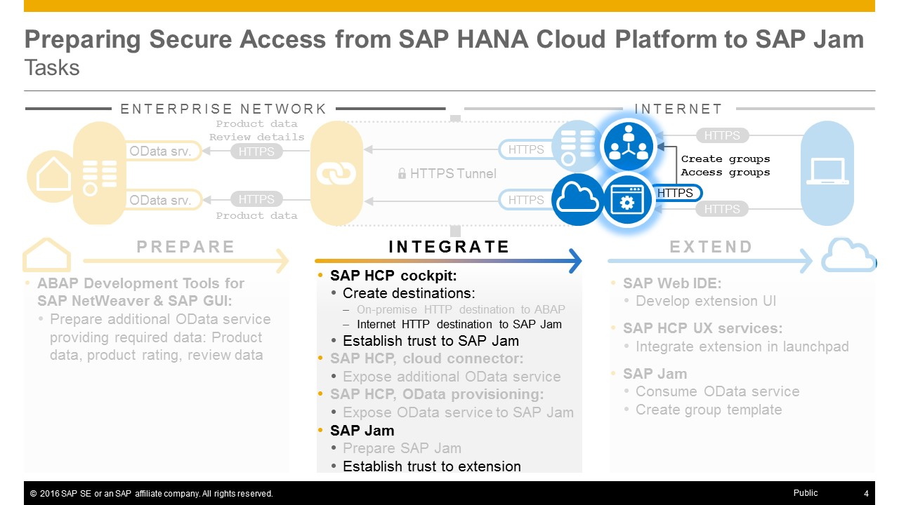

**Roles**

-   SAP HANA Cloud Platform
    -   HCP administrator, Jam administrator

**Systems, Tools, Services:**

-   HANA Cloud Platform (HCP)
    -   HCP Cockpit, Jam service and cockpit, Web IDE
-   Host OS
    -   browser (Chrome is recommended)

## Downloads

| Download Link                                                                                     | Description                                            | Context                                                                                    |
| :------------------------------------------------------------------------------------------------ | :----------------------------------------------------- | :----------------------------------------------------------------------------------------- |
| [**jam-internet-http.properties**](./imports/destinations/jam-internet-http.properties?raw=true) | Destination to connect from HCP to SAP Jam service API | [Section 3.3 Import and Configure HCP Destination](#import-and-configure-hcp-destination) |

## Step 1: Preparation Steps

1.  **Close all** your **incognito** browser sessions, as your second HCP user is not relevant in this unit.

    > **Note:** In the previous unit you explored how two users could collaborate with each other using the SAP Jam service on SAP HANA Cloud Platfrom. In the remaining weeks of this course you will continue to work only with your **first** HCP Trial user (_John_), who is the SAP Jam administrator and has the SAP Jam service enabled in his HCP Trial account. This first user will from now be refered to as _your HCP Trial user_ or just _Trial user_. Hanceforth, the second HCP Trial user (_Lisa_) is here not required anymore.

Continue from now on only with your first, the _HCP Trial user_.

[Top](#step-1-top)

## Step 2: Configure _SAP Jam Service_ to trust the _HCP IdP_ (1. Handshake)

In SAP HANA Cloud Platform, identity information is provided by identity providers (IdP), and not stored on SAP HANA Cloud Platform itself. You can have a different IdP for each account you own, and this is configurable using the Cockpit, please find [more information here](https://hcp.sap.com/capabilities/security/cloud-identity.html).

In this step you will configure the _SAP Jam Service_ in your SAP HANA Cloud Platform trial account, to trust the _HCP IdP_. We refer to this as the _first handshake_.

#### 2.1 Get Signing Certificate and Trust Metadata from HCP

1.  Open your HCP Account Overview page in Google Chrome, by clicking on the [**HCP bookmark**](../../week-1/unit-5#step-3-prepare-sap-hana-cloud-platform-trial-account).
2.  Click on the **Security > Trust** tab on left navigation area.
3.  Click on the **Edit** on _Trust Management_ page.

    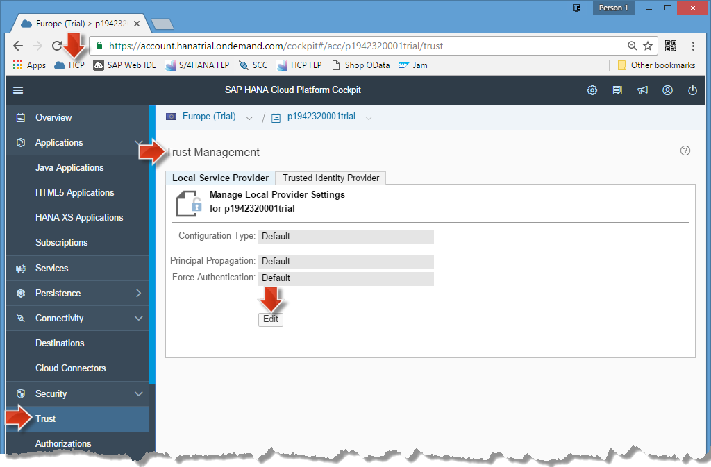

4.  Select **Custom** from _Configuration Type_ dropdown list.
5.  Click on the **Generate Key Pair** so that the _Signing Key and Certificate_ field both filled with a new value.

    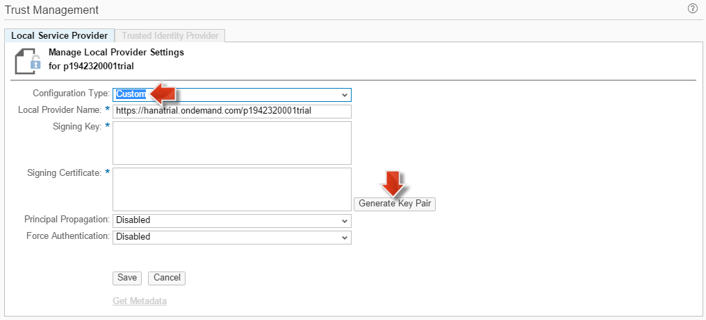

6.  **Select all** of the **Signing Certificate** text field and copy the selected certificate to your clipboard.

    > **Warning:** Please ensure that you **select and copy all text**, not missing a single character.

    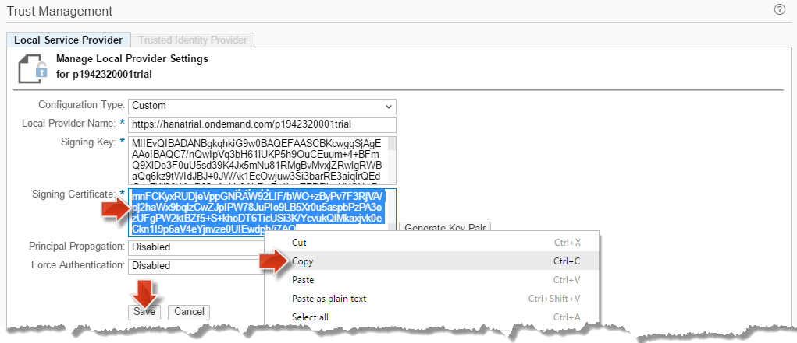

7.  Paste this _HCP Secret_ to a text editor, that you can refer to it later.

    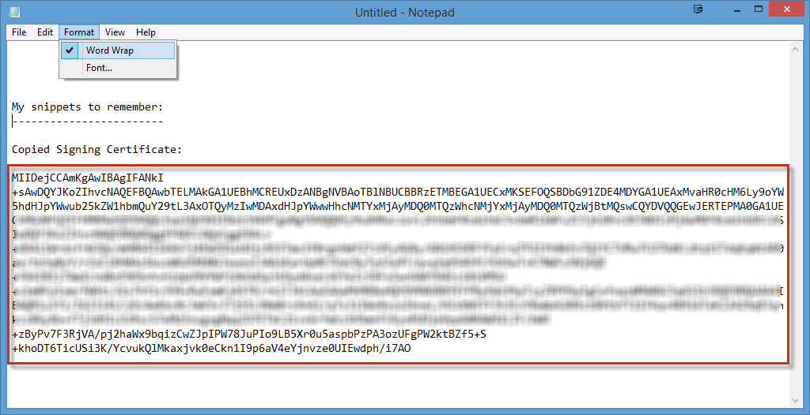

8.  Back in the HCP cockpit, **Save** the generated trust as custom configuration. As a result, the _Get Metadata_ link will be enabled.
9.  Confirm the opened _Alert_ and Click on the **OK**.

    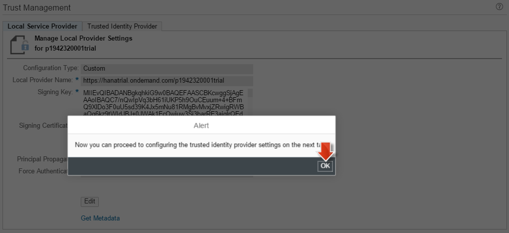

10. Click on the **Get Metadata** link to download the _Custom Identity Provider (IdP) Metadata_ as xml file.
11. **Remember** the **download location** of this file. It will be called something like **https---hanatrial[...].xml**.

    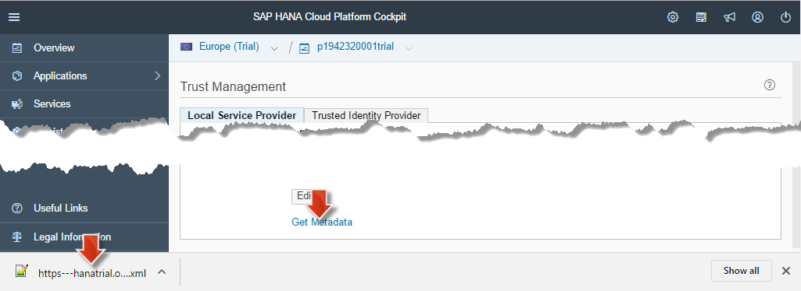

[Top](#step-2-1-top)

#### 2.2 Add HCP _Trust Secrets_ to SAP Jam Service

1.  Open a new browser tab.
2.  Click on you [**SAP Jam bookmark**](../unit-3/#create-jam-bookmark)
3.  If necessary, **log in** with your HCP Trial user to open the _Jam Service Cockpit_.
4.  Make sure that the **browser window width** is big enough so that you see the **all** menu bar items (Home, Groups, Company).

    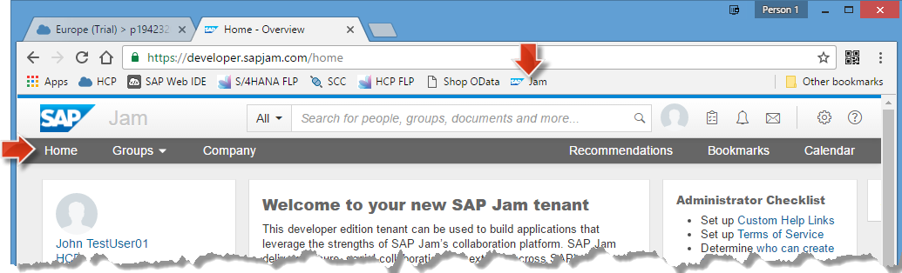

5.  On the opened _Jam Service Cockpit_:
6.  Click on the **Account settings** icon in the upper right corner of the opened the _Jam Service Cockpit_.
7.  Choose **Admin** to open the administration area of the _Jam Cockpit_, which opens an additional navigation area on the left side of the cockpit.

    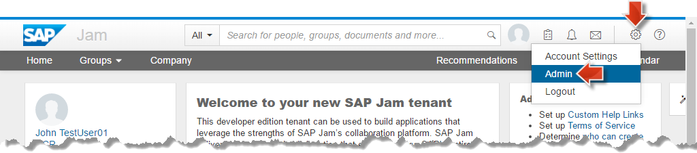

8.  On the opened **Jam Cockpit Administration** page:
9.  Click on the **+** icon of the **Integrations** tab on the left-side navigation area to open Integrations options
10. Click on the **SAML Trusted IDPs** tab to open the page where you can add Trusted IdPs of type SAML like the HCP IdP you copied the Secrets from before.

    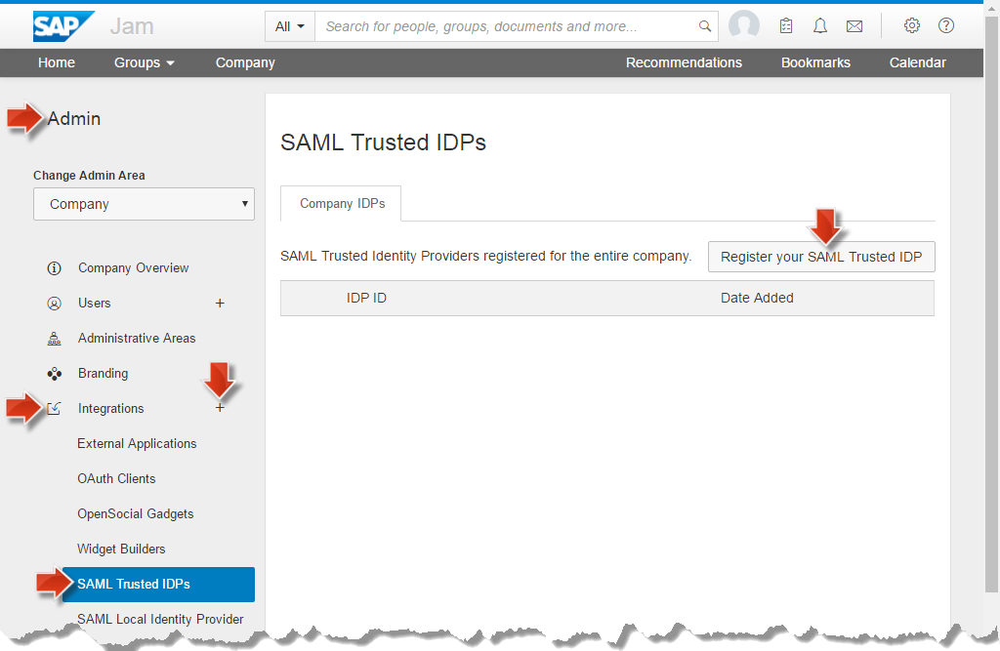

11. Click on the **Register your SAML Trusted IDP** button.
12. Click on the **Browser** button.

    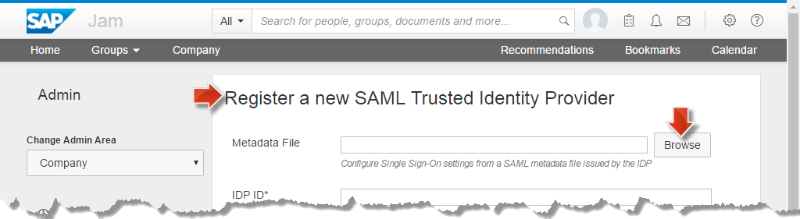

13. Locate and open the _Custom Identity Provider (IdP) Metadata_ xml file from your downloads folder to import the metadata of the HCP IdP.
14. Paste the **Signing Certificate** (the text which you copied to a text editor in the previous step), into the X509 Certificate (Base64) field.
15. Select the checkbox with the label **Enabled**.
16. Click on the **Register** button.

    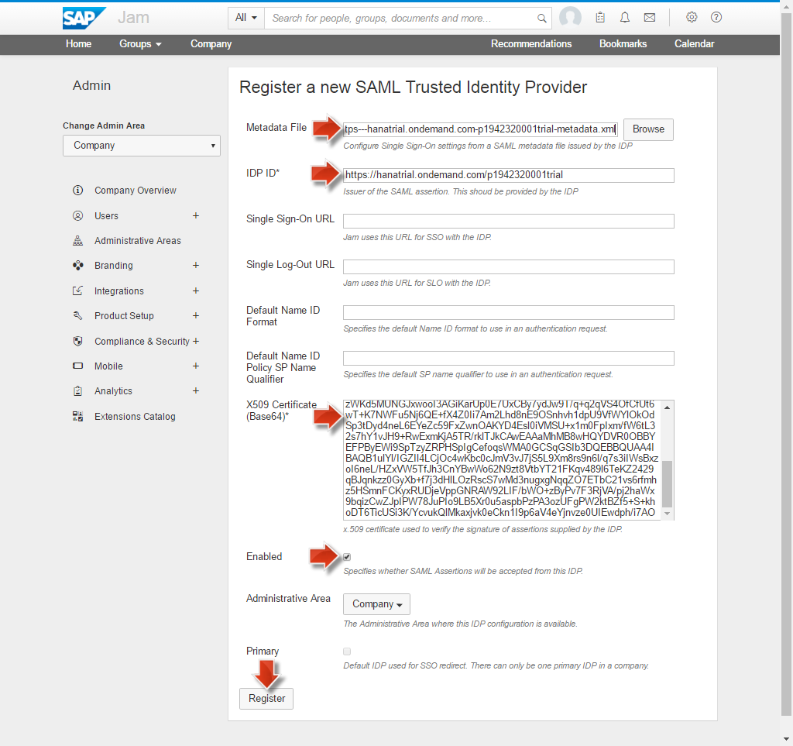

17. **Switch on** the slider of the newly created SAML Trusted IdP.

>   **Result:** The Identity Provider (IdP) from your HCP Trial account has been successfully registered as trusted SAML IdP in your SAP Jam service. This way users are automatically logged on in the SAP Jam service, once they have logged on to the SAP HANA Cloud Platform trial account.
>
>   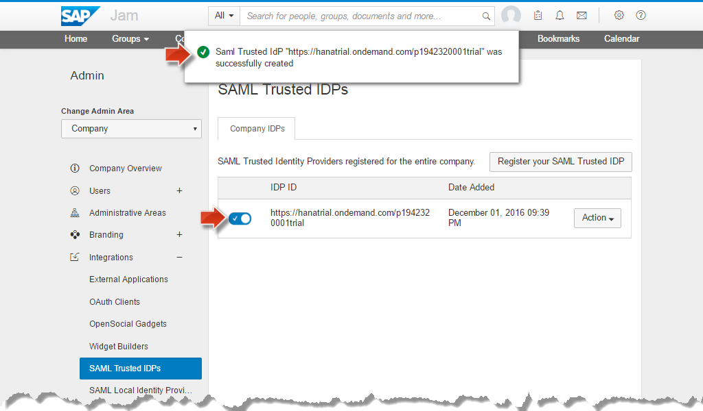

[Top](#step-2-2-top)

## Step 3: Configure _HCP_ to call _Jam Service_ via OAuth (2. Handshake)

[OAuth](https://en.wikipedia.org/wiki/OAuth) is an open standard for authorization, used as a way for users to authorize websites or applications to access their information on other websites but without giving them the passwords.

#### 3.1 Add OAuth Client in Jam Service

1.  On the still opened **Jam Cockpit Administration** page:

    > **Hint:** In case your browser was closed: Open the [**SAP Jam bookmark**](../../week-3/unit-3/#create-jam-bookmark) > Click on the **Account settings** icon > Choose **Admin**).

2.  Click on **Integrations** > **OAuth Clients** to open the _OAuth Clients_ page.
3.  Click on **Add OAuth Client** link to open the _Register a new OAuth Client_ form.

    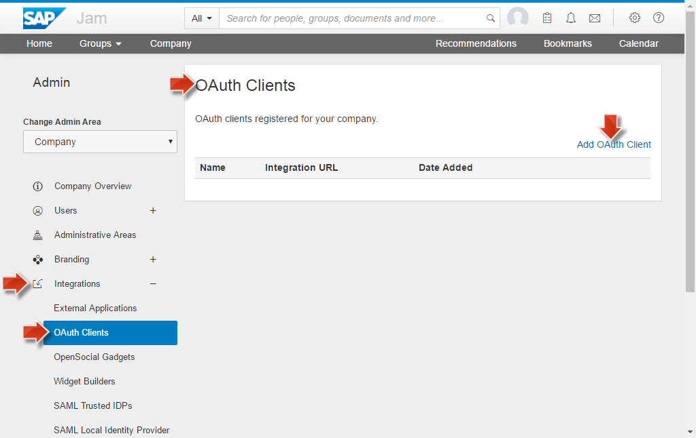

4.  On the opened **Register a new OAuth Client** page, enter the following settings:
    -   Name: **SAP HANA Cloud Platform**
    -   Integration URL: **https://hanatrial.ondemand.com**
    -   Keep the rest of the parameter on the form as they are.
5.  Click Save.

    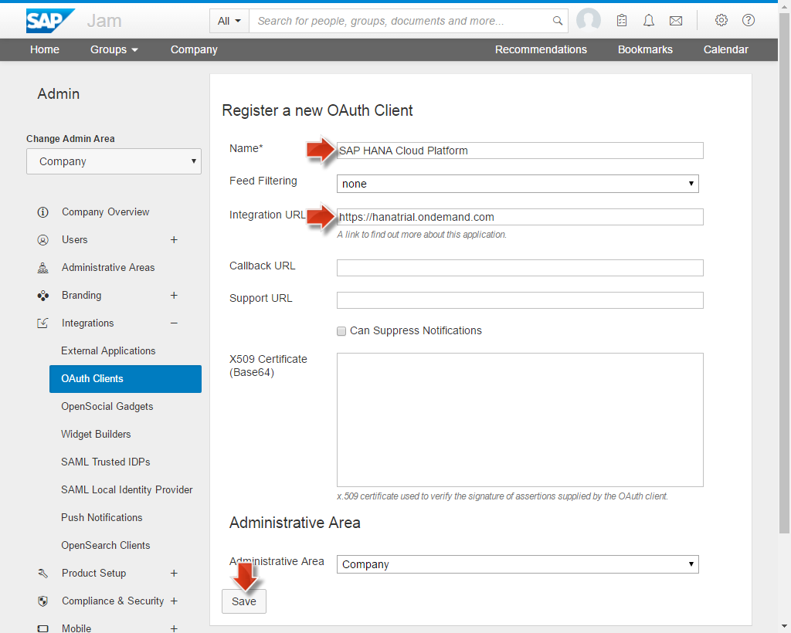

    > **Result:** You created an OAuth client from which you can get a secret.
    >
    > 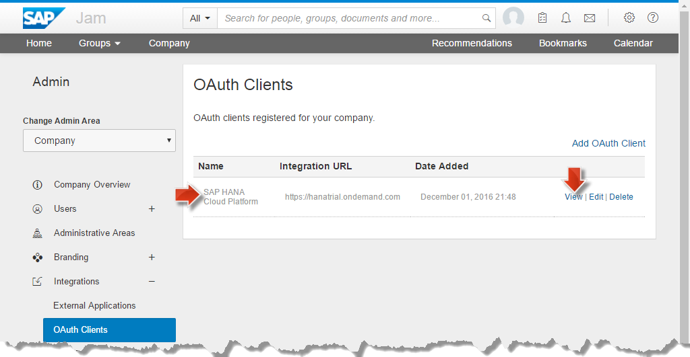

6.  Click on the **View** link at the end of the line list entry of the added OAuth Client, to open the OAuth Client details page.
7.  On the opened **OAuth Client - SAP HANA Cloud Platform** details page, select the **Key** value and **copy** it to your clipboard.

    > **Warning:** Make really sure that you **copy the entire key**, not missing a single character.

    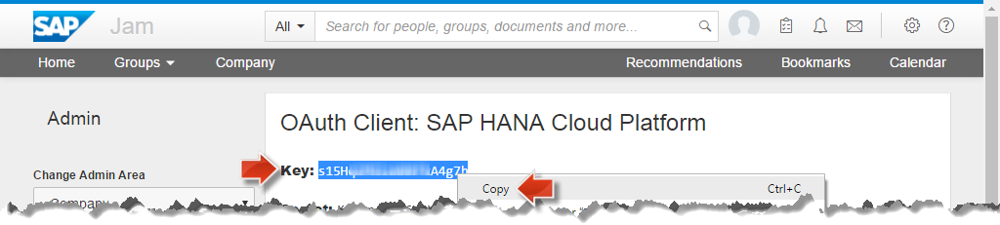

8.  Paste the key into any text editor, as you will need it soon in this unit.

    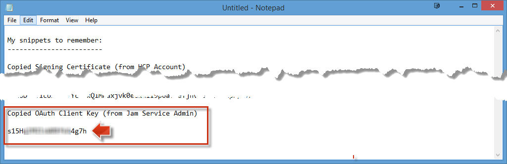

[Top](#step-3-1-top)

#### 3.2 Reset HCP Trust to _Default_

1.  Go to the **HCP Cockpit** account overview page (click on the **HCP bookmark**):
2.  Click on the **Security > Trust** tab on left navigation area.
3.  Click on the **Edit** on _Trust Management_ page.

    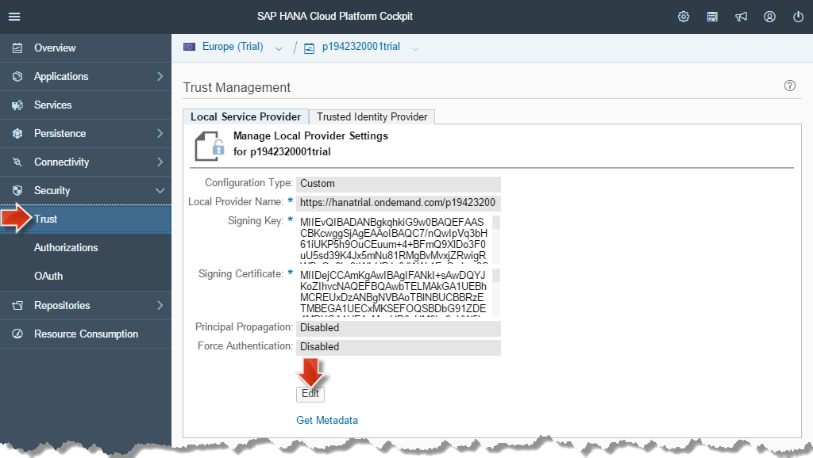

4.  Select **Default** from _Configuration Type_ dropdown list.
5.  Click on the **Save**.

    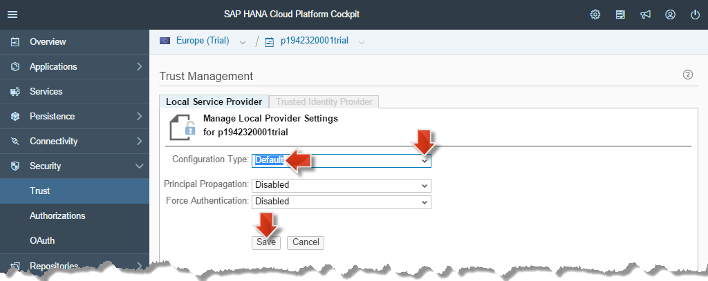

[Top](#step-3-2-top)

#### 3.3 Import and Configure HCP Destination

In this step you will make the SAP Jam OData API known to your SAP HANA Cloud Platform trial account. To do so, you will create a new destination in your account.

##### 3.3.1 Download pre-configured Destination

1.  Download the [jam-internet-http.properties](./imports/destinations/jam-internet-http.properties?raw=true) file (_right-click > save as..._), which contains the properties for your HCP destination.
2.  Choose **Save as...** to open an OS file browser.

    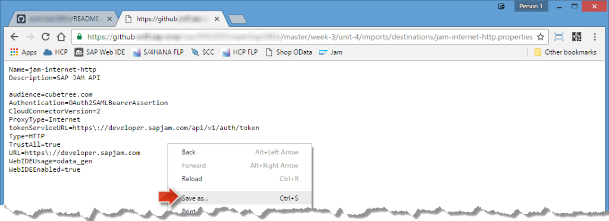

    > **Note:** The downloaded might be saved by your browser with an additional extension, i.e. **jam-internet-http.properties.txt**. This is ok and will work fine.

> **Result:** You have downloaded the file **jam-internet-http.properties**, which contains the properties for your HCP destination.

[Top](#step-3-3-1-top)

##### 3.3.2 Import Destination

1.  On the still opened **HCP Cockpit** page (or open a new browser tab and Click on the **HCP bookmark**):
2.  Click on the **Connectivity > Connectivity** tab on left navigation area.
3.  Click on the **Import Destination**

    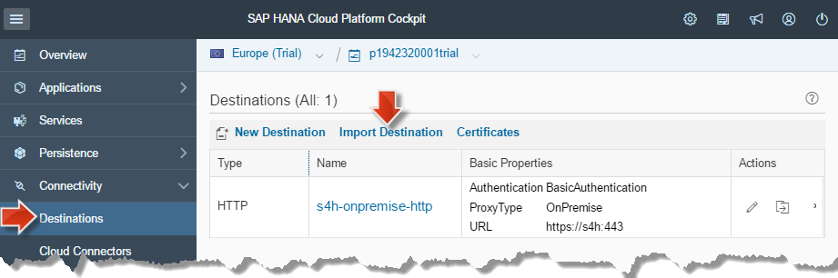

4.  Locate and open the **jam-internet-http.properties** file, so that its data will be opened in a destination configuration form in the HCP Cockpit page.

    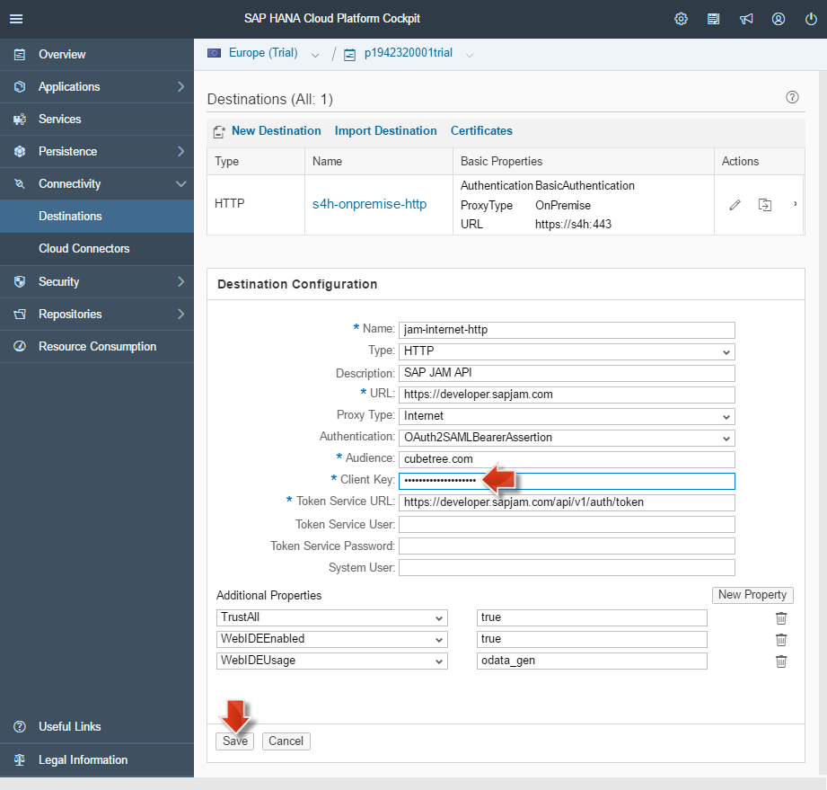

5.  Enter the **OAuth Key** from the previous step, that you pasted into a text editor, and paste it into the _Client Key_ field.
6.  Click on **Save**.

      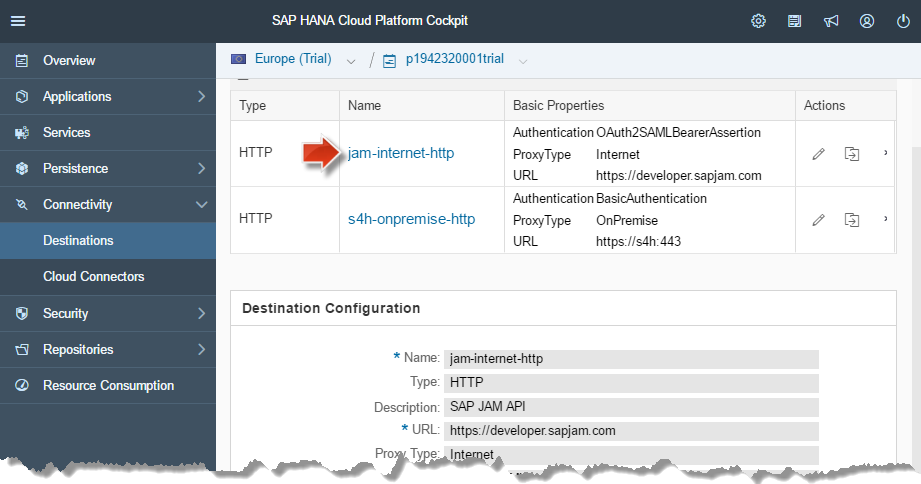

    > **Result:** The destination has been successfully saved into your HCP account and added as an additional line to the destinations table. By means of this destination a connection from your HCP account to the **SAP Jam service API** has been established. You are now able to call the RESTful API in order to create Jam groups or to invite users from any HCP application.

[Top](#step-3-3-2-top)

## Step 4: Access SAP Jam API from HCP (SAP Web IDE)

#### 4.1 Public Jam OData API

1.  Open a new browser tab and launch _Google search_ [https://www.google.com](https://www.google.com)
2.  Search for **SAP Jam OData Documentation** to see some results like this:

    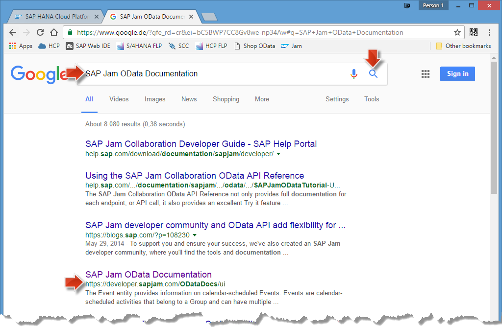

3.  Find the search result with URL [https://developer.sapjam.com/ODataDocs/ui](https://developer.sapjam.com/ODataDocs/ui) and **open it**.
4.  On the opened **SAP Jam ODataDocs** page you find all available public APIs of an enabled SAP Jam service.
5.  Select **[Get/$metadata API]**
6.  Click on **Try** button

    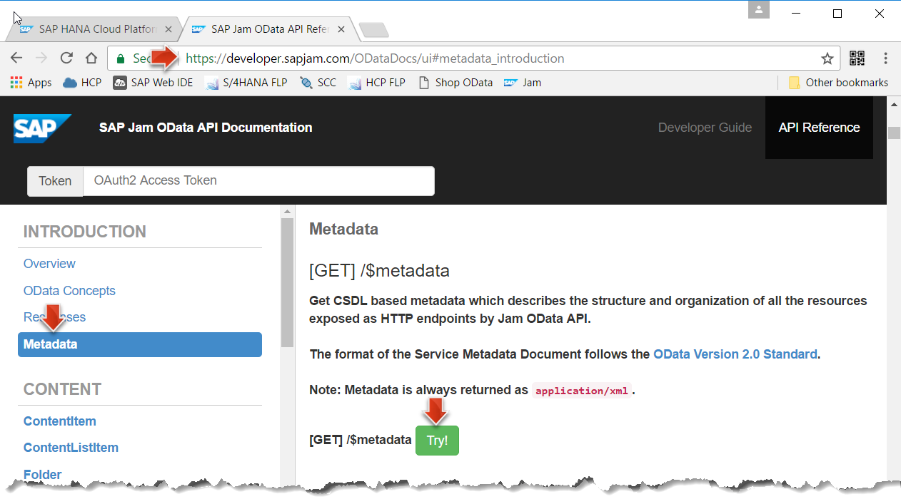

7.  As a result, the _REQUEST URL_ of the metadata call of the SAP Jam OData Service is shown as well as the response body. The response shows the available OData entity sets of _SAP Jam OData_ services, like **\\<EntityType Name="Group">** and many others.

    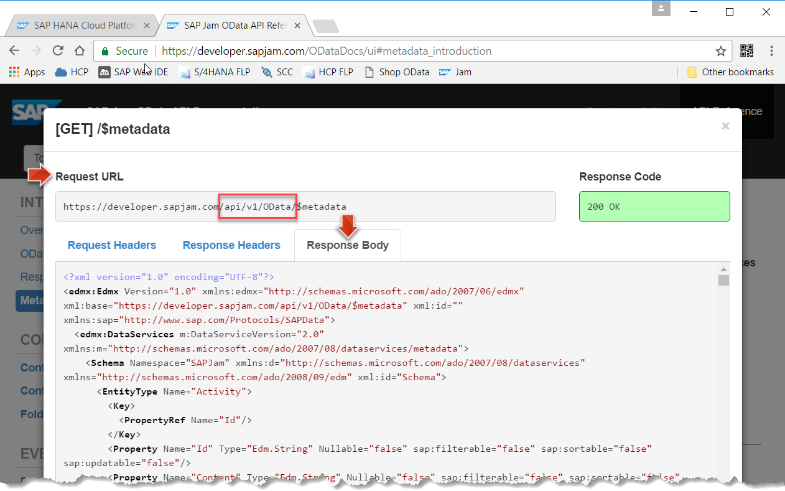

8.  Copy the **api/v1/OData** part from REQUEST URL _https://developer.sapjam.com/api/v1/OData/$metadata_ to your clipboard.

    > **Note:** This string is used in the following section 4.2 where you have to paste _api/v1/OData_ as relative path into the _Web IDE_ connection data step.

[Top](#step-4-1-top)

#### 4.2 Create Web IDE Test Project with Jam OData Connectivity

1.  Open a new browser tab.
2.  Click on **SAP Web IDE bookmark** (as created in [section 4.2](../../week-1/unit-5/#create-sap-web-ide-bookmark) of unit 5 in week 1) and **log in** with your Trial user if necessary.
3.  Click on **Development** tab of the panel on the right side.

    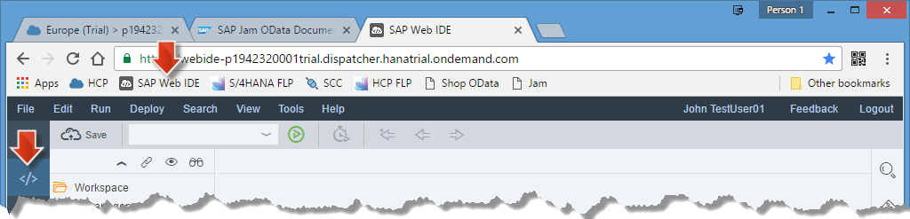

4.  On opened **Web IDE > Development** tool page, click on **File > New > Project from Template** in the menu to open the _project creation wizard_.

    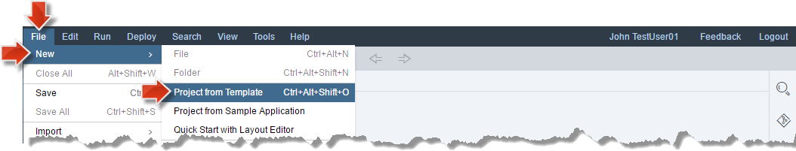

5.  On _project creation_ **wizard page 1**, select **List Report Application** as template from the opened project creation wizard and click on **Next**.

    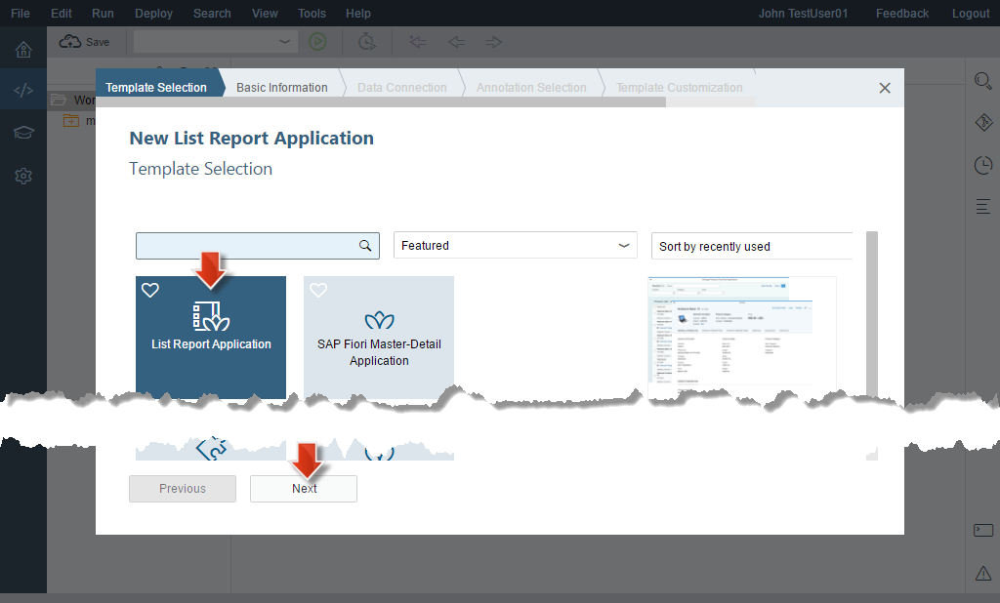

6.  On _project creation_ **wizard page 2**, enter **Jam** both for _Project Name_ and _Title_ entry fields and click on **Next**.

    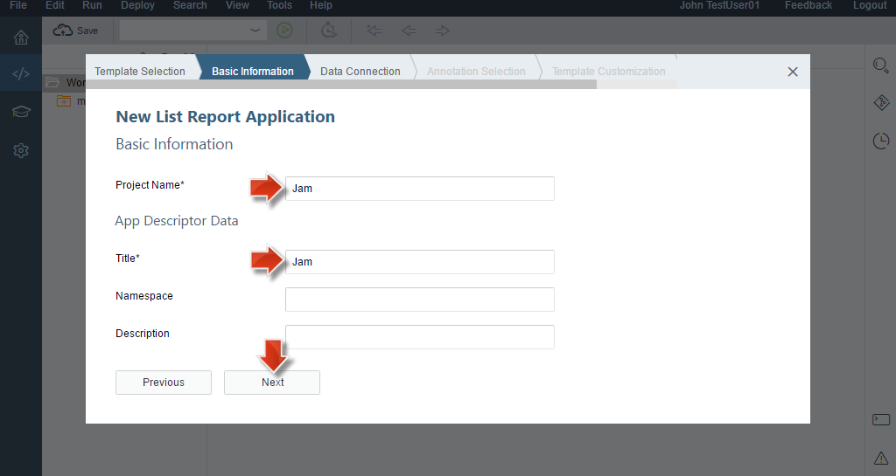

7.  On _project creation_ **wizard page 3**:

    -   Service: **Service URL**
    -   Choose **SAP JAM API** as system to connect (which is destination name of the SAP Jam OData API in your HCP account).
    -   Paste the path **api/v1/OData** from your clipboard to the service URL entry field.
    -   Click on the **Test** button.

    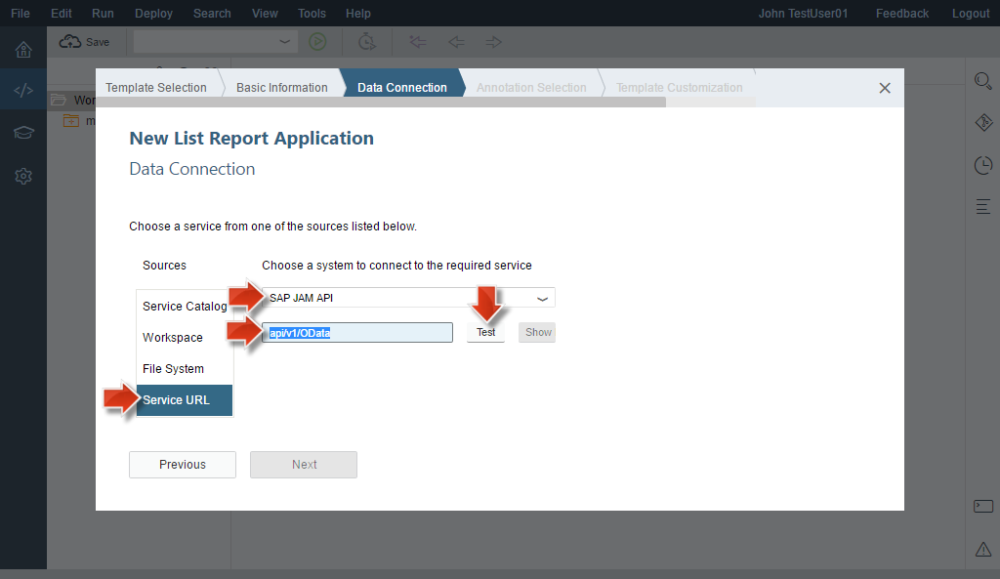

    > **Result:** Inside the service box you can open the root node to display all entity sets (e.g. External Objects, Folders, Groups, etc.) which are exposed by the Jam service.
    >
    > 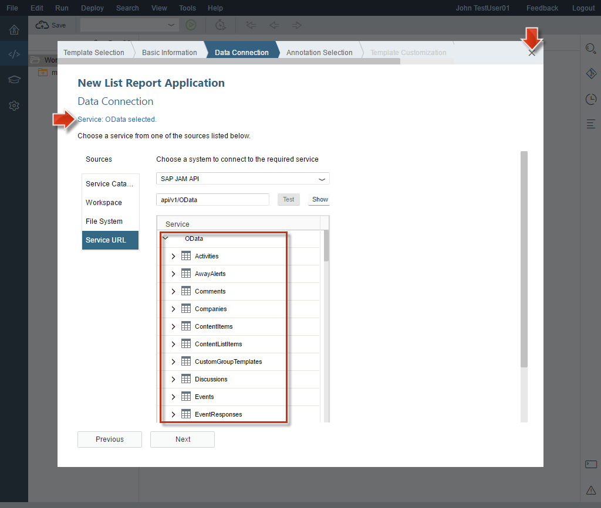

    > **Hint:** If you do not get the expected OData result but any error message then test if one of the following steps helps to solve the problem.
    >
    > -   **1)** **Clean up** the Web IDE as described in the [Troubleshooting Guide: SAP JAM - TRBL 2](../../troubleshooting/troubleshooting-jam/#trbl-2-web-ide-clean-up) and after that try again accessing the SAP Jam OData API.
    > -   **2)** Check if trust **SAML trusted IdP ID** is the same on both sides: HCP and SAP Jam service. This is described in the [Troubleshooting Guide: SAP JAM - TRBL 3](../../troubleshooting/troubleshooting-jam/#trbl-3-check-saml-trusted-idp-id).
    > -   **3)** Check that the **backend system is still running** and is accessible. To verify this, execute the steps in [week 3, unit 2, Step 1: Preparation Steps](../../week-3/unit-2/#step-1-preparation-steps).

8.  Now that you have successfully tested the access to the SAP Jam OData APPI running in your own SAP HANA Cloud Platform trial account, you may cancel the project creation wizard and **close the Web IDE** browser tab.

    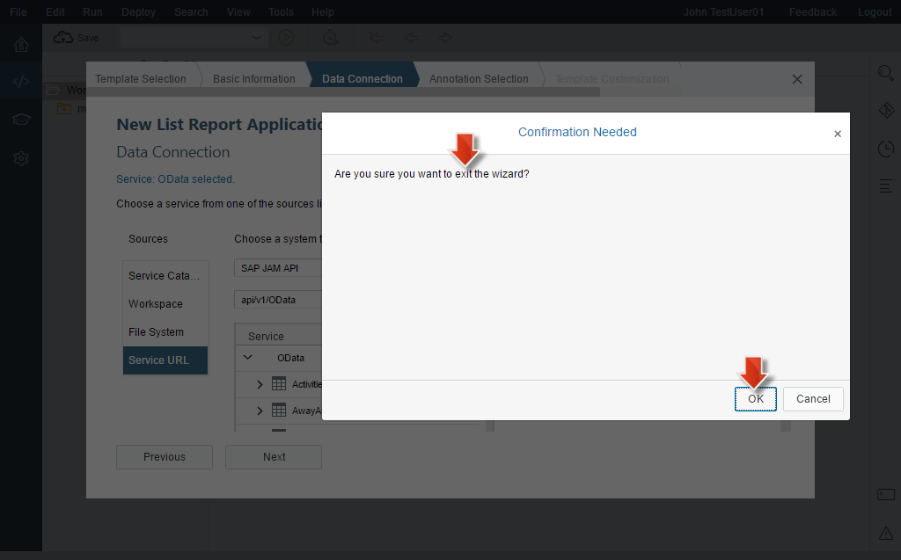

#### **Unit Results:**

> -   The successfully tested OData service confirms that the programmatic access from an HCP application (here from the _SAP Web IDE_) to the SAP Jam service via the OAuth destination has been established, and that secure access is functioning.
> -   Having this in place, developers could now start developing a collaborative extension which is added to an HCP application, so that it may access and control SAP Jam features. You will see this in the next two units of this week.

[Top](#step-4-2-top)

[**&lt; Previous** Unit 3](../unit-3/) | [**Up ^** Week 3](../) | [**Next >** Unit 5](../unit-5/)
