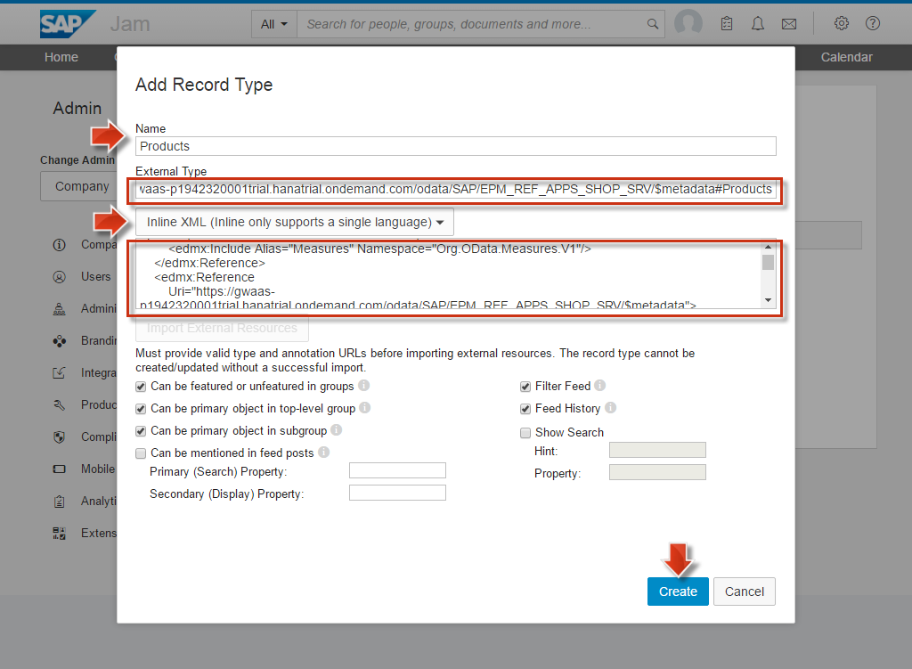
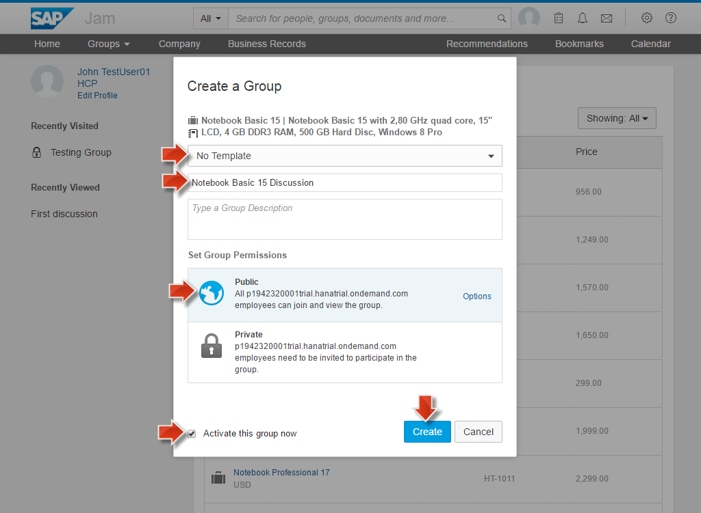
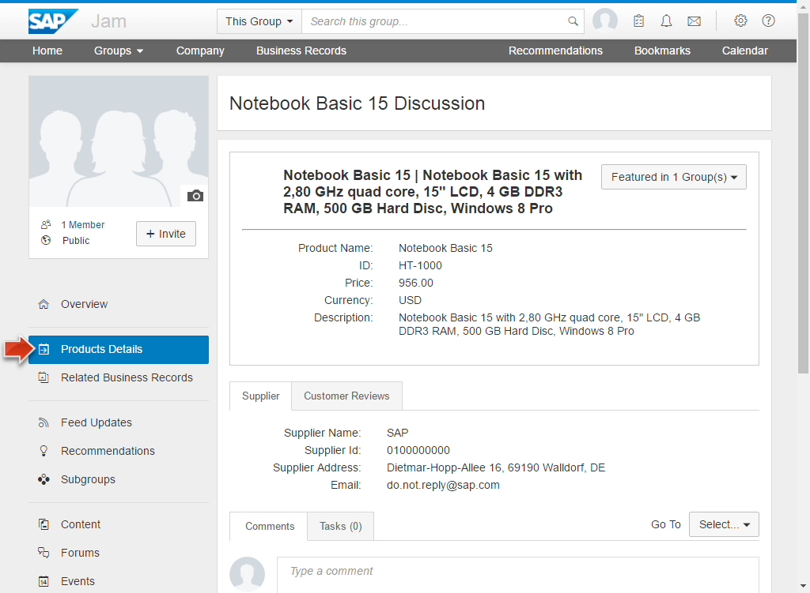
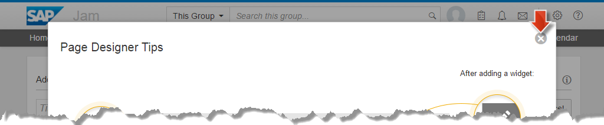
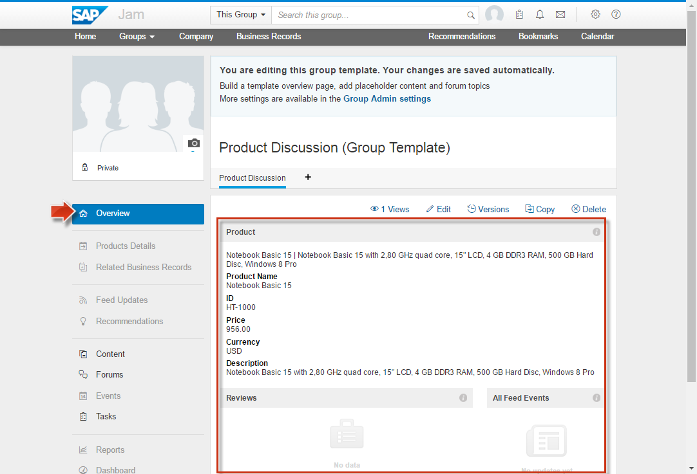

<a name="step-1-1-1-top"/><a name="step-1-1-2-top"/><a name="step-1-2-top"/><a name="step-1-3-top"/><a name="step-1-4-top"/>
<a name="step-2-1-top"/><a name="step-2-2-1-top"/><a name="step-2-2-2-top"/><a name="step-2-3-top"/>
<a name="step-3-1-top"/><a name="step-3-2-1-top"/><a name="step-3-2-2-top"/><a name="step-3-2-3-top"/><a name="step-3-3-top"/>





**Overview:**

**Roles**

-   SAP HANA Cloud Platform
    -   HCP administrator
    -   Jam administrator

**Systems, Tools, Services:**

-   HANA Cloud Platform (HCP)
    -   SAP HANA Cloud Platform Cockpit
    -   SAP Jam Service Cockpit
    -   SAP Web IDE
-   Host OS
    -   Google Chrome

## Downloads

| Download Link                                                | Description                                                  | Context                                                        |
| :----------------------------------------------------------- | :----------------------------------------------------------- | :------------------------------------------------------------- |
| [**annotation.xml**](./imports/jam/annotation.xml?raw=true) | annotation.xml describing the UI formatting of business data | [Section 1.3 Prepare Annotation XML](#prepare-annotation-xml) |

## Step 1: Preparation Steps

Make sure that you have executed the following preparation steps to be well prepared for the unit.

#### 1.1 Test _Connection Chain_ via _Shop_ OData Service

The _Shop_ OData Service is a good test to verify that the entire connection chain from your local **NetWeaver ABAP Back-End (1)**, via the **Cloud Connector (2)**, via **OData Provisioning HCP service (3)** to an **HCP Application in the Internet (4)** works. Execute the following steps to test it.

> **Warning:** A successful connection chain test is mandatory to continue developing the _collaborative extension_: Only if the _Shop_ OData Service retrieves the requested **Products** you can be sure that all connected components (1), (2), (3) and (4) are up and running fine, i.e. the _Back-End to Internet_ connection chain works.

##### 1.1.1 Get _Products_ from _Shop_ OData Service

1.  Open a new browser tab.
2.  Open your [**Shop OData**](../../week-3/unit-2/#create-shop-odata-bookmark) bookmark and log on with your HCP Trial P-User, if required.

    > **Warning:** If there is an error output instead of the expected service collections, then first execute below [section 1.1.2](#restart-netweaver-abap-and-cloud-connector) and then try the [section 1.1.1](#get-products-from-shop-odata-service) again.

    

    > **Result:** Service collections like _Reviews_, _Products_, etc. are displayed as a result in your browser.
    >
    > **Note:** This displayed OData service output is not yet the business data itself. It is the so called _Metadata Document_ of the OData service, telling just what kind of business data (_Products_, _Reviews_, etc.) is potentially available via the OData service. Sometimes this OData metadata document is cached, so you can't be sure that the _Back-end to Internet_ connection chain is working fine, just by checking the metadata. So in order to make sure that everything is in order, you need to modify the OData service URL to retrieve _actual_ business data from the backend. In this case we will retrieve some _Product_ entities.

3.  Modify the _Shop OData_ URL to get _Product_ entities from the service:

    -   Remove the **;v=1** from the end of the URL
    -   Add the **/Products** at the end of the URL
    -   Click **RETURN** key to launch the URL

    > **Warning:** If there is an error message instead of the expected service collections, then execute the following [section 1.1.2](#restart-netweaver-abap-and-cloud-connector) first, and then try to execute [section 1.1.1](#get-products-from-shop-odata-service) again.

    

    > **Result:** All available **Product entities** from the back-end are displayed.

If you retrieve the product entities in the browser output, then you successfully verified that your _Back-End to Internet_ connection chain is working fine.

[Top](#step-1-1-1-top)

##### 1.1.2 Restart Back-End System and Cloud Connector

Only if your _Back-End to Internet_ connection chain is **not working**, execute the following steps to restart the Back-End components. Then you should execute the above [section 1.1.1](#get-products-from-shop-odata-service) again, in order to verify the successful connectivity.

> **Note:** Execute the following steps **exactly and step by step**. Always make sure that each executed commands has finished before you jump to the next command step.

1.  **Restart** _local NetWeaver ABAP_: Execute the following VM _Konsole_ commands (see [week 1, unit 6, section 6.4](../../week-1/unit-6/#shutdown-vm-with-netweaver-as-abap) and [week 1, unit 6, section 6.5](../../week-1/unit-6/#starting-vm-with-netweaver-as-abap).

    -   **su -l npladm**.
    -   **stopsap ALL**.
    -   **sudo ifconfig**, find then **inet addr:10.0.2.15**. If not there do also **sudo rcnetwork restart**.
    -   **startsap ALL** and wait a bit.
    -   **sapcontrol -nr 00 -function GetProcessList** until all four process status are **GREEN**.

2.  **Restart** _SAP HANA Cloud Connector_:  Execute the following VM _Konsole_ commands (for details see [week 3, unit 1, section 1.2](../../week-3/unit-1/#cloud-connector-is-up-and-running))

    -   **sudo service scc_daemon stop**
    -   **sudo service scc_daemon start**
    -   **sudo service scc_daemon status** shows **Active: active**

3.  **Connection Check** in _Cloud Connector_ administration tool:

    -   Open a new browser tab.
    -   Click on **SCC bookmark** to open the _SAP Cloud Connector (SCC)_ administration tool.
    -   **Log in** with your SCC administrator password.
    -   Click **Cloud To On-Premise** tab.
    -   Make sure that the **ACCESS CONTROL** tab on the opened details page is selected.
    -   Click on **first Actions icon** in section *Mapping Virtual To Internal System* to check availability of internal host.
    -   Confirm that the *Check Result* value is changed to **Reachable**.

    

> **Result:** After clicking the first _Actions_ icon, the _Check Result_ entry is changing after a short time to **Reachable**. This means the connection from the SAP HANA Cloud Connector to the Back-End system works.

[Top](#step-1-1-2-top)

#### 1.2 Prepare _Shop_ OData Service URL

In some of the below steps you will make use of the **Shop OData service URL** which we will prepare already now:

1.  Open a new browser tab.
2.  Open your [**Shop OData**](../../week-3/unit-2/#create-shop-odata-bookmark) bookmark.
3.  Copy the URL from the Google Chrome address field to your clipboard

    

4.  Paste this **URL** to some text editor from where it can be used then later. We call it **_Shop OData URL_**.

    

5.  Remove the last part **;v=1** from the pasted **URL**.

    

> **Result:** You have prepared the **_Shop OData URL_** for later use in this exercise.

[Top](#step-1-2-top)

#### 1.3 Prepare Annotation XML

In some of the below steps you will need an _annotation.xml_ which we will prepare now.

> **Info:** The annotation.xml file defines how the _Products_ and _Reviews_ business data is **displayed** later in the Jam service. We will not explain the description language how business content is displayed in SAP Jam. You can find more information on the topic on   [help.sap.com](http://help.sap.com/download/documentation/sapjam/developer/index.html#dd85029a63004b0f94773b25980e3261.html).

1.  **Right-click** on the following link [annotation.xml](./imports/jam/annotation.xml?raw=true) which points to the prepared annotation.xml file which contains the pre-defined annotation xml content.
2.  Choose **Open link in new tab**
3.  The _annotation.xml_ file content opens in a new browser tab.
4.  On the opened browser tab, right-click and choose **Save As...** to save to your local file system.
5.  Open the saved XML file in any text editor.
6.  Find the string **{ODATA PROVISIONING URL}**

    

7.  **Replace** the found string with the **Shop OData service URL** you prepared in [section 1.2](#prepare-shop-odata-service-url) above.

    

8.  Save the _annotation.xml_ file again.

> **Result:** You have prepared the **annotation.xml** for later use in [section 2.2.1](#add-record-type-products-to-external-application) and [2.2.2](#add-record-type-reviews-to-external-application).

[Top](#step-1-3-top)

#### 1.4 Open _SAP Jam Service Cockpit_

_SAP Jam Service Cockpit_ is the main tool in which you will work in this unit.

1.  Open a new browser tab.
2.  Click on [**SAP Jam**](../../week-3/unit-3/#create-jam-bookmark) bookmark.
3.  **Log in** with your HCP trial user to open the _SAP Jam Service Cockpit_.
4.  Make sure that the **browser window width** is big enough so that you see the menu bar items **Home, Groups, Company**.

    

5.  Keep this browser tab open.

[Top](#step-1-4-top)

## Step 2: Consuming Back-End API in SAP Jam

#### 2.1 Create new _External Application_

1.  On the opened _SAP Jam Service Cockpit_:
2.  Click **Account settings** icon in the upper right corner of the opened the _SAP Jam Service Cockpit_.
3.  Choose **Admin** to open the administration area of the _SAP Jam Cockpit_, which opens an additional navigation area on the left side.

    

4.  On the opened **SAP Jam Cockpit Administration** page:

    -   Click **+** icon of the **Integrations** tab on the left-side navigation area to open Integrations options
    -   Click **External Applications** tab to open the page where you can add an _External Application_ which accesses back-end data via our back-end OData API.

    

5.  On the opened **External Applications** details page:

    -   Click **Add Applications** button.
    -   Choose **SAP HANA Cloud Platform** from the dropdown list to open an _External Application_ form.

    

6.  On the opened **External Applications** form page:

    -   _Name:_ **EpmRefAppsShopSrv**

    > **Warning:** You need to use **exactly** this name, otherwise the later provided extension code will not work correctly.

    -   _User Name:_ **{Your HCP Trial p-User}**
    -   _Password:_ **{Your p-User password}**
    -   **Keep the rest** of the settings on the form as they are.
    -   Click **Save**.

    

> **Result:** In your SAP Jam tenant, you now created a new _External Application_ with the name _EpmRefAppsShopSrv_ of the application type _SAP HANA Cloud Platform_.
>
> 

[Top](#step-2-1-top)

#### 2.2 Add _Record Types_ to External Application

##### 2.2.1 Add _Record Type_ **Products** to External Application

1.  On the newly created _EpmRefAppsShopSrv_ external application, click on the **Actions** button.
2.  Choose **Manage Record Types**.

    

3.  Click **Add Record Type**.

    

4.  Fill out the _Record Type_ form **exactly** as follows:

    -   _Name:_ **Products**
    -   _External Type:_ Paste the prepared **Shop OData URL** (from section 1.2) and add **/$metadata#Products** at the end.

    > **Note:** With our example p-User p1942320001 the External Type value looks like **https://gwaas-p1942320001trial.hanatrial.ondemand.com/odata/SAP/EPM_REF_APPS_SHOP_SRV/$metadata#Products**.

5.  _Annotation URL:_

    -   Click on **Annotation URL** and choose the **Inline XML** option, so that a text area underneath the button is displayed.
    -   Paste the contents of the prepared **annotation.xml** (see [section 1.3](#prepare-annotation-xml)) into the text area.

    

6.  Click on **Create**.
7.  An **Import External Resources: Products** success message should now be displayed, which you should confirm by clicking on the **Done** button.

    

> **Result:** The new record type **Products** has been added to the Record Types of the external application _EpmRefAppsShopSrv_.
>
> 

[Top](#step-2-2-1-top)

##### 2.2.2 Add _Record Type_ **Reviews** to External Application

In the same way you added the _Products_ record type to the _EpmRefAppsShopSrv_ _External Application_ you will now add a second **Reviews** record type.

1.  On the **Manage EpmRefAppsShopSrv Record Types** page:
2.  Click **Add Record Type** button.

    

3.  Fill out the _Record Type_ form **exactly** as follows:

    -   _Name:_ **Reviews**
    -   _External Type:_ Paste the prepared **Shop OData URL** (from section 1.2) and add **/$metadata#Reviews** at the end.

    > **Note:** With our example p-User p1942320001 the External Type value looks like **https://gwaas-p1942320001trial.hanatrial.ondemand.com/odata/SAP/EPM_REF_APPS_SHOP_SRV/$metadata#Reviews**.

4.  _Annotation URL:_

    -   Click on **Annotation URL** and choose the **Inline XML** option, so that a text area underneath the button is displayed.
    -   Paste the contents of the prepared **annotation.xml** (see [section 1.3](#prepare-annotation-xml)) into the text area.

    

5. Click **Create**.

6.  An **Import External Resources: Reviews** success message should now be displayed, which you should confirm by clicking on the **Done** button.

    

> **Result:** The new record type **Reviews** has been added to the list of Record Types of the external application _EpmRefAppsShopSrv_.
>
> 

[Top](#step-2-2-2-top)

#### 2.3 Display _Business Records_ Data

1.  In the **SAP Jam Service Cockpit**:
2.  Click **Business Records** in the main menu bar to open the _Business Records_.

    

3.  Click on the **EpmRefAppsShopSrv** link, to navigate into this external application, where the two record types _Products_ and _Reviews_ are listed.

    

4.  Click on the **Products** link, so that all product information that is retrieved from the _Shop OData service_ is displayed in a table. The format of this table is defined as specified in the _annotation.xml_ file.

    

5.  Click on any product, e.g. **Notebook Basic 15** to display even more information about the selected product, e.g. review data.

    

> **Result:** The displayed product information comes directly from your locally installed SAP Netweaver ABAP back-end system (via SAP HANA Cloud Connector and the SAP HCP OData provisioning service). This demonstrates that your SAP Jam instance has now access to the backend and can display business content (here: _Products_ and _Reviews_) from said system.
>
> 

[Top](#step-2-3-top)

## Step 3: Create SAP Jam Entities based on _Business Records_ Data

#### 3.1 Create a _Jam Group_ based on a Product

1.  Navigate back to the table of all products. (Main menu: **Business Records > EpmRefAppsShopSrv > Products**).
2.  Hover your mouse pointer over the first product **Notebook Basic 15**, to see a context popup with a _Create Group_ button.
3.  Click on the **Create Group** button to open a _Create a Group_ dialog.

    

4.  On the opened **Create a Group** fill out the form **exactly** as follows:

    -   _Template:_ **No Template**.
    -   _Name:_ **Notebook Basic 15 Discussion**.
    -   _Permission_: **Public**.
    -   _Activate this group now_: Checkbox is **Selected**.
    -   Click **Create**.

    

5.  The newly created group opens.

    

6.  Click on the **Product Details** tab in left-hand navigation area, to navigate back to the product details.

    

[Top](#step-3-1-top)

#### 3.2 Create a _SAP Jam Group Template_ based on a Product

##### 3.2.1 Create a new _Group Template_

1.  Click on the **Account settings** icon in the upper right corner of the _SAP Jam Service Cockpit_.
2.  Choose **Admin** to open the administration area of the _SAP Jam Cockpit_, which opens an additional navigation area on the left side.

    

3.  Click on the **+** icon of the **Product Setup** tab in the left navigation area to open the _Product Setup_.
4.  Click on the  **Group Templates** tab.
5.  Click on **Create a template** to open the _Create a template_ form.

    

6.  Fill out the **Create a template** form **exactly** as follows:

    -   _Name:_ **Product Discussion**
    -   _Business Records:_ Select **Products** from dropdown list
    -   Keep the rest of the settings as they are.
    -   Click **Create** to save the new template.

    

    > **Result:** The newly created template is now displayed and you can now start editing this template.
    > 

[Top](#step-3-2-1-top)

##### 3.2.2 Design the newly created _Group Template_

1.  Click on the **Create An Overview Page** button on the before opened new template.
2.  On opened **Add New Page** dialog:

    -   Keep the pre-selected first layout page
    -   Click **OK**.

    

3.  Close the (helpful but not yet needed) **Designer Tips** overlay to open the _Add an Overview Page_, where you design an overview page for the template by adding so called _widgets_.

    

4.  On the opened **Add an Overview Page** page:

    -   Enter **Product Discussion** into the title field.
    -   Click on the **Add Widget** button of the upper area to open an overlay window where you can specify the _type of widget_ you want to add.

    

5.  On the opened overlay window:

    -   Hover over the icons and find the **Business Record** widget - one of the two _suitcase_ icons.
    -   Click on the **Business Record** widget icon to open the _Business Record Widget_.

    

6.  In the opened _Business Record Widget_ dialog:

    -   Enter **Product** as _widget title_.
    -   Keep all _Product Properties_ selected.
    -   Click **OK**.

        

    > **Result:** The product widget of type _Business Record_ is displayed in the area where the _Add Widget_ button was placed before.

      

    Similar to how you added the first _Business Record_ to the group template, you will add now two other widgets in the corresponding layout areas of the overview page designer.

7.  Click the **Add Widget** button in the lower left area of the overview page designer.

    

8.  On the opened overlay window:

    -   Hover over the icons and find the **Business Record List** widget - the other _suitcase_ icon.
    -   Click on the **Business Record List** widget icon to open the _Business Record List_ dialog.

    

9.  On the opened _Business Record List_ dialog:

    -   Select **Reviews** from first dropdown list.
    -   Enter **Reviews** as _widget title_.
    -   _Show_: Select **Related** from dropdown list.
    -   _Sort by_: Select **Rating** from dropdown list.
    -   Maximum number of items: **25**
    -   Keep other settings to their defaultsProperties selected.
    -   Click **OK**.

    

    > **Result:** The Reviews widget of type _Business Record List_ is displayed in the lower left area of the overview page designer.
    >
    > 

10. Click the **Add Widget** button in the lower right area of the overview page designer.

    

11. On the opened overlay window:

    -   Hover over the icons and find the **Feed** widget - the newspaper icon.
    -   Click on the **Feed** widget icon to open the _Feed_ dialog.

    

12. On the opened _Feed_ dialog:

    -   **Keep** all the **defaults**.
    -   Click **OK**.

    

    > **Result:** The _All Feed Events_ widget of type _Feed_ is displayed in the lower right area of the overview page designer.
    >
    > 

13. Click **Publish** to save the new template design.

    

14. Confirm the opened dialog again with **Publish**.

    

    > **Result:** The newly designed overview page of the _Product Discussion_ group template is displayed.
    >
    > 

[Top](#step-3-2-2-top)

##### 3.2.3 Activate the Designed _Group Template_

1.  On the opened _SAP Jam Service Cockpit_:

    -   Click **Account settings** icon in the upper right corner
    -   Choose **Admin** to open the administration area, which is an additional navigation area on the left side.

    

2.  On the opened **Jam Cockpit Administration** page:

    -   Click on the **+** icon of the **Product Setup** entry, on the left to expand _Product Setup_ options.
    -   Click on the **Group Templates** entry. On this page you can make templates available for the creation of SAP Jam Groups.

    

3.  On the opened **Group Template** details page:

    -   **Scroll down** to the bottom of the templates list to find your **Product Discussion** template. This template includes the _External Application_ which accesses back-end data via the back-end OData API.
    -   **Switch on** the slider, so that this new template is enabled. The template is now visible as template in SAP Jam group creation dialogs.

    

[Top](#step-3-2-3-top)

#### 3.3 Create a new Group based on the _Product Discussion_ Template

1.  Click on **Business Records** in the main menu bar of the _SAP Jam Service Cockpit_ to open the _Business Records_ page.

    

2.  Click on the _EpmRefAppsShopSrv_ link to navigate into the external application details page, where the two types of records, _Products_ and _Reviews_ are listed.

    

3.  Click on the _Products_ link, so that all product information (as retrieved via the _Shop OData service_) is displayed in a table. The format of this table is defined as specified in the _annotation.xml_ file.

    

4.  Hover over the second product **Notebook Basic 17** to get an overlay window with a _Create Group_ button.
5.  Click on **Create Group** button to open the _Create a Group_ dialog.

    

6.  Fill out the _Create a Group_ form **exactly** as follows:

    -   Select **Product Discussion** (the new template) from the _templates_ dropdown list.
    -   _Name:_ **Notebook Basic 17 Discussion**.
    -   _Permission_: **Public**
    -   _Activate this group now_: Checkbox **Selected**
    -   Click **Create**.

        

    > **Result:** The group you just created is now open in SAP Jam. It is using the template that you created in the previous step.
    >
    > 

7.  Click on the **Overview** tab in the navigation area on the left.

> **Result:**
>
> -   The newly created SAP Jam Group with name _Notebook Basic 17 Discussion_ has an overview page, which uses the _Product Discussion_ template design.
> -   The product and reviews data, which is diplayed in the new Group, is connected to the external application contents, which is retrieved using the Shop OData service from your SAP NetWeaver backend.

[Top](#step-3-3-top)

[**&lt; Previous** Unit 4](../unit-4/) | [**Up ^** Week 3](../) | [**Next >** Unit 6](../unit-6/)
