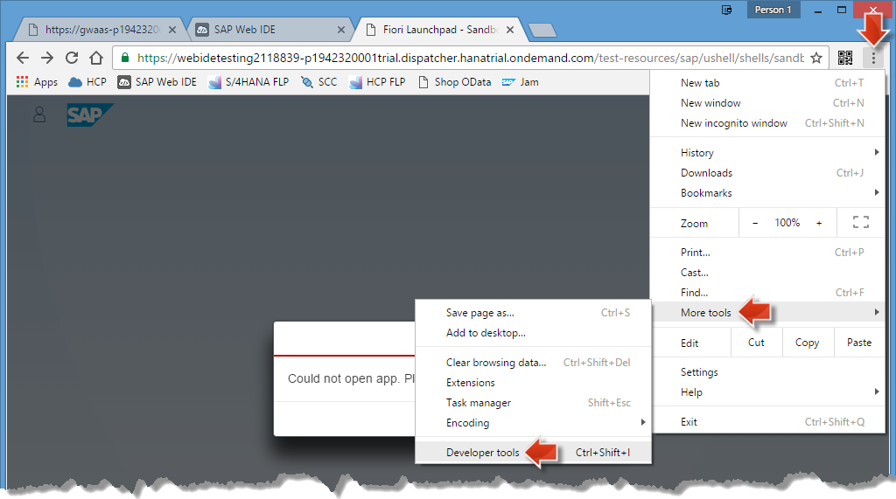
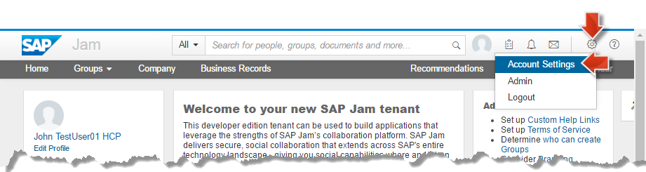
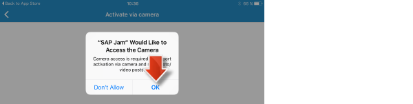

<a name="step-1-1-top"/><a name="step-1-2-top"/><a name="step-1-2-top"/>
<a name="step-2-1-top"/><a name="step-2-2-1-top"/><a name="step-2-2-2-top"/><a name="step-2-2-3-top"/><a name="step-2-3-top"/><a name="step-3-top"/>





> **Note:** As a reminder, in [week 3, unit 5, section 3.3](../../week-3/unit-5/#create-a-new-group-based-on-product-discussion-template) you already created a SAP Jam collaboration group for a product (_Notebook Basic 17_) and you used your new _Product Discussion_ template that retrieves the product data from your backend system. But so far you have only done this inside the SAP Jam Service Cockpit as _Jam Administrator_. Now you will develop the _collaborative extension_ that will enable the business users of the _Manage Products_ SAP Fiori application to collaborate on business decisions (i.e. discussing low-rated products in a SAP Jam Group with other stakeholders) without the need to ask your SAP Jam admin.

**Overview:**

**Roles**

-   SAP HANA Cloud Platform
    -   Web front-end developer

**Systems, Tools, Services:**

-   HANA Cloud Platform (HCP)
    -   HCP Cockpit, Web IDE
-   Host OS
    -   Web browser (Chrome is recommended)

## Downloads

| Download Link                                                                            | Description                                                                    | Context                                                                                   |
| :--------------------------------------------------------------------------------------- | :----------------------------------------------------------------------------- | :---------------------------------------------------------------------------------------- |
| [**collaboration-extension.zip**](./imports/html5/collaboration-extension.zip?raw=true) | collaboration-extension.zip containing the SAPUI5 collaboration extension code | [Section 1.2 Download collaboration-extension.zip](#download-collaboration-extensionzip) |

## Step 1: Preparation Steps

Make sure that you have executed the following preparation steps to be well prepared for the unit.

#### 1.1 Test _Connection Chain_ via _Shop_ OData Service

As you did in the beginning of [unit 5](../../week-3/unit-5/#get-products-from-shop-odata-service), please ensure that the _Back-End to Internet Connection Chain_ is still alive.

1.  Execute the steps in [week 3, unit 5, section 1.1.1](../../week-3/unit-5/#get-products-from-shop-odata-service).

> **Result:** You successfully **retrieved _Products_ from the _Shop_ OData Service** in order to ensure that the _Back-End to Internet_ Connection Chain is still up and running.

[Top](#step-1-1-top)

#### 1.2 Download _collaboration-extension.zip_

1.  Download the [collaboration-extension.zip](./imports/html5/collaboration-extension.zip?raw=true) archive to your local file system and remember the download location.

[Top](#step-1-2-top)

#### 1.3 Open SAP Web IDE

The _SAP Web IDE_ is the main tool in which you will work in this unit.

1.  Open a new browser tab.
2.  Click on [**SAP Web IDE**](../../week-1/unit-5/#create-sap-web-ide-bookmark) bookmark.
3.  **Log in** with your HCP Trial P-user (if necessary).
4.  If **Tips and Trick** window pops up:
    -   Select **Don't show on startup**.
    -   Click **Close**.
5.  Click on the **Development** tab of the panel on the right side.

    > **Result:** The _SAP Web IDE_ opens and the workspace with the _manageproducts_ application (containing the [UX extension](../../week-2/)) should be displayed.
    >
    > 

6.  **Keep** this browser tab **open**.

[Top](#step-1-3-top)

## Step 2: Import and Run _Collaboration Extension_

#### 2.1 Import and Run _Collaborative Extension_

1.  In the opened **Web IDE**:
2.  Select **manageproducts** project node.
3.  Open content menu and choose **Import > From File System** to open _Import_ dialog.

    

4.  On the opened **Import** dialog:
5.  Click **Browse...** button.
6.  Navigate to the location where you downloaded the **collaboration-extension.zip** archive and open it.

    

7.  Click **Select Folder**.
8.  Select the **manageproducts** folder under _Workspace_.
9.  Make sure **Extract Archive** is selected.
10. Click **OK**.

    

11. Confirm the _Confirmation Needed_ dialog with **OK**, so that you agree that the imported sources will overwrite your existing project sources in your SAP Web IDE workspace.

      

    > **Result:** The imported **collaboration-extension.zip** has overwritten some file contents of the existing **manageproducts** project. These changes contain the collaboration extension code and the project is therefore now ready for testing.
    >
    >   

12. After successful import:
13. Select **manageproducts** project node so that the _Run Component.js_ is displayed in the dropdown list left of the _Run_ icon.
14. Click on the **Run** icon in the toolbar to open the **Web IDE Application Preview** in a new browser tab, where the application with the _collaborative extension_ runs.

    

    > **Result:** In **Web IDE Application Preview** you should now see the running _Manage Products_ application which contains the _collaborative extension_.
    >
    > **Note:** If you get an error message, or no product data is displayed at all, then please try to do the SAP WebIDE cleanup steps as described in our [Troubleshooting Guide: SAP Web IDE](../../troubleshooting/troubleshooting-webide/).
    >
    > 
    >
    > **Scroll down** to find the newly added **Collaboration** section on the details page of a selected product. What a user of the _Manage Products_ application can do with the newly added collaboration feature is explained in [section 2.2](#test-collaborative-extension-features) below.
    >
    >   

##### 2.1.1 Web IDE Clean-up

> **Note:** In most cases when something is not running in one of the web-based tools like the SAP Web IDE, then first try to clean up the Web browser cache as follows.

1.  Symptom: You get not the expected web page but an error or no data is retrieved:
2.  Ignore the error message.

    

3.  Click **Customize and control** menu of _Chrome_ Web browser.
4.  Choose **More tools > Developer tools** to open the _Chrome_ developer tools.

    > **Note:** These developer tool enable an additional context menu of the Web browser refresh button, which is not otherwise not available.

      

5.  **Right-click** on the browser **Refresh** icon to open the developer menu option.
6.  Choose **Empty Cache and Hard Reload** to force the Web browser to empty its cache and reload.

      

    > **Result:** After this you get in many cases the application running again in the Web IDE.

      

7.  Click the **cross icon** in the middle of the right side to close the _developer tools_ again.

You have imported successfully the Collaborative extension and when running it from the Web IDE you could see the newly added **Collaboration** section on each product details page.

In the next section you will see how the collaborative extension works.

[Top](#step-2-1-top)

#### 2.2 Test _Collaborative Extension_ Features

Now you will test the collaboration features in the **SAP Web IDE Application Preview** tab where you already launched the _Manage Products_ application including the new _Collaborative Extension_.

Two collaboration features are implemented in the application:

-   Accessing collaboration groups relating to a specific product: For the products Notebook Basic 15 and 17 you created already SAP Jam groups in [week 3, unit 5, section 3.3](../../week-3/unit-5/#create-a-new-group-based-on-the-product-discussion-template). This means, that you should see these groups once you select these products in the _Manage Products_ application.
-   Creating new collaboration groups for a product.

##### 2.2.1 Access existing Jam Groups for Products

Continue in the opened **Web IDE Application Preview** tab:

1.  In the running _Manage Products_ application:

    -   Enter **Notebook Basic** into the **Search** field of the running _Manage Products_ application.
    -   Click on the **Search icon** to find all products of the catalog which name contains _Notebook Basic_.

        

    -   Select **Notebook Basic 15** (the first entry in the search result list).

        > Result: On the details page of the selected products you find a link

          

    -   Click the link **Notebook Basic 15 Discussion** to open the corresponding Jam group in a new browser tab.

        > **Note:** This is the SAP Jam group which you created in in [week 3, unit 5, section 3.1](../../week-3/unit-5/#create-a-jam-group-based-on-a-product) from the SAP Jam service cockpit as a first test.
        >
        > 

[Top](#step-2-2-1-top)

##### 2.2.2 Creating new SAP Jam Groups for Products

Continue in the opened **Web IDE Application Preview** tab, where the product **Notebook Basic 15** is still selected.

1.  On the detail page of the selected **Notebook Basic 15**:

    -   Scroll down to **Collaboration** section.
    -   Click on the **Create new Jam Group** icon to open _New SAP Jam Group_ dialog.

        

2.  In the open **New SAP Jam Group** dialog enter the following details:

    -   _Group name_: Enter **Why is Notebook Basic bad?**.
    -   _Group template_: **Product Discussion** (should already be pre-selected).
    -   _Invite Users_: Keep the selected test user (e.g. _Lisa_, the one that was added in [week 3, unit 3, section 1.2](../../week-3/unit-3/#create-a-new-hcp-trial-test-user) as second user for testing 'real-life-like' collaboration) so that the selected user will get an invitation e-mail for the now created group.
    -   Click on **Create** to create the new SAP Jam group and send then the invitation mails.

    

    > **Result:** The newly crated group **Why is Notebook Basic bad?** for the selected product **Notebook Basic 15** has been created and a corresponding success message appears.
    >
    >   

3.  Click **OK** on the success message.

    > **Result:** You will see that a new entry in the list of available groups for selected product **Notebook Basic 15** has been added and you could open the newly created collaboration group by clicking the link.
    >
    >   

4.  Click on link **Why is Notebook Basic so bad?** to open the before created Jam Group.
5.  If **logon** page appears enter your HCP Trial P-user.

    > **Result:** The Jam Group with name **Why is Notebook Basic so bad?** opens and you can find there the product data and also the related **user reviews**.
    >
    > 

In the next section you will add a new review for the _Notebook Basic 15_ product from within the _Web Shop_ application in your SAP Fiori Launchpad. Then you will see that the SAP Jam Group is directly connected to the back-end, and your new review will be visible.

> **Note:** The review data as coming from the FLP Web Shop application is stored in the back-end. And Jam Groups accesses via the OData provisioning the back-end data.

[Top](#step-2-2-2-top)

##### 2.2.3 Add a new Review to _Notebook Basic 15_

1.  Open a new browser tab.
2.  Open the [**S/4HANA FLP**](../../week-2/unit-1/#step-4-create-s4hana-flp-bookmark) bookmark.
3.  If **Your connection is not private** appears
    -   Click **ADVANCE** link.
    -   Click **Proceed to localhost (unsafe)** link.
4.  **Logon** with back-end user

    -   Name: **Developer**
    -   Password: **Appl1ance**

    > **Result:** The SAP Fiori Launchpad running in your backend system appears with three reference applications. One of them is the **Shop** application, where users can by products (IT equipment), rate them and write reviews.
    >
    > 

5.  Click on the **Shop** tile so that the _Shop_ application opens.
6.  Enter **Notebook Basic** in the search.
7.  Click **Search** icon to find all products which contain the search string in its name, especially the **Notebook Basic 15**, for which you want to write an additional review.

    

8.  Click on the first entry **Notebook Basic 15** to open the details page, where you can create a review for the selected product.
9.  You can see that there are three existing reviews, which were already displayed in the SAP Jam Group before.
10. Click **Write a Review** to open _My Review_ dialog.

    

11. On the opened **My Review** dialog:
12. Click on the **first star** to give a one star rating.
13. Enter **My first bad rating** in the text area.
14. Click **OK** to submit your review, which rates the _Notebook Basic 15_ as a bad one, to the back-end.

    

    > **Result:** The newly created review is displayed as the fourth review in the list of reviews.
    >
    > 

15. Now you will verify, that this new review is also shown in the SAP Jam Group.
16. Switch to the browser tab with the opened SAP Jam Group **Why is Notebook Basic bad?**
17. Click on the **refresh** icon of the browser.

> **Result:** The business data of the SAP Jam Group is refreshed and the updated reviews, including the new **My first bad rating**, are displayed.
>
> 

[Top](#step-2-2-3-top)

#### 2.3 Deploy and Register _manageproducts_ to HCP FLP

You will now deploy the _manageproducts_ application with the added _collaborative extension_ to SAP HANA Cloud Platform (HCP) and add it to your SAP Fiori Launchpad (FLP) running in your HCP account.

##### 2.3.1 Deploy _manageproducts_ to HCP

Switch to the SAP Web IDE browser tab and execute the following steps.

1.  Click **Workspace > manageproducts** and choose context menu item **Project Settings**.

     

2.  On opened _Project Settings_ page:

    -   Select the item **Project Types**.
    -   Make sure that **SAPUI5 Client Build** _Project Type_ is selected.
    -   Click **Save** to save the settings.
    -   Click **Close** to close the settings page.

        

3.  Click **Workspace > manageproducts**
4.  Choose context menu item **Deploy > Deploy to SAP HANA Cloud Platform**.

    

5.  On the opened **Deploy Application to SAP HANA Cloud Platform** dialog:
6.  Keep all **default settings**.
7.  Click **Deploy**.

    

    > **Result:** The **manageproducts** SAP Fiori app was successfully deployed to your HCP trial account.
    >
    > 

8.  Keep the **Successfully Deployed** dialog open, as you will register from this dialog the deployed application to your HCP FLP.

[Top](#step-2-3-1-top)

##### 2.3.2 Register _manageproducts_ to FLP

1.  Continue from the last **Successfully Deployed** screen of the before section.

    > **Note:** In case you closed the confirmation popup before, select  **manageproducts** in the project tree and click context menu item **Deploy > Register to SAP Fiori Launchpad**.

2.  Click **Register to SAP Fiori launchpad**

    

3.  On **General Information** wizard page:
4.  Add **-discuss** to the _Semantic Object_ name field.
5.  Click **Next**.

    

6.  On **Tile Configuration** wizard page:

    -   Title: **Manage Products**.
    -   Subtitle: **Rating and Discussions**.
    -   Click **Next**.

    

7.  On **Assignment** wizard page:

    -   Site: **Procurement Launchpad**.
    -   Catalog: **Procurement Application**.
    -   Group: **Product Management**.
    -   Click **Next**.

    

8.  On **Confirmation** wizard page click **Finish**.

    

    > **Result:** A **Successfully Registered** confirmation popup comes up.
    >
    > 

9.  Click **Open SAP Fiori launchpad** link to open the SAP Fiori launchpad in a new browser tab.

    

    > **Result:** In the launchpad you will now see the new application tile **Manage Products** with **Ratings and Discussions** subtitle.
    >
    > 

10. Click  **Manage Products** tile with **Ratings and Discussions** subtitle.

    > **Result:** You opened the _manageproducts_ application where you can now find the collaborative extension running in the SAP Fiori Launchpad in your HCP account.
    >
    > 

[Top](#step-2-3-2-top)

## Step 3: SAP Jam Mobile App (Optional)

Last but not least we will show you that you can install the **SAP Jam** mobile application (from _Apple iTunes App Store_ or _Google Play App Store_) so that you can experience the Jam collaboration features (e.g. discussions in Jam groups, adding content etc.) on your mobile devices (tablets or phones).

> **Note:** This is an optional step, which has not been demonstrated in the video presentations of the course.

Execute the following steps to get the SAP Jam mobile application running on your mobile device.

1.  On your mobile device **open your mobile applications store** (_Apple iTunes App Store_ for Apple devices or _Google Play App Store_ for Android devices).
2.  Search for **SAP Jam** application.

    > **Note:** Here we will use an iPad as example to install and open the SAP Jam mobile application. Other mobile devices will work in a very similar way.

    

3.  Download and install the **SAP Jam** application.
4.  Click open to enter the logon screen of the **SAP Jam**

    

    > **Result:** The initial **SAP Jam logon** page is displayed.
    >
    > 

5.  Select the value **developer.sapjam.com** from the entries list of the first entry field.
6.  Now prepare the **SAP Jam mobile logon via camera** in the **Jam Service Cockpit** where you will enable a QR code.
7.  On your PC/laptop open a new browser tab.
8.  Click on **SAP Jam bookmark**
9.  If necessary **Log in** with your HCP Trial P-User to open the _Jam Service Cockpit_.
    -   Make sure that the **browser window width** is big enough so that you see the menu bar items **Home, Groups, Company**.
10. Choose **Account Settings** to open the administration area of the _Jam Cockpit_, which opens an additional navigation area on the left side of the cockpit.

    

11. On the opened **Account Settings** page

    -   Click on **Mobile Setup** link to open _Mobile Setup_ page.

        

12. On the opened **Mobile Setup** page

    -   Click on **Activate via Camera**.

        

        > **Result:** The **QR code** for activating the _SAP Jam_ mobile application is displayed always for 30 seconds. After 30 seconds the QR code expires but you can renew the QR code by clicking then the _Get New Code_ button.
        >
        > 

13. Go back to your mobile device where still the **SAP Jam logon page** is displayed.
14. Click on **Activate via camara**.

    

15. Click **Next** on the displayed page.

    

16. Click **OK** to allow _SAP Jam_ accessing your camera.

    

17. **Scan QR code** which you displayed before in your _SAP Jam service cockpit_.

    

    > **Result:** You activated the your _SAP Jam mobile app_ and you are just a few steps away to enter your _SAP Jam collaboration instance_ from your mobile device.
    >
    > 

18. Execute these last steps to enter your _SAP Jam collaboration instance_ from your mobile device.
19. Click **Allow** to authorize access from your mobile device to your HCP Jam account.

    

20. Click **OK** if you want to enable Jam notifications.

    

21. Click **Skip Passcode** link.

    > **Note:** Instead you could enter twice a 6-digit passcode so that your SAP Jam mobile application is secured, i.e. every time you start the application you have to enter the 6-digit passcode first.

    

    > **Result:** You entered the **SAP Jam collaboration instance** on your mobile device.
    > 

22. Click **Groups** tab on the bottom to get the list of all the groups you already created during the units of this week 3.

    

> **Result:** Now you can play around in your **SAP Jam collaboration instance** from your mobile device. You can open any existing Jam group and start collaborating with other users like before in your Web browser. Just try it out for your own.
>
> With this you have finished week 3 of the course and hopefully got a good understanding how collaborative extensions work on with SAP Jam on SAP HANA Cloud platform.

[Top](#step-3-top)

[**&lt; Previous** Unit 5](../unit-5/) | [**Up ^** Week 3](../) | [**Next >** Week 4](../../week-4/)
