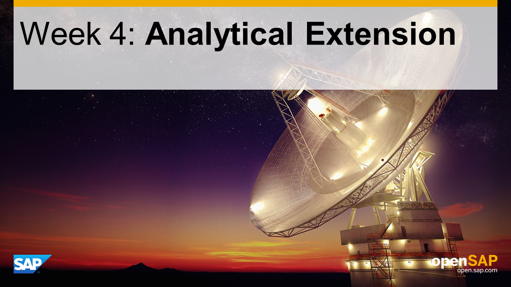

## Units

- Unit 1: [Understand the Challenge](./unit-1/)
- Unit 2: [Setup HANA for Replication](./unit-2/)
- Unit 3: [Replicate Backend Data to the Cloud with SLT](./unit-3/)
- Unit 4: [Creating an OData Service in HANA](./unit-4/)
- Unit 5: [Creating the SAP Fiori User Interface](./unit-5/)
- Unit 6: [Analytical Extensions with SAP BusinessObjects Cloud](./unit-6/)

## Overview

