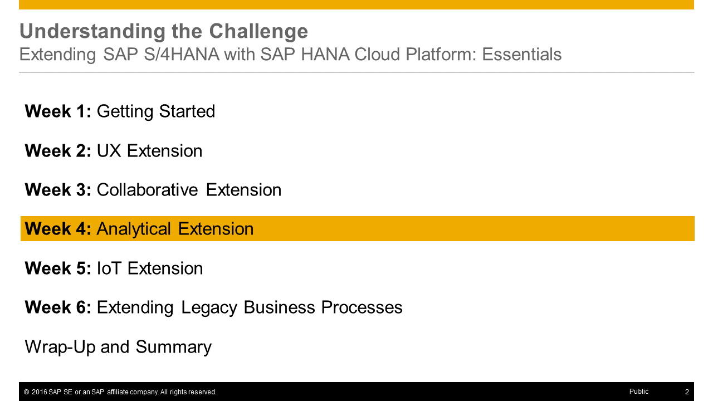

<a name="top"/>



> **Note:** On this page you will only find the presentation slides of the unit, without any additional context or explanations. Therefore **we strongly recommend to watch the [corresponding video](https://open.sap.com/courses/hcp3a1/items/60iytEGwgLVt7AY0qmm0cu)** _(openSAP log-in required)_ in which Thomas Bieser, the course instructor, explains the slides in detail. This will greatly enhance your understanding of this units content.

## Presentation Slides

### Slide 1: Title

### Slide 2: Week Overview

### Slide 3: Unit Overview

### Slide 4: Business Problem for this Week

### Slide 5: Solution for this week: Identify IT equipment that is rarely ordered

### Slide 6: Extension for this week: Analytical extension

### Slide 7: Pattern for this week: Data replication

### Slide 8: Path towards the Analytical Extension

### Slide 9: Involved Roles for this week

### Slide 10: What you've learned in this unit

[Top](#top)

[**&lt; Previous** Week 3](../../week-3/) | [**Up ^** Week 4](../) | [**Next >**   Unit 2](../unit-2/)