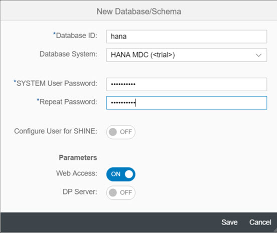

<a name="step-1-top"/><a name="step-2-top"/><a name="step-3-top"/>


**Overview:**

**Role:** HCP / SAP HANA Administrator

**Systems, Tools, Services:**

-   HCP Cockpit
-   HANA Cockpit on HCP
-   Eclipse

## Step 1: Create New SAP HANA Database on SAP HANA Cloud Platform

In this step we will create a new SAP HANA [Multitenant Database Container (MDC)](https://help.sap.com/saphelp_hanaplatform/helpdata/en/62/3afd167e6b48bf956ebb7f2142f058/content.htm) in your SAP HANA Cloud Platform account. Henceforth, we will simply refer to the **HANA MDC** as **HANA database**.
You want to replicate data from your on-premises SAP NetWeaver backend system into this database, so that you can work with this data independently from backend system availability.

1.  Log in to your [SAP HANA Cloud Platform Trial](https://account.hanatrial.ondemand.com/cockpit/) account, by opening your [**HCP**](../../week-1/unit-5#step-3-prepare-sap-hana-cloud-platform-trial-account) bookmark.
2.  Click on the **&lt;p-user>trial** link to open the account dashboard, in case it is not already opened.

    

3.  Navigate to **Persistence** > **Databases & Schemas**.

    

4.  Click on **New**.

    

5.  Enter the following values:

    -   Schema ID:  **hana**
    -   Database System: **HANA MDC (&lt;trial>)**
    -   SYSTEM User Password: **&lt;enter a password and remember it>**
    -   Repeat Password: **&lt;repeat password>**
    -   Keep the default values of the other parameters.
    -   Click on **Save**.

    

6.  Wait. The database creation process may take around 10 minutes. The final event log entry should state **HTTPS access from Internet enabled**.

    

> **Warning:**	The HANA database in your HCP trial account is stopped automatically every 12 hours. So you need to ensure that your HANA database is running before executing each unit, especially if you don't work on this course continuously. **If the SAP HANA multitenant database  remains in a stopped state for two weeks, it will be deleted from your HCP trial account!** In the SAP HANA Cloud Platform Cockpit you can see when it will be stopped or deleted.
> 

> **Result**: You have now created and started your own SAP HANA database running in your SAP HANA Cloud Platform trial account.

[Top](#)

## Step 2: Create Database User ACME in SAP HANA Cockpit

In this step you will log in to the **SAP HANA Cockpit** (not to be confused with the _SAP HANA Cloud Platform Cockpit_). This is a web interface that allows you to administer and monitor the HANA database running in your SAP HANA Cloud Platform account. You will create a new database user called **ACME** that will be used for all consecutive interactions with the database. It is not a recommended practice to use the existing **SYSTEM** user, so that there is always an admin user available with extended privileges, e.g. in case the ACME user should get locked or compromised.

1.  Go to your HCP account by opening the [**HCP**](../../week-1/unit-5#step-3-prepare-sap-hana-cloud-platform-trial-account) bookmark and navigate to **Persistence** > **Databases & Schemas**.
2.  Click on **hana**, to open the overview page for your newly created HANA MDC database.

    

3.  Open the **Administration Tools** by clicking on **SAP HANA Cockpit**

    

4.  Login with the user **SYSTEM** and the password you set when you created the SAP HANA MDC database.
5.  An information dialog opens, telling you that you are not authorized to open the SAP HANA Cockpit. Once you click on **OK**, the user **SYSTEM** will be assigned the necessary roles. Click on **Continue**.

    

6.  You should see a **Successful** dialog window, which you confirm with **Continue** to open the HANA cockpit in a new window.
7.  Click on the **Manage Roles and Users** tile.

    

8.  A new tab **SAP HANA Web-based Development Workbench: Security** has opened for managing database users and their roles on the HANA database.

    

9.  Select **New** > **User** from the menu.

    

10. Enter **ACME** as _username_ and provide an _initial password_.

    > **Note:** The initial password must have at least eight characters, contain at least one number, one capital letter and one lowercase letter.

    > **Note:** This _initial password_ will be changed upon first logon with the ACME user. As you are probably using the same password throughout this tutorial, we recommend that you provide a different initial password here that you can replace with your default tutorial password upon your first logon with the ACME user.

    

11. Navigate to the tab **Granted Roles** and add the following roles by pressing the **+** icon:
    -   **sap.hana.xs.ide.roles::Developer** _(for doing database development, e.g. enabling OData services)_
    -   **MODELING** _(for modeling HANA analytical views)_
    

12. Switch to the tab **System Privileges** and add the following system privileges by pressing the **+** icon:
    -   **CREATE SCHEMA** _(for SLT replication)_
    -   **ROLE ADMIN** _(for SLT replication)_
    -   **USER ADMIN** _(for SLT replication and to reactivate the SYSTEM user in case it should get locked.)_
    

13. Navigate to the tab **Package Privileges**
    -   Add the **.REPO_PACKAGE_ROOT** by pressing the **+** icon.
    -   In the right-hand section **Privileges for 'Root Package'**, select the checkbox **ALL** for granting write access to the root folder.
    

14. Click **Save** icon in the toolbar of the **Security** cockpit.
    

15. Please verify that the user has been saved by checking the event log in the bottom right corner.
    

> **Result:** You have now created a new user called ACME on the SAP HANA database running in your SAP HANA Cloud Platform account. This user has now the required roles and privileges for executing the tasks in the upcoming exercises.

[Top](#)

## Step 3: Connect SAP HANA Development Environment in Eclipse to HANA DB on HCP

In the [first week of this course](../../week-1/unit-5/), you have added some additional plugins to your Eclipse IDE from the _https://tools.hana.ondemand.com_ repository. In the **SAP HANA Development Environment** you can work with and model database tables on your HANA database. In this step you will connect this SAP HANA Development Environment to the SAP HANA database running in your SAP HANA Cloud Platform trial account.

1.  Open your Eclipse IDE.
2.  If you have followed the previous exercises, so far you can only see the **Java EE** and **ABAP** perspectives in Eclipse.
3.  Add the **SAP HANA Development** perspective, by clicking on **Window** > **Perspective** > **Open Perspective** > **Other** or by clicking the **Open Perspective** icon in the toolbar.

    

4.  Open the **SAP HANA Development** perspective.
5.  In the left-hand section, switch to the **Systems** tab.

    

6.  Click on the little arrow next to the **Create** icon to open a context menu and select **Add Cloud System...**

    

7.  In the **Add SAP HANA Cloud Platform System** you need to provide the **logon data of your HCP trial account**, NOT of your HANA database:

    -   Account name: **&lt;your HCP trial account name>**
    -   User name: **&lt;your HCP trial account user>**
    -   Password: **&lt;your HCP trial account password>**
    -   Click on **Next**.

    

8.  In the **SAP HANA Schemas and Databases** wizard screen, please provide the following information:

    -   Database: **hana**
    -   Database User: **ACME**
    -   Database Password: **&lt;_initial password_ you set in  [step 3](#step-3-create-database-user-acme)>**
    -   Uncheck the **Save database password** checkbox, as you will change the _initial password_ in the next step.
    -   Click on **Finish**

    

9.  Change the _initial password_ for the **ACME** user:

    -   Old password: **&lt;initial ACME password>**
    -   Password: **&lt;set a permanent password for the ACME user>**
    -   Repeat: **&lt;repeat permanent password>**
    -   Click **OK**.

    

    -   You should now see a successful confirmation message: **Password for user ACME changed.**

10. You can now see that a _System_ has been added in the section on the left. It represents a connection to the SAP HANA database in your HCP account with the ACME user.

    

> **Result:** You have now successfully set up the _SAP HANA Development_ environment in your Eclipse IDE. You have changed the initial password for the ACME database user and connected the SAP HANA Development environment to the SAP HANA database running in your SAP HANA Cloud Platform account.

[Top](#)

[**&lt; Previous** Unit 1](../unit-1/) | [**Up ^** Week 4](../) | [**Next >** Unit 3](../unit-3/)
