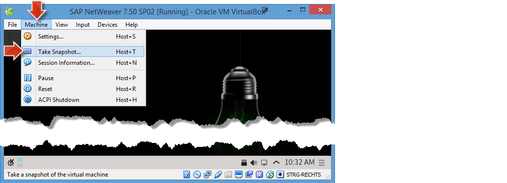



**Overview:**

**Roles:**

-   SAP Basis administrator
-   SAP application expert
-   HCP / SAP HANA administrator

**Systems, Tools, Services:**

-   SAP HANA database in SAP HANA Cloud Platform trial account
-   SAP S/4HANA backend system in VirtualBox
-   SAP Cloud Connector in VirtualBox
-   ABAP in Eclipse
-   SAP Landscape Transformation Replication Server

## Step 1: Preparation Steps

### Step 1.1: Ensure that your SAP HANA database is running

In this step you will ensure that the SAP HANA database operating in your SAP HANA Cloud Platform trial account is started. You will need to perform this check several times in this openSAP course, as the databases in the trial environment will be stopped every 12 hours.

1.  Log in to your [SAP HANA Cloud Platform Trial](https://account.hanatrial.ondemand.com/cockpit/) account, by opening your [**HCP**](../../week-1/unit-5#step-3-prepare-sap-hana-cloud-platform-trial-account) bookmark.
2.  Navigate to **Persistence** > **Databases & Schemas** and click on your **hana** database, that you created in [Week 4, Unit 2](../unit-2/).

    

3.  If your database status is **STOPPED**, you need to click on the **Start** button.

    

4.  The startup procedure should take no more than 30 seconds. You need to refresh the browser manually in order to see the status change.
5.  Your database should now be in status **STARTED**.

    

> **Result:** You have now verified that the SAP HANA database operating in your SAP HANA Cloud Platform account is started.

[Top](#)

### Step 1.2: VM with SAP NetWeaver AS ABAP is up and running

To make sure that your SAP S/4HANA backend system is in a defined, up and running state do the following **VM Stop/Start cycle**:

1.  **Stop** SAP NetWeaver AS ABAP and **Close** VM as described in [week 1, unit 6, section 6.4](../../week-1/unit-6/#shutdown-vm-with-netweaver-as-abap).
2.  **Start** first latest VM Snapshot **NetWeaver & Cloud Connector Setup & iwbep activated (week 3, unit 2)** and then NetWeaver ABAP as described in [week 1, unit 6, section 6.5](../../week-1/unit-6/#starting-vm-with-netweaver-as-abap).

> **Result:** Your _SAP NetWeaver AS ABAP 7.50 SP02_ system is now up and running with its processes on a Linux VM.

[Top](#)

### Step 1.3: Cloud Connector is up and running

Make sure that the _SAP Cloud Connector_ (SCC) is up and running as described in [Week 2 - Unit 5](../../week-2/unit-5/#start-your-sap-cloud-connector).

1.  In the running **Oracle VM VirtualBox** open a **Konsole** (KDE **Application Menu > System > Konsole**)
2.  Check _SCC_ status:
3.  Execute **sudo service scc_daemon status** (will ask for root password) to get the SCC status output.
4.  If status output is:

    -   **Active: active** then Cloud Connector is up and running.

        

    -   **Active: inactive** then start Cloud Connector: **sudo service scc_daemon start**

        -   Then **Check _SCC_ status** again.

        

> **Result:** Your SAP HANA Cloud Connector is up and running.

[Top](#)

## Step 2: Verify your SAP HANA Development environment in Eclipse is connected to your HANA DB on HCP

1.  Open your Eclipse IDE.
2.  Ensure that you have opened the **SAP HANA Development** perspective and the **Systems** view.

    

3.  In case you are not logged on yet, right-click on your HANA system and select **Log on** from the context menu. In the consecutive popup provide the password you specified for the **ACME** database user in Unit 2.

    

4.  Expand the **Catalog** folder. You can now see the existing schemas of your HANA database.

    

> **Result:** You have successfully connected your SAP HANA Development environment to the SAP HANA database running in your SAP HANA Cloud Platform account using the dedicated ACME database user. You are now able to inspect the contents of the database in Eclipse.

[Top](#)

## Step 3: Set up Service Channel in SAP HANA Cloud Connector

In this step you will set up a **Service Channel in the SAP HANA Cloud Connector** running in your VirtualBox. This service channel allows your SAP NetWeaver backend system to communicate with the HANA database running in your HCP account. This **service channel is required to replicate data** from the backend system to the HANA database in the cloud using SLT.

> **Note:** This step is performed in a different order in the video recording for the openSAP course.

1.  Open Up your Google Chrome browser.
2.  Open your SAP HANA Cloud Connector, typically located at <https://localhost:8443> or by using the [**SCC**](../../week-2/unit-3/#set-up-initial-configuration) bookmark.
3.  Log in using the following credentials:

    -   Username: **Administrator**
    -   Password: **&lt;the password you specified in [Week 2, Unit 3](../../week-2/unit-3/#set-up-initial-configuration)>**

4.  Click on **On-Premise to Cloud** and the **+** (Add...) icon.
    

5.  Specify the Service Channel Type: **HANA Database** and press **Next**.

    -   HANA Instance Name: **hana** _(You may have to manually enter this instance name.)_
    -   Local Instance Number: **00**
    -   Enabled: **true**
    -   Click on **Finish**.

    

6.  You can see that a new Service Channel has been created and enabled. The service state icon should be green.
    

> **Result:** A Service Channel has been created from your VirtualBox to your SAP HANA Cloud Platform account, establishing the communication channel between your SAP NetWeaver backend system and the SAP HANA database on HCP.

[Top](#)

## Step 4: Set up Data Replication Job between Backend System and your HANA DB on HCP

In this step you will set up a data replication job between your SAP NetWeaver backend system and the SAP HANA database running in your SAP HANA Cloud Platform account. You will do this using SLT by opening the SAP backend transaction _LTRC_.

> **Hint:** If you are running through the course with minimum system requirements and not with 6 GB RAM for the Virtual Machine, you could try to skip the replication of the data definition tables as described in [Troubleshooting guide](../../troubleshooting/troubleshooting-slt/#trbl-4-skipping-the-replication-of-data-definition-tables).

1.  Open up Eclipse and switch to the **ABAP** perspective.

    

2.  Double-click on your ABAP Project **NPL_001_xxxxxx** to connect to your SAP NetWeaver backend system.
3.  In case you get asked, log on using the following credentials:
    -   Client: **001**
    -   User: **Developer**
    -   Password: **Appl1ance**
4.  Click on **Run** > **ABAP Development Object...** from the menu, or select the corresponding icon from the toolbar.

    

5.  Search for and select the transaction **LTRC** and click on **OK**.

    

6.  A new window called **SAP LT Replication Server - Cockpit: Overview** will open in Eclipse. This is the transaction that allows us to set up replication jobs in the SAP NetWeaver backend system.
7.  Click on the **Create Configuration** button.

    

    > **Hint:** In Eclipse installations in MacOS, the button **Create Configuration** does not respond with the first click. The work-around for this bug is to click on some other button in the toolbar first, for example, the button **i** and then now click on the button **Create Configuration**. Now it opens a new wizard.

8.  In the wizard, enter the following data, and leave the remaining settings as default:

    -   **Specify General Data** > **General Data**:
    -   Configuration Name: **SLT_REPLICATION**

        > **Hint:** If at a later point in time you run into trouble, and you have to set up the SLT replication again, please use the name **SLT_REPLICATION** again, as you would run into issues in later exercises otherwise. In order to use this same name again, you would first need to cleanup procedure. This is described in our [troubleshooting guide for SLT](../../troubleshooting/troubleshooting-slt/#trbl-2-how-to-reset-the-sap-hana-database).

    -   Click **Next**

    

9.  **Specify Source System** > **System Data**:

    -   Select the **RFC Connection** radio button.
    -   RFC Destination: **NPL**
    -   Select the **Allow Multiple Usage** checkbox.
    -   Click **Next**

    

10. **Specify Target System** > **System Data**:

    -   Select the **DB Connection** radio button.
    -   Database System: **HANA**
    -   Administration User Name: **ACME**
    -   Password: **&lt;ACME user password>**

      > **Note:** You changed the initial password of the ACME user when you first logged on to the HANA DB in Unit 2, Step 3.

    -   Host Name: **localhost**
    -   Instance Number: **00**
    -   Logical Port Number: **15**
    -   Click **Next**

    > **Hint:** Even though the target system is running remotely on the SAP HANA Cloud Platform, you may use the host _localhost_ here, as you established a service channel in the SAP HANA Cloud Connector in step 2.

    

11. **Specify Transfer Settings** > **Job Options**:

    -   Number of Data Transfer Jobs: **4**
    -   Number of Initial Load Jobs: **4**
    -   Number of Calculation Jobs: **1**
    -   Click on **Next**.

    > **Hint:** Please be careful with these settings, as they are very resource intensive and will use all the resources on your machine, if configured incorrectly. Basically these settings specify how many jobs should be used to replicate the data. We strongly advise you to use the settings specified above, as your system might become unresponsive otherwise.
    >
    > **Hint:** You may ignore any warnings regarding **Sizing conflicts exist on the screen**.

    

12. Review all of the settings and click on **Create**.

    

13. As a result you will now see that a new job **SLT_REPLICATION** has been created.
14. Double-click on **SLT_REPLICATION** to see that already three administrative tables are specified for replication in the **Table Overview** tab.

    

> **Result:** You have now created an initial SLT replication job in your SAP NetWeaver backend system and are now replicating data to your SAP HANA database running in your SAP HANA Cloud Platform account.

[Top](#)

## Step 5: Verify Initial Data Replication to SAP HANA Database

In this step you will verify that the data replication is working as it should. You will look at the SAP HANA database running in your HCP account to verify that the control tables that were created in the SLT_REPLICATION scheme are being replicated.

1.  In Eclipse, switch to the **SAP HANA Development** perspective.
2.  In the **Systems** view on the left side, right-click on your HANA database and select **refresh** from the context menu, to retrieve the latest data from the HANA database running in your HCP trial account.

    

3.  Expand the node **Catalog** > **SLT_REPLICATION** > **Tables**.

    

4.  Please note that the new **SLT_REPLICATION** schema now exists on the database. It was created as a result of setting up the SLT_REPLICATION schema in your backend system.
5.  You will now find a total list of nine tables, consisting of the three control tables in your **SLT_REPLICATION** scheme and some additional six tables starting with **RS\***.

> **Result:** You have verified that the data replication is working. The new **SLT_REPLICATION** schema now exists on your SAP HANA database running in your SAP HANA Cloud Platform account. It was created as a result of setting up the SLT_REPLICATION schema in your SAP NetWeaver backend system.

[Top](#)

## Step 6: Add Data Tables to SLT Replication Job

In this step we are going to add the actual backend database tables containing sales order and product data to the SLT_REPLICATION scheme and start the replication of these tables to the HANA database running on HCP.

1.  Go back to the **LTRC** transaction. (This is the window with the title **LT Replication Server - Cockpit** in your Eclipse IDE.)
2.  Click on **Data Provisioning** in the toolbar.

    

3.  Click on the icon for **Multiple selection** to the right of the text field.

    

4.  Enter the following table names to be replicated, and click on **Execute**:

    | Database Table Name | Table Contents        |
    |---------------------|-----------------------|
    | **SNWD_PD** | (Product ID, price, category) |
    | **SNWD_SO** | (Ordered quantities)          |
    | **SNWD_SO_I** | (Ordered Items)             |
    | **SNWD_SO_SL** | (Ordered quantities)       |
    | **SNWD_TEXTS** | (Product names)            |
    | **SNWD_REV_HEAD** | (Average ratings)       |

    

    > **Note:** Even though you can only see the **SNWD_PD** entry in the _Table Name in Database_ field, the other entries are also selected in the background due to the multiple selection. You can see this, as the icon next to the text field is now green.

5.  Select the **Start Replication** radio button, and click on **Execute** to start the data replication.

    

6.  The tables selected for replication will be in status **Scheduled** first, then in status **Replication (Initial Load)** and finally in status **Replication**. You need to reload the screen, in order to track the status changes.

    

    > **Note:** Please note how the indicators and states in the **Current Action** and **In Process** columns change with each **refresh**.

    

7.  Switch to the tab **Data Transfer Monitor** to see which data transfers are still outstanding.

    

8.  Click on **Refresh** repeatedly to see the progress.
9.  Finally, as a result, in the **Table Overview** tab, all the tables should have the status **Replication**.

    

> **Result:**  You have now added all data tables to the SLT_Replication scheme and started the replication process. Please be aware that this is a very resource intensive process. So if you are doing this openSAP course with the minimum system resources, your mileage may vary and it might take you a bit longer until you are successful. If you run into issues, please also check our [SLT troubleshooting guide](../../troubleshooting/troubleshooting-slt/).

[Top](#)

## Step 7: Verify Successful Data Replication

In this step you are going to verify that the data replication is running successfully. (Please note that the replication will run continuously, and not only do an initial load.) To do so, we are going to open the **transaction SE16 in the SAP NetWeaver backend system** and are going to **compare the table contents** to the same table in your **SAP HANA database on HCP** using the SAP HANA Development perspective in your Eclipse IDE.

1.  In the **Systems** view of the **SAP HANA Development** perspective, open your database in HCP and perform a refresh.

    

2.  Navigate to **Catalog** > **SLT Replication** > **Tables**
3.  You can see that the new tables have now been added to the tables of the **SLT_TRANSFORMATION** replication scheme.

    

4.  Perform a right click on the **SNWD_PD** table and select **Open Content**.

    

5.  As a result, you will see that the table in your HANA DB on HCP now contains **123 entries**. If the number is less than that, wait, refresh and see if the number is increasing. This would mean that the initial data replication is still running.

    

6.  Now you want to verify that the same amount of entries exist in the source **SNWD_PD** table in your local backend system.
7.  In the **ABAP** perspective in Eclipse, select **Run** > **Run ABAP Development Object**.

    

8.  Search and open transaction **SE16**.
9.  Enter table name **SNWD_PD**, hit **enter** and then execute the transaction to open the database table.

    

10. In the toolbar of the transaction click on **Number of Entries**. As a result, you can see that the source database table in your backend system also contains **123 entries**.
    

> **Result:** You have verified that the business data is successfully being replicated to the SAP HANA database running in your SAP HANA Cloud Platform account.

[Top](#)

## Step 8: Create VM Snapshot

After you have successfully replicated the tables using SAP Landscape Transformation Server to the SAP HANA in the SAP HANA Cloud platform, please take a snapshot of this Virtual Machine state. You can revert to this snapshot, in case your system should get corrupted for any reason.

1.  In the running Oracle VM VirtualBox window menu: **Choose Machine > Take Snapshot...**

    

2.  In the opened window enter a name **ABAP with SCC and SLT Replication** and click on **OK**.

[Top](#)

[**&lt; Previous** Unit 2](../unit-2/) | [**Up ^** Week 4](../) | [**Next >** Unit 4](../unit-4/)
