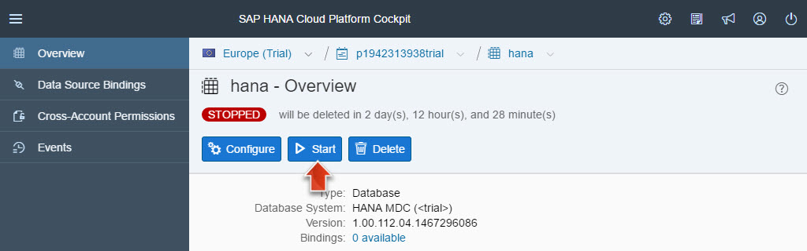
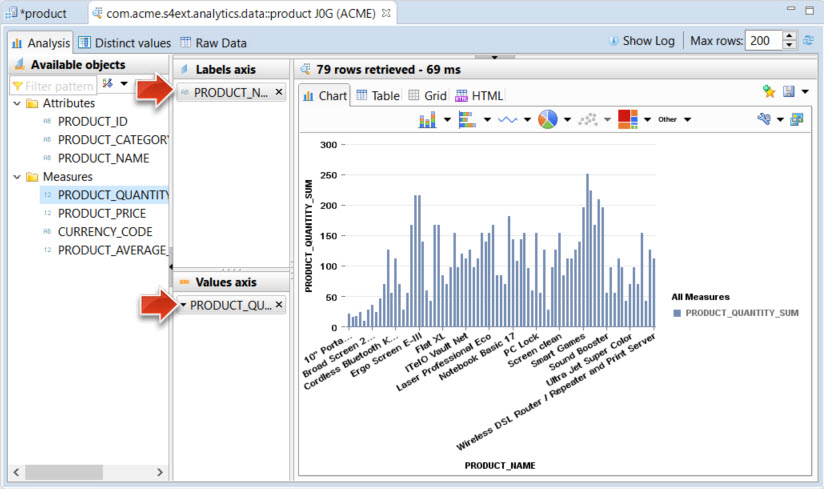



**Roles:**

-   SAP HANA modeler

**Systems, Tools, Services:**

-   SAP HANA database in SAP HANA Cloud Platform trial account
-   SAP S/4HANA backend system in VirtualBox
-   SAP Cloud Connector in VirtualBox
-   ABAP in Eclipse
-   SAP Landscape Transformation Replication Server

## Downloads

| Download Link                                                                         | Description                    | Context                                                                                                                                          |
|---------------------------------------------------------------------------------------|--------------------------------|--------------------------------------------------------------------------------------------------------------------------------------------------|
| [**hana-analytic-service.zip**](./imports/hana/hana-analytic-service.zip)                | HANA XS Archive                | [Step 2: Create new Analytical View and OData Service on your SAP HANA Database](https://sap.github.io/cloud-s4ext-dev/week-4/unit-4/#step-2-create-new-analytical-view-and-odata-service-on-your-sap-hana-database)|
| [**hana-internet-http.properties**](./imports/destinations/hana-internet-http.properties) | Destination Configuration File | [Step 5: Creating a Destination in HCP for the Analytical OData Service](#step-5-creating-a-destination-in-hcp-for-the-analytical-odata-service) |

## Step 1: Preparation Steps

### Step 1.1: Ensure that your SAP HANA database is running

In this step you will ensure that the SAP HANA database operating in your SAP HANA Cloud Platform trial account is started. You will need to perform this check several times in this openSAP course, as the databases in the trial environment will be stopped every 12 hours.

1.  Open the **HCP** bookmark in your Google Chrome browser that will take you to the account overview screen of your SAP HANA Cloud Platform trial account.
2.  Navigate to **Persistence** > **Databases & Schemas** and click on your **hana** database, that you created in [Week 4, Unit 2](../unit-2).

    

3.  If your database is in status **STOPPED**, you need to click on the **Start** Button.

    

4.  The startup procedure should take no more than 30 seconds. You need to refresh the browser manually in order to see the status change.
5.  Your database should now be in status **STARTED**.

    

> **Result:** You have now verified that the SAP HANA database operating in your SAP HANA Cloud Platform account is started.

[Top](#)

### Step 1.2: VM with NetWeaver ABAP is up and running

To make sure that your SAP S/4HANA backend system is in a defined, up and running state do the following **VM Stop/Start cycle**:

1.  **Stop** SAP NetWeaver AS ABAP and **Close** VM as described in [week 1, unit 6, section 6.4](../../week-1/unit-6/#shutdown-vm-with-netweaver-as-abap).
2.  **Start** first latest VM Snapshot **NetWeaver & Cloud Connector Setup (End of Week 2)** and then NetWeaver ABAP as described in [week 1, unit 6, section 6.5](../../week-1/unit-6/#starting-vm-with-netweaver-as-abap).

> **Result:** Your _SAP NetWeaver AS ABAP 7.50 SP02_ system is now up and running with its processes on a Linux VM.

[Top](#)

### Step 1.3: Cloud Connector is up and running

Make sure that the _SAP Cloud Connector_ (SCC) is up and running as described in [Week 2 - Unit 5](../../week-2/unit-5/#start-your-sap-cloud-connector).

1.  In the running **Oracle VM VirtualBox** open a **Konsole** (KDE **Application Menu > System > Konsole**)
2.  Check _SCC_ status:
3.  Execute **sudo service scc_daemon status** (will ask for root password) to get the SCC status output.
4.  If status output is:

    -   **Active: active** then Cloud Connector is up and running.

        

    -   **Active: inactive** then start Cloud Connector: **sudo service scc_daemon start**

        -   Then **Check _SCC_ status** again.

        

> **Result:** Your SAP HANA Cloud Connector is up and running.

[Top](#)

## Step 2: Create new Analytical View and OData Service on your SAP HANA Database

In this step you are going to import a new database view to your SAP HANA database that is used to analyze the product data in your company. You are going to enable this view as OData service, so that you can build a graphical UI extension on top of this service.

1.  Open Eclipse and switch to the **SAP HANA Development** perspective. You should be looking at the **SAP HANA** > **Repositories** view.

    

2.  Right-click on your HANA database in the **Repositories** view. From the context menu, select **Create Repository Workspace**. If necessary, provide your logon data for the ACME user.

    

3.  In the popup, use the default settings to **Create a new Repository Workspace** and click on **Finish**.

    

4.  Switch to the **Project Explorer** view.
5.  Create a new XS Project, by clicking on **File** > **New** > **XS Project**.

    

6.  In the **New XS Project** wizard, leave the default settings unless specified otherwise:

    - Project Name: **s4ext**
    - Create a new **HANA** working set:
        -   Click on **Working sets** > **New...**
        -   Working set name: **HANA**
        -   Do not select any working set contents.
        -   click on **Finish**.
    - Select the checkbox for **Add project to working sets**
    - Working Sets: **HANA**
    - Click on **Next**.

    

    - Repository Package: **com.acme.s4ext**
    - Click on **Next**.

    

    - Uncheck the **Access Objects** for **XS Application Access** and **XS Application Descriptor**. They should NOT be selected.

    > **Hint:** Later we will import the sources for this project and this import will contain a `.xsacces` and a `.xsapp` file. So they are not needed here.

    - Click on **Finish**.

    

7.  Add the working set **HANA** to the **Project Explorer** view, by clicking on the **Project Explorer menu** > **Select Working Set...**.

    

8.  Expand the **HANA** working set.
9.  Open the context menu for the **s4ext** project and select **Import...**

    

10. Select **General** > **Archive File** > **Next**.

    

11. Download and select the [hana-analytic-service.zip](./imports/hana/hana-analytic-service.zip?raw=true) archive (containing the files to create the database view and the OData service) to your download folder.

12. In the Eclipse import wizard, click on **Browse..**, select the **hana-analytic-service.zip** file you just downloaded, and click on **Finish**.

    

21. In the **Project Exporer** view, expand **s4ext** > **analytics** > **data** and **s4ext** > **analytics** > **service**. You will see the new view **product.calculationview** and the **analytics.xsodata** OData service.

    

    > **Hint:** If **Eclipse Text file encoding** is not set to **UTF-8** you will get errors, similar to the following screen shot:
    > 
    >
    > To resolve this, follow the directions given in [Week 1, Unit 5, Step 5.4: Configure UTF-8 Text encoding](../../week-1/unit-5/#configure-utf-8-text-encoding) to switch on _UTF-8_ for your workspace.

22. Now you need to activate the inactive objects in the HANA database:

    - Select the **s4ext** project.
    - From the toolbar in the **SAP HANA Development** perspective, select **Activate All SAP HANA Development Objects**.

    

    - Click on **Select All** and on **OK**.

    > **Hint:** Deselect artifacts that might be generated by your file system, e.g. in Mac OS the file **.DS_Store**.

    

> **Result:** You have now imported and activated a new database view **(product.calculationview)** to your SAP HANA database that is used to analyze the product data in your company. You have enabled this view as an OData service **(analytics.xsodata)**, so that you can build a graphical UI extension on top of this service.

[Top](#)

## Step 3: Understanding the Product Calculation View

This step is designed to help you to explore and understand the data model that you are going to use to build the analytical extension.

1.  Go to Eclipse and open the **SAP HANA Development** perspective.
2.  In the Project Explorer, navigate to **HANA** > **s4ext** > **analytics** > **data** and double-click on the **product.calculationview**.

    

3.  Inspect the details of the **Semantics** entity to understand the underlying data model. Please also refer to the explanation in Thomas' [video for Week 4, Unit 4](https://open.sap.com/courses/hcp3a1/items/pwWHmnRcn62Duq2YsCUB3).

    

4.  In the toolbar of the **product.calculationview**, click on the small arrow next to the **Data Preview** icon to open a context menu and select **Open in Data Preview Editor**.

    

5.  The **Data Preview Editor** allows you to create an ad-hoc analysis of the data on your database table. Create a new analysis as follows:

    - Drag and drop the attribute **PRODUCT_NAME** onto the **Labels axis**.
    - Drag and drop the measure **PRODUCT_QUANTITY** onto the **Values axis**.
    - As a result you can see the aggregated product quantities per product.

    

6.  Click on the **Raw Data** tab and do an ascending sort of the **PRODUCT_QUANTITY** column. You will find that the **PRODUCT_QUANTITY** for the **Benda Laptop 1408** is **10**.

    

7.  You now want to increase the quantity by ordering five additional **Benda Laptop 1408**.
8.  Open your local SAP Fiori Launchpad in your backend system, using the [**S/4HANA FLP**](../../week-2/unit-1/#step-4-create-s4hana-flp-bookmark) bookmark. Log in using your backend user credentials (User: _Developer_ / Password: _Appl1ance_).
9.  Open the **Employee (EPM)** > **Shop** demo application.

    

10. Search for **Benda** and click on **Add to Cart**.

    

11. Open the **Shopping Cart**, increase the **Order quantity** to the value **5** and click on **Go to Checkout**.

    

12. Click on **Buy Now** to confirm the order of 5 additional Benda Laptops. You should see a success message, confirming that your order has been sent to the IT.

    

>**Note:** You just ordered 5 laptops using the Shop application directly in your SAP S/4HANA backend system. This change is now directly reflected in the database in this backend system. Now this change in the local database table will be replicated to the SAP HANA database in your HCP account (using the SLT_REPLICATION job you set up earlier this week).

13. Go back to Eclipse and check the **Raw Data** view. Click on **Execute** to refresh the data coming from the SAP HANA database running in your SAP HANA Cloud Platform trial account. You can now see that the data replication is still running, as the **PRODUCT_QUANTITY** has now increased to **15**.

    

> **Result:** You now have a better understanding of the underlying data model used in our demo, and how this is modeled as a database view on your SAP HANA database. Also, you have confirmed that the continuous data replication is working using the SLT Replication you set up in Week 4, Unit 3.

[Top](#)

## Step 4: Understanding the Analytics OData Service

In this step you verify that the OData service for exposing the analytical view data is working and create a new browser bookmark for this service.

1.  Go to Eclipse and open the **SAP HANA Development** perspective.
2.  In the **Project Explorer** view, navigate to **HANA** > **s4ext** > **analytics** > **service** and double-click on the **analytics.xsodata** file.

    

3.  If you inspect the contents of the file, you will note that the code states that the view **com.acme.s4ext.analytics.data/product.calculationview** should be exposed as OData service.
4.  Execute the OData service, by selecting **Run** > **Run as...** from the toolbar.

    

5.  As a result your browser will open the OData service. Note that the service is exposed from the SAP HANA database running in your SAP HANA Cloud Platform account. To see the data, you need to log on using your ACME database user:

    - Username: **ACME**
    - Password: **&lt;Insert the HANA DB password you assigned in week 4 unit 2.>**

    

6.  You may now view and explore the created OData service.
7.  Create a new bookmark in Google Chrome called **Product Analytic OData**.

    
8.  To see the product entities add **/product** at the end of the url of the OData service.

    

	> **Warning:** Please check if the **PRODUCT_NAME** is shown or if you only have **null** as shown in the screen shot. If you have **null** you are using a browser with a wrong language setting. Just open **chrome://chrome/settings/languages** in **Chrome** and configure the default language. See more details [Week 1 Unit 5 Step 2.1. Install and Configure Chrome](../../week-1/unit-5/#install-and-configure-chrome).
	>
	>    

> **Result:** You have now verified that the product analytic OData service that is exposed from the HANA database in your SAP HANA Cloud Platform trial account is working and exposed to the internet.

[Top](#)

## Step 5: Creating a Destination in HCP for the Analytical OData Service

In this step you create a new destination in your SAP HANA Cloud Platform account to allow the SAP Web IDE to connect to the OData service, exposed by the SAP HANA database in your account. You will verify that the destination is working correctly by creating a sample application in the Web IDE.

1.  Download the destination properties file we prepared to your computer: [hana-internet-http.properties](./imports/destinations/hana-internet-http.properties?raw=true) (**Right-click** > **Save link as...**)
2. Log in to your [SAP HANA Cloud Platform](https://account.hanatrial.ondemand.com/cockpit/) account, by opening your [**HCP**](../../week-1/unit-5#step-3-prepare-sap-hana-cloud-platform-trial-account) bookmark.
3.  Navigate to **Connectivity** > **Destinations**, click on **Import Destination** and import the previously downloaded **hana-internet-http.properties** file.

    

4.  Adjust the destination as follows:

    - URL: **&lt;Insert the URL for the Product Analytic OData service>**
      (e.g. _https://hana\{\{HCP user id}}trial.hanatrial.ondemand.com/com/acme/s4ext/analytics/service/analytics.xsodata_
    - User: **ACME**
    - Password: **&lt;your ACME password>**
    - Select the checkbox: **Use default JDK truststore**
    - Click **Save**.

    

5. As a result, you now have a new destination called **hana-internet-http** in the destination list.
6. You now want to verify that the new destination is working. The best way to do this is to create a sample application in the SAP Web IDE.
7. Open the [**SAP Web IDE**](../../week-1/unit-5#step-4-prepare-sap-web-ide) bookmark in Google Chrome.

    > **Hint:** If your Web IDE is already started, you need to restart it after adding a new destination to the SAP HANA Cloud Platform, as then destinations are only loaded once during the launch of the SAP Web IDE. If it still does not show up, please check the [SAP Web IDE troubleshooting guide](https://sap.github.io/cloud-s4ext-dev/troubleshooting/troubleshooting-webide/).

8. Go to **File** > **New** > **Project from Template**

    

9. Select the **List Report Application** template and click on **Next**.

    

10. Specify any name and title

    - Project Name: **analytic**
    - Title: **analytic**
    - Click on **Next**.

    

11. Select **Service URL** > **Product Analytic API**. When selected you can find the **analytics.xsodata** service in the **Service** section below. Expand this service, to view the database tables of the view exposed as OData service. This proves that the service is working correctly.

    

    > **Hint:** If you can't find the **Service URL** > **Product Analytic API** do a hard reload or clear your browser cache and reload the **SAP Web IDE** again.

13. You may now cancel the wizard and close the SAP Web IDE browser tab.

> **Result:** You have now verified that the destination that connects the Product Analytic OData service (exposed from the SAP HANA database in your HCP account) is working and can be used in SAP Web IDE. This means that you can now build an application on HCP using this OData service.

[Top](#)

[**&lt; Previous** Unit 3](../unit-3/) | [**Up ^** Week 4](../) | [**Next >** Unit 5](../unit-5/)