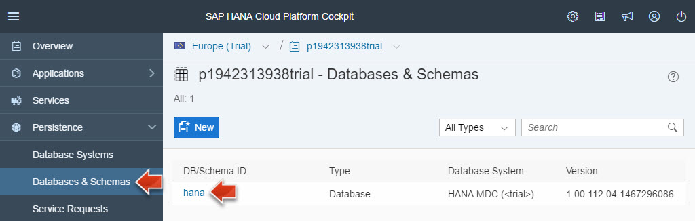
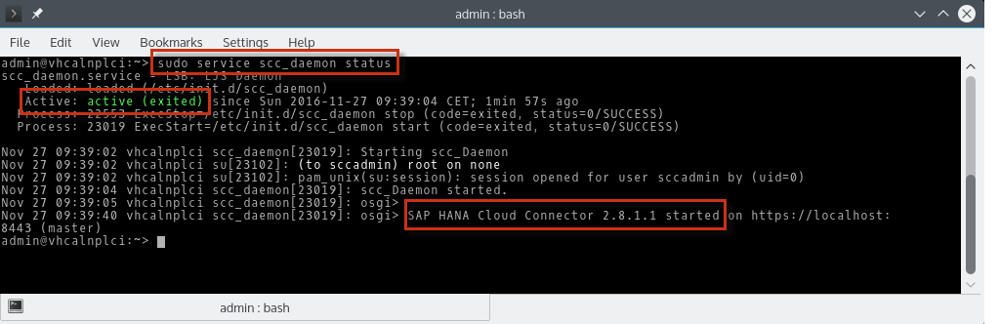
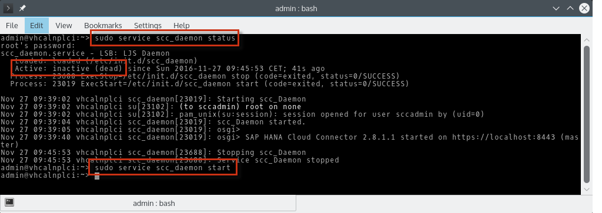
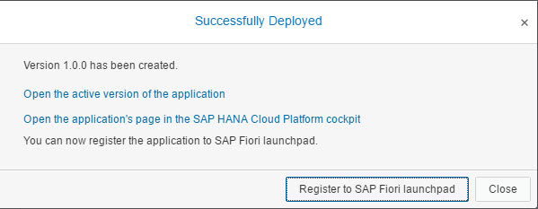



**Overview:**

**Roles:**

-   Developer: Web front end

**Systems, Tools, Services:**

-   SAP Web IDE
-   SAP HANA database in SAP HANA Cloud Platform
-   SAP Fiori Launchpad in SAP HANA Cloud Platform

## Downloads

| Download Link                                                   | Description                          | Context                                                                                                                          |
|-----------------------------------------------------------------|--------------------------------------|----------------------------------------------------------------------------------------------------------------------------------|
| [**productanalytics.zip**](./imports/html5/productanalytics.zip)| Product Analytics HTML5 sources      | [Step 2: Import and Run the Product Analytics HTML5 Application](#step-2-import-and-run-the-product-analytics-html5-application) |

## Step 1: Preparation Steps

### Step 1.1: Ensure that your SAP HANA database is running

In this step you will ensure that the SAP HANA database operating in your SAP HANA Cloud Platform trial account is started. You will need to perform this check several times in this openSAP course, as the databases in the trial environment will be stopped every 12 hours.

1.  Open the **HCP** bookmark in your Google Chrome browser that will take you to the account overview screen of your SAP HANA Cloud Platform trial account.

2.  Navigate to **Persistence** > **Databases & Schemas** and click on your **hana** database, that you created in [Week 4, Unit 2](../unit-2).

    

3.  If your database is in status **STOPPED**, you need to click on the **Start** Button.

    

4.  The startup procedure should take no more than 30 seconds. You need to refresh the browser manually in order to see the status change.
5.  Your database should now be in status **STARTED**.

    

> **Result:** You have now verified that the SAP HANA database operating in your SAP HANA Cloud Platform account is started.

[Top](#)

### Step 1.2: VM with NetWeaver ABAP is up and running

To make sure that your SAP S/4HANA backend system is in a defined, up and running state do the following **VM Stop/Start cycle**:

1.  **Stop** SAP NetWeaver AS ABAP and **Close** VM as described in [week 1, unit 6, section 6.4](../../week-1/unit-6/#shutdown-vm-with-netweaver-as-abap).
2.  **Start** first latest VM Snapshot **NetWeaver & Cloud Connector Setup (End of Week 2)** and then NetWeaver ABAP as described in [week 1, unit 6, section 6.5](../../week-1/unit-6/#starting-vm-with-netweaver-as-abap).

> **Result:** Your _SAP NetWeaver AS ABAP 7.50 SP02_ system is now up and running with its processes on a Linux VM.

[Top](#)

### Step 1.3: Cloud Connector is up and running

Make sure that the _SAP Cloud Connector_ (SCC) is up and running as described in [Week 2 - Unit 5](../../week-2/unit-5/#start-your-sap-cloud-connector).

1.  In the running **Oracle VM VirtualBox** open a **Konsole** (KDE **Application Menu > System > Konsole**)
2.  Check _SCC_ status:
3.  Execute **sudo service scc_daemon status** (will ask for root password) to get the SCC status output.
4.  If status output is:

    -   **Active: active** then Cloud Connector is up and running.

        

    -   **Active: inactive** then start Cloud Connector: **sudo service scc_daemon start**

        -   Then **Check _SCC_ status** again.

        

> **Result:** Your SAP HANA Cloud Connector is up and running.

## Step 2: Import and Run the Product Analytics SAP Fiori Application

In this step you are going to open the SAP Web IDE and import the Product Analytics SAP Fiori application that Peter Procurement will use to identify products that may be removed from his product catalog.

1.  Download the Product Analytics SAP Fiori application source code to your local machine: [productanalytics.zip](./imports/html5/productanalytics.zip?raw=true) (**Right-click > Save link as...**)
2.  Open the **SAP WebIDE**, by clicking on the [**SAP Web IDE**](../../week-1/unit-5#step-4-prepare-sap-web-ide) bookmark.
3.  On the home screen of SAP Web IDE, click on **File** > **Import from File System**.

    

4.  Click on **Browse...** and select your downloaded **productanalytics.zip** file from your file system. Make sure that **Extract Archive** is selected, and **Import to** folder **/productanalytics** is specified. Click **OK** to import the application.

    

5.  Switch to the **Development** perspective.

    

6.  If you want, explore the imported source code to understand how the application was created. In the corresponding video for this unit, [Thomas gives some additional explanations](https://open.sap.com/courses/hcp3a1/items/7BmWhMjjHaEO63YBGBZLKQ).
7.  Right-click on the imported **productanalytics** application in the folder structure and select **Run** > **Run as** > **Web Application** from the context menu.

    

8.  The SAP Fiori application **Product Procurement Analytics** opens in a new browser tab.

>**Warning:** You need to set your browser language to **EN** (english) for the application to work correctly. The issue is the following: When calling an OData service, the browser also passes the preferred language to the backend. Then the backend will send back the text labels for the requested language. However, in our case the texts for the **Enterprise Procurement Model** which is the basis for this tutorial is only maintained in english. This breaks our SAP Fiori analytical application, and you would only see one bar in the chart as a result, if your browser language is not set to english. Please see [week 1, unit 5, step 2](../../week-1/unit-5/#install-and-configure-chrome) how to change your browser language.

9.  Click on **Refine Product Analytics** on top and drag the slider for the **Minimum ordered Quantity**. Note how this changes the analysis chart below.

    

    >**Note:** You might need to scroll down a bit in the application to see some products, as there are a few products that have not been ordered at all.

10. Click on the **star icon** to figure out which products have the worst user rating in your company by changing the slider for the **Minimum Rating**.

    

11. Click the **bubble chart icon** to come to the analytics page that combines the product order quantity, user ratings, as well as the product price in one single view.

    

> **Result:** You now have an analytical application available to figure out which products can be eliminated from your product procurement catalog. For example the products in the bottom left section of the bubble chart are good candidates for deletion, as they are not ordered often, and when they are ordered they get a bad product rating.

[Top](#)

## Step 3: Add the Application to your SAP Fiori Launchpad

In this step you will deploy the _Product Analytics_ application to your SAP HANA Cloud Platform trial account and register the application to the SAP Fiori Launchpad in the same account.

1.  Open the **SAP Web IDE** bookmark in your Chrome browser.
2.  In the **Development** view, right-click on the node **productanalytics** and select **Deploy** > **Deploy to SAP HANA Cloud Platform**.

    

3.  If necessary, provide the logon credentials for your SAP HANA Cloud Platform trial account.
4.  Select the radio button **Deploy a new application**, leave the default values and click on **Deploy**.

    

5.  After the application has been successfully deployed, click on **Register to SAP Fiori Launchpad**.

    

6.  In the upcoming wizard for registering your Product Analytics application to your SAP Fiori Launchpad, provide the following details:
7.  General Information:

    -   Provider Account: **trial (flpportal)**
    -   Application Name: **productanalytics**
    -   Click **Next**.

    

8.  Tile Configuration:

    -   Type: **Static**
    -   Title: **Product Analytics**
    -   Subtitle: **Analyze product sales and ratings**
    -   Click **Next**.

    

9.  Assignment:

    -   Site: **Procurement Launchpad**
    -   Catalog: **Procurement Applications**
    -   Group: **Product Management**
    -   Click **Next** and then **Finish**.

    

10. You should get a success message dialog **Successfully Registered**. Click the link **Open SAP Fiori Launchpad**.

    

11. A new browser tab is opened containing your SAP Fiori Launchpad. Click on the tile **Product Analytics** which you created now to open and use the HTML5 application.

    

> **Result:** You have now deployed the Product Analytics application to your SAP HANA Cloud Platform trial account and registered the application to the SAP Fiori Launchpad running in the same SAP HANA Cloud Platform trial account.

[Top](#)

[**&lt; Previous** Unit 4](../unit-4/) | [**Up ^** Week 4](../) | [**Next >** Unit 6](../unit-6/)
