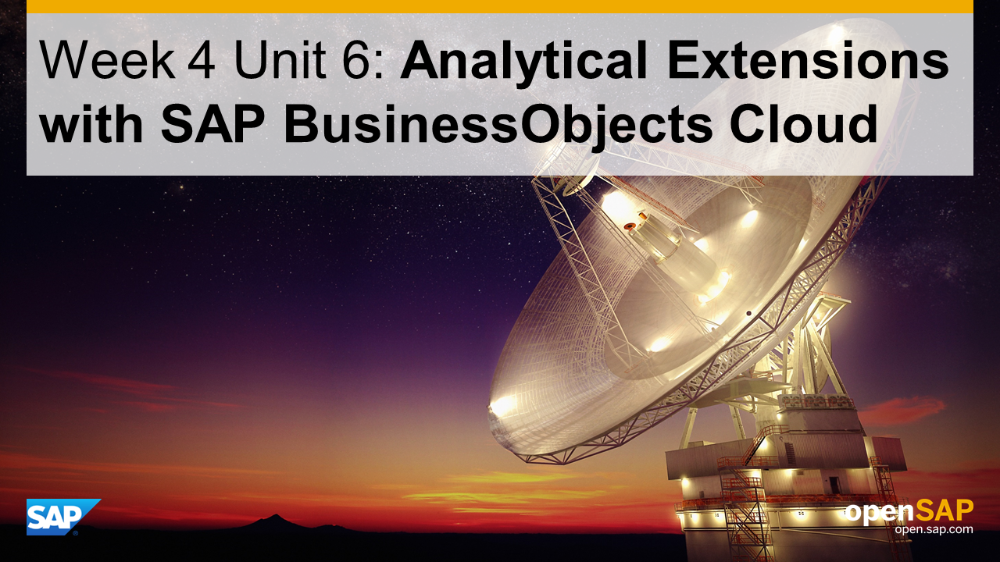
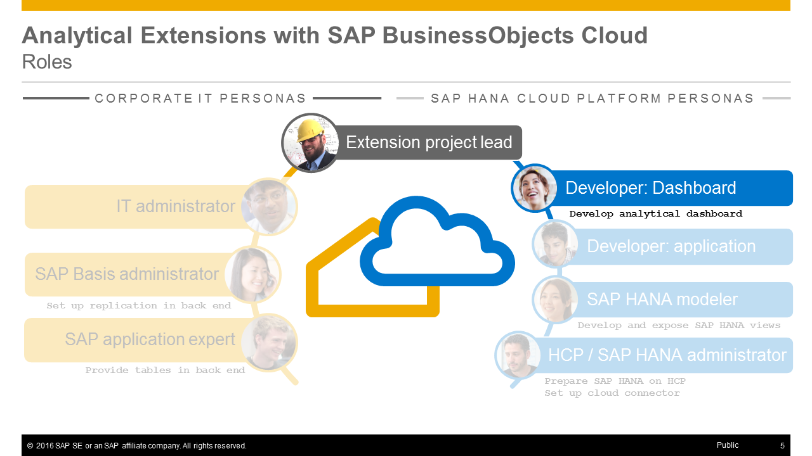

<a name="top"/>



> **Note:** On this page you will only find the presentation slides of the unit, without any additional context or explanations. Therefore **we strongly recommend to watch the [corresponding video](https://open.sap.com/courses/hcp3a1/items/7joQe0UH1LLZiFWtG12F9E)** _(openSAP log-in required)_ in which Thomas Bieser, the course instructor, explains the slides in detail. This will greatly enhance your understanding of this units content.

## Presentation Slides

### Slide 1: Title

### Slide 2: Week Overview

### Slide 3: Unit Overview

### Slide 4: Tasks

### Slide 5: Roles

### Slide 6: What you've learned in this unit

[Top](#top)

[**&lt; Previous** Unit 5](../unit-5/) | [**Up ^** Week 4](../) | [**Next >** Week 5](../../week-5/)