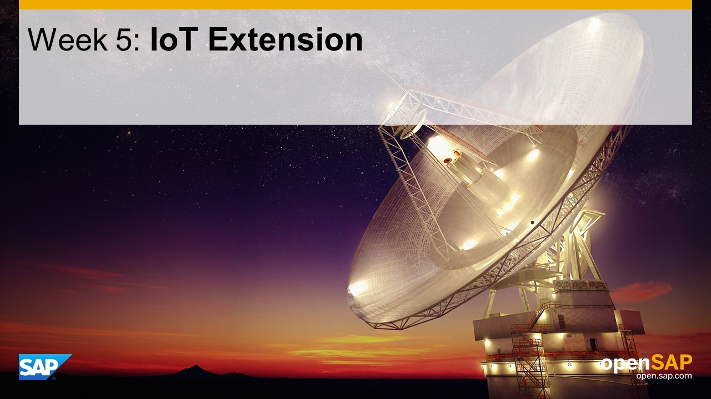

## Units
- Unit 1: [Understand the Challenge](./unit-1/)
- Unit 2: [IoT Service: Setting Up and Connecting Devices](./unit-2/)
- Unit 3: [IoT Service: Writing and Reading Data from SAP HANA](./unit-3/)
- Unit 4: [IoT Extension: Consuming Data from SAP HANA with Java](./unit-4/)
- Unit 5: [IoT Extension: Providing OData Services with Java](./unit-5/)
- Unit 6: [IoT Extension: SAP Fiori User Interfaces](./unit-6/)

## Overview

