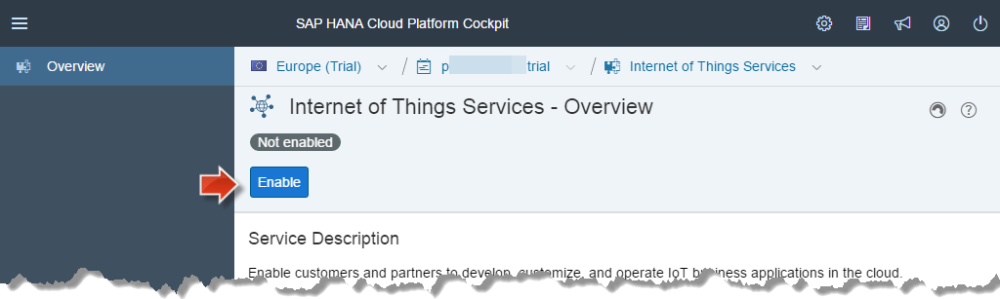
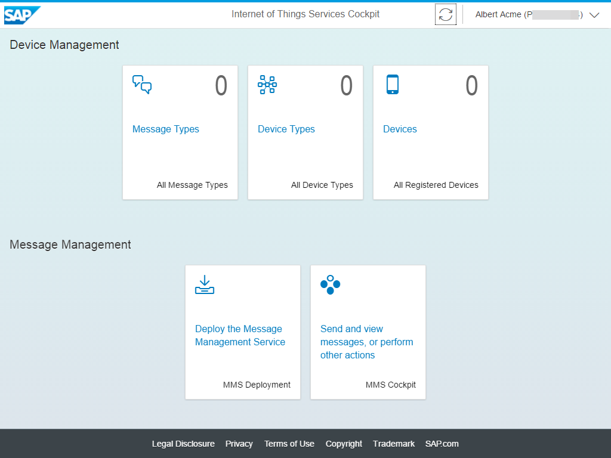
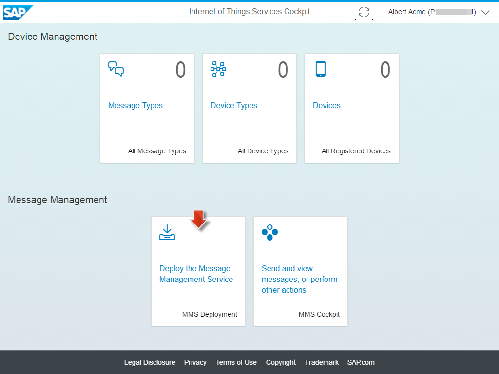
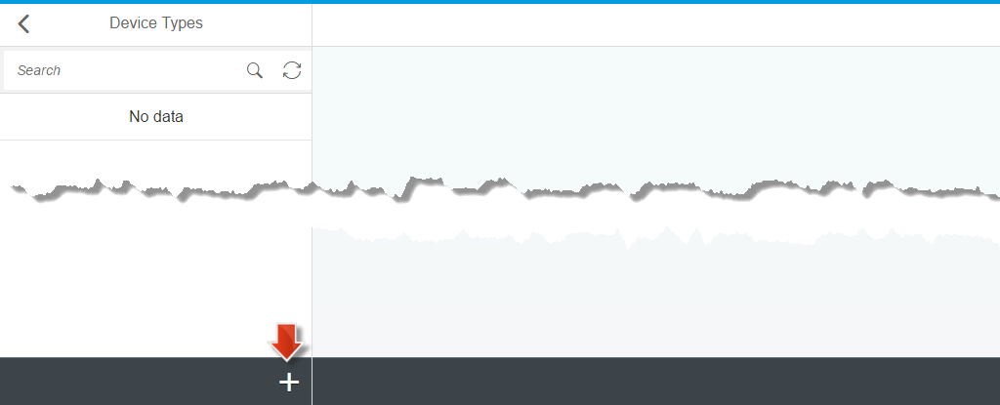
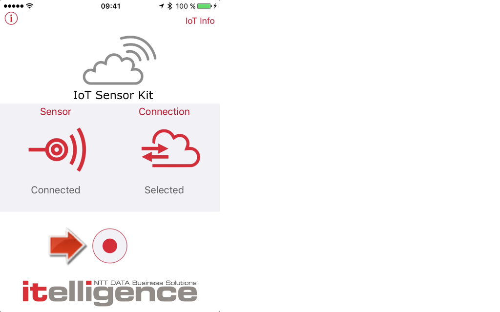
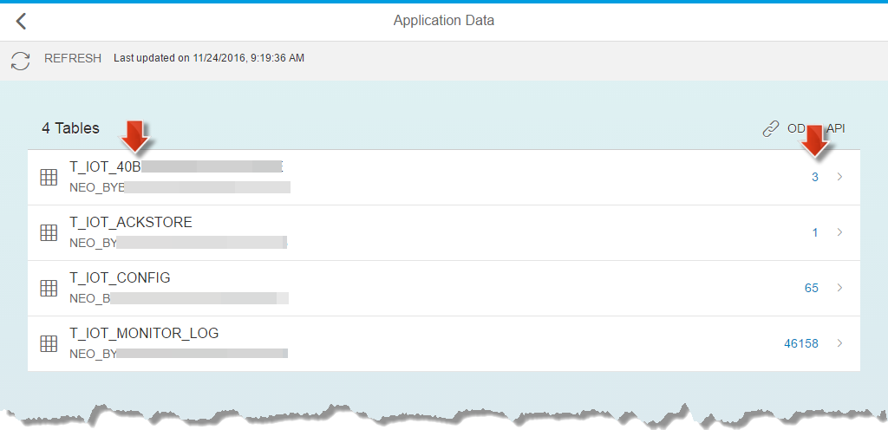

<a name="step-1-top"/><a name="step-2-top"/><a name="step-3-top"/><a name="step-4-top"/><a name="step-5-top"/><a name="step-6-top"/><a name="step-7-top"/><a name="step-8-top"/>





**Overview:**


**Role:**

-   HCP/IoT administrator


**Systems, Tools, Services:**

-   Cloud Cockpit
-   IoT Service and IoT Services Cockpit

## Downloads

| Download Link                                                                                   | Description                             | Context                                                                                       |
| ----------------------------------------------------------------------------------------------- | --------------------------------------- | --------------------------------------------------------------------------------------------- |
| [**IoT Sensor Environment.json**](./imports/postman/IoT%20Sensor%20Environment.json?raw=true)   | Postman Environment configuration files | [6.1 Send Acceleration Messages using Postman in Google Chrome](#send-acceleration-messages-using-postman-in-google-chrome) |
| [**IoT Sensor Messages.json**](./imports/postman/IoT%20Sensor%20Messages.json?raw=true)         | Postman Messages configuration file     | [6.1 Send Acceleration Messages using Postman in Google Chrome](#send-acceleration-messages-using-postman-in-google-chrome) |
| [**iot-internet-http.properties**](imports/destinations/iot-internet-http.properties?raw=true)  | Destination properties file             | [Step 8: Import Destination iot-internet-http](#step-8-import-destination-iot-internet-http)  |

## Step 1: Enable Internet of Things Services in HCP Account

1.  Log in to your [SAP HANA Cloud Platform Trial](https://account.hanatrial.ondemand.com/cockpit/) account, by opening your [**HCP**](../../week-1/unit-5#step-3-prepare-sap-hana-cloud-platform-trial-account) bookmark.
2.  Click on the **&lt;p-user>trial** link to open the account dashboard, in case it is not already opened.
3.  On the left side, navigate to **Services**.
4.  Find and open the **Internet of Things Services**.

    

5.  Press the **Enable** button, to enable the _Internet of Things Services_ in your own HCP account.

    

6.  After the service is enabled, click on the **Configure Internet of Things Services** link.

    

7.  On the left side navigate to **Roles**. You will see that your HCP user is already assigned to the predefined role _IoT-User_, which is all we need for now.

    

8.  Go back to the **Internet of Things Services - Overview**.

    

9.  Click on the **Go to Service** link.

    

10. The **Internet of Things Services Cockpit** opens in a new browser tab.

    

    <a name="iot-service-cockpit-bookmark"/>
11. Create a **Google Chrome bookmark** with the name **IoT Service Cockpit**.

> **Result:** The **Internet of Things Service** is enabled and ready to use.

[Top](#step-1-top)

## Step 2: Deploy IoT Message Management Service (MMS)

The _Internet of Things Service_ has been enabled in the previous step. You will now define _Message Types_, _Device Types_ and _Devices_ in the IoT Service Cockpit. The _Message Management Service (MMS)_ is the component that is responsible for receiving data from
devices and sending messages to devices. In this step you will deploy the _MMS_ into your SAP HANA Cloud Platform account.

1.  Open the [**IoT Services Cockpit**](#iot-service-cockpit-bookmark) from the previous step in your browser.
2.  Click on the **Deploy the Message Management Service** tile.

    

3.  In the _Deploy the Message Management Service_ check  **User Name** and enter the **Password** of your HCP trial user. Press **Deploy**

    

4.  Confirm the **Deploy** confirmation dialog and click on the **Deploy** button. This deploys a Java application with name **iotmms** into your HCP account.

    

5.  After a successful deployment, a link to the **Java Application Dashboard** for the **iotmms** application will be displayed. Here you can _assign roles to users_, who need to get access to the IoT services. **Open this link**.

    

6.  In the opened **Java Application Dashboard**, verify that the **iotmms** service is in state **Started**.

    

    > **Hint:** You can also find the _iotmms_ service directly in the HCP cockpit: To find it in your account, navigate to  **Applications** > **Java Applicatons**. Here you can find the _helloworld_ application you deployed in [week 1, unit 5](../../week-1/unit-5/#deploy-and-run-helloworld-java-app-on-hcp-account) and the _iotmms_ application you just deployed.
    >
    > 

7.  Assign the role **IoT-MMS-User** to your HCP user:

    -   In the navigation menu for the application, navigate to **Security** > **Roles**.
    -   Check that the predefined role **IoT-MMS-User** is selected in the roles table.
    -   Click on the **Assign** button in the **Individual Users** table.

    

8.  In the upcoming assign dialog insert your HCP user id (without the trial suffix, for example: p19411111) and click on **Assign**.

    

9.  Now you are ready to open the _Message Management Service_  application with your HCP user:

    -   Click on **Overview** to get back to the dashbord of **iotmms**.
    -   Click on the  **Application URL**.

    

10. In a new browser tab the **Message Management Service Cockpit** will open.

    

    <a name="message-management-service-cockpit-bookmark"/>

11. Create a _Chrome bookmark_ with name **Message Management Service Cockpit**

> **Result:** The **Message Management Service Cockpit** is up and running, and you create a new browser bookmark called **Message Management Service Cockpit**.

[Top](#step-2-top)

## Step 3: Create Message Type

In the IoT service, a **message type** defines the message format and data fields that can be sent or received by an IoT device.

In our scenario, the IoT sensor devices attached to an IT equipment will send **acceleration values**, so that we can detect if a piece of IT equipment gets broken due to mishandling. Whenever the acceleration values for x, y and z axis exceed a certain treshold, a new damage incident with the strength of the shock and timestamp are written to the SAP HANA database running in your HCP account.

1.  In _Google Chrome_ open the [**IoT Services Cockpit**](#iot-service-cockpit-bookmark) bookmark.
2.  Click on the **Message Types** tile.

    

3.  Click on the **+** icon at the bottom of the page to create a **new message type.**

    

4.  Fill out the **Create Message Type** form **EXACTLY** as follows:

    -   Name: **AccelerationMessageType**
    -   Field at position 1: **timestamp** of type **date**
    -   Click the **+ Add Field** three times, to create three additional fields.
    -   Field at position 2: **accX** of type **double**
    -   Field at position 3: **accY** of type **double**
    -   Field at position 4: **accZ** of type **double**
    -   Click on **Create**

    

5.  You will now find the **AccelerationMessageType** message type in the list.

    

6.  Click on the button **Fields** and to verify that you have defined all four fields as you can see in the screenshot. The exact spelling with the capital letters is important!

    

    > **Warning:** If you did a mistake and your result differs from our screenshot, you will need to delete the message type and create it again. Unfortunatley, it is not possible to edit the message type. If you proceed with wrong fields you will experience problems in the next steps!

7.  Click on the **&lt; (Back)** icon to navigate back to the _Internet of Things Services Cockpit_.

    

> **Result:** A new message type **AccelerationMessageType** has been created, which describes the fields a sensor should send to detect a damage.

[Top](#step-3-top)

## Step 4: Create a new Device Type

In the IoT service, a device type specifies a group of devices that share the same specification. Different Message types can be assigned to a device type.

You will create a new device type for the sensors that should register damages to the IT equipment in this step.

1.  In _Google Chrome_ open the [**IoT Services Cockpit**](#iot-service-cockpit-bookmark) bookmark.
2.  Click on the **Device Types** tile.

    

3.  Click the **+** icon at the bottom of the page.

    

4.  Fill out the **Create Device Type** form as follows:

    -   Name: **AccelerationSensorDeviceType**
    -   Further Details: leave this field empty

5.  Click **+ Add Message Type** to add a new assignment to a message type:

    -   Assignment Name: let it empty, by default it gets the name of the selected message type.
    -   Message Type: check that **AccelerationMessageType** is selected.
    -   Direction: check that  **From Device** is selected.

6.  Click **Create** to save the defined device type.

    

7.  You will now find the new **AccelerationSensorDeviceType** device type in the list.
8.  Click on the icon **Msg. Types** (Message Types) to verify that the **AccelerationMessageType** was assigned to the **AccelerationSensorDeviceType**.

    

9.  Click on the **&lt;** (Back) icon to navigate back to the overview page of the _IoT Services Cockpit_.

    

> **Result:** A new **AccelerationSensorDeviceType** device type has been created. Devices of this type are allowed to send messages of type _AccelerationMessageType_.

[Top](#step-4-top)

## Step 5: Create a new Device

An IoT device is a physical object that is able to send or receive messages.

In our scenario the shock sensor is such a device. The shock sensor will be attached to the equipment that has been ordered, before being handed out to an employee. Remember that the shock sensor will send acceleration values.

1.  In _Google Chrome_ open the bookmark [**IoT Services Cockpit**](#iot-service-cockpit-bookmark).
2.  Click **Devices** tile on the overview _IoT Services Cockpit_.

    

3.  Click the **+** Icon at the bottom of the **Devices** page.

    

4.  Fill out the **Create Device** form as follows:

    -   Name: **Sensor01**
    -   Device Type: **AccelerationSensorDeviceType**
    -   Futhere Details: let this field empty
    -   Click **Create** to save the defined device **Sensor01**.

    

5.  A dialog pops up, which displays the **OAuth Access Token**. Copy the displayed **Token** of the **Sensor01** and paste it to a text editor as this value will be needed later.
6.  Click on **Close**.

    

7.  Verify that you have crated your first device with the name **Sensor01** of device type **AccelerationSensorDeviceType**.

    

8.  Click on the **&lt;** (Back) icon in the upper left corner to navigate back to the overview page of the _IoT Services Cockpit_.

> **Result:** You have created your first IoT device with the name **Sensor01** of device type **AccelerationSensorDeviceType**.

[Top](#step-5-top)

## Step 6: Send Data to HCP IoT Services

In the previous steps you have defined a **message type**, a **device type** and your first device **Sensor01**. Now you would like to verify that everything is set up and working correctly.

There are three (alternative) ways to test this:

-   [6.1 Send Acceleration Messages using Postman in Google Chrome](#send-acceleration-messages-using-postman-in-google-chrome)
-   [6.2 Send Acceleration Messages using an iPhone / iPad (optional)](#send-acceleration-messages-using-an-iphone--ipad-optional)
-   [6.3 Send Acceleration Messages using a REST client of your choice (optional, experts only)](#send-acceleration-messages-using-a-rest-client-of-your-choice-optional-experts-only)

#### 6.1 Send Acceleration Messages using Postman in Google Chrome

1.  In [week 1, unit 5](../../week-1/unit-5/#postman-for-chrome) you installed the _Postman_ extension - a REST client for Google Chrome. Open _Postman_ by opening the url **chrome://apps/** in _Google Chrome_.
2.  Download the files [IoT Sensor Messages.json](./imports/postman/IoT%20Sensor%20Messages.json?raw=true) and [IoT Sensor Environment.json](./imports/postman/IoT%20Sensor%20Environment.json?raw=true) to your computer.
3.  Open **Postman**, click on **Import** and select the downloaded file **IoT Sensor Messages.json**. This file contains two prepared HTTP requests: one that sends low accerleration data from the sensor and will not register a damage report for the device, and one shock that will register a device damage incident.

    

4.  Depending of the window size, you might have to click on the **Show Sidebar** button to see the imported REST call collection on the left.

    

5.  Click on the **Environments** button in the upper right corner and select **Manage Environments**.

    

6.  Click on **Import** and select the downloaded file "**IoT Sensor Environment.json**". This file contains information on where the HTTP requests should be sent.

    

7.  Click on the environment name **\*IoT Sensor Environment** to get to the update dialog for this environment.

    

8.  In the upcoming dialog fill in the values as described below and press **Update**.

    
    Value Details:

    -   **hcpTrialUserId**: fill in your HCP user id.

        > **Hint:** You can't remember HCP user id? Open your **HANA Cloud Platform Cockpit** (bookmark **HCP**) in _Google Chrome_ and click on the **User information** button. In the **User Info** dialog you can find your **ID**.
        >
        >  

    -   **messageTypeId**:

        -   Open the **Internet of Things Services Cockpit** (bookmark [**IoT Services Cockpit**](#iot-service-cockpit-bookmark)) in _Google Chrome_.
        -   Select **Message Types**.
        -   Select **AccelerationMessageType**.
        -   Copy the **Id**.
        -   Paste it into the **messageTypeId** field.

        

    -   **deviceId**:

        -   Open the **Internet of Things Services Cockpit** (bookmark [**IoT Services Cockpit**](#iot-service-cockpit-bookmark)) in _Google Chrome_.
        -   Select **Devices**
        -   Select your created Sensor e.g. **Sensor01**
        -   Copy the **Id**
        -   Paste it into the **deviceId** field.

        

    -   **deviceOAuthAccessToken**: In step 3.3 you copied and pasted this OAuth token into a text editor. You may use that one.

        > **Hint:** If you did not save the token you can create a new token:
        >
        > -   Open the **Internet of Things Services Cockpit** (bookmark [**IoT Services Cockpit**](#iot-service-cockpit-bookmark)) in _Google Chrome_.
        > -   Select **Devices**
        > -   Select your created Sensor e.g. **Sensor01**
        > -   Click **Authentication** button and press **Generate Token**  to generate a new token.
        >
        >     
        >
        > -   Copy the token from the upcoming dialog:
        >
        >     

        -   Paste it into the **deviceOAuthAccessToken** field.

9.  Close the **MANAGE ENVIRONMENTS** dialog after you click **Update** to update the values.

    

10. In the **Environment** combo box select the **IoT Sensor Environment** you just updated.

    

11. Click on **POST Message: Low acceleration - No damage** to open the POST HTTP request on the right side.

    

12. Click on the **Send** to send the first message to the HCP IoT Services.
13. Select the **POST Message: High acceleration - Damage** and click on **Send** to send a message with higher acceleration value.

    

    > **Hint:** When you click on **Code** _postman_ shows you an overview of the _POST_ request:
    >
    > 
    >
    > You may also use the different other tabs to learn more details about the requests you are sending:
    >
    > 

14. This is all we need to do for now. If you want to send more acceleration messages, please feel free to change the accerleration values and to send additional requests to the HCP IoT Services.

> **Result:** You have now sent (at least) two acceleration messages from an emulated sensor device to the HCP IoT Services: One request had high acceleration values that were so high, that a damage was registered for this device. You may now continue with the next [step 7](#step-7-explore-stored-iot-data-sent-by-a-sensor), or alternatively use the acceleration sensor in an iPhone / iPad to generate more data in [substep 6.2](#send-acceleration-messages-using-an-iphone--ipad-optional).

[Top](#)

#### 6.2 Send Acceleration Messages using an iPhone / iPad (optional)

This substep is optional, as the app we are using to send the sensor data to the HCP IoT Services is only available for iOS devices (iPhone or iPad).

1.  In your _iOS device_, goto the **iTunes App store** and install the **IoTSensor** app published by **itelligence AG**.

    

    You may scan this QR code to find the app in the iTunes App store:
    

2.  The **IoTSensor** app allows you add a connection to the HCP IoT Services in your HCP account, by scanning a QR code. However, you need to create this QR code containing the information that points to your HCP IoT Service.
3.  On your computer, in _Google Chrome_ open the _bookmark_ [**IoT Services Cockpit**](#iot-service-cockpit-bookmark).
4.  Click on the tile **Device Types** and and select the device type **AccelerationSensorDeviceType**.
5.  Copy the displayed device type **ID** and **Device Registration Token** of the **AccelerationSensorDeviceType** and paste it to a text file.

    > **Hint:** Copy the ID and Token of **Device Type** and not the values of **Device**.

    


5.  Copy and paste the following string to a text editor: **iot-create://&/accountName&/\<hcpTrialUserId>trial&/name&/\<hcpTrialUserId>Connection&/dataCenter&/hanatrial&/deviceName&/myDevice&/deviceTypeID&/\<deviceTypeId>&/deviceReg&/\<deviceTypeRegistrationToken>&/messageTypeID&/\<messageTypeId>**
6.  Find and replace the following parameters:

    -   **\<hcpTrialUserId>** - your HCP Trial User ID, e.g., "P194234567" without trial in the end.
    -   **\<deviceTypeId>** - the device type ID, from the IoT Services Cockpit
    -   **\<messageTypeId>** - the message type ID, from the IoT Services Cockpit
    -   **\<deviceTypeRegistrationToken>** - the device type registration OAuth token, which you copied to your clipboard now in sub-step 5 of section 6.2.

    - Example: **iot-create://&/accountName&/p000000trial&/name&/myTrialConnection&/dataCenter&/hanatrial&/deviceName&/myiPhone&/deviceTypeID&/f807b43597e44cf1fc4b&/deviceReg&/ce89c5cfe7fdb25b381eff51136b97&/messageTypeID&/9208dd4b8cc54bc1fb1b**.

    > **Hint:** Copy and replace the ID of **Device Type** and the respective token and not the ID and Auth Token of **Device**. For further reference: <http://scn.sap.com/docs/DOC-71601>.

7.  In your Google chrome browser, Click the Google Chrome extension **The QR Code Generator** which you added in [Week 1, Unit 5](../../week-1/unit-5/#qr-extension-for-chrome).
8. Click on **Edit this QR code** and paste the string you **enriched with your HCP IoT Services logon data**. This will generate a new QR code specific for your IoT Service on HCP.
9.  Open the **IoTSensor** app on your iOS device, tap on **Connections** and scan your **personal QR code** for the IoT Service.

    

10. After you successfully scanned the QR code, a **New Connection** dialog opens with pre-filled values. Tap on **Registration** to register this connection.

     

    > **Note:** Check if the field **Device Name** has a special character "**'**", if yes, remove this special character as the registration would fail due to this special character in device name.

11. You should get a message: **Registration was successful**.

    

12. Tap on **Back** and tap on **Sensor**.

    

13. Select your iOS device as **Source**. Then press the **Configuration** icon, which looks like a gear.

    

14. Change the **HTTP upload** interval to **1s** which means that sensor data is sent to your **HCP IoT Services** every second.

    

15. Now tap on the **Select Source** and **Back** to navigate back to the home screen of the app.
16. Tap on the **record icon** (red circle) to start recording and to send messages to your **HCP IoT Services**. Verify that the **Sensor** is **Connected** and **Connection** shows **Selected**.

    

17. Now is the time when it's time to shake your iOS device like crazy! (Be nice to your device, and don't bang it on the table. :)) High acceleration (=fast movement) will trigger damage reports for your sensor.
18. You should now see messages like **1 message(s) received from device\[...]**. Tap on the **Stop** button to stop sending the sensor messages.

    

> **Result:** You have now successfully sent sensor data from your iOS device to your SAP HANA Cloud Platform Internet of Things Services. If you shook your device hard enough, you should have registered some damages for this device.

[Top](#step-6-top)

#### 6.3 Send Acceleration Messages using a REST client of your choice (optional, experts only)

You may also use any other **REST** client - however this is a bit harder and requires some expert knowledge. There is no need of using **Postman**.

Just create a HTTP request using the following details:
Replace all `<...>` place holders using the correct values as described at step 8 of [6.1 Send Acceleration Messages using Postman in Google Chrome](#send-acceleration-messages-using-postman-in-google-chrome).

-   **Request Method**: POST
-   **URL**: https://iotmms\<hcpTrialUserId>trial.hanatrial.ondemand.com/com.sap.iotservices.mms/v1/api/http/data/\<deviceId>
-   **Header - Content-Type**: application/json
-   **Header - Authorization**: Bearer \<deviceOAuthAccessToken>
-   **JSON Body** (Please replace the time stamp and messageTypeId. The acceleration values should also be changed for each request.):

    > **Hint:** Make sure that you copy the ID and Token of **Device** here and not of **DeviceType**.

    -   Low acceleration - No damage:


        ```json
        {
            "mode":"sync",
            "messageType":"<messageTypeId>",
            "messages":[
                {
                    "timestamp":<current time stamp eg. 1475079756>,
                    "accX": 0.4151,
                    "accY": -0.3861,
                    "accZ": -0.1825
                }
            ]
        }
        ```

    -   High acceleration - Damage:

        ```json
        {
            "mode":"sync",
            "messageType":"<messageTypeId>",
            "messages":[
                {
                    "timestamp":<current time stamp eg. 1475079756>,
                    "accX": 4.0291,
                    "accY": 0.5061,
                    "accZ": -0.1409
                }
            ]
        }
        ```

[Top](#step-6-top)

## Step 7: Explore stored IoT data sent by a sensor

Now let's find out which data has was sent to the **HCP IoT MMS Service**. In this step you will see where you can find the data with the acceleration messages.

1.  In _Google Chrome_ open the _bookmark_ [**Message Management Service Cockpit**](#message-management-service-cockpit-bookmark).
2.  Click on the tile **Display stored messages**.

    

3.  All relevant database tables of the IoT Message Management Service are shown here. The table containing the sensor messages is called **T_IOT_\<MESSAGE_TYPE_ID>**. The number of entries is displayed as well. Click on the table name to see the individual entries.

    

4.  The message details window list all messages. In the screen you should see at least two messages (depending on what you did in step 6): One with low acceleration values and one with high accelerations, indicating a damage.

    
     Details for the columns:

    -   **G_DEVICE**: id of the device, which sent the message.
    -   **G_CREATED**: timestamp, when the message reached the _MMS service_.
    -   **C_TIMESTAMP**: timestamp, which the sensor transmitted. When defining the MessageType in [step 3.1](#step-3-create-message-type), this was one of the fields you defined. In the _POST_ HTTP request, that is sent to the HCP IoT Service, you can find the field in the request body. The REST/iOS client created an actual timestamp for you, when sending the request.
    -   **C_ACCX**, **C_ACCY**, **C_ACCZ**: These are the acceleration values. They are also a part of the HTTP request body and fields of the MessageType.

5.  Click on the link **OData API**. This API lists access to the IoT messages using an OData service. The URL looks like this: **https://iotmms\<HCP trial user id>trial.hanatrial.ondemand.com/com.sap.iotservices.mms/v1/api/http/app.svc/\<NEO schema name>.T_IOT_\<messagetypeid>**

    

6.  The **OData API** for the HCP IoT Service displays all messages as OData entity types.

    

7.  Replace the table name in the URL with **$metadata** to retrieve the OData metadata document describing the _Entity Data Model_ for this service. (The URL looks like this: **https://iotmms\<hcp trial user id>trial.hanatrial.ondemand.com/com.sap.iotservices.mms/v1/api/http/app.svc/$metadata**)

    

> **Result:** You now know where the IoT messages are stored, and how to retrieve the data using the OData API.

[Top](#step-7-top)

## Step 8: Import Destination _iot-internet-http_.

In this step you will add a new destination, pointing to the IoT Services to your SAP HANA Cloud Platform account. This destination is needed to allow the SAP Web IDE to access the API. As you already have seen in the previous weeks, we have provided a prepared destinations properties file, which you may import.

1.  Download the file [iot-internet-http.properties](imports/destinations/iot-internet-http.properties?raw=true) (Right-click > Save link as...).
2.  Open the _Chrome bookmark_ **HCP**.
3.  Expand  **Connectivity** and select **Destinations**.
4.  Press **Import Destination** and import the downloaded **iot-internet-http.properties** file.

    

5.  In the **Destination Configuration** edit the following properties:

    -   **URL**: replace the place holder **&lt;YOUR_TRIAL_USER_ID>**  with your **HCP trial User ID**
    -   **User**: replace the place holder **&lt;YOUR_TRIAL_USER_ID>**  with your **HCP trial User ID**. Hint: In a productive environment you should use a technical user here and not your user. 
    -   **Password**: fill in the password of your HCP user
    -   don't change the other properties

    > **Hint:** if you don't know your HCP user ID, just click on the  button in the upper right corner to get _User Info_ dialog opened.

6.  Press **Save** to save the _iot-internet-http_ destination.

    > **Result:** The new destination appears in the _Destinations_ list.
    >
    > 

[Top](#step-8-top)

## Unit Result:

> You have configured a _Device_ in the SAP HANA Cloud Platform IoT Services and sent your first sensor messages. You also learned how to explore the data for received messages and now know the database tables, where the data is stored.

[**&lt; Previous** Unit 1](../unit-1/) | [**Up ^** Week 5](../) | [**Next >** Unit 3](../unit-3/)
