<a name="step-1-top"/><a name="step-2-top"/><a name="step-3-top"/>





<a name="step-1-top"/><a name="step-2-top"/><a name="step-3-top"/>

**Overview:**

**Role:**

-   HCP/IoT administrator

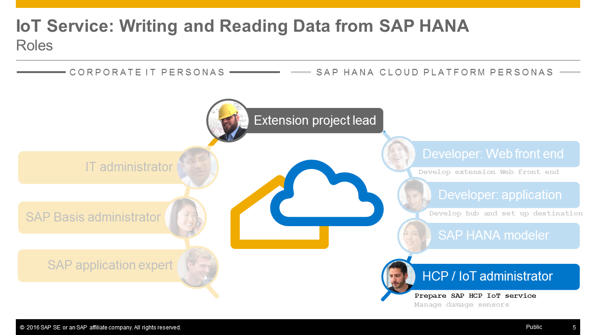

**Systems, Tools, Services:**

-   HCP Cockpit
-   IoT Services
-   HANA database on HCP

## Step 1: Preparation Steps

#### 1.1 Check that SAP HANA database in your HCP account is started

In SAP HANA Cloud Platform trial accounts SAP HANA MDC databases will be stopped after some hours. So please check that your **hana** database in your HCP account is still up and running. You can find instructions on how to do this in [Week 4, Unit 3, Step 1.1](../../week-4/unit-3/#step-11-ensure-that-your-sap-hana-database-is-running).

#### 1.2 Verify your SAP HANA Development environment in Eclipse is connected to your HANA DB on HCP

Also verify your **SAP HANA Development** environment in Eclipse is connected to your HANA database on HCP. If needed, log on using the **ACME** user. You can find instructions on how to do this in [Week 4, Unit 3, Step 2](../../week-4/unit-3/#step-2-verify-your-sap-hana-development-environment-in-eclipse-is-connected-to-your-hana-db-on-hcp).

[Top](#step-1-top)

## Step 2: Write IoT messages to your SAP HANA database

In the [previous unit 2](../unit-2/) you used the _HCP IoT Services_. By default, all messages are written to some database which is proprietory for the HCP service. However, for this scenario, you want to store the IoT messages in your HANA database on HCP, so that the IoT data is stored in the same database as the replicated business data from your SAP NetWeaver backend system. So in this step, you will write the IoT messges to your SAP HANA database on HANA Cloud Platform.

#### 2.1 Change the Data Source Binding of the IoT Service

First you have to change the data source binding of the **IoTService** Java application. You will change it to use the **ACME** user of your **hana** database.

1.  In _Google Chrome_ open the **HCP** bookmark, to get to your SAP HANA Cloud Platform account overview page.
2.  Open the dashboard of the **iotmms** Service: **Applications** > **Java Application** > **iotmms**.

    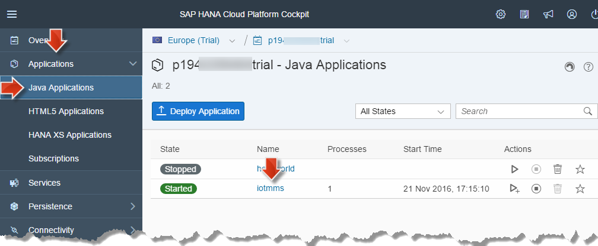

3.  Press the **Stop**-button to stop the **iotmms** Java application. Accept the additional stop request dialog.

    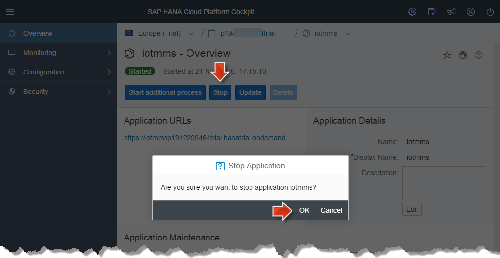

4.  Expand the node **Configuration** of **iotmms** and select **Data Source Bindings** in the navigation area.

    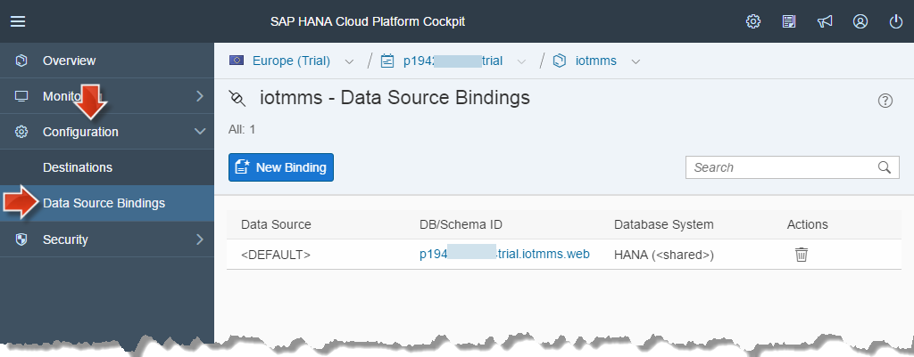

5.  The existing binding **p1234567890trial.iotmms.web** of **HANA (&lt;shared>)** needs to be deleted: Press the **trash**-icon and accept the confirmation dialog by clicking on **OK** to delete the binding.

    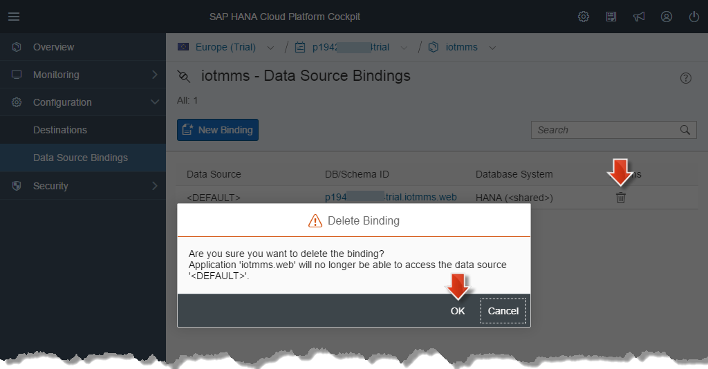

6.  Click on the button: **New Binding** to specify a new binding to your **hana** MDC database using the following properties:

    -   **Data Source:** leave as **\<default>**.
    -   **DB/Schema ID:** select  **hana**, which is the name of your MDC HANA database.
    -   **Database User:** **ACME**
    -   **Password:** provide the **password** of the database user **ACME** .
    -   **Verify crendentials** is checked.
    -   Click **Save** to save the data source binding.

    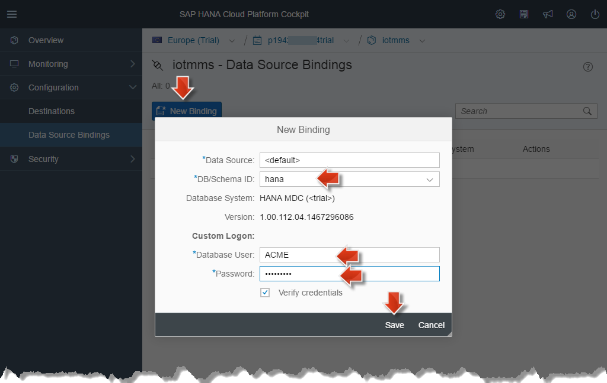

7.  Go back to the **iotmms-overview**. The application should now be _stopped_. (If it is not, just wait a little.) Press the **Start**-button to start the application again. This restart is needed to apply the changed data source binding for the Java application.

    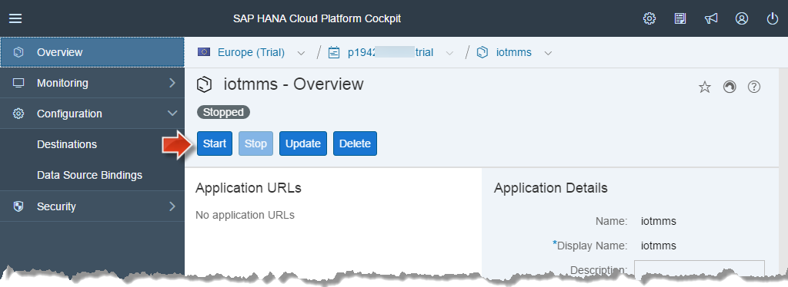

8.  Wait until the application state turns to **Started**.

    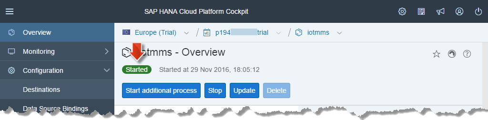

#### 2.2 Check for changes in your SAP HANA database

Lets find out if something changed in your **hana** database on HCP.

1.  Open your **Eclipse workspace**.
2.  Open the perspective **SAP HANA Development**.
3.  Log on to your SAP HANA database in the **Systems** view.
4.  Expand  **Catalog**> **ACME** > **Tables** .
5.  Some configuration tables like **T_IOT_CONFIG** and **T_IOT_MONITOR_LOG** should now have been created. However, there will not be a table containing any messages yet.

    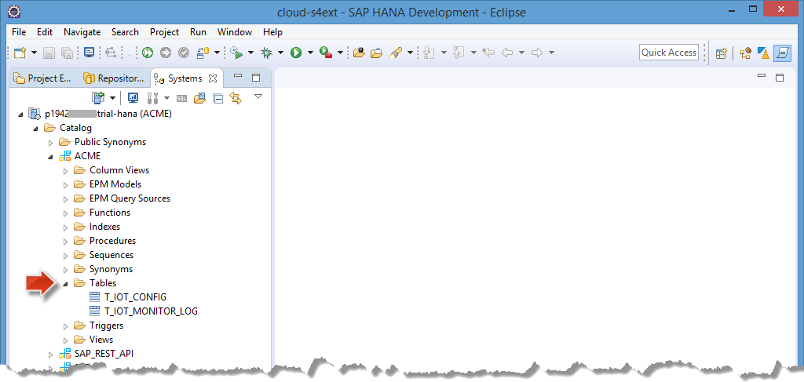

    > **Remember:** The replicated data are stored in a different schema **SLT_REPLICATION**. This is why you can't see the replicated data tables here.

#### 2.3 Store IoT Messages in Table **T_IOT_MESSAGE**

Remember that in the [previous Unit 2](../unit-2/) IoT messages were stored in a table named **T_IOT_\<MESSAGE_TYPE_ID>**. The _MESSAGE_TYPE_ID_ is a _UUID_ which you could not specify when creating the according Message Type.

In one of the next steps we want to join the sensor data with the replicated data. Now we will configure that the sensor messages will be stored in the table **T_IOT_MESSAGE**.

1.  Go back to your browser and open the browser bookmark **Message Management Service Cockpit** which you created in [previous Unit 2](../unit-2/#message-management-service-cockpit-bookmark).
2.  Open the tile **Configure Processing Service Mappings (Configuration)**

    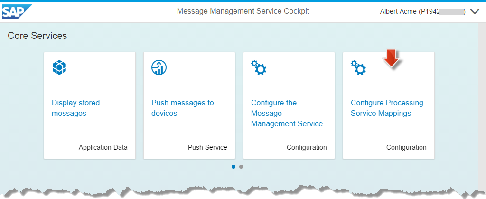

3.  In the **Processing Service Mappings** press **+ Add Mapping** to create a new configuration.

    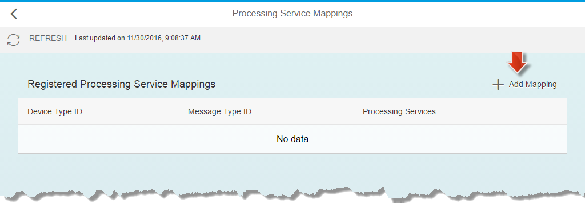

4.  You now need to fill in the **Device Type ID** and the **Message Type ID**. You can retrieve the data as follows:
5.  Get the **Device Type ID** from the **IoT Service Cockpit** and copy it to the field **Device Type ID**:

    -   In the **Internet of Things Service Cockpit** open the **Devices Types**.
    -   Select the already created **AccelarationSernsorDeviceType**
    -   Use the displayed **ID**
    
    > **Hint:** Please copy the ID of **DeviceType** and not the ID of **Device**.
    
    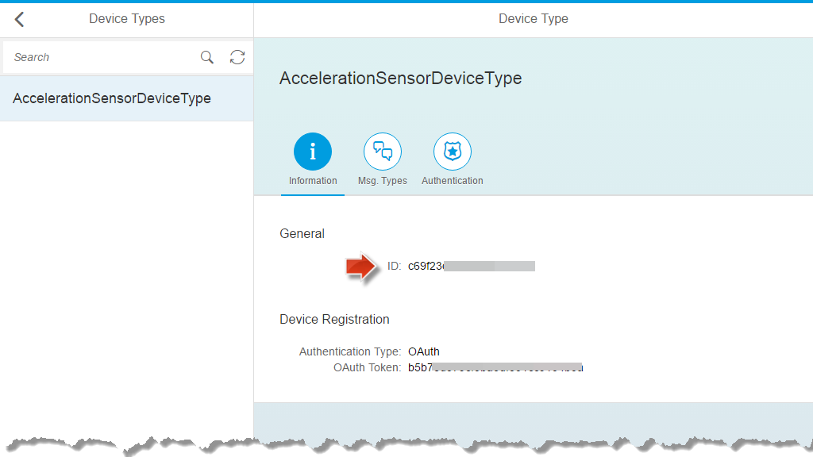

6.  Get the **Message Type ID** from the **IoT Service Cockpit** and copy it to the field **Message Type ID**:

    -   in the **Internet of Things Service Cockpit** open the **Message Types**.
    -   select the **AccelarationMessageType**
    -   use the displayed **ID**

        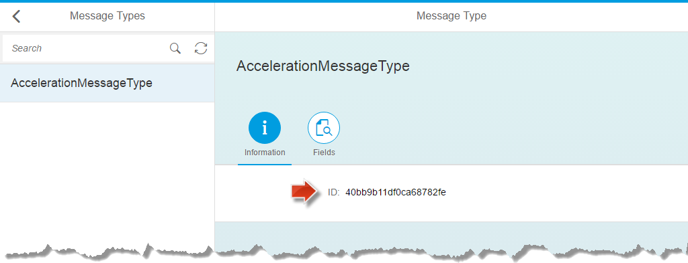

7.  Click on **+ Add Processing Service**.

    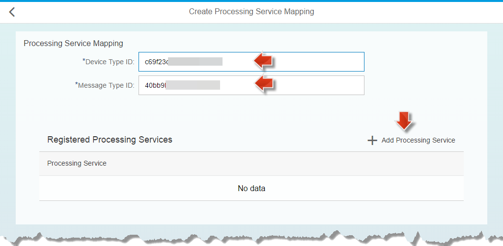

8.  In the upcoming **Select Processing Service** select **sql** from the list.

    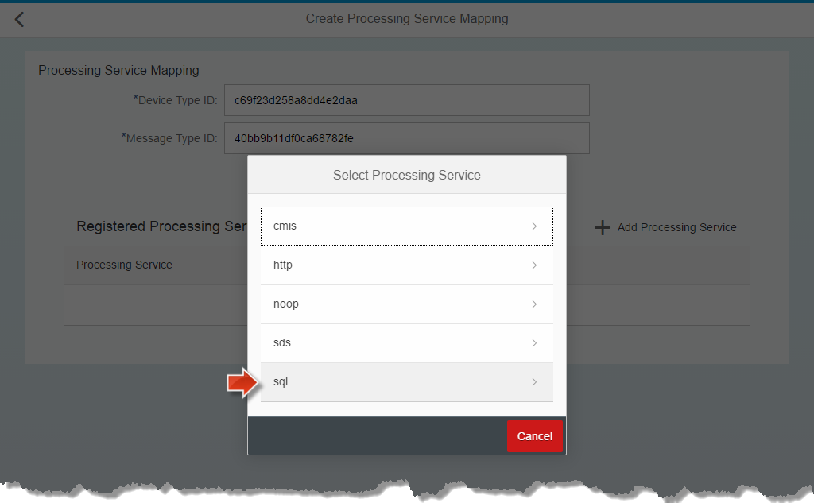

9.  It opens the **Create Processing Service SQL** configuration:

    -   **Create Default Columns**:
        -   _Value_: **ON**
        -   _Overwrite Global_: **Checkbox checked**
    -   **Database Schema NAME**:  **ACME**
    -   **Table Name**:
        -   _Value_: **T_IOT_MESSAGE**
        -   _Overwrite Global_: **Checkbox checked**
    -   Click on the **Back to Mapping Page** button.

    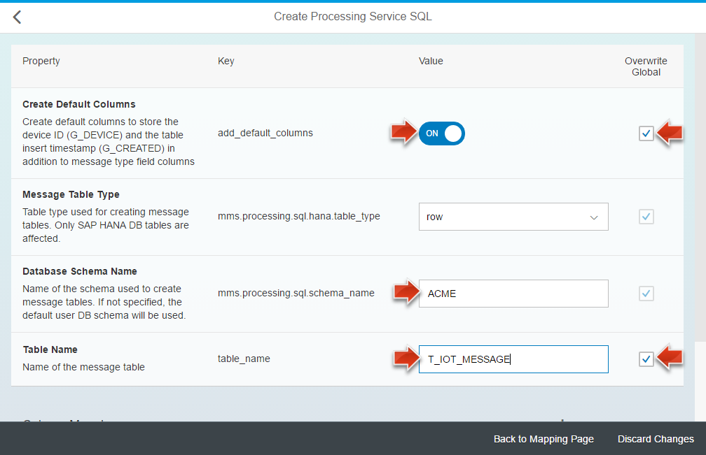

10. Back in the **Create Processing Service Mapping** dialog, click on the button **Create** to save the mapping.

    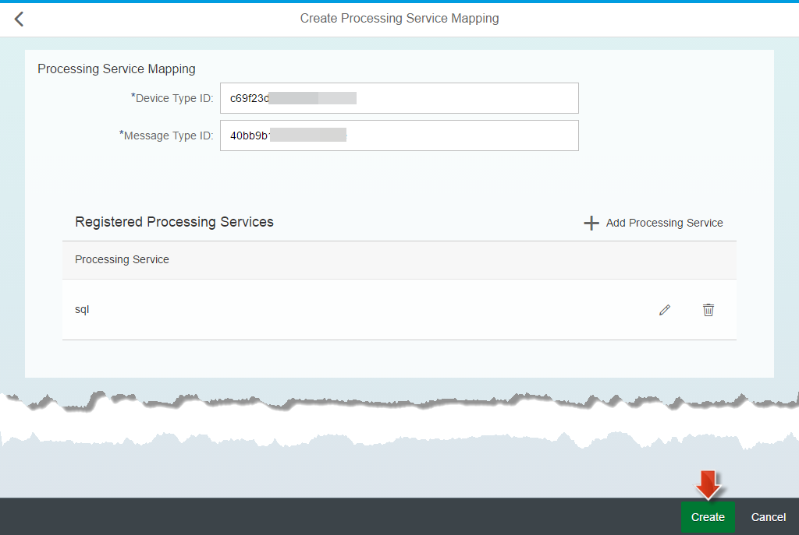

> **Result:** Now you have configured the HCP IoT Service, so that it will store messages in your own _hana_ database. Additionally, you have configured the service so that it will store sensor message in a new table with the name T_IOT_MESSAGE.

[Top](#step-2-top)

## Step 3: Send Acceleration Messages

Now that you have changed the data binding for your IoT service, your message tables in your SAP HANA database will be empty. Therefore it is now time to send some new messages. After you have sent some fresh acceleration messages, the table **T_IOT_MESSAGE** should be created and contain the new message data.

Go back to [week 5, unit 2, step 6](../../week-5/unit-2/#step-6-send-data-to-hcp-iot-services) to see how you can send fresh IoT sensor data. Make sure that you send some **messages with low acceleration values**, but some **messages with high acceleration values as well**, so that some damages will be visible later.

#### 3.1 Check SAP HANA Database Content

1.  Go Back to **Eclipse** > Perspective **SAP HANA Development** > View **Systems** > **p1234567890trial-hana(ACME)** >

2.  Navigate to **Catalog** > Schema **ACME** > **Tables** and **Refresh** your database. A new table **T_IOT_MESSAGE** should have appeared.
3.  Open the **Context Menu** of table **T_IOT_MESSAGE** and select **Open Content**. You should now find your fresh IoT messages.

    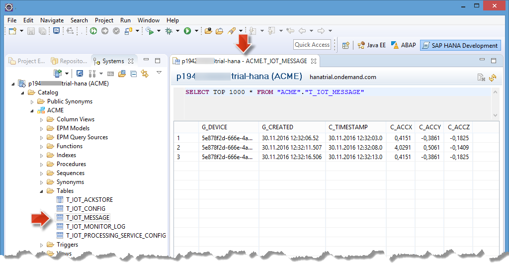
    In the above screenshot three messages have been sent.

    > **Warning:** It is important that you don't have any spelling mistakes in the database table name and table columns, as you would run into problems in later units otherwise. If you need to correct these, make sure to stop and restart the iotmms service to activate any changes.

[Top](#step-3-top)

## Unit Result:

> You have now configured the **HCP IoT Services** to store its data on the SAP HANA database running in your HCP account. You have also adjusted the configuration, so that sensor messages are stored in the table called **"ACME"."T_IOT_MESSAGE"**. You also sent some fresh sensor data, and verified that they are now being written to the SAP HANA database.

[**&lt; Previous** Unit 2](../unit-2/) | [**Up ^** Week 5](../) | [**Next >** Unit 4](../unit-4/)
