<a name="step-1-top"/><a name="step-2-top"/><a name="step-3-top"/>





**Overview:**

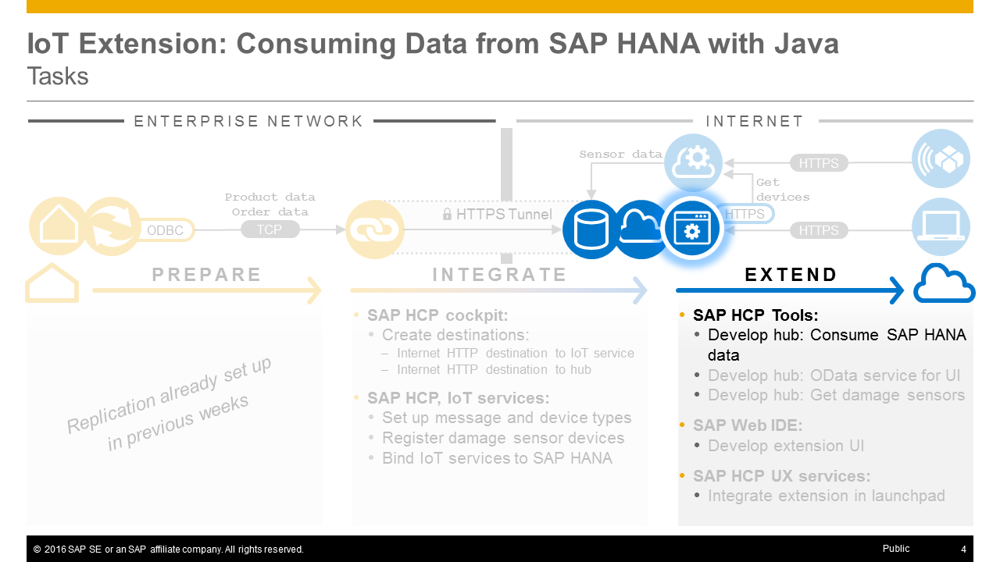

**Role:**

-   Developer: application

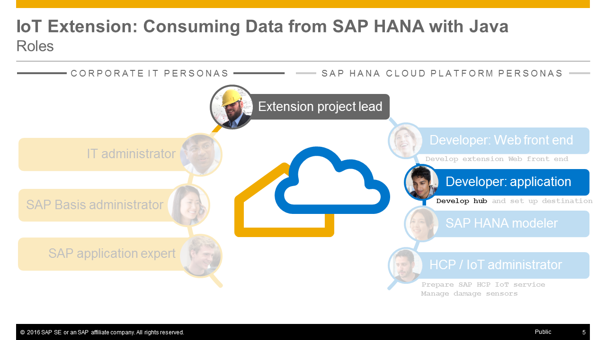

**Systems, Tools, Services:**

-   Java
-   Eclipse
-   Maven
-   Cockpit

## Downloads

| Download Link                              | Description                               | Context                                                                                   |
| ------------------------------------------ | ----------------------------------------- | ----------------------------------------------------------------------------------------- |
| [**hub-v1.zip**](imports/java/hub-v1.zip) | Java Source of Project _hub_ in version 1 | [Step 3: Import Java hub sources in Eclipse](#step-3-import-java-hub-sources-in-eclipse) |

## Step 1: Preparation Steps

#### 1.1 Check that SAP HANA database in your HCP account is started

In SAP HANA Cloud Platform trial accounts SAP HANA MDC databases will be stopped after some hours. So please check that your **hana** database in your HCP account is still up and running. You can find instructions on how to do this in [Week 4, Unit 3, Step 1.1](../../week-4/unit-3/#step-11-ensure-that-your-sap-hana-database-is-running).

#### 1.2 Verify your SAP HANA Development environment in Eclipse is connected to your HANA DB on HCP

Also verify your **SAP HANA Development** environment in Eclipse is connected to your HANA database on HCP. If needed, log on using the **ACME** user. You can find instructions on how to do this in [Week 4, Unit 3, Step 2](../../week-4/unit-3/#step-2-verify-your-sap-hana-development-environment-in-eclipse-is-connected-to-your-hana-db-on-hcp).

[Top](#step-1-top)

## Step 2: Understanding the Goal of the Java Hub implementation

In order to build the IoT Extension, you need to access different data sources: The **replicated sales order information** and the **IoT sensor data** which are stored **in the SAP HANA database** in your SAP HANA Cloud Platform account. Then you need to access information about **registered sensor devices**, which is provided by the **IoT Services REST API**. You also need to **implement some logic**, e.g. to calculate from the sensor messages which values have exceeded a certain threshold, in order to **calculate damage reports** for registered devices.

To accomplish all of this, you will use [**EclipseLink JPA**](http://www.eclipse.org/eclipselink/) to create the **first version** of the **Java Hub application**.

Let's have a look at the data model:

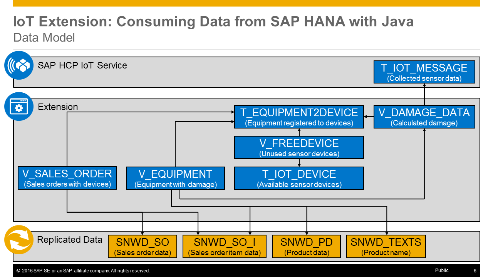

In the data model you can find the replicated data tables (originating from your SAP NetWeaver backend system) at the bottom. There is sales order, sales order item, and product data information. At the top you can find the _T_IOT_MESSAGE_ table containing the sensor messages recorded using the HCP IoT Services.

The Java Hub extension will now create the following missing entities, which you need to build the **IoT Extension**.

-   **T_EQUIPMENT2DEVICE**: table linking a _device_ to an _equipment_
-   **T_IOT_DEVICE**: table containing all _devices_, synced from the HCP IoT Services
-   **V_FREEDEVICE**: view containing all _free devices_, which are not used to track a equipment
-   **V_DAMAGE_DATA**: view _calculation for damage detection_
-   **V_EQUIPMENT**: view joining _damage details_ with the _sales orders_
-   **V_SALES_ORDER**: view joining _device details_ to the _sales orders_

## Step 3: Import Java Hub sources in Eclipse

We have prepared a Java Hub application as a Maven project for you. (You learned how to work with Maven in [Week 1, Unit 5](../../week-1/unit-5/).)

1.  Download the zip archive [hub-v1.zip](imports/java/hub-v1.zip?raw=true) and extract the archive to your local file system.
2.  Open **Eclipse**.
3.  Select  **File** > **Import ...** > **Maven** > **Existing Maven Projects** > **Next**

    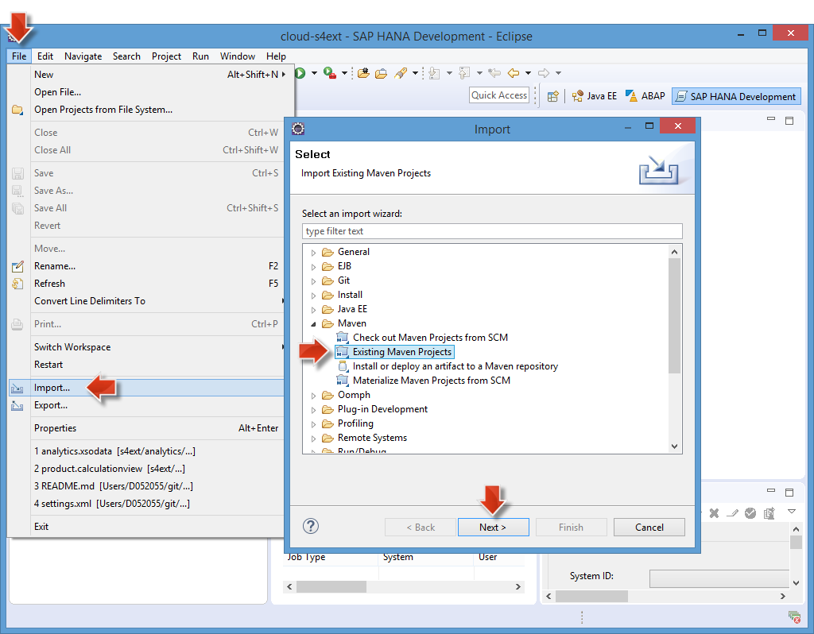

4.  In the **Import Maven Projects** dialog:

    -   click **Browse...** and select **&lt;your hub-v1 unzip directory>/hub-v1**.
    -   Check the checkbox the **pom.xml** file in the **Projects** section.
    -   Check the checkbox **Add project(s) to working set** and this project to your **JAVA** working set.
    -   Press **Finish**

    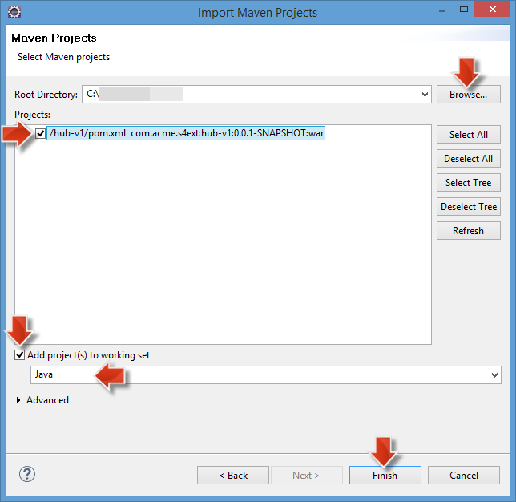

5.  In the **Project Explorer** view you will now find the new **hub-v1** (included in the **Java** working set).

    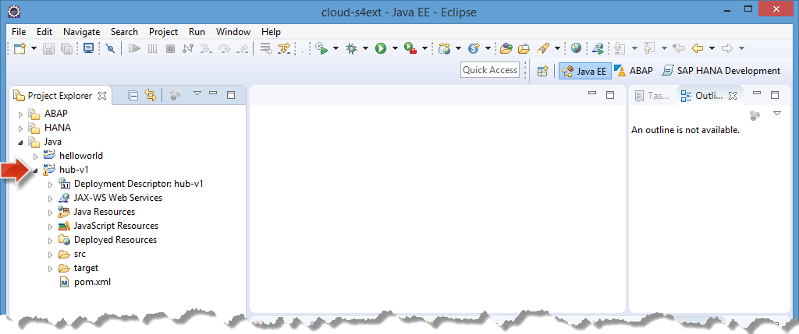

> **Result:** You now imported the _hub-v1_ Java development project to your _Eclipse_ workspace.

[Top](#step-1-top)

## Step 4: Build and Deploy the Java Hub Application

In this step you will run a _maven install_ on the _hub-v1_ project in Eclipse. This will result in a _war_-file that will be deployed as a Java application to your _HCP account_.

#### 4.1 Build via _maven install_

1.  Open Eclipse and the workspace where you have already imported the **hub-v1** maven project.
2.  In the Project Explorer, right-click on the **hub-v1** project and select **Run As** > **8 Maven install** from the context menu.

    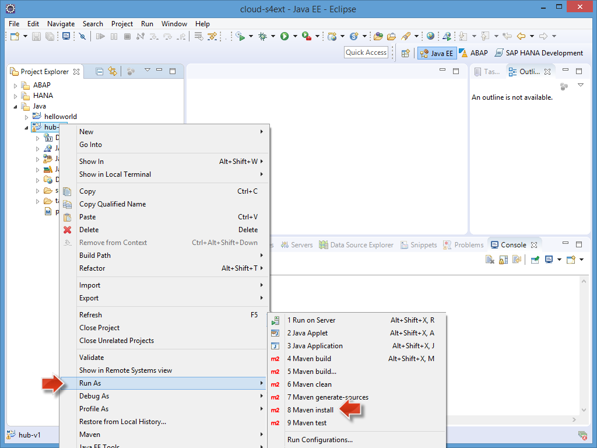

3.  In the **Console** window in Eclipse, you will see the output of the maven build.
4.  Wait until you the build is finished and you can find the **BUILD SUCCESS** information in the _Console Window_.

    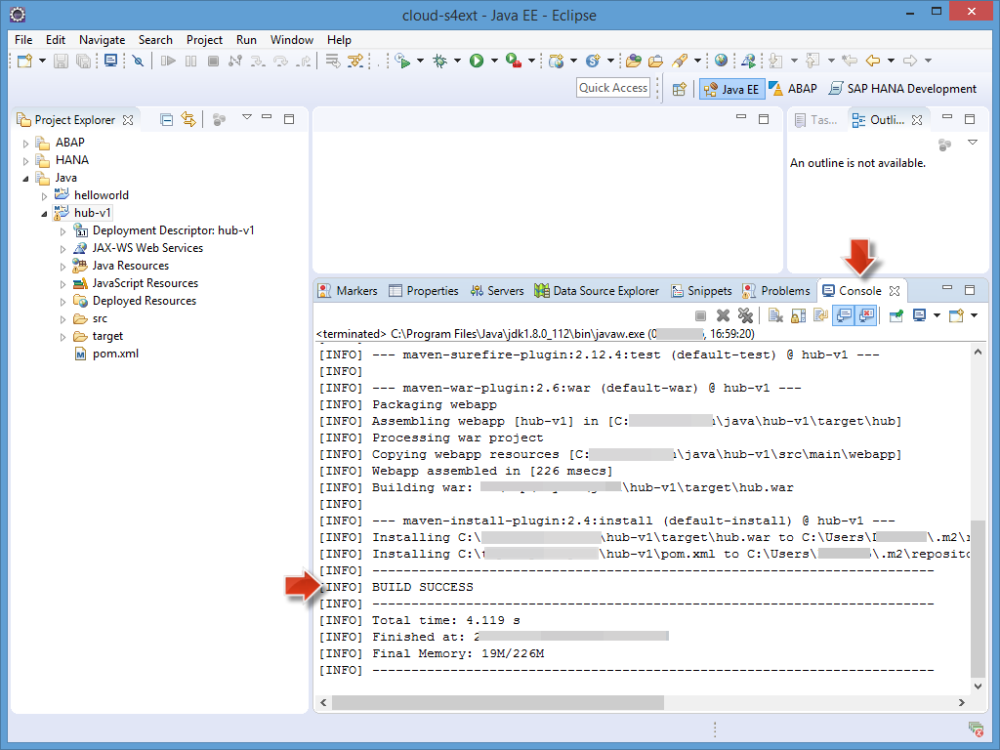

5.  Right-click on the project **hub-v1** and select **refresh** from the context menu.
6.  Expand the project node **hub-v1** to find a new directory **target**,  which now contains the freshly built **hub.war** file.

    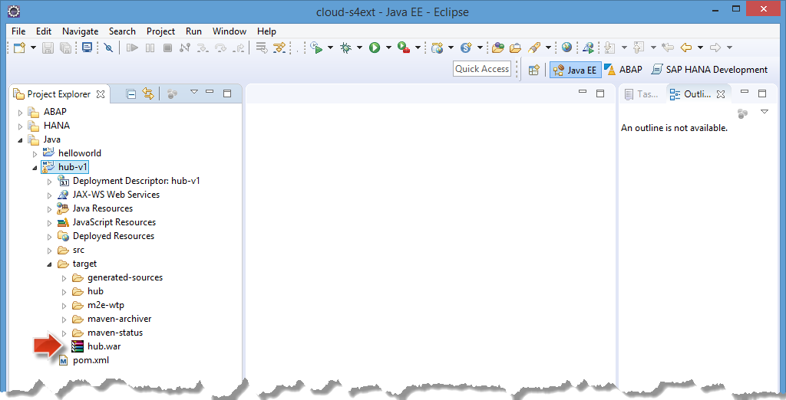

#### 4.2 Deploy Java Hub Application to HCP

1.  Open your HCP account <https://account.hanatrial.ondemand.com> and go to your account overview page.
2.  Navigate to **Applications** > **Java Application** to open the your **Java Applications** - dashboard
3.  In an SAP HANA Cloud Platform trial account the number of running application is restricted. In case the Java application **hellworld** is still in status **Started** you now need to stop it, as you would exceed the limit of running Java applications in your HCP trial account otherwise: In the dashboard of **hellworld** press the **Stop** button.

    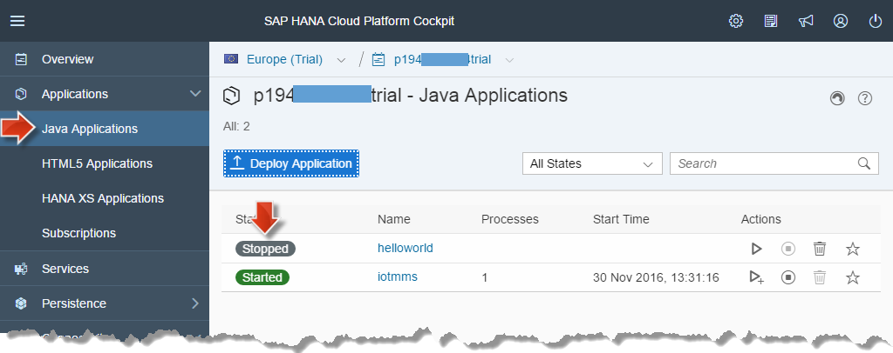
    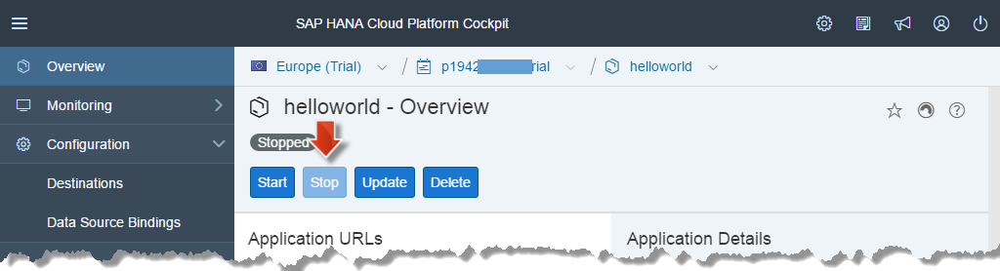

4.  Press the **Deploy Application** button.

    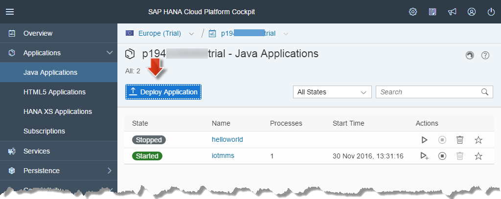

5.  In the  **Deploy Application** will open. Fill in the following properties:

    -   **WAR File Location    :** Browse and select the war file _hub-v1/target/hub.war_
    -   **Applicaton Name      :** _hub_
    -   **Runtime Name         :** _Java Web Tomcat 8_
    -   **Runtime Version      :** _3_
    -   **Compute Unit Size    :** _Lite_
    -   **Number of Processes  :** Min: _1_ Max: _1_
    -   **JVM Version          :** _JRE 8_
    -   **JVM Arguments        :** (no arguments needed!)
    -   **Max Number of Threads:** _200_
    -   **Connection Timeout (ms):** _20000_
    -   **URI Encoding         :** _ISO-8859-1_
    -   **Response Compression :** _Off_

    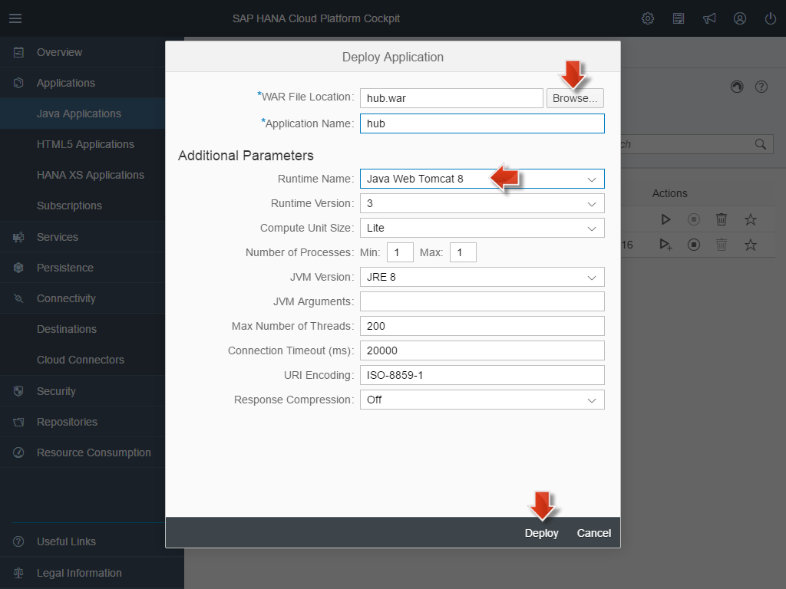

6.  Press the Button **Deploy** and wait until the deployment is finished.
7.  **Do not start** the application now, as we first have to change the _Data Source Binding_. Click **Done** to close the dialog.

    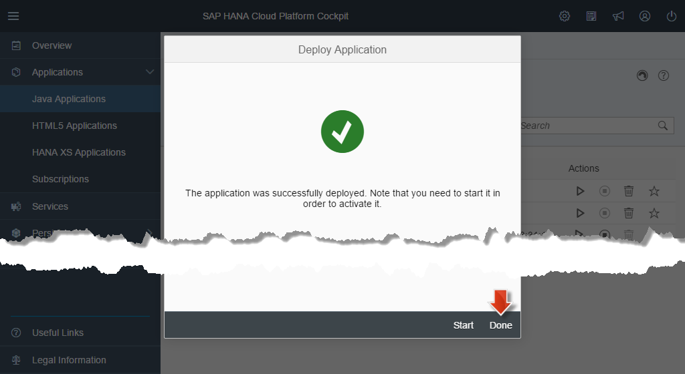

    > **Hint:** If you accidentally started the application, don't worry. But you should first stop the application before you proceed with the next step to change the _Data Source Binding_.
    > Why is this needed? A change of the Data Source Binding will get active with the next start of the Java application. Just changing the Data Source Binding without a restart would not have an effect on the running instance.

#### 4.3 Change the Data Source Binding

1.  Open the dashboard of the **hub** application by clicking on the name **hub** in the **Java Applications**-list.

    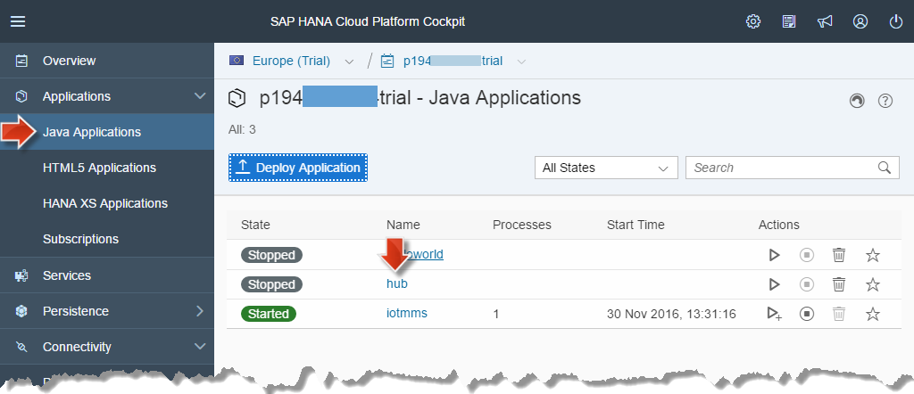

2.  In the left navigation bar of the **hub** application, navigate to **Configuration** > **Data Source Bindings**.

    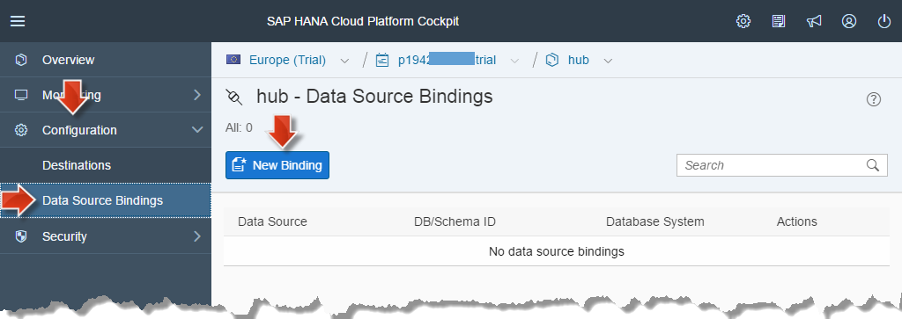

3.  Press the **New Binding** button and create a new binding as follows:

    -   Data Source:     **&lt;default>**
    -   DB/Schema ID:    **hana**
    -   Database System: **HANA MDC (&lt;trial>)**
    -   Database User:   **ACME**
    -   Password:        **&lt;Password of the ACME user>**
    -   Verify Credentials: **true**

    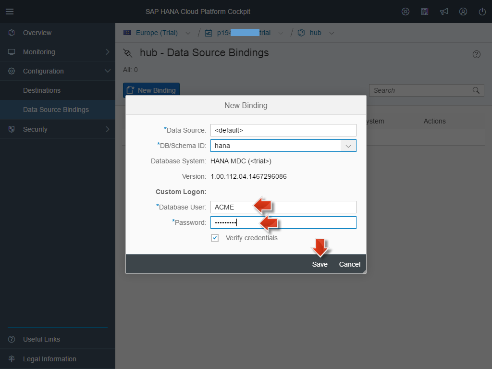

#### 4.4 _hana_ Tables and Views

1.  Switch to your **Eclipse** application.
2.  Open the **SAP HANA Development** perspective.
3.  In the tab **Systems**, expand the node **&lt;your trial accountid>trial-hana(ACME) > Catalog > ACME**.
4.  If you are not logged in, you will be asked for your **ACME** user and password. Enter the credentials and press **OK**.
5.  Expand the node **Catalog > ACME > Tables** and verify that the IoT tables are still there.
6.  Expand the node **Catalog > ACME > Views**. You should now see that currently no view exists.

    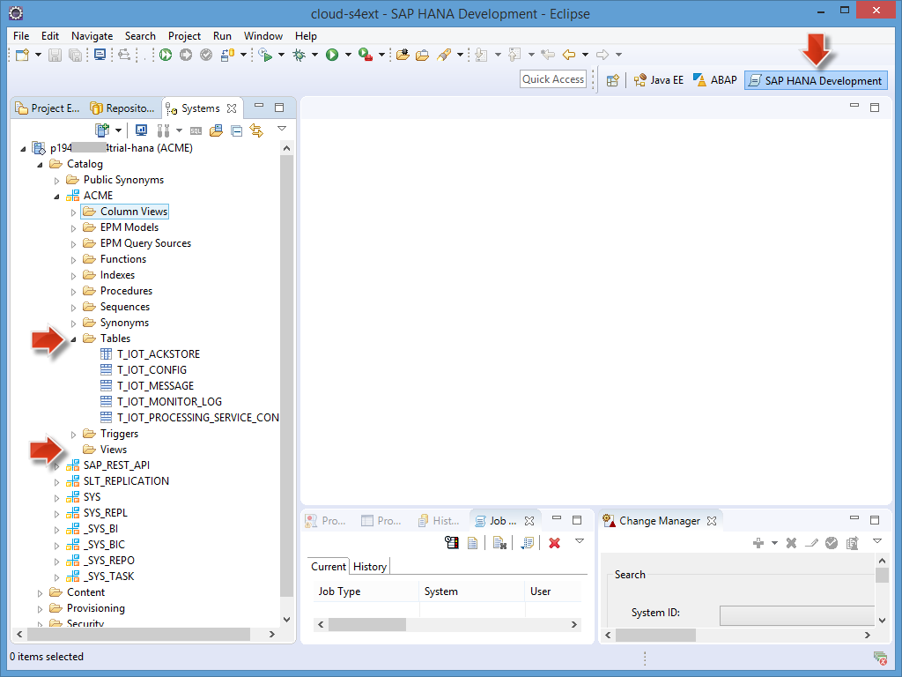

> **Result:** In this step you deployed the Java Hub Application into your SAP HANA Cloud Platform account, changed its data source binding, and learned what the state of your HANA database looks like before you started the Java Hub application for the first time.

## Step 5: Start the Java Hub Application

1.  Switch to the browser window where the SAP HANA Cloud Platform account is opened (or open your **HCP** bookmark).
2.  Select the Tab **Applications** > **Java Application**.
3.  Select the **hub** application and click on **Start** to start the Java Hub application.

    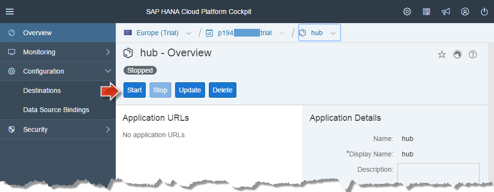

4.  Wait until the application is started.

    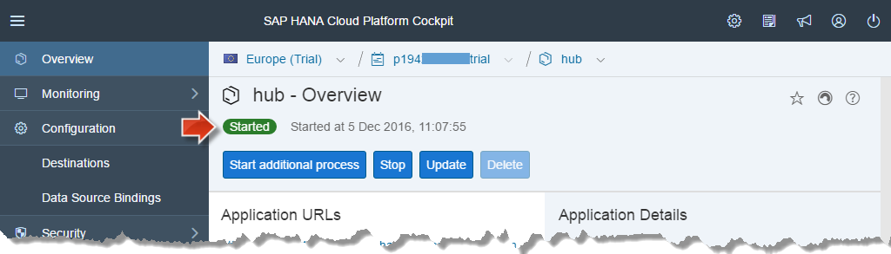

5.  Switch to Eclipse and open the **SAP HANA Development** perspective.
6.  In the **Systems** view, expand the node **&lt;your trial accountid>trial-hana(ACME) > Catalog > ACME**.
7.  Do a right-click on **Views** and select **Refresh** from the context-menu to refresh all views. **Expand** the **Views**-Folder. The views _V_DAMAGE_DATA_, _V_EQUIPMENT_, _V_FREE_DEVICE_ and _V_SALES_ORDER_ should now have been created by the Java Hub application.

    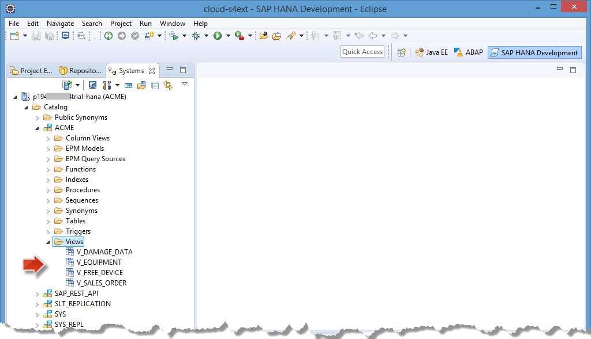

8.  Open the **Context Menu** of the view **V_SALES_ORDER** and click on **Open Content**.

    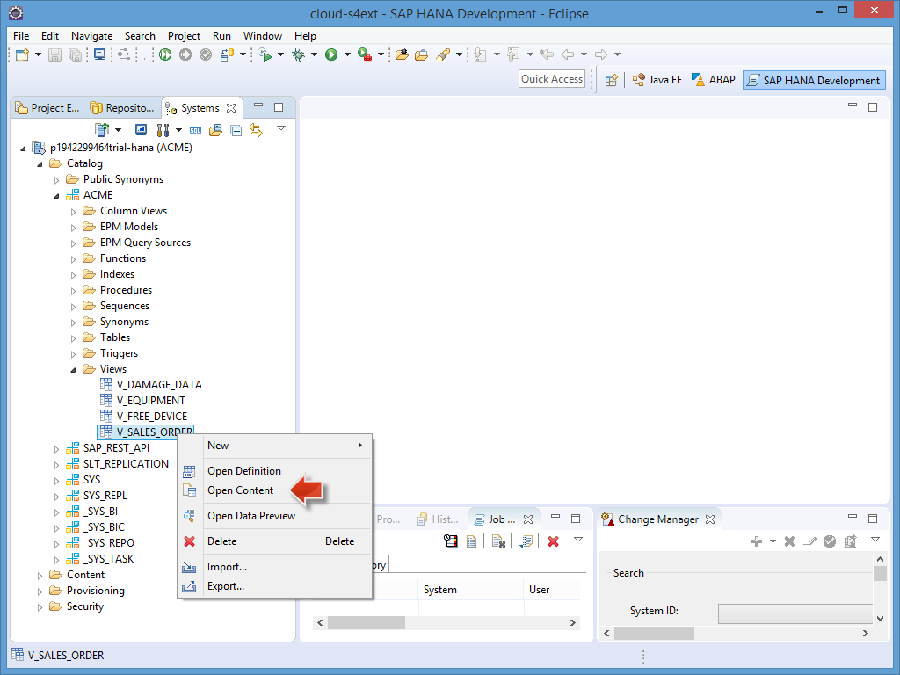

9.  A new view displaying the content of the table **"ACME"."V_SALES_ORDER"** should now have opened.

    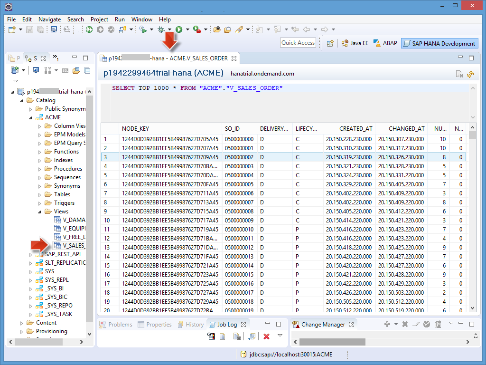

10. If you now refresh the **Tables** folder, you should also see, that two new tables **T_IOT_DEVICE** and **T_EQUIPMENT2DEVICE** should have been created.

    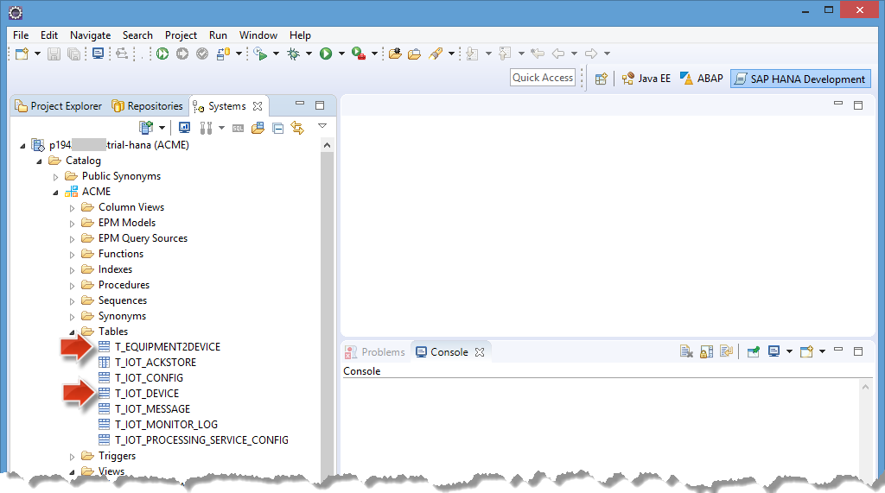

11. Go back to your browser and open the **Application URLs** (https&#x3A;//hub\\&lt;your HCP user ID>trial.hanatrial.ondemand.com/hub) in the **hub** dashbord.

    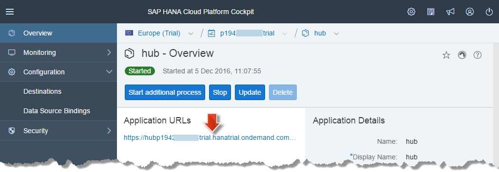

12. In the resulting authentication popup, enter the login data for your HCP account.

    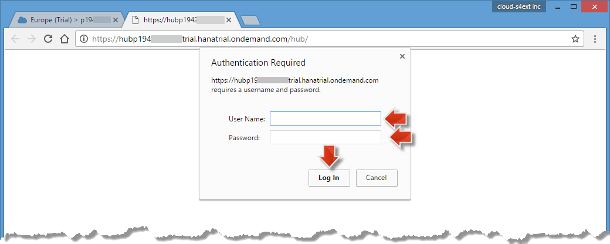

13. The **hub** will show up with an overview page. Click on the link **jpaPreview** to get the Sales Order data displayed.

    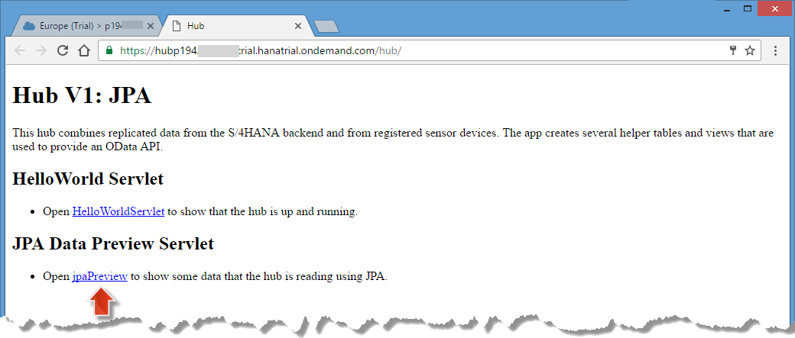

14. A **Hub - JAP Preview** browser tab will open.
    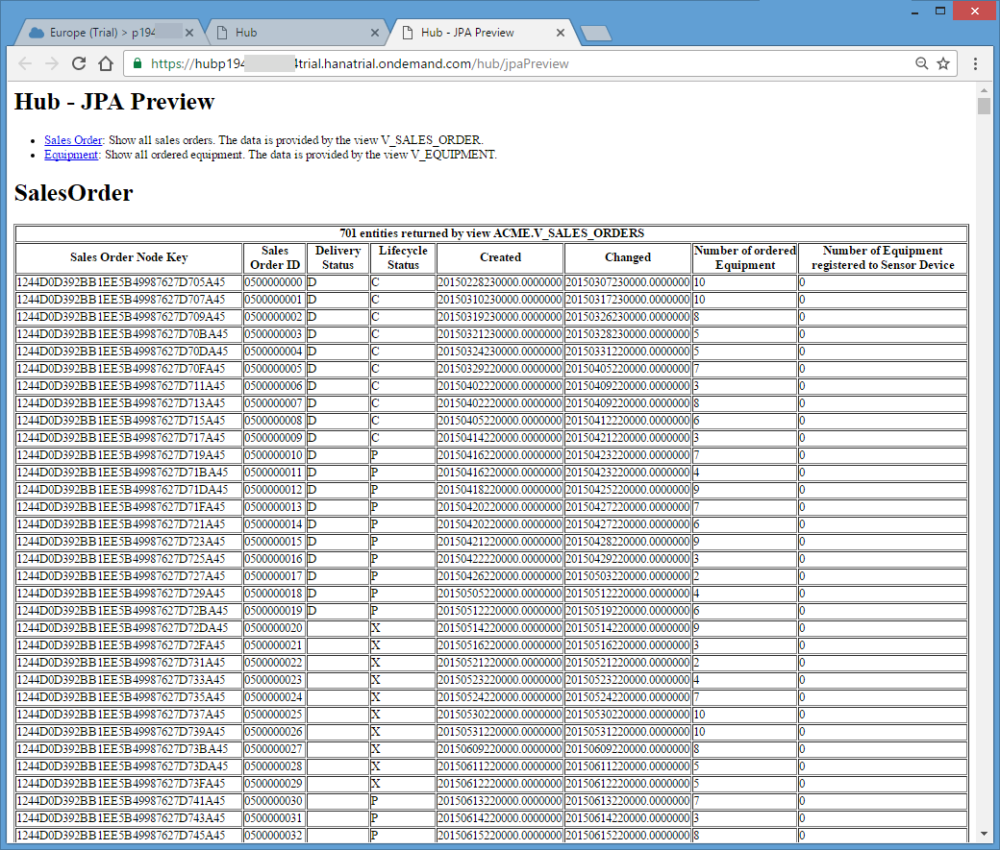

> **Result:** You have started the application and you have verified that it displays data from the _ACME_ database schema.

[Top](#step-2-top)

## Step 6: (optional) Code Walkthrough

In this step we will walk you through the coding of the Java Hub application that you can see in your imported Eclipse Java project _hub_v1_.

In the package [_com.acme.s4ext.jpa.model_](./src/java/hub-v1/src/main/java/com/acme/s4ext/jpa/model) different JPA entities are defined.

- Let's have a close look at the class [SalesOrder.java](./src/java/hub-v1/src/main/java/com/acme/s4ext/jpa/model/SalesOrder.java).
  In this class you can find the following annotations:

  ```java
    @Entity
    @ReadOnly
    @Table(schema = "ACME", name = "V_SALES_ORDER")
    @NamedQuery(name = SalesOrder.FIND_ALL, query = "select s from SalesOrder s order by s.soId")
  ```

    - The **\@Entity** is the annotation to define a class as an JPA entity.
    - The **\@Table** annotation specifies the table and schema, which is mapped. This is an optional annotation, but needet if the table name and the Entity name differ.
    - In our case we decided for a more technical table name. As in this case we are mapping a view, we add use the **\@Readonly** annotation.
    - The various fields use the **\@Column** annotation to map fields to the database table columns.

- In [persistence.xml](./src/java/hub-v1/src/main/resources/META-INF/persistence.xml) we haved defined which data entites exist.

- In class [EntityManagerFactoryHandler.java](./src/java/hub-v1/src/main/java/com/acme/s4ext/jpa/EntityManagerFactoryHandler.java) the persistence unit is used to create a **javax.persistence.EntityManagerFactory**.

- The two classes in the package [com.acme.s4ext.jpa.dbsetup](./src/java/hub-v1/src/main/java/com/acme/s4ext/jpa/dbsetup) created all missing tables during the first start of the application. To make the code as simple as possible, we decided not to use a framework to do this. (However, if you were to do this in a real-life scenario, you should probably use one.)
    - The class [DatabaseEntitySetup](./src/java/hub-v1/src/main/java/com/acme/s4ext/jpa/dbsetup/DatabaseEntitySetup.java)) just execute the various sqls of folder [src/main/resources/sqlscripts](./src/java/hub-v1/src/main/resources/sqlscripts).
    - The [JPAPreviewServlet](./src/java/hub-v1/src/main/java/com/acme/s4ext/jpa/servlet/JPAPreviewServlet.java) is a simple implementation to use jpa to render the equipment and sales order Entities to a html output.

## What you’ve learned in this unit

-   How to develop and build Java applications on _SAP HANA Cloud Platform_ using _Maven_
-   How to consume data from _SAP HANA_ on _SAP HANA Cloud Platform_ using the _EclipseLink JPA_ on Java
-   How to deploy _Java applications_ on _SAP HANA Cloud Platform_

[**&lt; Previous** Unit 3](../unit-3/) | [**Up ^** Week 5](../) | [**Next >** Unit 5](../unit-5/)
