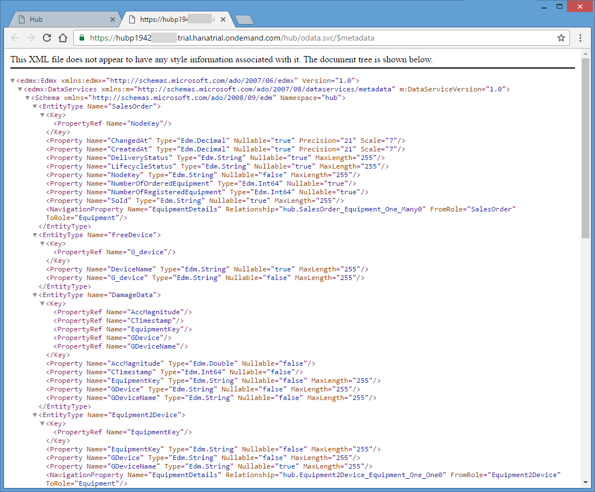

<a name="step-0-top"/><a name="step-1-top"/><a name="step-2-top"/><a name="step-3-top"/><a name="step-4-top"/><a name="step-5-top"/><a name="step-6-top"/>






## Downloads

| Download Link                                                                            | Description                                                                   | Context                                                                                         |
|------------------------------------------------------------------------------------------|-------------------------------------------------------------------------------|-------------------------------------------------------------------------------------------------|
| [**hub-internet-http.properties**](./imports/destinations/hub-internet-http.properties?raw=true)  | Destination configuration providing the OData service of Java Hub application | [Step 6: Define HCP Destination hub-internet-http](#step-6-define-hcp-destination-hub-internet-http)    |
| [**hub-v2.zip**](imports/java/hub-v2.zip?raw=true)                                                | Maven Java Sources of *hub-v2* Project                                       | [Step 2: Download and Import Java Hub v2 to Eclipse](#step-2--download-and-import-java-hub-v2-to-eclipse) |

**Overview:**


**Roles:**

-   Developer: Application


**System, Tools, Services:**

-   Java
-   Eclipse
-   Maven
-   HCP Cockpit
-   SAP Web IDE

## Step 1: Understand the Goal of the Java Implementation

In the previous unit you combined data from different data sources in Java using the **Java Persistency API (JPA)**. As you want to use this data in a SAP Fiori web user interface, you want to make this data available as an OData service. Apache Olingo is an open source project that can help you to achieve this. In this unit you will learn how this can be done, and we will create a **second version of the Java Hub Application** to do this.


[Top](#step-1-top)

## Step 2:  Download and Import Java Hub v2 to Eclipse

1.  Download the zip archive [hub-v2.zip](imports/java/hub-v2.zip?raw=true) and extract the archive to your local file system.
2.  Open **Eclipse**.
3.  Select  **File** > **Import ...** > **Maven** > **Existing Maven Projects** > **Next**
4.  In the **Import Maven Projects** dialog:

    -   click **Browse...** and select **&lt;your hub-v2 unzip directory>/hub-v2**.
    -   Check the checkbox the **pom.xml** file in the **Projects** section.
    -   Check the checkbox **Add project(s) to working set** and this project to your **JAVA** working set.
    -   Press **Finish**

    

> **Result:** You have imported the Java Hub project in version 2 to your Eclipse workspace.

[Top](#step-2-top)

## Step 3: Build and Deploy the Java Hub v2 to HCP

#### 3.1 Build using _maven install_

1.  Open Eclipse and the workspace where you have already imported the **hub-v2** maven project.
2.  In the **Project Explorer**, right-click on the **hub-v2** project and select **Run As** > **8 Maven install** from the context menu.
3.  In the **Console** window in Eclipse, you will see the output of the maven build.
4.  Wait until you the build is finished and you can find the **BUILD SUCCESS** information in the _Console_ tab.
5.  Right-click on the project **hub-v2** and select **refresh** from the context menu.
6.  Expand the project node **hub-v2** to find a new directory **target**,  which now contains the freshly built **hub.war** file.

    

#### 3.2 Deploy to HCP and Start the Application

1.  Open your HCP account <https://account.hanatrial.ondemand.com> and go to your account overview page (or use your **HCP** bookmark).
2.  Select **Applications** > **Java Application** > **hub** to open the dashboard of the _hub_ project you deployed in the [Week 4, Unit 4](../unit-4/).
3.  Press the **Stop** button to stop the application and confirm the upcoming confirmation dialog.

    

4.  Press **Update**.

    

5.  Select the **hub.war** archive that resulted from step 3.1 and press **Update**. This is the _web archive_ for the Java Hub version 2 - and it will **replace the existing version of the Java Hub application** in your HCP account. All other properties should not be changed, as they are kept the same as version 1.

    

6.  Confirm the successful update information.

    

7.  Meanwhile the application should be in state **Stopped**, if not just wait a little. Press **Start** to start the application again.

    

8.  Wait until _hub_ is in status **Started**.

    

> **Result:** You have upgraded the _HCP Java Application_ named _hub_ to version 2.

[Top](#step-3-top)

## Step 4: Inspect the new Java Hub application (version 2)

Let's have a look at the running _hub v2_ application and see what is new.

1.  In the dashboard of the _hub_ application open the **Application URLs**.

    

2.  When asked for the user and password, provide your HCP user and password.
3.  A new browser window will open. Please check the heading and verify that it now states **Hub V2**. If it still states **Hub V1**, you did not successfully deploy the new version and should repeat the above step 3.

4.  In the application, you will now find a new section **OData Service Servlet**. Here you can find links pointing to different OData resources exposed by the Java Hub application:

-   **odata.svc**: lists all entity sets that are exposed by the OData service

    

-   **odata.svc/$metadata:** The metadata document for the OData service with information on contained entity sets, data types and data model.

    

-   **odata.svc/IoTDevices**: Will list all sensor devices that are registered in your SAP HCP IoT service. As long there are no registered sensor devices, this enitity set will return no values.

    

-   **odata.svc/SalesOrders** Will list all sales orders including the number of ordered equipment and the equipment number which is registered to a sensor device.

    

> **Result:** You had a look into the _OData_ API provided by the Java _hub_ application (version 2) running in your HCP account. You now know that the hub application is combining different data sources into one OData API. You also know, how to access this data.

[Top](#step-4-top)

## Step 5: Code Walk Through (optional)

In version 1 of the same application a **persistence unit** with the name _hub_ was created, containing various entities. In version 2 of the **Java Hub** application, the [_Apache Olingo_ framework](https://olingo.apache.org/) was added, to expose the data from the JPA model as OData service. Additionally, device data is read from the HCP IoT Service in your HCP account and stored in the HANA DB.

> **Hint:** You may **use Eclipse to compare the Java Hub source code of version 1 and 2**.
>
> 1.  Select both projects **hub-v1** and **hub-v2**. (You can use your mouse and the **Ctrl** button to select several projects at the same time.)
> 2.  With both projects, selected, open the context menu und select **Compare with > Each Other**.
>     
> 3.  As a result a new view is opened in Eclipse, where all changed directories/files are listed. You can e.g. select the _index.html_ to get a side-by-side file comparison.
>     

#### 5.1 Code Walk Through - Device Synchronization

This **Java hub** (version 2) uses the connectivity service to connect to the HCP IoT Services API.

In the file [src\main\webapp\WEB-INF\web.xml](./src/java/hub-v2/src/main/webapp/WEB-INF/web.xml#L18-L22) the **resource-ref**-code snippet configures the connectivity service resource:

```xml
	<!-- Reference to destinations provided by SAP HANA Cloud Platform connectivity service -->
	<resource-ref>
		<res-ref-name>connectivityConfiguration</res-ref-name>
		<res-type>com.sap.core.connectivity.api.configuration.ConnectivityConfiguration</res-type>
	</resource-ref>
```

> **Hint 1: Eclipse keyboard shortcut for opening resources**
>
> 1.  **ctrl** + **shift** + **r** opens the **Open Resource**-dialog.
> 2.  Select **web.xml** and press **Open**.

> **Hint 2: Swith on syntax highlighting for the _web.xml_ file**
> In the bottom left corner of the opend **web.xml**-tab you can switch from **Design** to **Source** view.
> 

During the start of the application the [DeviceSynchronizationOnStartListener.java](./src/java/hub-v2/src/main/java/com/acme/s4ext/iot/sync/DeviceSynchronizationOnStartListener.java) (Path: _/hub-v2/src/main/java/com/acme/s4ext/iot/sync/DeviceSynchronizationOnStartListener.java_) will take care that a scheduler periodically fetches all devices from the HCP IoT Services API.

This listener is configured in [src\main\webapp\WEB-INF\web.xml](./src/java/hub-v2/src/main/webapp/WEB-INF/web.xml#L30-L34) as you can see in the following code snippet:

```xml
  <!-- DeviceSynchronizationWebListener will be started on application start and will trigger a scheduled job to fetch and persist registered sensor devices from the SAP HCP IoT service. -->
	<listener>
		<listener-class>com.acme.s4ext.iot.sync.DeviceSynchronizationOnStartListener</listener-class>
	</listener>
```

In the above-mentionned java class [DeviceSynchronizationOnStartListener.java](./src/java/hub-v2/src/main/java/com/acme/s4ext/iot/sync/DeviceSynchronizationOnStartListener.java) a very simple scheduler of a **DeviceSynchronizationTask** is implemented.

The [DeviceSynchronizationTask.java](./src/java/hub-v2/src/main/java/com/acme/s4ext/iot/sync/DeviceSynchronizationTask.java) class will ask the [DeviceSynchronizationIoTApiRestClient.java](./src/java/hub-v2/src/main/java/com/acme/s4ext/iot/sync/DeviceSynchronizationIoTApiRestClient.java) for devices and writes them to the HANA database.

Looking at the class [DeviceSynchronizationIoTApiRestClient.java](./src/java/hub-v2/src/main/java/com/acme/s4ext/iot/sync/DeviceSynchronizationIoTApiRestClient.java) you will see that
 the destination [iot-internet-http](../unit-2/imports/destinations/iot-internet-http.properties?raw=true) you configured in week 5, unit 2 is used.

When the application is started, devices should have been synchronized to the SAP HANA database in your HCP account. Lets verify this:

1.  Open **Eclipse > SAP HANA Development > Systems > {your HCP trial user id}trial-hana (ACME) > Catalog > ACME > Table > T_IOT_DEVICE > Context Menu > Open Content**
2.  All your devices should now be listed in the content view:

    

#### 5.2 Code Walk Through - OData Service using Apache Olingo and Apache CXF

If you already have data available in the JPA format, the [Apache Olingo](https://olingo.apache.org/) framework makes it very easy for you to create an OData service:

We use [**Apache CXF**](http://cxf.apache.org/) to define a servlet named **ODataServlet** and configure **Apache Olingo** to provide details.
First, in the [src\\main\\webapp\\WEB-INF\\web.xml](./src/java/hub-v2/src/main/webapp/WEB-INF/web.xml#L36-L51) file, we define a servlet **ODataServlet**. Then we use Apache CXF as a framework to give us a servlet using olingo.

```xml
	<!-- The servlet providing the OData services will be provided by the Apache CXF framework.
		 For this, the framework consumes a standard implementations of the Apache Olingo
		 framework and a custom implementation of an OData service factory as input. -->
	<servlet>
		<servlet-name>ODataServlet</servlet-name>
		<servlet-class>org.apache.cxf.jaxrs.servlet.CXFNonSpringJaxrsServlet</servlet-class>
		<init-param>
			<param-name>javax.ws.rs.Application</param-name>
			<param-value>org.apache.olingo.odata2.core.rest.app.ODataApplication</param-value>
		</init-param>
		<init-param>
			<param-name>org.apache.olingo.odata2.service.factory</param-name>
			<param-value>com.acme.s4ext.odata.EntitiesODataJPAServiceFactory</param-value>
		</init-param>
		<load-on-startup>2</load-on-startup>
	</servlet>
```

> _Note:_ More information wanted?
>
> -   [Apache Olingo](https://olingo.apache.org/doc/odata2/index.html) Version 2.0
> -   Learn about [Creating a Web Application Project for Transforming JPA Models into OData Services](https://olingo.apache.org/doc/odata2/tutorials/CreateWebApp.html)

The only class, which needs to be implemented to achieve this is [com.acme.s4ext.odata.EntitiesODataJPAServiceFactory.java](./src/java/hub-v2/src/main/java/com/acme/s4ext/odata/EntitiesODataJPAServiceFactory.java).

> **Result:** You now have a basic understanding about how to create an OData service in SAP HANA Cloud Platform based on a JPA data model.

[Top](#step-5-top)

## Step 6: Define HCP Destination _hub-internet-http_

The **Java Hub** application exposes an OData service. To make this service available in the SAP Web IDE, you first need to create a new destination in your HCP account, as you already did in the previous weeks.

#### 6.1 Import the Destination _hub-internet-http_

1.  Go back to your Google Chrome browser and open the **odata.svc** OData service from your **Java Hub Application**: (_HCP bookmark > **Applications** > **Java Applications** > **hub**> **Application URLs** > **OData Service Servlet** > **odata.svc**_).
2.  Copy the link either from the Java Hub overview page:
    
    Or copy the URL from the browser tab where you opened the **OData.svc** service:
    
3.  Download the [**hub-internet-http.properties**](./imports/destinations/hub-internet-http.properties?raw=true) file to your computer (_right-click > save as..._).

4.  Go back to your HCP account overview page and navigate to **HCP > Connectivity > Destinations**. Click on **Import Destination** and select the _hub-internet-http.properties_ file from your download folder.

    

5.  Change the following properties:

    -   **URL**: paste the odata.svc URL from the **Java Hub** application. (The URL has the pattern **https://hub&lt;your HCP user ID>trial.hanatrial.ondemand.com/hub/odata.svc/**)
    -   **User**: your HCP user ID
    -   **Password** : your HCP password
    -   select  **Use Default JDK truststore**

    

#### 6.2. Verify the _hub-internet-http_ Destination

To check that the _hub-internet-http_ destination is working correctly, you should create a dummy project in **SAP Web IDE**, as you did in the previous weeks.

1.  Open **SAP Web IDE** (by using your [Google Chrome bookmark](../../week-1/unit-5#step-4-prepare-sap-web-ide))
2.  Create new project: **File > New > Project from Template**

    

3.  Select **List Report Application** and press **Next**.

    

4.  Provide a dummy **Project Name** and a dummy **Title** and press **Next**.
5.  Select source: **Service URL** and select **Hub API Services** as service - which corresponds to your _hub-internet-http_ destination. If everything is set up correctly, you should now see some data coming up in the wizard.

    

6.  Abort the project creation.

> **Result:** You have defined the destination _hub-internet-http_ which connects the OData service exposed by the Java Hub application to your Web IDE. This API can be used by the _Web front end Devloper_ to implement a new User Interface in the SAP Web IDE.

[Top](#step-6-top)

## What you’ve learned in this unit

-   How to develop and build Java applications on SAP HANA Cloud Platform using Maven
-   How to consume and provide REST services in Java applications on SAP HANA Cloud Platform
-   How to provide OData services in Java applications using Apache Olingo in combination with JPA on EclipseLink on SAP HANA Cloud Platform
-   How to deploy Java applications using the SAP HANA Cloud Platform cockpit

## Result:

> You have the Java Application _hub_ up and running in your SAP HANA Cloud Platform trial account . You have defined a _hub-internet-http_ destination ready to be used by the _Web front end Devloper_ to implement an HTML5 application providing an UI.

[**&lt; Previous** Unit 4](../unit-4/) | [**Up ^** Week 5](../) | [**Next >** Unit 6](../unit-6/)
