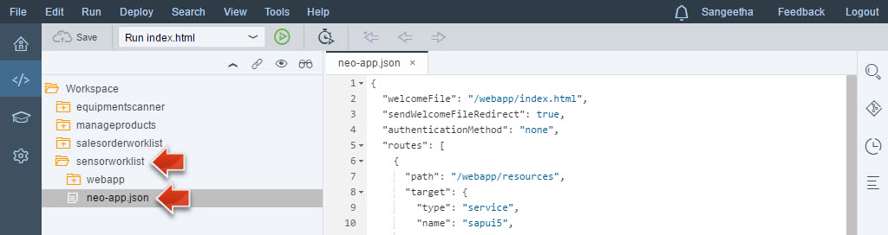
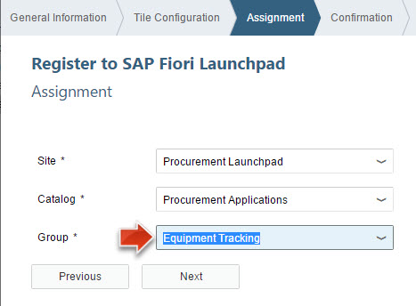
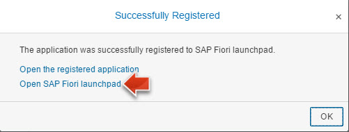

<a name="step-0-top"/><a name="step-1-top"/><a name="step-2-top"/><a name="step-3-top"/><a name="step-4-top"/><a name="step-5-top"/><a name="step-6-top"/><a name="step-7-top"/><a name="step-8-top"/>



**Overview:**

**Role:**

-   Developer: Web front end

**Systems, Tools, Services:**

-   SAP HANA database in SAP HANA Cloud Platform account
-   SAP Web IDE
-   SAP Hybrid App Toolkit Companion app (iOS/Android)

| Download Link                                                      | Description                                        | Context                                                                                                                                    |
|--------------------------------------------------------------------|----------------------------------------------------|--------------------------------------------------------------------------------------------------------------------------------------------|
| [**sensorworklist.zip**](imports/html5/sensorworklist.zip)         | Html5 sources for Sensor Worklist Application      | [Step 1: Import and Run the Sensor Worklist Application](#step-1-import-and-run-the-sensor-worklist-application)                           |
| [**equipmentscanner.zip**](imports/html5/equipmentscanner.zip).    | Html5 sources for Equipment Scanner Application    | [Step 4: Import and Run and Understand Equipment Scanner Application](#step-4-import-and-run-and-understand-equipment-scanner-application) |

## Step 1: Import and Run the Sensor Worklist Application

In this step you will import the source code for the _Sensor Worklist_ application into your SAP Web IDE and run the application.

1.  We have prepared a new "Sensor Worklist" application for you. Please download the **sensorworklist.zip** archive from [here](imports/html5/sensorworklist.zip?raw=true).
2.  Open the **Web IDE** bookmark in your Google Chrome browser and switch to the **Development** view.
3.  Click on **File** > **Import** > **From File System**.

    

4.  In the **Import** dialog use the following properties and press **OK**:
    - File: Select **sensorworklist.zip** from your local file system.
    - Import to: **/sensorworklist**
    - Ensure that **Extract Archive** is checked.

    

8.  Select the new imported project **sensorworklist** and click on the green **Run**-button in the toolbar.

    

9.  The application will open in a new browser window. Initially the list is empty, as we have not registered any sensor.

    

> **Result:** You have now imported a working "Sensor Worklist" application into your SAP Web IDE.

[Top](#)

## Step 2: Register a Sales Order Product to Sensor Device

In this step you will **attach sensors** (that were registered with the HCP IoT services) **to sales orders** using the new SAP Fiori web application.

1.  In the **Sensor Worklist** application press the **Register** button.

    

2.  A wizard will open guiding you through the steps on how to attach a sensor device to a sales order.
3.  Select a Sales Order (e.g. **0500000000**) and click on the button **Step 2**.

    

4.  Select one of the products (e.g. **Notebook Basic 15 (ID: HT-1000)**) that were included in the specified sales order and click on **Step 3**.

    

5.  Select the sensor **Sensor01** that you created in [Week 5, Unit 2](../week-5/unit-2/#step-5-create-a-new-device) and click on **Review**.

    

6.  Review the settings and press the **Register**-button to finish the registration.

    

7.  You have now successfully attached a sensor device to a product that was ordered in a new sales order.

    

[Top](#)

## Step 3: Add a new Sensor in IoT Services Cockpit

All available sensors have already been attached to devices. Before you can proceed, you need to add new IoT sensors in your IoT Services Cockpit.

1.  Try to register a second sensor to a sales order product, by pressing **Register** button.

    

2.  Select a Sales Order (e.g. **0500000000**) and click on the button **Step 2**.

    

3.  **Step 2**: select another Product e.g. **Astro Laptop 1516 (ID: HT-1251)** and click on the button **Step 3**.

    

4.  **Step 3**: Now you will find out that currently no free sensor devices are available that could be attached to the product from this sales order. Therefore you need to add a new sensor device in your HCP IoT Services. Click on the link **Open IoT Service Cockpit**.

    

> **Note:** If you have performed several methods to send data o the HCP IoT services in [Week 5, Unit 2, Step 6](../unit-2/#step-6-send-data-to-hcp-iot-services), you may have an additional sensor available that you could use.

5.  A new browser tab opens with the **IoT Service Cockpit**. Please note that you have already been directed to the **Devices** page. Press the **+** button to create a new sensor.

    

6.  Enter the following values and press **Create** to create a new sensor:
    -   Name: **Sensor02**
    -   Device Type: **AcceleationSensorDeviceType**
    

7.  You may now close the **IoT Service Cockpit** tab and return to the wizard where you assign a sensor to a product from a sales order.
8.  Back at the **Register a Sales order product to Sensor Device -- Step 3** press the **Refresh**-button, select the newly created **Sensor02**, review the settings and press **Register**.
9.  You will now see that there are two _Registered Sensor Devices_: _Sensor01_ that should have some Registered Damages (that you created in [Week 5, Unit 3](../unit-3/#step-3-send-acceleration-messages)), whereas the newly created _Sensor02_ should have 0 damages.

    

10. Click on **Sensor01** to see the detailed error reports for this device.

    

> **Result:** You have now successfully assigned two sensors to two products that were ordered by your internal customers. You are able to analyze when the devices were subjected to shocks/drops and could have been damaged.

[Top](#)

## Step 4: Import and Run and Understand Equipment Scanner Application

In this step you will import and run the _Equipment Scanner_ application. This application allows you to scan a device and check if there are any registered damages for this device.

1.  We have prepared a new _Equipment Scanner_ application for you. Please download the [**equipmentscanner.zip**](imports/html5/equipmentscanner.zip?raw=true) archive.
2.  In Google Chrome, open your **Web IDE** bookmark.
3.  Click on **File** > **Import** > **From File System**.

    

4.  In the **Import** dialog use the following properties and press **OK**:
5.  File: Select **equipmentscanner.zip** from your local file system.
6.  Import to: **/equipmentscanner**
7.  Ensure that **Extract Archive** is checked.

    

8.  Select the new imported project **equipmentscanner** and click on the green **Run**-button in the toolbar.

    

9.  A new browser tab should open with the _Equipment Scanner_ application.

> **Note:** The application supports two modes: A mobile mode would allow you to scan a QR code using the camera of a mobile phone and a manual mode, that allows you to manually enter an equipment ID to check for damages. In the next step we will only use the manual mode, as we need to deploy the application to a mobile phone in a special way, in order for it to work. We will do this in a later part of this exercise.

7.  Change to **Manual Mode**. This mode allows you to manually enter an _Equipment ID_ and check for potential damages that were registered with the attached sensor.

    

8.  Enter an **Equipment ID** using the value help and press **Check**.

    

9.  In the next screen you can see the detailed damage reports for this equipment.

    

> **Result:** You successfully imported the _Equipment Scanner_ application to your Web IDE and verified that it is working correctly.

[Top](#)

## Step 5: Code Walkthrough

In this step you will have a look at the code of the _Sensor Worklist_ and the _Equipment Scanner_ applications to understand how these applications are retrieving the data from the Java Hub that you implemented in the previous units of this weeks exercise.

1.  Switch back to the _Development View_ of the **Web IDE** and open the file **neo-app.json** in the **sensorworklist** project.

    

2.  Scroll down to find the path **/hub-internet-http**. This part establishes the connection to the **hub-internet-http** destination that connects to the _Java Hub_ that you developed in the previous unit.

3.  Open the Web IDE search function and search for the term **/equipment** in the project **sensorworklist**.

    

4.  There will be two search results. Select the search result in line 22: **path: '/Equipments',**, which will open a new tab in the Web IDE with the file **Worklist.view.xml** and highlight the search result in the source code.

    

5.  The equipment table in the user interface of the application is now retrieving the data from the Java hub, by concatenating the **path** from the **neo-app.json** and the **path: '/Equipments',** specified in the view of the worklist application.

6.  Please also take a further look at the source code and search for the term **{EquipmentKey}**. This is basically a placeholder, that will retrieve the table contents from the OData service that we specified above.

    

7.  You may now also use the search function and search for the terms **/Damage** to find out from which service we are retrieving the product damage information, and the term **/FreeDevice** to find out where we are retrieving the information on which devices have not yet been assigned to a sensor.

> **Result:** You now understand the data binding for the  _Sensor Worklist_ and the _Equipment Scanner_ applications and how the OData service from the Java Hub is used as data provider for these applications.

[Top](#)

## Step 6: Deploy Sensor Worklist Application to SAP Fiori Launchpad

In this step you will deploy the _Sensor Worklist_ application to the SAP Fiori Launchpad running in your SAP HANA Cloud Platform trial account.

1.  Open the **SAP Web IDE** bookmark in your Chrome browser.
2.  In the **Development** view, right-click on the node **sensorworklist** and select **Deploy** > **Deploy to SAP HANA Cloud Platform**.

    

3.  If necessary, provide the logon credentials for your SAP HANA Cloud Platform trial account.
4.  Select the radio button **Deploy a new application**, leave the default values and click on **Deploy**.

    

5.  After the application has been successfully deployed, click on **Register to SAP Fiori Launchpad**.

    

6.  In the upcoming wizard for registering your application to your SAP Fiori Launchpad, provide the following details:
7.  General Information:
    -   Provider Account: **trial (flpportal)**
    -   Application Name: **sensorworklist**
    -   Click **Next**.
    

8.  Tile Configuration:
    -   Type: **Static**
    -   Title: **Register Sensor Devices**
    -   Subtitle: **Sensor Worklist**
    -   Click **Next**.
    

9.  Assignment:
    -   Site: **Procurement Launchpad**
    -   Catalog: **Procurement Applications**
    -   Group: **Equipment Tracking**
    -   Click **Next** and then **Finish**.
    

10. You should get a success message dialog **Successfully Registered**. Click the link **Open SAP Fiori Launchpad**.

    

11. A new browser tab is opened containing your SAP Fiori Launchpad. Click on the tile **Register Sensor Devices** which you created now to use the application.

    

> **Result:** You have now deployed the _Sensor Worklist_ application to your SAP HANA Cloud Platform account and registered the application to the SAP Fiori Launchpad running in the same SAP HANA Cloud Platform account.

[Top](#)

## Step 7: Deploy and use the Equipment Scanner Application on a Mobile Device

In this step you will deploy the _Equipment Scanner_ to your SAP HANA Cloud Platform account. You will then download the _SAP Hybrid App Toolkit Companion_ app to your smartphone and run the application on your phone. This is a helper tool that allows the _Equipment Scanner_ application to access your phones camera in order to scan a QR code.

1.  Open the **SAP Web IDE** bookmark in your Chrome browser.
2.  In the **Development** view, right-click on the node **equipmentscanner** and select **Deploy** > **Deploy to SAP HANA Cloud Platform**.

    

3.  If necessary, provide the logon credentials for your SAP HANA Cloud Platform trial account.
4.  Select the radio button **Deploy a new application**, leave the default values and click on **Deploy**.

    

5.  In the upcoming dialog **Successful Deployed** click on **Open the active version of the application**.

    

6.  A new browser tab will open deployed version of the **Equipment Scanner** application.
7.  In [Week 1, Unit 5](../../week-1/unit-5/#qr-extension-for-chrome) you installed **[The QR Code Extension](https://chrome.google.com/webstore/detail/the-qr-code-extension/oijdcdmnjjgnnhgljmhkjlablaejfeeb)** for Google Chrome. Click on the QR Code icon in the top-right corner to display the URL for this application as QR code.

    

8.  Install and open the **SAP Hybrid App Toolkit Companion** on your smartphone:
    - Android: [Google Play Store](https://play.google.com/store/apps/details?id=com.sap.ide.pubcompanion)
    - iOS: [Apple iTunes App Store](https://itunes.apple.com/us/app/sap-hybrid-app-toolkit-companion/id1066733080)

11. You don't need to protect the app with a password, so you may press **Disable Passcode** followed by **Submit**.

    

12. Double-tap your phone screen, and tap on **Scan**.

    > **Note:** In iOS your device may ask you whether you would like the "SAPCompanionApp" to access your camera. You need to tap on **OK** in order to use the app.

    

13. Go back to your Google Chrome tab with the **Equipment Scanner** and make sure that the QR code for this page is displayed. Scan the QR code from your computer screen with the **SAP Hybrid App Toolkit Companion**.

    

14. Now you have the **Equipment Scanner** running on your mobile device. Tap on the button on the screen labeled as **Click circle to scan**. This will allow a support employee to scan a QR code of a sensor device, allowing them to see potential damage reports for said device.

    

15. Open the **Sensor Worklist** application in a new Google Chrome browser tab. Click on the **Sensor01** link to display the corresponding QR code for the device id.

    

16. Scan this QR code with the **Equipment Scanner** running in the companion app on your mobile.

    

17. On your mobile Device you will no see the Details of the Registered selected sensor.

    

> **Result:** You have now successfully deployed the equipment scanner application to a mobile phone. This would enable your IT support staff to scan QR codes on the sensor devices attached to IT equipment, and to check for potential mishandling/damages.

[Top](#)

[**&lt; Previous** Unit 5](../unit-5/) | [**Up ^** Week 5](../) | [**Next >** Week 6](../../week-6/)
