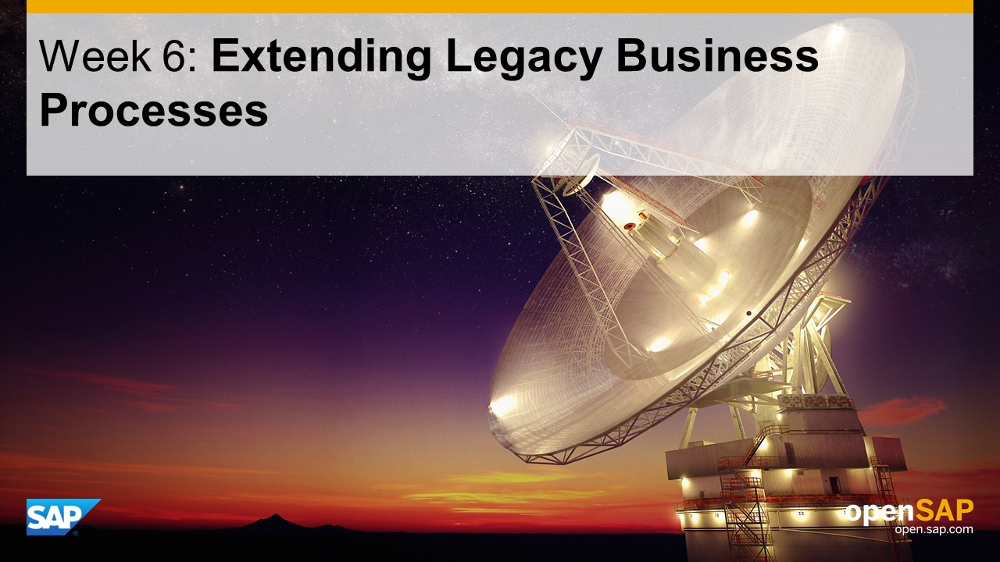

## Units
- Unit 1: [Understand the Challenge](./unit-1/)
- Unit 2: [Prepare Backend API: Remote Function Modules](./unit-2/)
- Unit 3: [Create the IoT Extension: Consume RFC](./unit-3/)
- Unit 4: [Create the IoT Extension: Fiori User Interface](./unit-4/)
- Unit 5: [Wrap-Up and Summary](./unit-5/)

