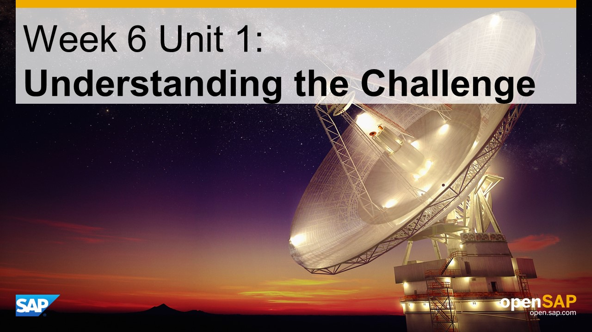
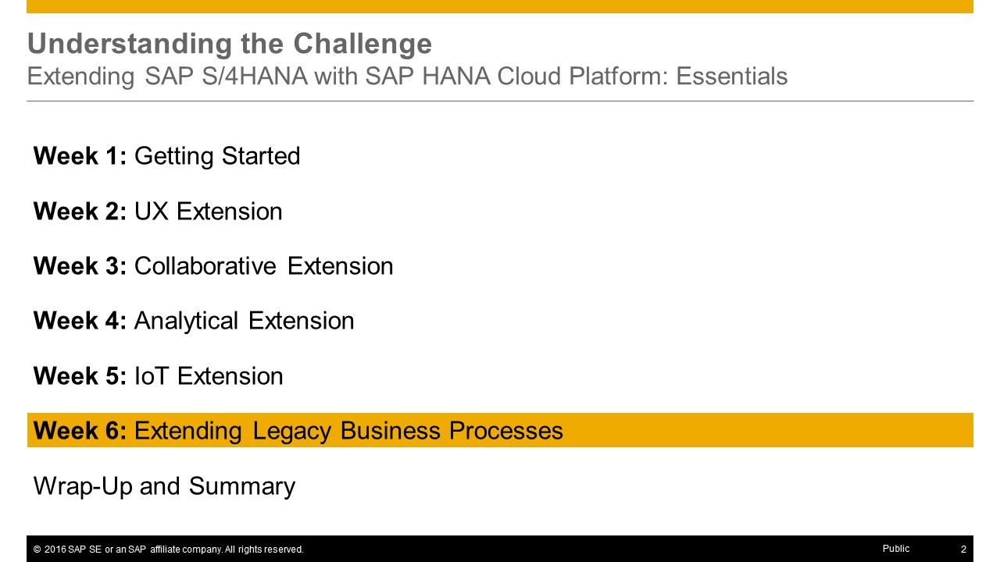
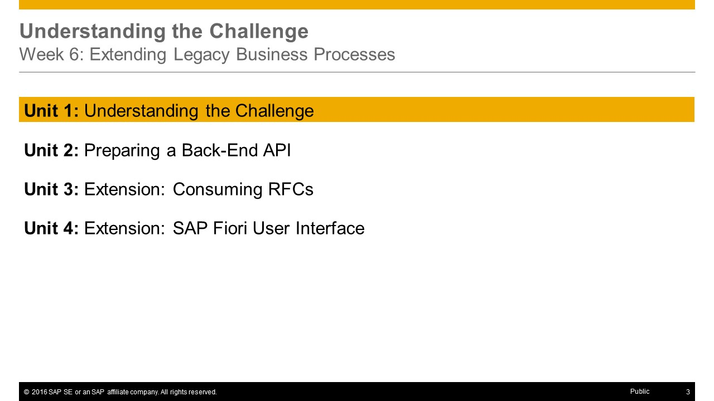
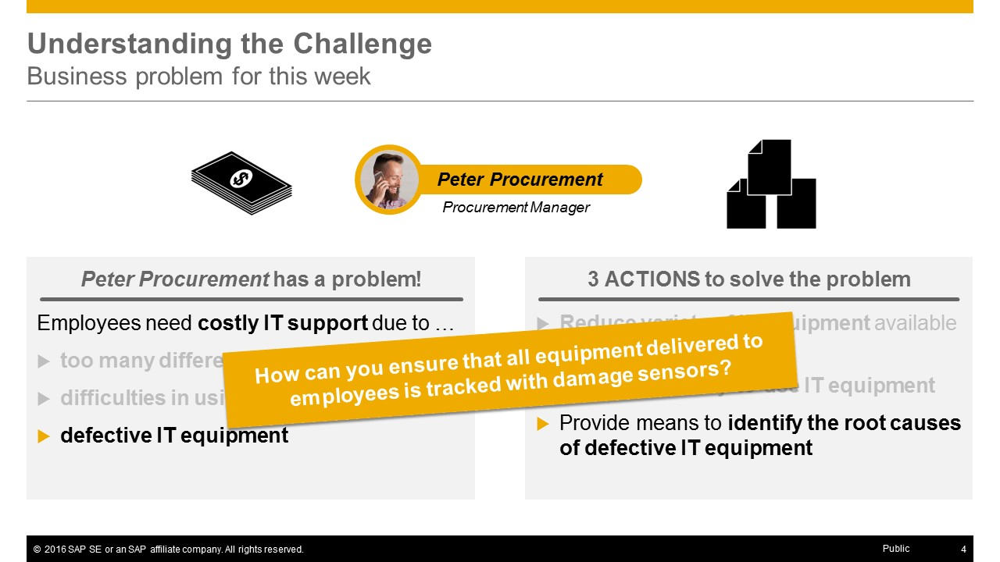
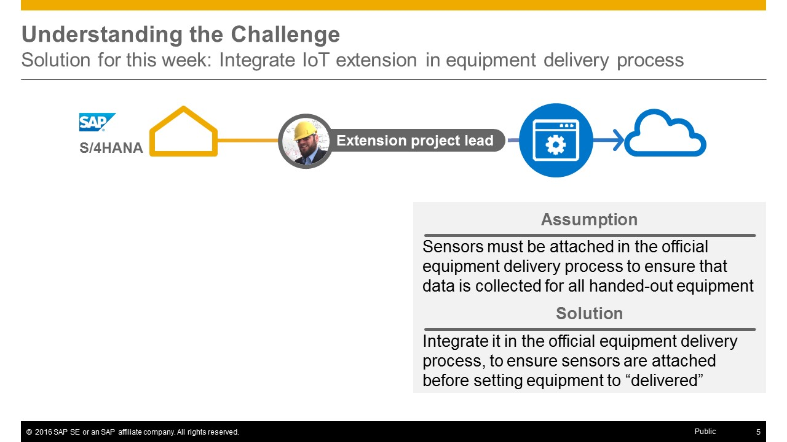
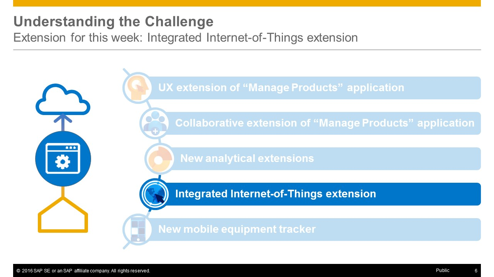
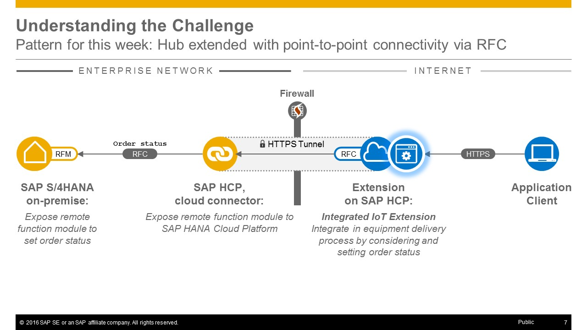
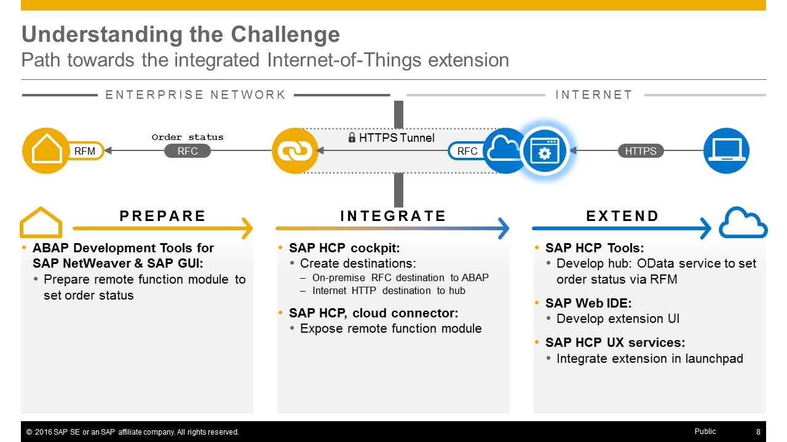
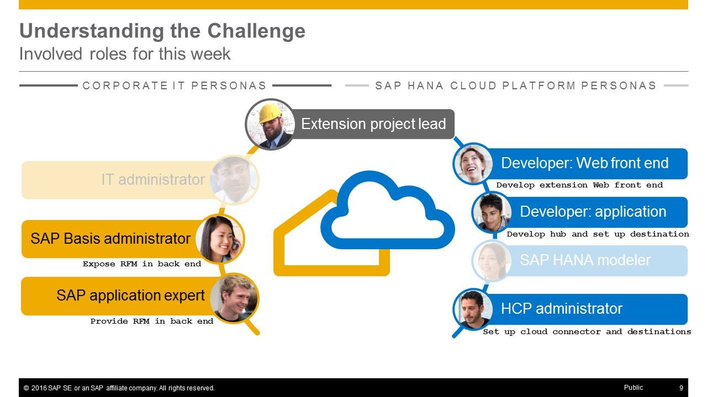
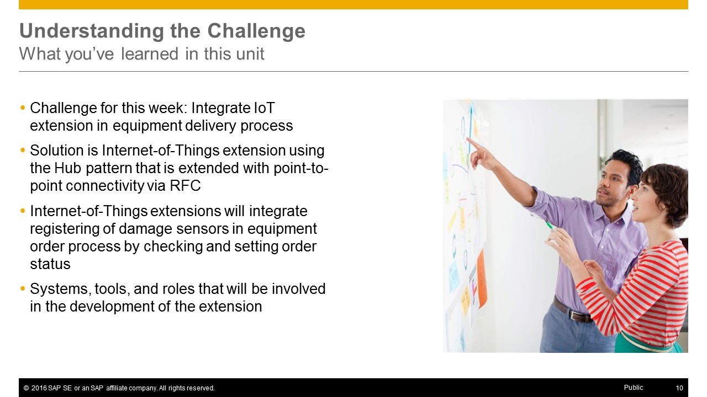

<a name="top-1"/><a name="top-2"/><a name="top-3"/><a name="top-4"/><a name="top-5"/><a name="top-6"/><a name="top-7"/><a name="top-8"/><a name="top-9"/><a name="top-10"/>



> **Note:** On this page you will only find the presentation slides of the unit, without any additional context or explanations. Therefore **we strongly recommend to watch the [corresponding video](https://open.sap.com/courses/hcp3a1/items/3iNFg6Vg0vtTqFKE0bFbgh)** _(openSAP log-in required)_ in which Thomas Bieser, the course instructor, explains the slides in detail. This will greatly enhance your understanding of this units content.

## Presentation Slides

Here you get the sequence of presentation slides for the _challenge for week 6_.

### Slide 1: Title

[Top](#top-1)

### Slide 2: Week Overview

[Top](#top-2)

### Slide 3: Unit Overview

[Top](#top-3)

### Slide 4: Business Problem

[Top](#top-4)

### Slide 5: Solution for this week

[Top](#top-5)

### Slide 6: Extension for this week: Integrated Internet-of-Things extension

[Top](#top-6)

### Slide 7: Extension Pattern: Hub pattern extended with point-point connectivity via RFC

[Top](#top-7)

### Slide 8: Path towards the Collaborative Extension

[Top](#top-8)

### Slide 9: Involved Roles

[Top](#top-9)

### Slide 10: What you've learned in this unit

[Top](#top-10)

[**< Previous** Week 5](../../week-5/) | [**Up ^** Week 6](../) | [**Next >** Unit 2](../unit-2/)
