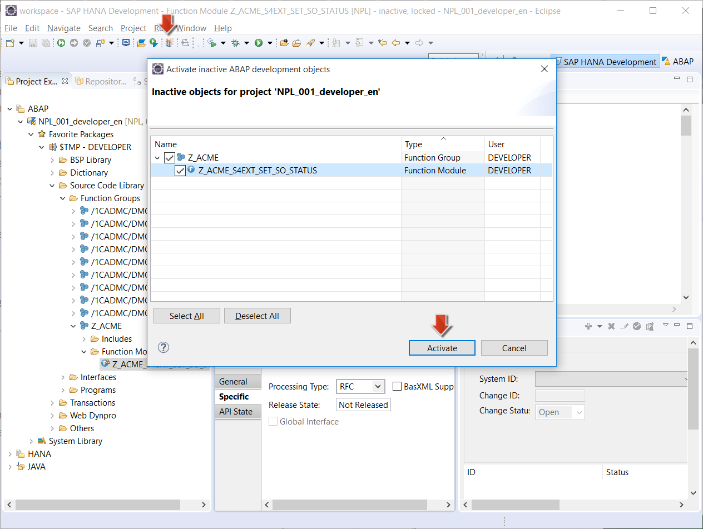

<a name="step-1-top"/><a name="step-2-top"/><a name="step-3-top"/>





**Overview:**

**Roles**

**Systems, Tools, Services:**

-   Guest OS (VM Back-End)
    -   NetWeaver 7.50 (S/4HANA)
-   Host OS
    -   Eclipse IDE with ABAP tools (ABAP in Eclipse), Web browser (Google Chrome)
-   HANA Cloud Platform (HCP)
    -   Cloud Cockpit

## Downloads / Developer Access Key

| Download Link                                       | Description                   | Context                                                                                                           |
|-----------------------------------------------------|-------------------------------|-------------------------------------------------------------------------------------------------------------------|
| [**Z_ACME_S4EXT_SET_SO_STATUS.txt**](./imports/abap/Z_ACME_S4EXT_SET_SO_STATUS.txt)    | Source code for function module **Z_ACME_S4EXT_SET_SO_STATUS** | [Step 2: Create and Activate new Function Module](#create-and-activate-new-function-module)      |
| **35408798513176413512** | Developer Access Key for NPL system | [Step 2: Create and Activate new Function Module](#create-and-activate-new-function-module)      |

## Step 1: Preparation Steps

#### 1.1 Start the SAP NetWeaver AS ABAP system

Start your NetWeaver AS ABAP system and verify that it is running properly, as described in the preparation step [Week 4 - Unit 3 - Step 1.2](../../week-4/unit-3//#step-12-vm-with-sap-netweaver-as-abap-is-up-and-running). The backend system should be based on the snapshot state [Week 4 - Unit 3 - Step 8](../../week-4/unit-3/#step-8-create-vm-snapshot).

[Top](#step-1-top)

## Step 2: Create and Activate new Function Module

To set the status of the Sales Order in the SAP S/4HANA backend system, you need to create a new ABAP Remote Function Module (RFC) which has functions to set the sales order status.

#### 2.1 Create new Function Group

1.  Open Eclipse IDE and switch to the **ABAP** Perspective.
2.  Double-click on your ABAP Project to connect to the ABAP system. If you do not have an ABAP project, follow the steps to [create an ABAP project](../../week-2/unit-2/#step-3-create-new-abap-project-in-eclipse-ide).

    

3.  It opens a dialog window **Logon to Project &lt;your ABAP Project name>**
4.  Enter user **Developer**
5.  Enter password **Appl1ance** if you didn't change the password.
6.  Click **OK**.

    

7.  Right-click on the ABAP project you created and click on **New** , **ABAP Function Group**.

    

8.  In the open dialog, enter the following:
    - In the **Package** field, enter **$TMP**.
    - Enter **Z_ACME** for the **Name** field and a short description.
    - Click **Next**.

    

12. You are asked to enter a **Developer Access Key** for your ABAP system. This is asked for the first time when you create objects if you use the  developer edition of a SAP NetWeaver 7.50 ABAP Application Server.
13. For the field **Access Key**, Enter **35408798513176413512**.
14. Click **Next**

    

15. Click **Finish** in the next screen to create a Function Module.

    

16. In the **Project Explorer** window, click the icon looking like double-arrow, **Link with Editor** to select the newly created **Z_ACME** in project explorer.

    

#### 2.2 Create new Function Module

1.  Right-click on the ABAP Function Group **Z_ACME** and click **New**.
2.  Click on **ABAP Function Module**.

    

3.  It opens a new **ABAP Funtion Module** dialog. Fill the fields :
    -  **Project** is the ABAP Project which you created in Step 1.
    -  **Name** : Enter **Z_ACME_S4EXT_SET_SO_STATUS**
    -  **Description** : Enter  **Z_ACME_S4EXT_SET_SO_STATUS**
    -  **Function Group**: **Z_ACME** should be selected.
4.  Click **Next**

    

5.  Click **Finish** in the next screen.

    

6. Copy the contents of the file [Z_ACME_S4EXT_SET_SO_STATUS.txt](imports/abap/Z_ACME_S4EXT_SET_SO_STATUS.txt?raw=true) into the clipboard.
7. Replace the contents of the newly created function module **Z_ACME_S4EXT_SET_SO_STATUS** with your clipboard contents.
8. Click **Save** to save the changes.
9. Click on the button **Activate** to activate the function module.

    

#### 2.3 Remote enable the Function Module

If the function module has to be called from another SAP system or  from the cloud, the function module has to be remote-enabled. (Sometimes this is also called RFC-enabled.)

1.  Select the Function Module **Z_ACME_S4EXT_SET_SO_STATUS** in the **Project Explorer** window.
2.  In the **Properties** tab in the Eclipse window, click on **Specific**.
3.  Change the **Processing Type** to **RFC** to enable the ABAP Function Module to be **Remote Function Call**.
4.  Click **Save** to save the changes.

    

5.  Check the button **Activate inactive ABAP development objects** to activate the changes.

    

[Top](#step-2-top)

## Step 3: Test the ABAP Function module

1.  Right-click on the ABAP Function Module **Z_ACME_S4EXT_SET_SO_STATUS**, which you created in the previous step.
2.  Click on **Run As** and click on **ABAP Application**.

    

3.  This opens the **Test Function Module: Initial Screen**.
4.  To get a value of Sales Order **IV_NODE_KEY**, let us browse the table containing Sales Orders in the Java Hub application.
5.  Login to your SAP HANA Cloud Platform account <https://account.hanatrial.ondemand.com/cockpit/> using your trial user and password.
6.  In the navigation area on the left side, choose **Java Applications** under **Applications**.

    

7.  Select the Java application **hub** and click on the URL in the **Application URLs** section to open the **hub** applicaton.

    

8.  The Java application **hub** opens in a new browser tab.
9.  Enter your HCP user ID and password.

    

10. Click on the link **GET odata.svc/SalesOrders** and search for a Sales Order with LifecycleStatus: **N**.

    

11. Copy the Node key of this Sales Order.

    

12. Paste the value in the field **IV_NODE_KEY** in the Eclipse view for testing your Function Module.
13. Enter **X** for the field **IV_SET_SO_IN_PROCESS** to set the sales order to status: **In Process**
14. Click on **Execute** (or press the **F8** key).

    

15. It switches to the **Test Function Module: Result Screen** and the RFC Function should not return any errors.

    

[Top](#step-3-top)

[**&lt; Previous** Unit 1](../unit-1/) | [**Up ^** Week 6](../) | [**Next >** Unit 3](../unit-3/)
