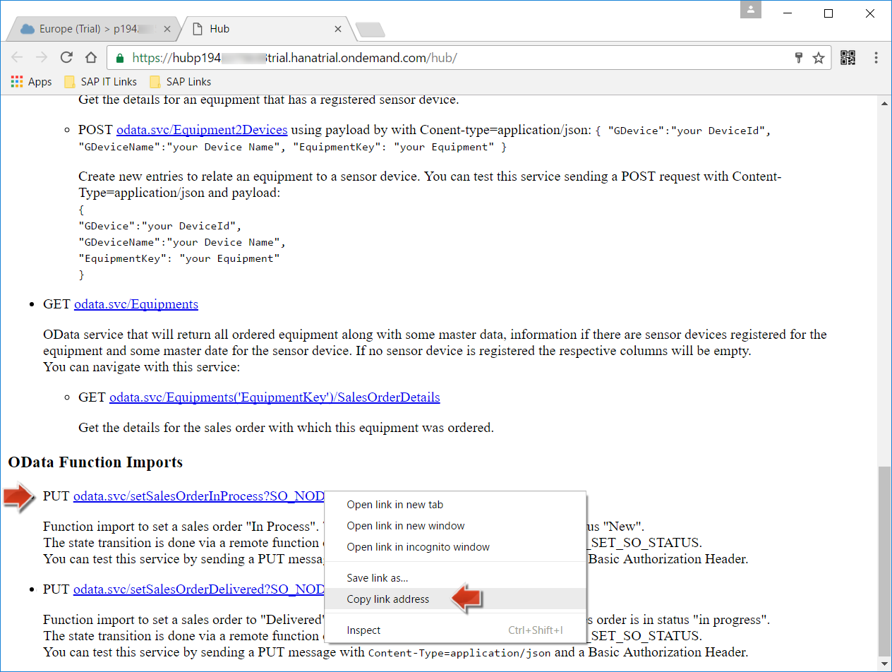
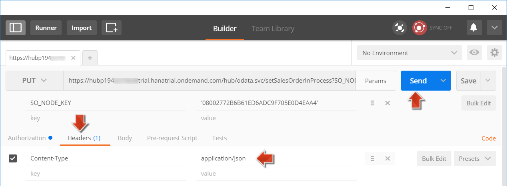

<a name="step-1-top"/><a name="step-2-top"/><a name="step-3-top"/><a name="step-4-top"/><a name="step-5-top"/><a name="step-6-top"/>





**Overview:**

**Roles**

**Systems, Tools, Services:**

-   Guest OS (VM Back-End)
    -   SAP NetWeaver 7.50 (SAP S/4HANA), SAP Cloud Connector (Cloud Connector or SCC)
-   Host OS
    -   Eclipse IDE with ABAP tools (ABAP in Eclipse)
-   HANA Cloud Platform (HCP)
    -   Cloud Cockpit
-   Postman REST client

## Downloads

| Download Link     | Description          | Context        |
|-------------------|----------------------|----------------|
| [**s4h-rfc-access-control.zip**](./imports/connector/s4h-rfc-access-control.zip?raw=true) | Access Control Settings for SAP HANA Cloud Connector to allow access to the new Remote Function Module. | [Step 2: SAP HANA Cloud Connector: Setup Access Control for RFC Endpoint](#step-2-cloud-connector-setup-access-control-for-rfc-endpoint) |
| [**s4h-onpremise-rfc.properties**](./imports/destinations/s4h-onpremise-rfc.properties?raw=true) | Access Control Settings for SAP HANA Cloud Connector to allow access to the new Remote Function Module. | [Step 3: HCP: Create Destination s4h-onpremise-rfc.properties to expose RFC to HCP](#step-3-hcp-create-destination-s4h-onpremise-rfcproperties-to-expose-rfc-to-hcp) |
| [**hub-v3.zip**](./imports/java/hub-v3.zip?raw=true) | Java Hub application (v3): Expose RFC as OData Function Import | [Step 4: Eclipse: Import Java Hub Application (v3) to expose RFC as OData Function Import](#step-4-eclipse-import-java-hub-application-v3-to-expose-rfc-as-odata-function-import)      |

## Step 1: Preparation Steps

#### 1.1 Start the SAP NetWeaver AS ABAP system

Check and start your SAP NetWeaver AS ABAP system as described in the preparation step [Week 4 - Unit 3 - Step 1.2](../../week-4/unit-3//#step-12-vm-with-sap-netweaver-as-abap-is-up-and-running). The backend system should have the SLT replication job running. Your system should be in the same state as defined in the VM snapshot you created in [Week 4 - Unit 3 - Step 8](../../week-4/unit-3/#step-8-create-vm-snapshot).

#### 1.2 Start the SAP HANA database on SAP HANA Cloud Platform

Check and start the SAP HANA database in your SAP HANA Cloud Platform account as described in the preparation step [Week 4 - Unit 3 - Step 1.1](../../week-4/unit-3/#step-11-ensure-that-your-sap-hana-database-is-running).

#### 1.3 Start the SAP HANA Cloud Connector

Check if the SAP HANA Cloud connector is running as described in the preparation step [Week 4 - Unit 3 - Step 1.3](../../week-4/unit-3/#step-13-cloud-connector-is-up-and-running).

#### 1.4 Check the Service Channel in SAP HANA Cloud Connector

Check if the Service Channel is enabled in the SAP HANA Cloud Connector. The SAP HANA database (in the trial environment) is stopped everyday after a certain time which breaks the service channel. So first start the SAP HANA database in your HCP account.

1.  Login to your SAP HANA Cloud connector instance using the **SCC** bookmark you created in [Week 2 - Unit 3](../../week-2/unit-3/#step-2-connect-sap-hana-cloud-connector-with-your-hcp-trial-account).
    -  User Name: **Administrator**
    -  Password: **\<password you used when setting up the cloud connector>**
2.  Click on **Service Channels**. If the service channel is not active, first select the HANA database entry and then click on **Disable**.

    

3.  Click on **Activate** to re-enable the service channel. You should now see that the status is shown as **green**.

    

#### 1.5 Check if the SLT Replication Job is running

Check if the SLT replication job you set up in week 4 is in state **Activated**. The replication job needs to be running, so that once you update the sales order data in the backend using an RFC, this changed data will be replicated to the SAP HANA database in your SAP HANA Cloud Platform account.

1.  You created a replication job in the unit [Week 4 - Unit 3](../../week-4/unit-3/#step-4-set-up-data-replication-job-between-backend-system-and-your-hana-db-on-hcp). Open the transaction **LTRC** as described in that unit.
2.  Check if the replication job **SLT_REPLICATION** is in state **Activated**. If not, click on this job entry and click **Activate** to reactivate the replication job.

    

[Top](#step-1-top)

## Step 2: Cloud Connector: Setup Access Control for RFC Endpoint

1.  Log in to your SAP HANA Cloud Connector instance using the **SCC** bookmark you created in [Week 2, Unit 3](../../week-2/unit-3/#step-2-connect-sap-hana-cloud-connector-with-your-hcp-trial-account).
2.  In the navigation pane select item **Account: My Trial Account > Cloud To On-Premise**.
3.  Choose tab **Access Control** to add corporate network hosts that can be accessed from your HCP account.
4.  Download the file [s4h-rfc-access-control.zip](imports/connector/s4h-rfc-access-control.zip?raw=true).
5.  Click on the **Import** button in the toolbar under **Mapping Virtual To Internal Systems** and select the previously downloaded zip-file **s4h-rfc-access-control.zip**.

    

    

>**Result:** The Function Module **Z_ACME_S4EXT_SET_SO_STATUS**, which you created in _Week 6, Unit 2_ is now exposed to your HCP account using the SAP HANA Cloud Connector. Therefore it is now accessible from your SAP HANA Cloud Platform account.

[Top](#step-2-top)

## Step 3: HCP: Create Destination _s4h-onpremise-rfc.properties_ to expose RFC to HCP

1.  Download the destination properties file [s4h-onpremise-rfc.properties](imports/destinations/s4h-onpremise-rfc.properties?raw=true).
2.  Login to your [HCP account](https://account.hanatrial.ondemand.com/) by using the **HCP** bookmark.
3.  In the navigation area, expand the node **Connectivity**.
4.  Click on **Destinations**

    

5.  Press **Import Destination** and import the downloaded **s4h-onpremise-rfc.properties** file.
6.  The **User** is **DEVELOPER** and **Password** is **Appl1ance** if you did not change the password of your ABAP system.
7.  Click **Save** to save the destination.

    

>**Result:** You have created a new destination _s4h-onpremise-rfc.properties_ in your HCP account. This destination allows the Java Hub application to access the remote-enabled Function Module, which you created in your backend in the previous unit.

[Top](#step-3-top)

## Step 4: Eclipse: Import Java Hub Application (v3) to expose RFC as OData Function Import

1.  Download the sources for the Java Hub application (version 3) from [hub-v3.zip](imports/java/hub-v3.zip?raw=true) and extract the archive.
2.  Open **Eclipse** and switch to perspective **Java EE**.
3.  In the menu, click on **File** > **Import ...**.

     

4.  In the Import wizard, expand the node **Maven**, select **Existing Maven Projects** and click **Next**.

    

5.  For the field **Root Directory**, select the folder where you extracted the archive **hub-v3.zip**. Select the suggested **pom**.
6.  Check the checkbox **Add projects to working set** and select **JAVA** as working set.

    

7.  Press finish.

>**Result:** You imported the Java Hub application (v3) to your **Java** working set in Eclipse.

[Top](#step-4-top)

## Step 5: Eclipse: Build, Deploy and Run Java Hub application (v3)

1.  Right-click on the **hub-v3** project in Eclipse and select **Run as** > **8 Maven Install** to build and install the Maven project.

    

2.  Wait for the **BUILD SUCCESS** in the **Console** window.

    

3.  Right-click on the **hub-v3** project in the **Project Explorer** and click on **Refresh** to find the **hub.war** in the sub-folder **hub-v3/target**.

    

4.  Open your browser and log in to your [SAP HANA Cloud Platform account](https://account.hanatrial.ondemand.com/cockpit/), by using your **HCP** bookmark.
5.  Navigate to **Applications** > **Java Applications**.
6.  Select the Java application **hub** and press **Stop** to stop the existing Java Hub application (v2), which you created in week 5.

    

7.  Click on **Update** to open the **Update Application hub** dialog. This will allow you to overwrite the existing **Java Hub application (v2)** with the new **Java Hub application (v3)**.

    

8.  Click on **Browse** and select the file **hub.war**, which is located in the **WAR File Location** of your maven project (**hub-v3/target**).
9.  The dialog will use the settings as specified previously for the Java Hub application. Leave all settings as they are and press **Update**.

    

10. Press **Start** and wait until application has started again.

    

>**Result:** You updated the existing Java Hub application with version 3. It now exposes the ABAP remote function module as OData Function Import. This means that you can now change the Sales Order status in the SAP S/4HANA backend system using a REST call.

[Top](#step-5-top)

## Step 6: Change Backend Sales Order Status using a REST Call

1.  In the HCP Cockpit, open the **hub** Java application and click on the URL under the **Application URLs** to open the web interface for the Java Hub applicaton.

    

2.  The **Hub** application opens in a new browser tab. If necessary, enter your HCP user name and password.

    

3.  Before you can change the status of a Sales Order, you first need to set it to status **In Process**. In the section **Function Imports**, copy the URL:
    **https://hub\<hcpTrialUserId>trial.hanatrial.ondemand.com/hub/odata.svc/setSalesOrderInProcess?SO_NODE_KEY='....'**

       

4.  Open the Google Chrome extension **Postman** as a REST client. (You set this up in week 1, unit 5.)
5.  Paste the _URL_ you copied from the Hub application and change the _Request Type_ to **PUT**.

    

6.  Now you need to find a Sales Order in your SAP S/4HANA backend system with status **New**: Switch back to the browser tab with open **hub** application web interface. Open the OData service for the Sales Orders by clicking on the link **GET odata.svc/SalesOrders**.

    

7.  Find a Sales Order with **LifecycleStatus** as **N** _(New)_ and copy the value of the property **NodeKey**.

    

8.  Switch back to the **Postman** Google Chrome Extension.
9.  Click on **Params** next to the _URL_ to maintain the following parameters:
10. For the input parameter **SO_NODE_KEY**, paste the copied **NodeKey** enclosed by single quotes, e.g. _'1244D0D392BB1EE5B49987627D755A45'_.

    

11. In **Postman**, switch to the tab **Authorization**:
    - **Type**: select **BasicAuth**
    - **Username**: enter your **&lt;HCP-user-name>**.
    - **Password**: enter your password.

    

15. Click on **Update Request**.

    

16. Switch to the tab **Headers** and add a new header **Content-Type** with the value **application/json**.
17. Press **Send** to send the HTTP request.

    

18. Check the response in **Postman**. The value for the property **\<setSalesOrderInProcess>** should be **true**.

    

19. Now you want to change the Sales Order status to **Delivered**. To do so, switch back to the browser tab of the Java **hub** application and in the section **Function Imports**, copy the URL:
    **https://hub&lt;hcpTrialUserId>trial.hanatrial.ondemand.com/hub/odata.svc/setSalesOrderDelivered?SO_NODE_KEY='....'**

      

20. Switch to **Postman** and paste the copied URL.
22. Click on **Params** next to the copy-pasted URL to maintain the parameters for the HTTP request.
23. For the input parameter **SO_NODE_KEY**, paste the same **NodeKey** which you used before, again enclosed by single quotes, e.g. **'1244D0D392BB1EE5B49987627D755A45'**.
24. Verify that **Authorization** and **Headers** are the same as you used before.
25. Click **Send** to send the request and verify that the value for the **\<setSalesOrderDelivered>** property is **true**.

    

>**Result:** You successfully changed the status of a sales order in your S/4HANA backend system to delivered using an OData function import implemented in the Java Hub application (v3), which in turn calls the remote-enabled ABAP Function module in your backend system.

[Top](#step-6-top)

[**&lt; Previous** Unit 2](../unit-2/) | [**Up ^** Week 6](../) | [**Next >** Unit 4](../unit-4/)
