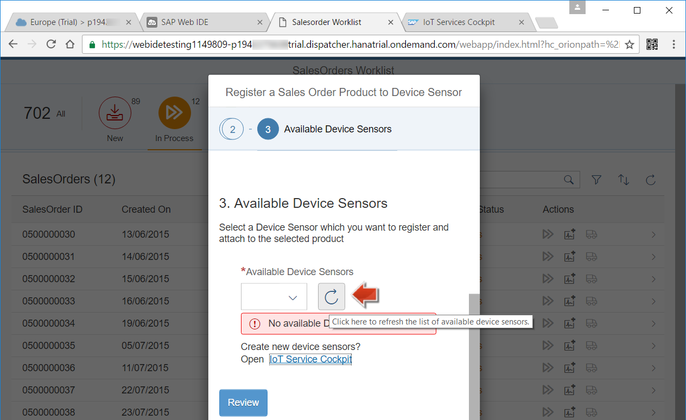

<a name="step-1-top"/><a name="step-2-top"/><a name="step-3-top"/><a name="step-4-top"/><a name="step-5-top"/>





**Overview:**

**Roles**

**Systems, Tools, Services:**

-   Guest OS (VM Back-End)
    -   NetWeaver 7.50 (S/4 HANA), SAP Cloud Connector (Cloud Connector or SCC)
-   HANA Cloud Platform (HCP)
    -   Cloud Cockpit, SAP Web IDE, IoT Service, SAP Fiori Launchpad.

## Downloads

| Download Link     | Description          | Context        |
|-------------------|----------------------|----------------|
| [**salesorderworklist.zip**](./imports/html5/salesorderworklist.zip?raw=true) | Sales Order Worklist SAP Fiori Application | [Step 2: Web IDE: Import and Run the Sales Order Worklist SAP Fiori App](#step-2-import-and-run-the-sales-order-worklist-sap-fiori-app) |

## Step 1: Preparation Steps

#### 1.1 System Preparation

Check and start that all your systems as described in [Week 6, Unit 3, Step 1](../unit-3/#step-1-preparation-steps).

#### 1.2 Check if _iotmms_ Java application is running

Login to your SAP HANA Cloud Platform account, using your **HCP** bookmark. Check if the Java application **iotmms** is in state **Started**. You deployed this application as part of [Week 5 - Unit 2](../../week-5/unit-2/#step-2-deploy-iot-message-management-service-mms).

[Top](#step-1-top)

## Step 2: Web IDE: Import and Run the Sales Order Worklist SAP Fiori App

#### 2.1 Import the Sales Order Worklist App

1.  Download the SAP Fiori application source code to your local computer: [salesorderworklist.zip](imports/html5/salesorderworklist.zip?raw=true).
2.  Open **SAP Web IDE** in your Google Chrome browser window, by using the **SAP Web IDE** bookmark.
3.  Click on **File** > **Import** > **From File System** in the Web IDE toolbar.

    

4.  Select the downloaded **salesorderworklist.zip** file from your download folder.
5.  Checkbox **Extract Archive** must be checked.
6.  Click on **OK** to import the sources.

    

>**Result:** You imported the Sales Order Worklist application to your SAP Web IDE.

#### 2.2 Run and Test the Sales Order Worklist App

1.  In **SAP Web IDE**, click on the project **salesorderworklist** and click on **Run** to run the Sales Order Worklist App.

    

2.  The application opens in a new browser window. Click on **New** to see all the sales orders in status **New**.

    

3.  Select any sales order in the list and click on the **>>** _(Set in Process)_ icon in the column **Actions**.

    

4.  You should now see a success dialog with message **Successfully changed lifecycle status of Sales Order &lt;0500000xx> to 'In Process'**. Click on **OK**.

    

5.  Switch to the tab **In Process** and find the sales order which you just changed.
6.  For the same sales order, click **Register new Device Sensor** in the column **Actions**.

    

7.  It opens a dialog window **Register a Sales Order Product to Device Sensor**, in which the selected Sales Order ID is shown. Click on **Step 2**.

    

8.  Select a product from the drop-down list **Products List of selected Sales Order** for which the sensor should be attached. Click on **Step 3**.

    

9.  In the drop-down list of **Available Device Sensors**, select a Sensor from the list. If you get a warning message, **No available Device Sensors found**, click on the link **Open IoT Service Cockpit** to create a new sensor.

    

10. It opens the _IoT Service Cockpit_, **Devices**. Click on **+** to add a new sensor device.

    

11. Enter a **Name** and **Device Type**, select the **AccelerationSensorDeviceType**. Click on **Create**.

    

12. Switch to the browser window of the Sales Order Worklist application.
13. Click on the **Refresh** button to see the **Available Device Sensors**

    

14. The sensor which was created now is available in the drop-down list. Select the sensor and click on **Review**.

    

15. Click **Register** to register a sensor device to a product that was ordered in this selected sales order.

    

16. You should now recieve a message stating: **Successfully registered Device Sensor**.

    

17. In the Sales Order, the icon looking like a **Truck** _(Set Delivered)_ should now be enabled. Click on this icon to set the Sales Order status to **Delivered**.

    

18. You will see a success dialog with message **Successfully changed lifecycle status of Sales Order &lt;0500000xx> to 'Delivered'**. Click on **OK**.

    

19. Switch to the tab **Delivered** and verify that the sales order you selected is now in status **Delivered**.

    

>**Result:** You successfully set a sales order to status delivered, then attached an IoT sensor device to a product from this sales order and then set the sales order status to delivered. You did this by using the OData service from the Java Hub application.

[Top](#step-2-top)

## Step 3: Deploy Sensor Worklist app to SAP HANA Cloud Platform

1.  In **SAP Web IDE**, right-click on the node **salesorderworklist** and select Deploy > Deploy to SAP HANA Cloud Platform.
    
2.  Provide your trial user credentials if asked, enter an **Application Name** and click on **Deploy** to deploy a new HTML Application.

    

3.  Once deployed, click on **Open active version** to see the deployed version to the SAP HANA Cloud Platform.

    

4.  The application opens in a new browser window. Check the address toolbar to find that the application is running in SAP HANA Cloud Platform.

    

>**Result:** You successfully deployed the Sensor Worklist app to your SAP HANA Cloud Platform account.

[Top](#step-3-top)

## Step 4: Register Sensor Worklist app to SAP Fiori Launchpad

1.  Register the HTML5 Application to the SAP Fiori Launchpad in your HCP account by clicking **Register to SAP Fiori Launchpad**. You can also right-click on the node **salesorderworklist** and select **Register** and **Register to SAP Fiori Launchpad**, if you already closed the wizard from step 3.

    

2.  A new dialog **Register to SAP Fiori Launchpad** opens.
3.  The **Provider Account** should be preselected and greyed out.
4.  The field **Application Name** is pre-filled with the name **salesorderworklist**.
5.  Click on **Next**.

    

6.  In the screen **Tile Configuration**:
    - For the field **Type**, leave the default set to **Static**.
    - Enter **Title** as **Process Order** and optionally as **Sub-title**.
    - Click on **Next**.

    

10. In the screen **Tile Configuration**:
    - For the drop-down field **Site**, select **Procument Launchpad** which you created in the previous unit.
    - For the drop-down field **Catalog**, select **Procument Applications**.
    - For the drop-down field **Group**, select **Equipment Tracking**.
    - Click on **Next**.

    

15. Click on **Finish**

    

16. You should get a success message dialog **Successfully Registered**. Click on the link **Open SAP Fiori Launchpad**.

    

17. It opens the SAP Fiori Launchpad running in your HCP account. Click on the tile **Process Order**.

    

18. The **Sales Order Worklist** application is now open in your SAP Fiori Launchpad; check the URL link in address bar to confirm this. Click on the **&lt;** icon to go back to the home screen.

    

19. Click on **Register Sensor Devices** in the home screen of the app.

    

20. Here you should find the IoT sensor you registered in step 2, and see that it has been attached to a product. On the right, you can see any damages that were recorded using the IoT sensor.
21. Optional: You may also see the damages on your mobile device, by scanning the QR code when you click on the link for your new sensor. Please refer to [week 5, Unit 6, Step 7](../../week-5/unit-6/#step-7-deploy-and-use-the-equipment-scanner-application-on-a-mobile-device) for information on how to do this.

    

>**Result:** You successfully deployed the Sensor Worklist app to the SAP Fiori Launchpad in your SAP HANA Cloud Platform account.

[Top](#step-4-top)

[**&lt; Previous** Unit 3](../unit-3/) | [**Up ^** Week 6](../) | [**Next >** Unit 5](../unit-5/)
