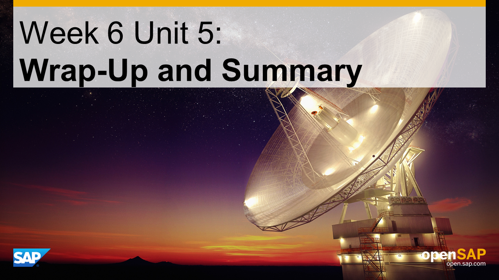

<a name="top"/>



> **Note:** On this page you will only find the presentation slides of the unit, without any additional context or explanations. Therefore **we strongly recommend to watch the [corresponding video](https://open.sap.com/courses/hcp3a1/items/3yBWtraALanO4HJpPWSUVu)** _(openSAP log-in required)_ in which Thomas Bieser, the course instructor, explains the slides in detail. This will greatly enhance your understanding of this units content.

## Presentation Slides

### Slide 1: Title

### Slide 2: Week Overview

### Slide 3: Peter Procurement’s problems have been addressed!

### Slide 4: Partner has delivered promised solutions!

### Slide 5: Developed SAP S/4HANA extensions on SAP HANA Cloud Platform

### Slide 6: Enabled innovations

### Slide 6: Innovate fast with minimal risk and cost

[Top](#top)
